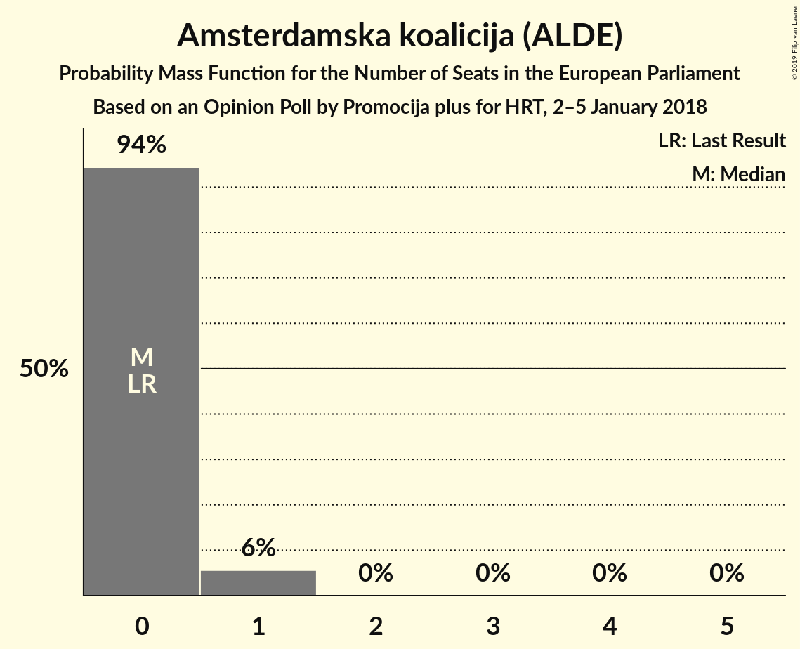

# Opinion Poll by Promocija plus for HRT, 2–5 January 2018

<a href="#voting-intentions">Voting Intentions</a> | <a href="#seats">Seats</a> | <a href="#coalitions">Coalitions</a> | <a href="#technical-information">Technical Information</a>

## Voting Intentions

### Confidence Intervals

| Party | Last Result | Poll Result | 80% Confidence Interval | 90% Confidence Interval | 95% Confidence Interval | 99% Confidence Interval |
|:-----:|:-----------:|:-----------:|:-----------------------:|:-----------------------:|:-----------------------:|:-----------------------:|
| Hrvatska demokratska zajednica (EPP) | 41.4% | 34.0% | 32.2–35.8% |31.7–36.4% |31.2–36.8% |30.4–37.7% |
| Socijaldemokratska partija Hrvatske (S&D) | 29.9% | 24.1% | 22.5–25.8% |22.1–26.3% |21.7–26.7% |21.0–27.6% |
| Živi zid (EFDD) | 0.5% | 13.3% | 12.1–14.7% |11.8–15.1% |11.5–15.5% |10.9–16.2% |
| Most nezavisnih lista (*) | 0.0% | 8.2% | 7.2–9.4% |7.0–9.7% |6.7–10.0% |6.3–10.5% |
| Amsterdamska koalicija (ALDE) | 0.0% | 5.2% | 4.5–6.2% |4.2–6.5% |4.1–6.7% |3.7–7.2% |
| Bandić Milan 365–Stranka rada i solidarnosti (*) | 0.0% | 2.7% | 2.2–3.4% |2.0–3.7% |1.9–3.8% |1.7–4.2% |
| Hrvatska narodna stranka–liberalni demokrati (ALDE) | 29.9% | 1.6% | 1.2–2.2% |1.1–2.4% |1.0–2.6% |0.9–2.9% |
| Pametno (ALDE) | 0.0% | 1.4% | 1.1–2.0% |1.0–2.2% |0.9–2.3% |0.7–2.6% |

*Note:* The poll result column reflects the actual value used in the calculations. Published results may vary slightly, and in addition be rounded to fewer digits.

## Seats

### Confidence Intervals

| Party | Last Result | Median | 80% Confidence Interval | 90% Confidence Interval | 95% Confidence Interval | 99% Confidence Interval |
|:-----:|:-----------:|:------:|:-----------------------:|:-----------------------:|:-----------------------:|:-----------------------:|
| <a href="#hrvatska-demokratska-zajednica-(epp)">Hrvatska demokratska zajednica (EPP)</a> | 4 | 5 | 5 |4–5 |4–5 |4–6 |
| <a href="#socijaldemokratska-partija-hrvatske-(s&d)">Socijaldemokratska partija Hrvatske (S&D)</a> | 2 | 3 | 3–4 |3–4 |3–4 |3–4 |
| <a href="#živi-zid-(efdd)">Živi zid (EFDD)</a> | 0 | 2 | 1–2 |1–2 |1–2 |1–2 |
| <a href="#most-nezavisnih-lista-(*)">Most nezavisnih lista (*)</a> | 0 | 1 | 1 |1 |1 |0–1 |
| <a href="#amsterdamska-koalicija-(alde)">Amsterdamska koalicija (ALDE)</a> | 0 | 0 | 0 |0–1 |0–1 |0–1 |
| <a href="#bandić-milan-365–stranka-rada-i-solidarnosti-(*)">Bandić Milan 365–Stranka rada i solidarnosti (*)</a> | 0 | 0 | 0 |0 |0 |0 |
| <a href="#hrvatska-narodna-stranka–liberalni-demokrati-(alde)">Hrvatska narodna stranka–liberalni demokrati (ALDE)</a> | 1 | 0 | 0 |0 |0 |0 |
| <a href="#pametno-(alde)">Pametno (ALDE)</a> | 0 | 0 | 0 |0 |0 |0 |

### Hrvatska demokratska zajednica (EPP)

*For a full overview of the results for this party, see the [Hrvatska demokratska zajednica (EPP)](party-hrvatskademokratskazajednicaepp.html) page.*

| Number of Seats | Probability | Accumulated | Special Marks |
|:---------------:|:-----------:|:-----------:|:-------------:|
| 4 | 9% | 100% | Last Result |
| 5 | 89% | 91% | Median |
| 6 | 2% | 2% | Majority |
| 7 | 0% | 0% |  |

### Socijaldemokratska partija Hrvatske (S&D)

*For a full overview of the results for this party, see the [Socijaldemokratska partija Hrvatske (S&D)](party-socijaldemokratskapartijahrvatskesd.html) page.*

| Number of Seats | Probability | Accumulated | Special Marks |
|:---------------:|:-----------:|:-----------:|:-------------:|
| 2 | 0% | 100% | Last Result |
| 3 | 81% | 100% | Median |
| 4 | 19% | 19% |  |
| 5 | 0% | 0% |  |

### Živi zid (EFDD)

*For a full overview of the results for this party, see the [Živi zid (EFDD)](party-živizidefdd.html) page.*

| Number of Seats | Probability | Accumulated | Special Marks |
|:---------------:|:-----------:|:-----------:|:-------------:|
| 0 | 0% | 100% | Last Result |
| 1 | 17% | 100% |  |
| 2 | 83% | 83% | Median |
| 3 | 0% | 0% |  |

### Most nezavisnih lista (*)

*For a full overview of the results for this party, see the [Most nezavisnih lista (*)](party-mostnezavisnihlista.html) page.*

| Number of Seats | Probability | Accumulated | Special Marks |
|:---------------:|:-----------:|:-----------:|:-------------:|
| 0 | 0.8% | 100% | Last Result |
| 1 | 99.2% | 99.2% | Median |
| 2 | 0% | 0% |  |

### Amsterdamska koalicija (ALDE)

*For a full overview of the results for this party, see the [Amsterdamska koalicija (ALDE)](party-amsterdamskakoalicijaalde.html) page.*

| Number of Seats | Probability | Accumulated | Special Marks |
|:---------------:|:-----------:|:-----------:|:-------------:|
| 0 | 95% | 100% | Last Result, Median |
| 1 | 5% | 5% |  |
| 2 | 0% | 0% |  |

### Bandić Milan 365–Stranka rada i solidarnosti (*)

*For a full overview of the results for this party, see the [Bandić Milan 365–Stranka rada i solidarnosti (*)](party-bandićmilan365–strankaradaisolidarnosti.html) page.*

| Number of Seats | Probability | Accumulated | Special Marks |
|:---------------:|:-----------:|:-----------:|:-------------:|
| 0 | 100% | 100% | Last Result, Median |

### Hrvatska narodna stranka–liberalni demokrati (ALDE)

*For a full overview of the results for this party, see the [Hrvatska narodna stranka–liberalni demokrati (ALDE)](party-hrvatskanarodnastranka–liberalnidemokratialde.html) page.*

| Number of Seats | Probability | Accumulated | Special Marks |
|:---------------:|:-----------:|:-----------:|:-------------:|
| 0 | 100% | 100% | Median |
| 1 | 0% | 0% | Last Result |

### Pametno (ALDE)

*For a full overview of the results for this party, see the [Pametno (ALDE)](party-pametnoalde.html) page.*

| Number of Seats | Probability | Accumulated | Special Marks |
|:---------------:|:-----------:|:-----------:|:-------------:|
| 0 | 100% | 100% | Last Result, Median |

## Coalitions

### Confidence Intervals

| Coalition | Last Result | Median | Majority? | 80% Confidence Interval | 90% Confidence Interval | 95% Confidence Interval | 99% Confidence Interval |
|:---------:|:-----------:|:------:|:---------:|:-----------------------:|:-----------------------:|:-----------------------:|:-----------------------:|
| Hrvatska demokratska zajednica (EPP) | 4 | 5 | 2% | 5 | 4–5 | 4–5 | 4–6 |
| Socijaldemokratska partija Hrvatske (S&D) | 2 | 3 | 0% | 3–4 | 3–4 | 3–4 | 3–4 |
| Živi zid (EFDD) | 0 | 2 | 0% | 1–2 | 1–2 | 1–2 | 1–2 |
| Amsterdamska koalicija (ALDE) – Hrvatska narodna stranka–liberalni demokrati (ALDE) – Pametno (ALDE) | 1 | 0 | 0% | 0 | 0–1 | 0–1 | 0–1 |

### Hrvatska demokratska zajednica (EPP)

| Number of Seats | Probability | Accumulated | Special Marks |
|:---------------:|:-----------:|:-----------:|:-------------:|
| 4 | 9% | 100% | Last Result |
| 5 | 89% | 91% | Median |
| 6 | 2% | 2% | Majority |
| 7 | 0% | 0% |  |

### Socijaldemokratska partija Hrvatske (S&D)

| Number of Seats | Probability | Accumulated | Special Marks |
|:---------------:|:-----------:|:-----------:|:-------------:|
| 2 | 0% | 100% | Last Result |
| 3 | 81% | 100% | Median |
| 4 | 19% | 19% |  |
| 5 | 0% | 0% |  |

### Živi zid (EFDD)

| Number of Seats | Probability | Accumulated | Special Marks |
|:---------------:|:-----------:|:-----------:|:-------------:|
| 0 | 0% | 100% | Last Result |
| 1 | 17% | 100% |  |
| 2 | 83% | 83% | Median |
| 3 | 0% | 0% |  |

### Amsterdamska koalicija (ALDE) – Hrvatska narodna stranka–liberalni demokrati (ALDE) – Pametno (ALDE)

| Number of Seats | Probability | Accumulated | Special Marks |
|:---------------:|:-----------:|:-----------:|:-------------:|
| 0 | 95% | 100% | Median |
| 1 | 5% | 5% | Last Result |
| 2 | 0% | 0% |  |

## Technical Information

### Opinion Poll

+ **Polling firm:** Promocija plus
+ **Commissioner(s):** HRT
+ **Fieldwork period:** 2–5 January 2018

### Calculations

+ **Sample size:** 1110
+ **Simulations done:** 524,288
+ **Error estimate:** 2.04%

