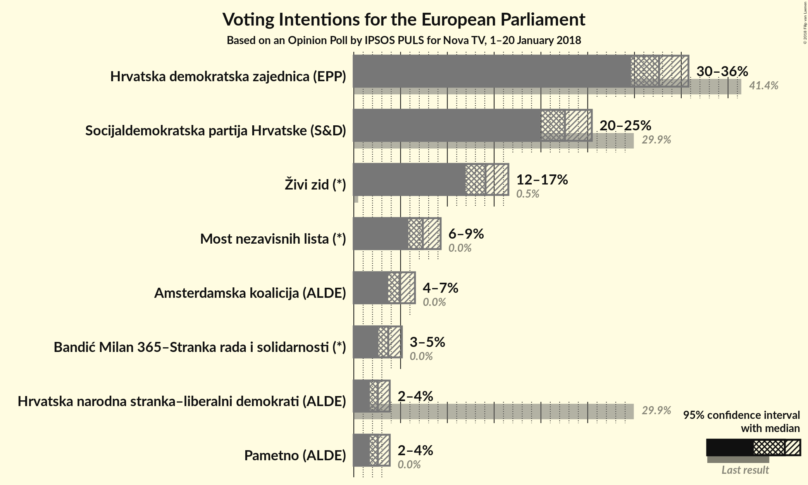
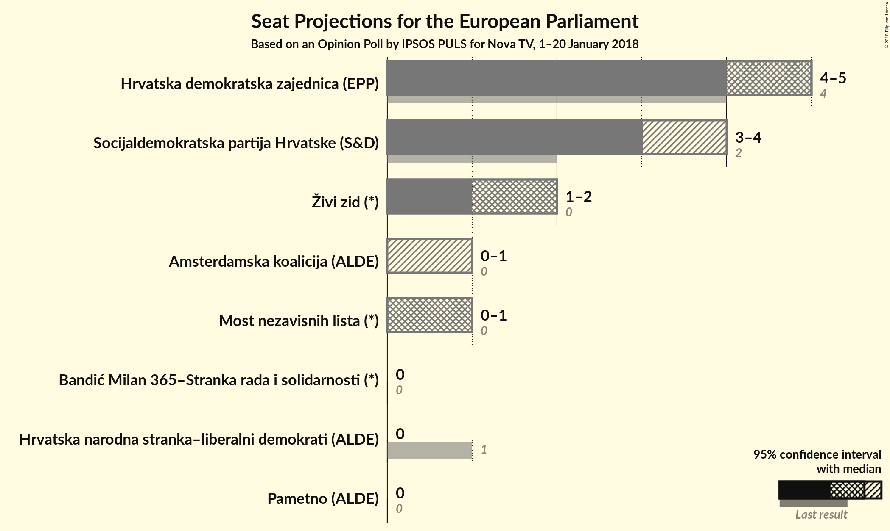

# Opinion Poll by IPSOS PULS for Nova TV, 1–20 January 2018

<a href="#voting-intentions">Voting Intentions</a> | <a href="#seats">Seats</a> | <a href="#coalitions">Coalitions</a> | <a href="#technical-information">Technical Information</a>

## Voting Intentions

### Confidence Intervals

| Party | Last Result | Poll Result | 80% Confidence Interval | 90% Confidence Interval | 95% Confidence Interval | 99% Confidence Interval |
|:-----:|:-----------:|:-----------:|:-----------------------:|:-----------------------:|:-----------------------:|:-----------------------:|
| Hrvatska demokratska zajednica (EPP) | 41.4% | 32.6% | 30.7–34.7% |30.1–35.3% |29.6–35.8% |28.7–36.8% |
| Socijaldemokratska partija Hrvatske (S&D) | 29.9% | 22.6% | 20.9–24.4% |20.4–25.0% |20.0–25.4% |19.1–26.3% |
| Živi zid (*) | 0.5% | 14.1% | 12.7–15.7% |12.3–16.1% |11.9–16.5% |11.3–17.3% |
| Most nezavisnih lista (*) | 0.0% | 7.4% | 6.4–8.6% |6.1–9.0% |5.8–9.3% |5.4–9.9% |
| Amsterdamska koalicija (ALDE) | 0.0% | 4.9% | N/A |N/A |N/A |N/A |
| Bandić Milan 365–Stranka rada i solidarnosti (*) | 0.0% | 3.7% | 3.0–4.6% |2.8–4.9% |2.6–5.1% |2.3–5.6% |
| Hrvatska narodna stranka–liberalni demokrati (ALDE) | 29.9% | 2.6% | 2.0–3.4% |1.8–3.6% |1.7–3.8% |1.5–4.3% |
| Pametno (ALDE) | 0.0% | 2.6% | 2.0–3.4% |1.8–3.6% |1.7–3.8% |1.5–4.3% |

*Note:* The poll result column reflects the actual value used in the calculations. Published results may vary slightly, and in addition be rounded to fewer digits.

## Seats

### Confidence Intervals

| Party | Last Result | Median | 80% Confidence Interval | 90% Confidence Interval | 95% Confidence Interval | 99% Confidence Interval |
|:-----:|:-----------:|:------:|:-----------------------:|:-----------------------:|:-----------------------:|:-----------------------:|
| <a href="#hrvatska-demokratska-zajednica-(epp)">Hrvatska demokratska zajednica (EPP)</a> | 4 | 5 | 5 |4–5 |4–5 |4–6 |
| <a href="#socijaldemokratska-partija-hrvatske-(s&d)">Socijaldemokratska partija Hrvatske (S&D)</a> | 2 | 3 | 3–4 |3–4 |3–4 |3–4 |
| <a href="#živi-zid-(*)">Živi zid (*)</a> | 0 | 2 | 2 |2 |1–2 |1–2 |
| <a href="#most-nezavisnih-lista-(*)">Most nezavisnih lista (*)</a> | 0 | 1 | 1 |1 |0–1 |0–1 |
| <a href="#amsterdamska-koalicija-(alde)">Amsterdamska koalicija (ALDE)</a> | 0 | N/A | N/A |N/A |N/A |N/A |
| <a href="#bandić-milan-365–stranka-rada-i-solidarnosti-(*)">Bandić Milan 365–Stranka rada i solidarnosti (*)</a> | 0 | 0 | 0 |0 |0 |0 |
| <a href="#hrvatska-narodna-stranka–liberalni-demokrati-(alde)">Hrvatska narodna stranka–liberalni demokrati (ALDE)</a> | 1 | 0 | 0 |0 |0 |0 |
| <a href="#pametno-(alde)">Pametno (ALDE)</a> | 0 | 0 | 0 |0 |0 |0 |

