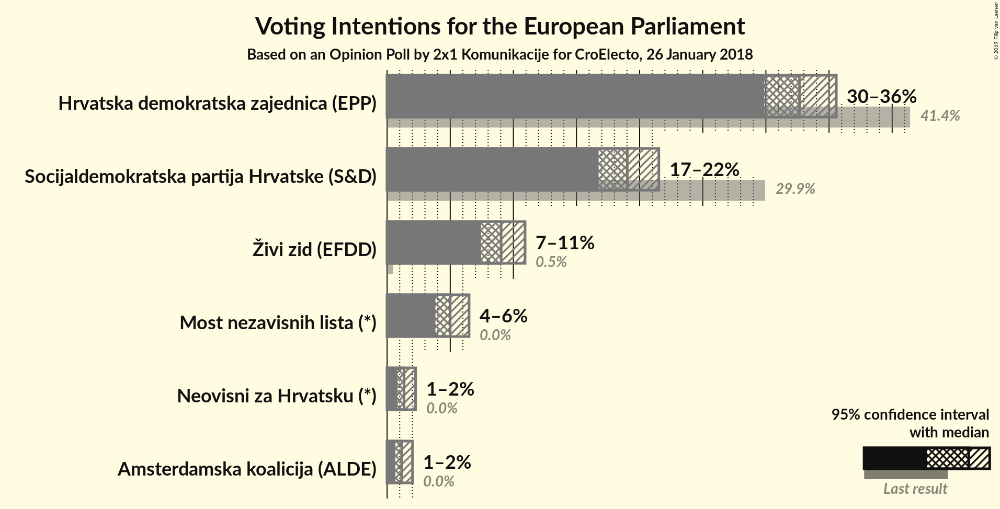
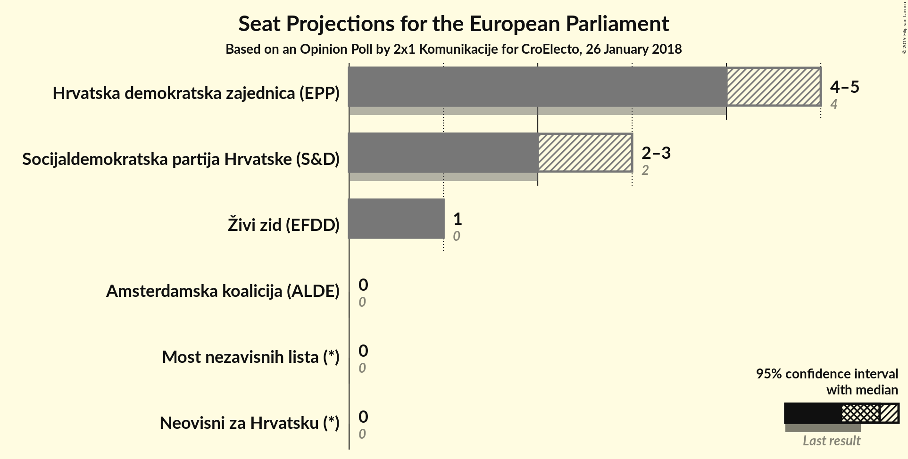
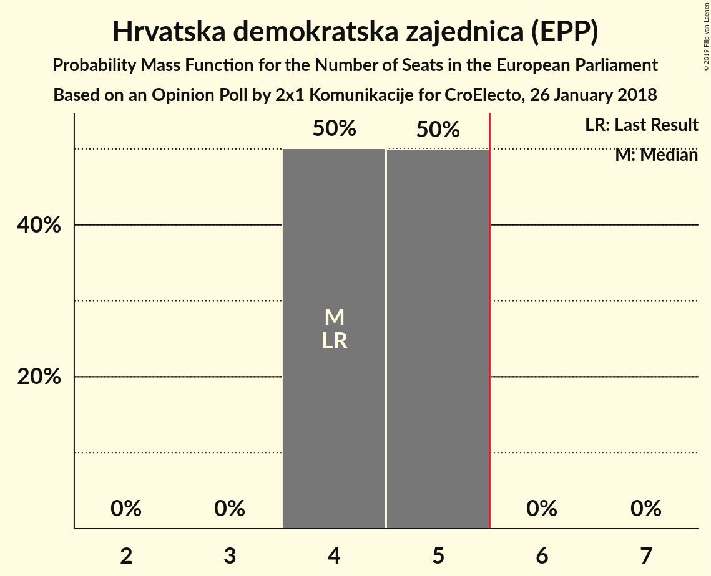
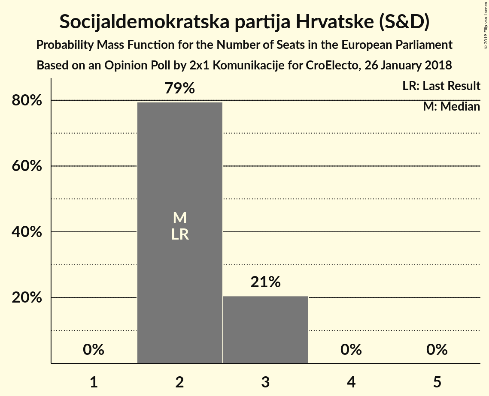
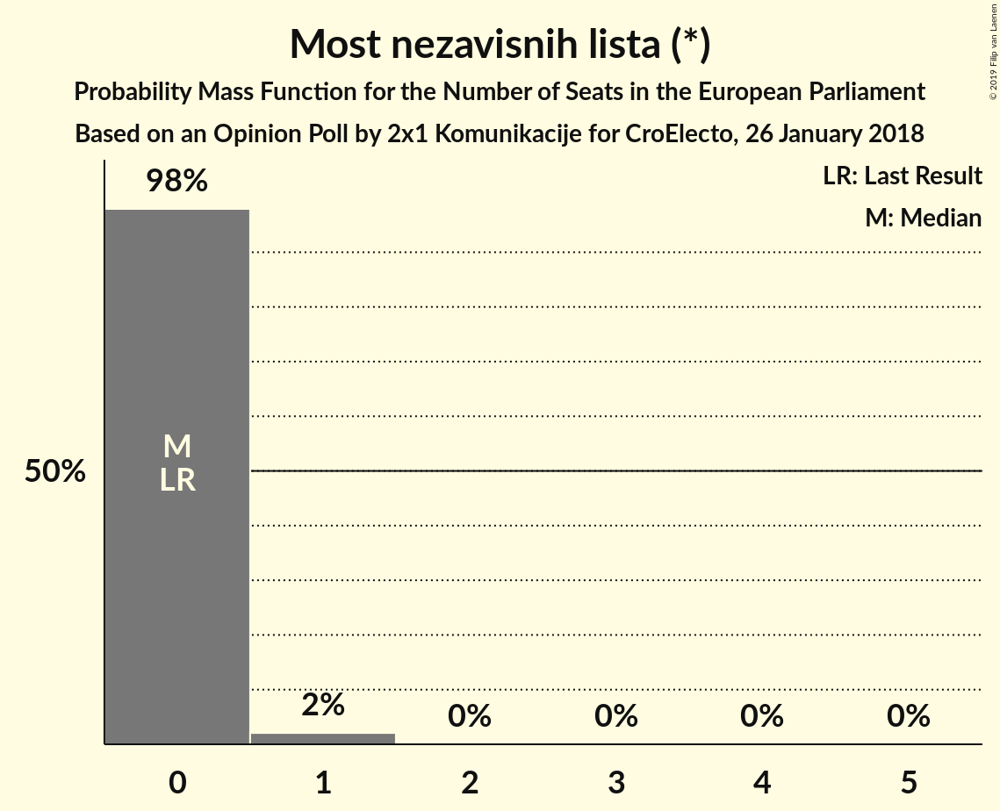
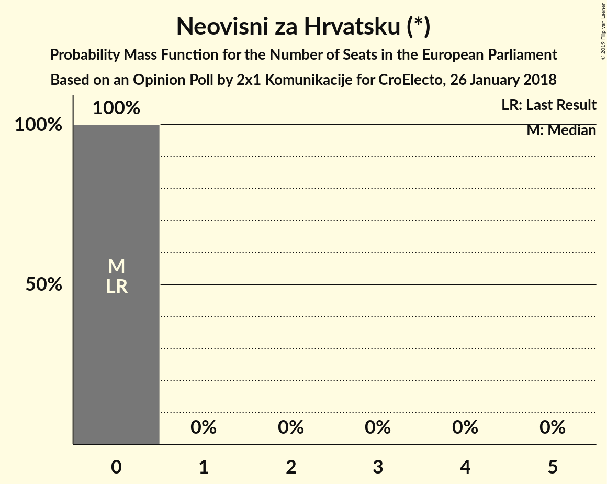
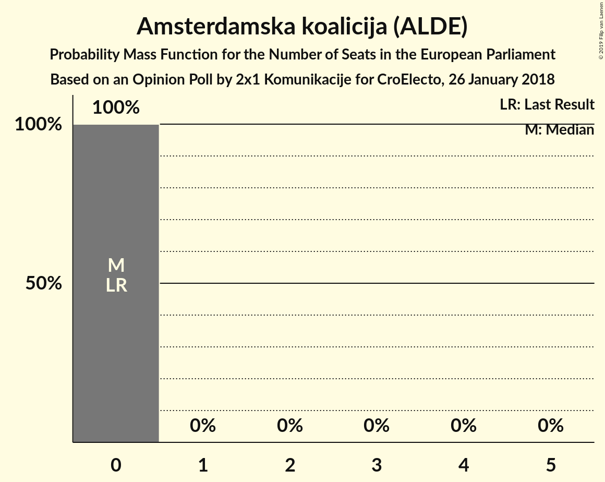
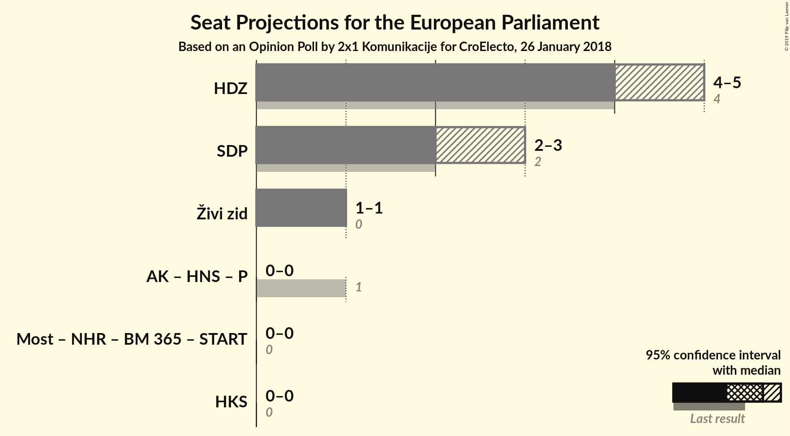
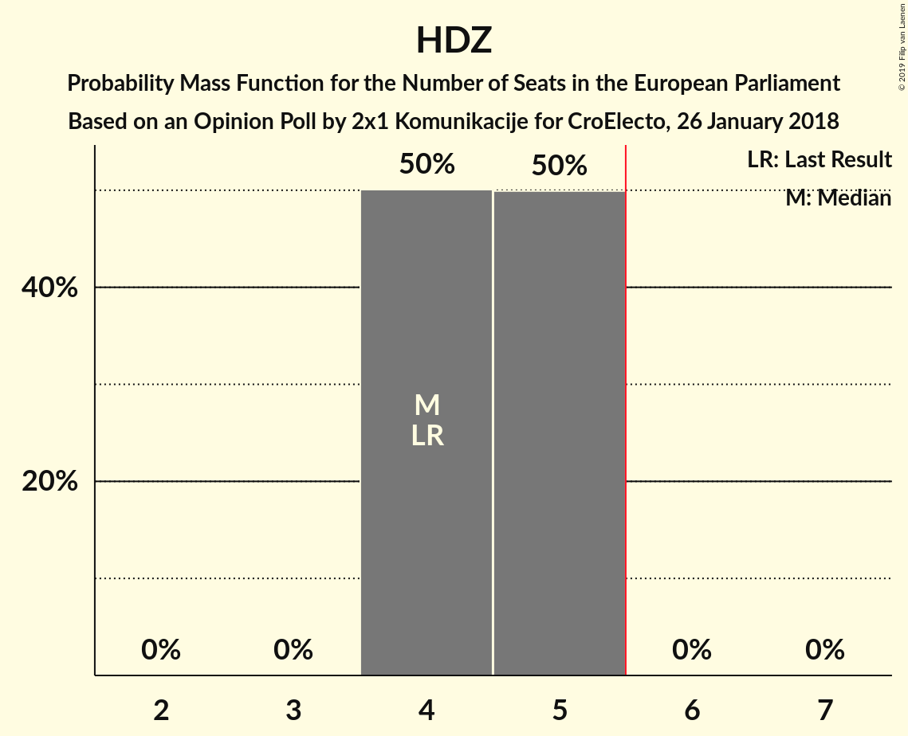
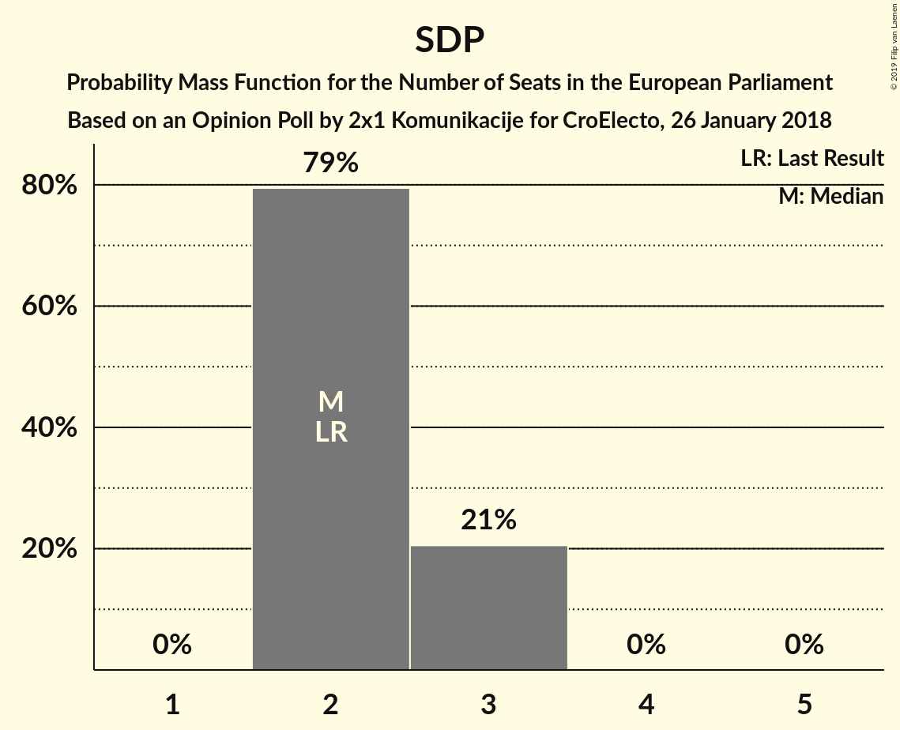

# Opinion Poll by 2x1 Komunikacije for CroElecto, 26 January 2018

<a href="#voting-intentions">Voting Intentions</a> | <a href="#seats">Seats</a> | <a href="#coalitions">Coalitions</a> | <a href="#technical-information">Technical Information</a>

## Voting Intentions

### Confidence Intervals

| Party | Last Result | Poll Result | 80% Confidence Interval | 90% Confidence Interval | 95% Confidence Interval | 99% Confidence Interval |
|:-----:|:-----------:|:-----------:|:-----------------------:|:-----------------------:|:-----------------------:|:-----------------------:|
| Hrvatska demokratska zajednica (EPP) | 41.4% | 32.7% | 30.8–34.6% |30.3–35.1% |29.9–35.6% |29.0–36.5% |
| Socijaldemokratska partija Hrvatske (S&D) | 29.9% | 19.0% | 17.5–20.7% |17.1–21.1% |16.8–21.5% |16.0–22.3% |
| Živi zid (EFDD) | 0.5% | 9.0% | 8.0–10.3% |7.7–10.6% |7.4–10.9% |7.0–11.6% |
| Most nezavisnih lista (*) | 0.0% | 5.0% | 4.2–6.0% |4.0–6.2% |3.8–6.5% |3.5–7.0% |
| Neovisni za Hrvatsku (*) | 0.0% | 1.3% | 1.0–1.9% |0.9–2.1% |0.8–2.3% |0.7–2.6% |
| Amsterdamska koalicija (ALDE) | 0.0% | 1.2% | 0.8–1.7% |0.7–1.9% |0.7–2.0% |0.5–2.3% |

*Note:* The poll result column reflects the actual value used in the calculations. Published results may vary slightly, and in addition be rounded to fewer digits.

## Seats

### Confidence Intervals

| Party | Last Result | Median | 80% Confidence Interval | 90% Confidence Interval | 95% Confidence Interval | 99% Confidence Interval |
|:-----:|:-----------:|:------:|:-----------------------:|:-----------------------:|:-----------------------:|:-----------------------:|
| <a href="#hrvatska-demokratska-zajednica-(epp)">Hrvatska demokratska zajednica (EPP)</a> | 4 | 4 | 4–5 |4–5 |4–5 |4–5 |
| <a href="#socijaldemokratska-partija-hrvatske-(s&d)">Socijaldemokratska partija Hrvatske (S&D)</a> | 2 | 2 | 2–3 |2–3 |2–3 |2–3 |
| <a href="#živi-zid-(efdd)">Živi zid (EFDD)</a> | 0 | 1 | 1 |1 |1 |1 |
| <a href="#most-nezavisnih-lista-(*)">Most nezavisnih lista (*)</a> | 0 | 0 | 0 |0 |0 |0–1 |
| <a href="#neovisni-za-hrvatsku-(*)">Neovisni za Hrvatsku (*)</a> | 0 | 0 | 0 |0 |0 |0 |
| <a href="#amsterdamska-koalicija-(alde)">Amsterdamska koalicija (ALDE)</a> | 0 | 0 | 0 |0 |0 |0 |

### Hrvatska demokratska zajednica (EPP)

*For a full overview of the results for this party, see the [Hrvatska demokratska zajednica (EPP)](party-hrvatskademokratskazajednicaepp.html) page.*

| Number of Seats | Probability | Accumulated | Special Marks |
|:---------------:|:-----------:|:-----------:|:-------------:|
| 4 | 50% | 100% | Last Result, Median |
| 5 | 50% | 50% |  |
| 6 | 0% | 0% | Majority |

### Socijaldemokratska partija Hrvatske (S&D)

*For a full overview of the results for this party, see the [Socijaldemokratska partija Hrvatske (S&D)](party-socijaldemokratskapartijahrvatskesd.html) page.*

| Number of Seats | Probability | Accumulated | Special Marks |
|:---------------:|:-----------:|:-----------:|:-------------:|
| 2 | 79% | 100% | Last Result, Median |
| 3 | 21% | 21% |  |
| 4 | 0% | 0% |  |

### Živi zid (EFDD)

*For a full overview of the results for this party, see the [Živi zid (EFDD)](party-živizidefdd.html) page.*

| Number of Seats | Probability | Accumulated | Special Marks |
|:---------------:|:-----------:|:-----------:|:-------------:|
| 0 | 0.1% | 100% | Last Result |
| 1 | 99.8% | 99.9% | Median |
| 2 | 0% | 0% |  |

### Most nezavisnih lista (*)

*For a full overview of the results for this party, see the [Most nezavisnih lista (*)](party-mostnezavisnihlista.html) page.*

| Number of Seats | Probability | Accumulated | Special Marks |
|:---------------:|:-----------:|:-----------:|:-------------:|
| 0 | 98% | 100% | Last Result, Median |
| 1 | 2% | 2% |  |
| 2 | 0% | 0% |  |

### Neovisni za Hrvatsku (*)

*For a full overview of the results for this party, see the [Neovisni za Hrvatsku (*)](party-neovisnizahrvatsku.html) page.*

| Number of Seats | Probability | Accumulated | Special Marks |
|:---------------:|:-----------:|:-----------:|:-------------:|
| 0 | 100% | 100% | Last Result, Median |

### Amsterdamska koalicija (ALDE)

*For a full overview of the results for this party, see the [Amsterdamska koalicija (ALDE)](party-amsterdamskakoalicijaalde.html) page.*

| Number of Seats | Probability | Accumulated | Special Marks |
|:---------------:|:-----------:|:-----------:|:-------------:|
| 0 | 100% | 100% | Last Result, Median |

## Coalitions

### Confidence Intervals

| Coalition | Last Result | Median | Majority? | 80% Confidence Interval | 90% Confidence Interval | 95% Confidence Interval | 99% Confidence Interval |
|:---------:|:-----------:|:------:|:---------:|:-----------------------:|:-----------------------:|:-----------------------:|:-----------------------:|
| Hrvatska demokratska zajednica (EPP) | 4 | 4 | 0% | 4–5 | 4–5 | 4–5 | 4–5 |
| Socijaldemokratska partija Hrvatske (S&D) | 2 | 2 | 0% | 2–3 | 2–3 | 2–3 | 2–3 |
| Živi zid (EFDD) | 0 | 1 | 0% | 1 | 1 | 1 | 1 |

### Hrvatska demokratska zajednica (EPP)

| Number of Seats | Probability | Accumulated | Special Marks |
|:---------------:|:-----------:|:-----------:|:-------------:|
| 4 | 50% | 100% | Last Result, Median |
| 5 | 50% | 50% |  |
| 6 | 0% | 0% | Majority |

### Socijaldemokratska partija Hrvatske (S&D)

| Number of Seats | Probability | Accumulated | Special Marks |
|:---------------:|:-----------:|:-----------:|:-------------:|
| 2 | 79% | 100% | Last Result, Median |
| 3 | 21% | 21% |  |
| 4 | 0% | 0% |  |

### Živi zid (EFDD)

| Number of Seats | Probability | Accumulated | Special Marks |
|:---------------:|:-----------:|:-----------:|:-------------:|
| 0 | 0.1% | 100% | Last Result |
| 1 | 99.8% | 99.9% | Median |
| 2 | 0% | 0% |  |

## Technical Information

### Opinion Poll

+ **Polling firm:** 2x1 Komunikacije
+ **Commissioner(s):** CroElecto
+ **Fieldwork period:** 26 January 2018

### Calculations

+ **Sample size:** 1041
+ **Simulations done:** 131,072
+ **Error estimate:** 0.79%

