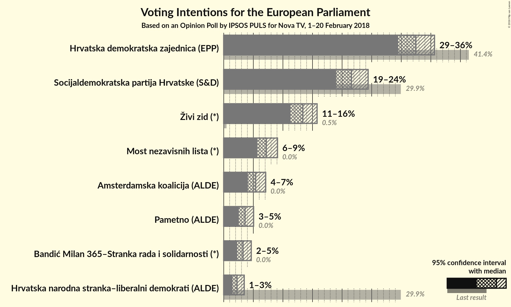
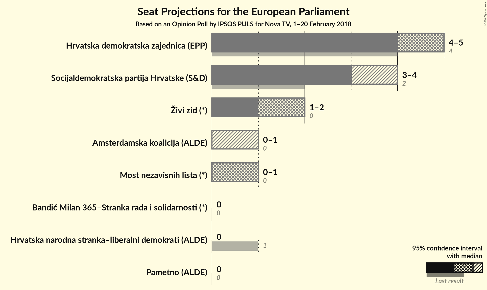
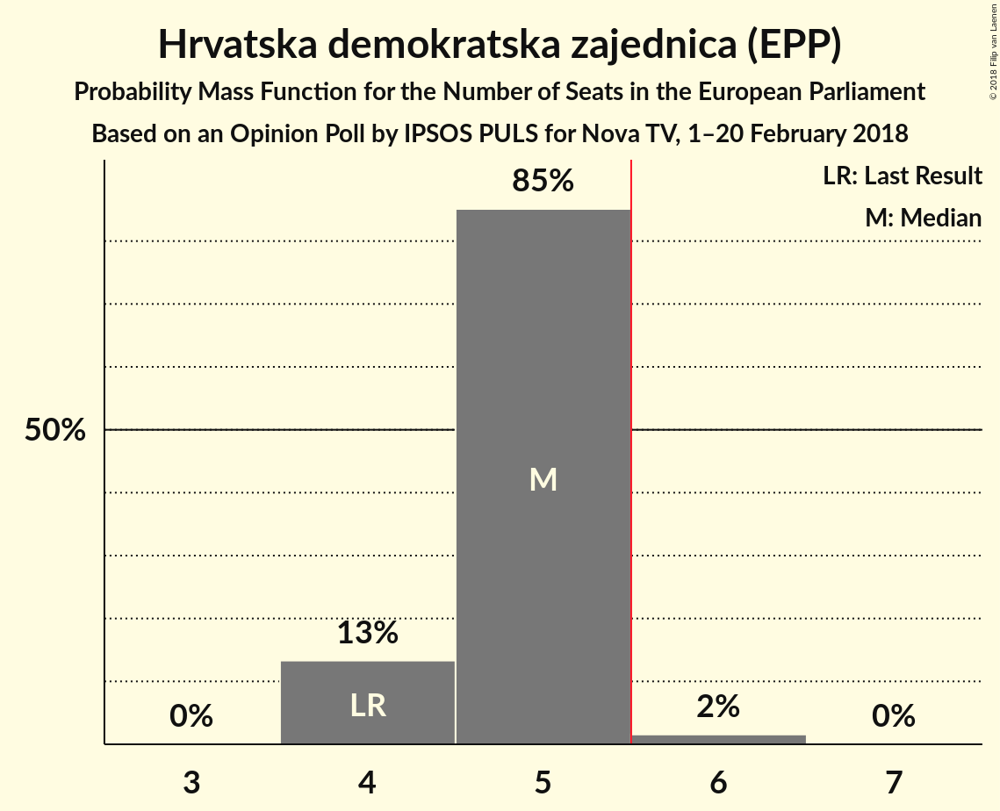
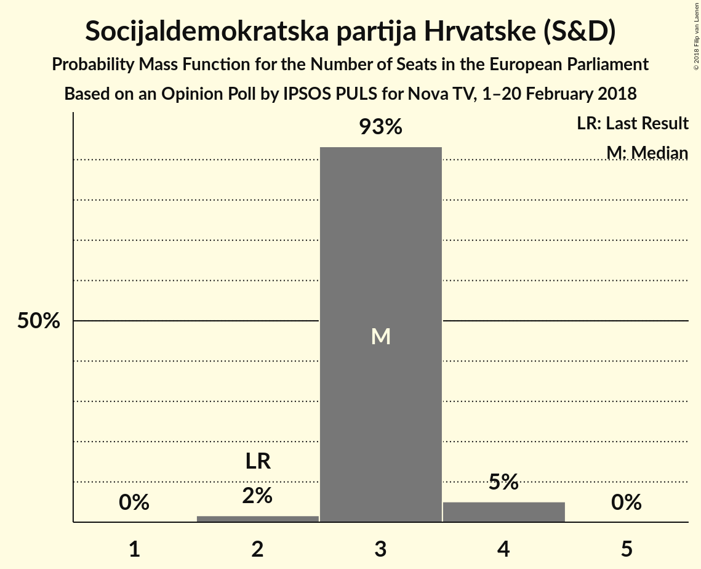
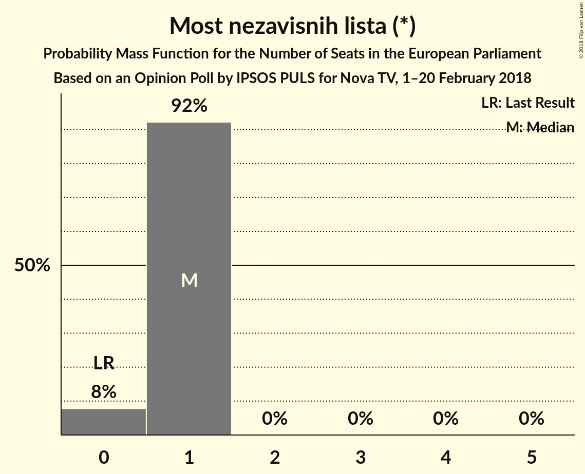
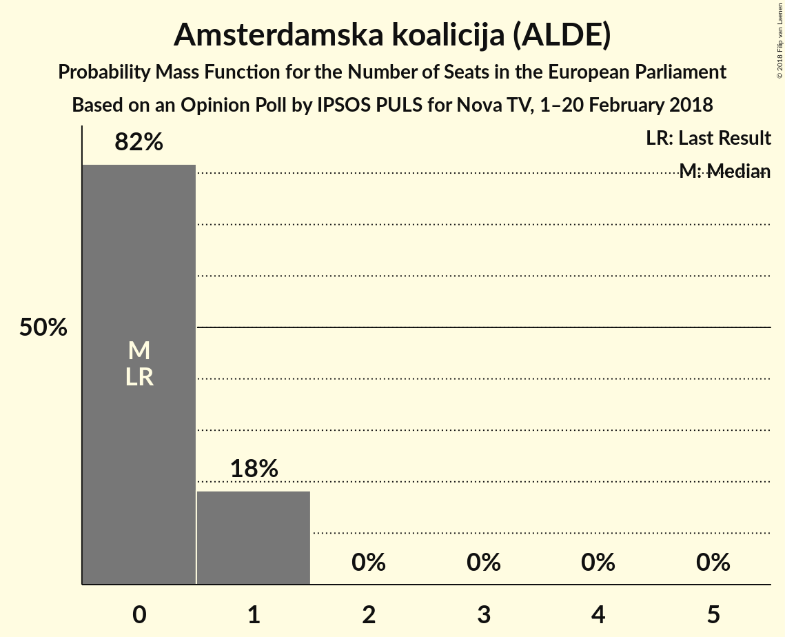
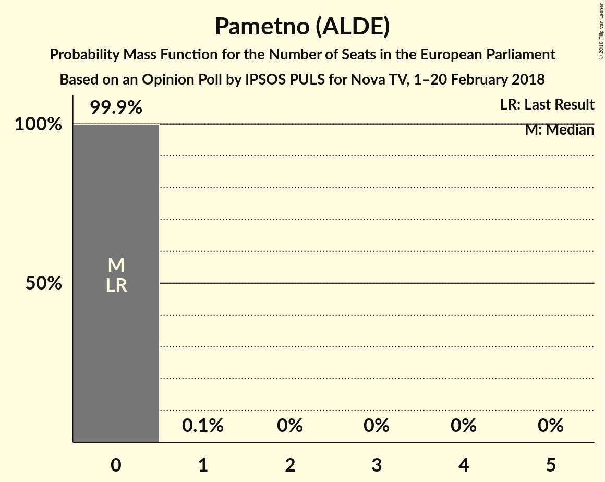
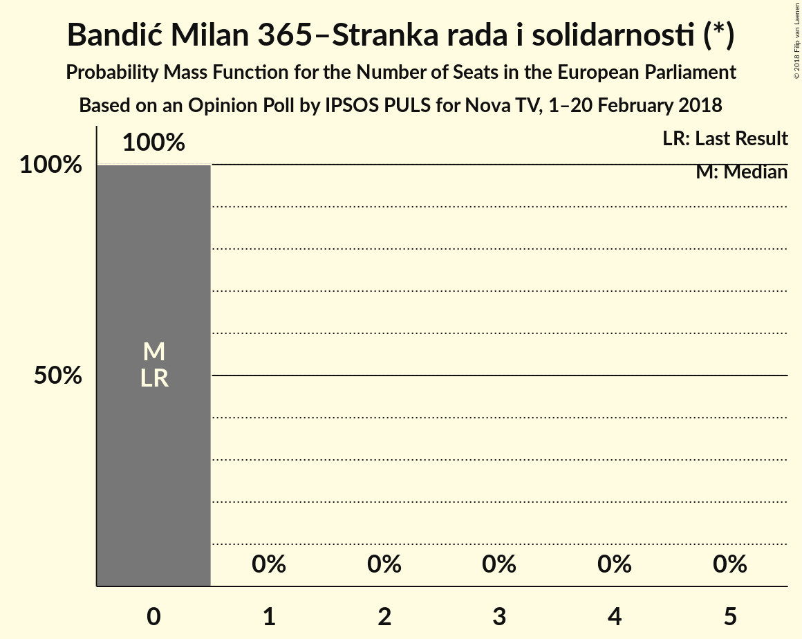
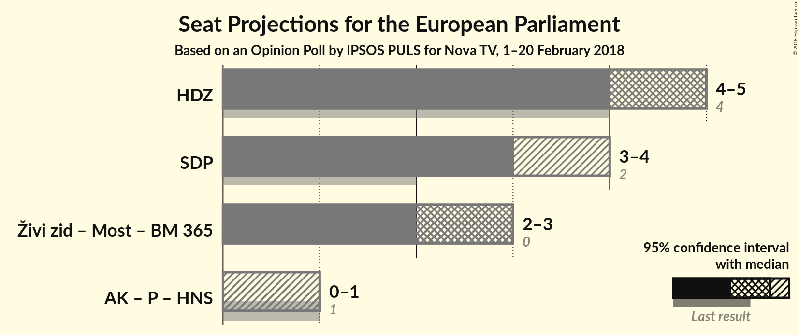

# Opinion Poll by IPSOS PULS for Nova TV, 1–20 February 2018

<a href="#voting-intentions">Voting Intentions</a> | <a href="#seats">Seats</a> | <a href="#coalitions">Coalitions</a> | <a href="#technical-information">Technical Information</a>

## Voting Intentions

### Confidence Intervals

| Party | Last Result | Poll Result | 80% Confidence Interval | 90% Confidence Interval | 95% Confidence Interval | 99% Confidence Interval |
|:-----:|:-----------:|:-----------:|:-----------------------:|:-----------------------:|:-----------------------:|:-----------------------:|
| Hrvatska demokratska zajednica (EPP) | 41.4% | 32.5% | 30.5–34.5% |29.9–35.1% |29.5–35.6% |28.5–36.6% |
| Socijaldemokratska partija Hrvatske (S&D) | 29.9% | 21.6% | 19.9–23.4% |19.4–23.9% |19.0–24.4% |18.2–25.3% |
| Živi zid (*) | 0.5% | 13.4% | 12.0–14.9% |11.6–15.4% |11.3–15.8% |10.7–16.6% |
| Most nezavisnih lista (*) | 0.0% | 7.2% | 6.2–8.4% |5.9–8.8% |5.7–9.1% |5.2–9.7% |
| Amsterdamska koalicija (ALDE) | 0.0% | 5.4% | 4.5–6.5% |4.3–6.8% |4.1–7.1% |3.7–7.7% |
| Pametno (ALDE) | 0.0% | 3.6% | 2.9–4.5% |2.7–4.8% |2.6–5.0% |2.3–5.5% |
| Bandić Milan 365–Stranka rada i solidarnosti (*) | 0.0% | 3.3% | 2.6–4.2% |2.4–4.4% |2.3–4.6% |2.0–5.1% |
| Hrvatska narodna stranka–liberalni demokrati (ALDE) | 29.9% | 2.2% | 1.7–3.0% |1.6–3.2% |1.5–3.5% |1.2–3.9% |

*Note:* The poll result column reflects the actual value used in the calculations. Published results may vary slightly, and in addition be rounded to fewer digits.

## Seats

### Confidence Intervals

| Party | Last Result | Median | 80% Confidence Interval | 90% Confidence Interval | 95% Confidence Interval | 99% Confidence Interval |
|:-----:|:-----------:|:------:|:-----------------------:|:-----------------------:|:-----------------------:|:-----------------------:|
| <a href="#hrvatska-demokratska-zajednica-(epp)">Hrvatska demokratska zajednica (EPP)</a> | 4 | 5 | 4–5 |4–5 |4–5 |4–6 |
| <a href="#socijaldemokratska-partija-hrvatske-(s&d)">Socijaldemokratska partija Hrvatske (S&D)</a> | 2 | 3 | 3 |3–4 |3–4 |2–4 |
| <a href="#živi-zid-(*)">Živi zid (*)</a> | 0 | 2 | 1–2 |1–2 |1–2 |1–2 |
| <a href="#most-nezavisnih-lista-(*)">Most nezavisnih lista (*)</a> | 0 | 1 | 1 |0–1 |0–1 |0–1 |
| <a href="#amsterdamska-koalicija-(alde)">Amsterdamska koalicija (ALDE)</a> | 0 | 0 | 0–1 |0–1 |0–1 |0–1 |
| <a href="#pametno-(alde)">Pametno (ALDE)</a> | 0 | 0 | 0 |0 |0 |0 |
| <a href="#bandić-milan-365–stranka-rada-i-solidarnosti-(*)">Bandić Milan 365–Stranka rada i solidarnosti (*)</a> | 0 | 0 | 0 |0 |0 |0 |
| <a href="#hrvatska-narodna-stranka–liberalni-demokrati-(alde)">Hrvatska narodna stranka–liberalni demokrati (ALDE)</a> | 1 | 0 | 0 |0 |0 |0 |

### Hrvatska demokratska zajednica (EPP)

*For a full overview of the results for this party, see the [Hrvatska demokratska zajednica (EPP)](party-hrvatskademokratskazajednicaepp.html) page.*

| Number of Seats | Probability | Accumulated | Special Marks |
|:---------------:|:-----------:|:-----------:|:-------------:|
| 4 | 13% | 100% | Last Result |
| 5 | 85% | 87% | Median |
| 6 | 2% | 2% | Majority |
| 7 | 0% | 0% |  |

### Socijaldemokratska partija Hrvatske (S&D)

*For a full overview of the results for this party, see the [Socijaldemokratska partija Hrvatske (S&D)](party-socijaldemokratskapartijahrvatskesd.html) page.*

| Number of Seats | Probability | Accumulated | Special Marks |
|:---------------:|:-----------:|:-----------:|:-------------:|
| 2 | 2% | 100% | Last Result |
| 3 | 93% | 98% | Median |
| 4 | 5% | 5% |  |
| 5 | 0% | 0% |  |

### Živi zid (*)

*For a full overview of the results for this party, see the [Živi zid (*)](party-živizid.html) page.*

| Number of Seats | Probability | Accumulated | Special Marks |
|:---------------:|:-----------:|:-----------:|:-------------:|
| 0 | 0% | 100% | Last Result |
| 1 | 12% | 100% |  |
| 2 | 88% | 88% | Median |
| 3 | 0% | 0% |  |

### Most nezavisnih lista (*)

*For a full overview of the results for this party, see the [Most nezavisnih lista (*)](party-mostnezavisnihlista.html) page.*

| Number of Seats | Probability | Accumulated | Special Marks |
|:---------------:|:-----------:|:-----------:|:-------------:|
| 0 | 8% | 100% | Last Result |
| 1 | 92% | 92% | Median |
| 2 | 0% | 0% |  |

### Amsterdamska koalicija (ALDE)

*For a full overview of the results for this party, see the [Amsterdamska koalicija (ALDE)](party-amsterdamskakoalicijaalde.html) page.*

| Number of Seats | Probability | Accumulated | Special Marks |
|:---------------:|:-----------:|:-----------:|:-------------:|
| 0 | 82% | 100% | Last Result, Median |
| 1 | 18% | 18% |  |
| 2 | 0% | 0% |  |

### Pametno (ALDE)

*For a full overview of the results for this party, see the [Pametno (ALDE)](party-pametnoalde.html) page.*

| Number of Seats | Probability | Accumulated | Special Marks |
|:---------------:|:-----------:|:-----------:|:-------------:|
| 0 | 99.9% | 100% | Last Result, Median |
| 1 | 0.1% | 0.1% |  |
| 2 | 0% | 0% |  |

### Bandić Milan 365–Stranka rada i solidarnosti (*)

*For a full overview of the results for this party, see the [Bandić Milan 365–Stranka rada i solidarnosti (*)](party-bandićmilan365–strankaradaisolidarnosti.html) page.*

| Number of Seats | Probability | Accumulated | Special Marks |
|:---------------:|:-----------:|:-----------:|:-------------:|
| 0 | 100% | 100% | Last Result, Median |

### Hrvatska narodna stranka–liberalni demokrati (ALDE)

*For a full overview of the results for this party, see the [Hrvatska narodna stranka–liberalni demokrati (ALDE)](party-hrvatskanarodnastranka–liberalnidemokratialde.html) page.*

| Number of Seats | Probability | Accumulated | Special Marks |
|:---------------:|:-----------:|:-----------:|:-------------:|
| 0 | 100% | 100% | Median |
| 1 | 0% | 0% | Last Result |

## Coalitions

### Confidence Intervals

| Coalition | Last Result | Median | Majority? | 80% Confidence Interval | 90% Confidence Interval | 95% Confidence Interval | 99% Confidence Interval |
|:---------:|:-----------:|:------:|:---------:|:-----------------------:|:-----------------------:|:-----------------------:|:-----------------------:|
| Hrvatska demokratska zajednica (EPP) | 4 | 5 | 2% | 4–5 | 4–5 | 4–5 | 4–6 |
| Socijaldemokratska partija Hrvatske (S&D) | 2 | 3 | 0% | 3 | 3–4 | 3–4 | 2–4 |
| Živi zid (*) – Most nezavisnih lista (*) – Bandić Milan 365–Stranka rada i solidarnosti (*) | 0 | 3 | 0% | 2–3 | 2–3 | 2–3 | 2–3 |
| Amsterdamska koalicija (ALDE) – Pametno (ALDE) – Hrvatska narodna stranka–liberalni demokrati (ALDE) | 1 | 0 | 0% | 0–1 | 0–1 | 0–1 | 0–1 |

### Hrvatska demokratska zajednica (EPP)

| Number of Seats | Probability | Accumulated | Special Marks |
|:---------------:|:-----------:|:-----------:|:-------------:|
| 4 | 13% | 100% | Last Result |
| 5 | 85% | 87% | Median |
| 6 | 2% | 2% | Majority |
| 7 | 0% | 0% |  |

### Socijaldemokratska partija Hrvatske (S&D)

| Number of Seats | Probability | Accumulated | Special Marks |
|:---------------:|:-----------:|:-----------:|:-------------:|
| 2 | 2% | 100% | Last Result |
| 3 | 93% | 98% | Median |
| 4 | 5% | 5% |  |
| 5 | 0% | 0% |  |

### Živi zid (*) – Most nezavisnih lista (*) – Bandić Milan 365–Stranka rada i solidarnosti (*)

| Number of Seats | Probability | Accumulated | Special Marks |
|:---------------:|:-----------:|:-----------:|:-------------:|
| 0 | 0% | 100% | Last Result |
| 1 | 0.2% | 100% |  |
| 2 | 20% | 99.8% |  |
| 3 | 80% | 80% | Median |
| 4 | 0% | 0% |  |

### Amsterdamska koalicija (ALDE) – Pametno (ALDE) – Hrvatska narodna stranka–liberalni demokrati (ALDE)

| Number of Seats | Probability | Accumulated | Special Marks |
|:---------------:|:-----------:|:-----------:|:-------------:|
| 0 | 82% | 100% | Median |
| 1 | 18% | 18% | Last Result |
| 2 | 0% | 0% |  |

## Technical Information

### Opinion Poll

+ **Polling firm:** IPSOS PULS
+ **Commissioner(s):** Nova TV
+ **Fieldwork period:** 1–20 February 2018

### Calculations

+ **Sample size:** 890
+ **Simulations done:** 1,048,576
+ **Error estimate:** 1.19%

