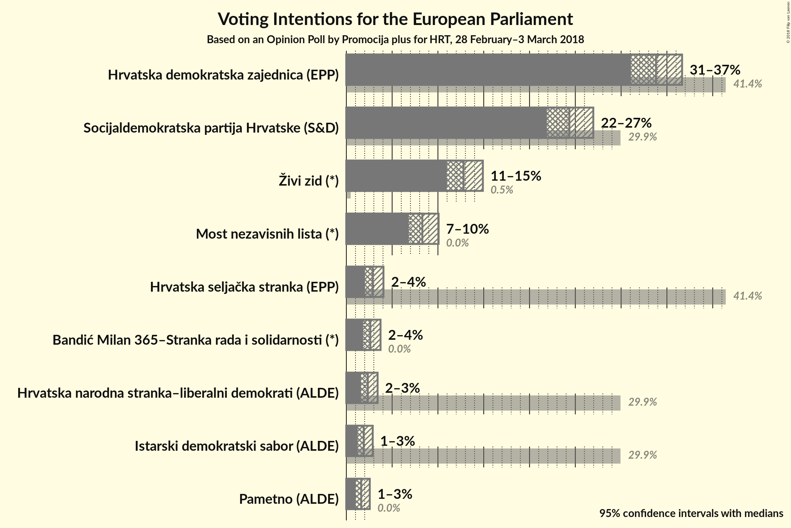
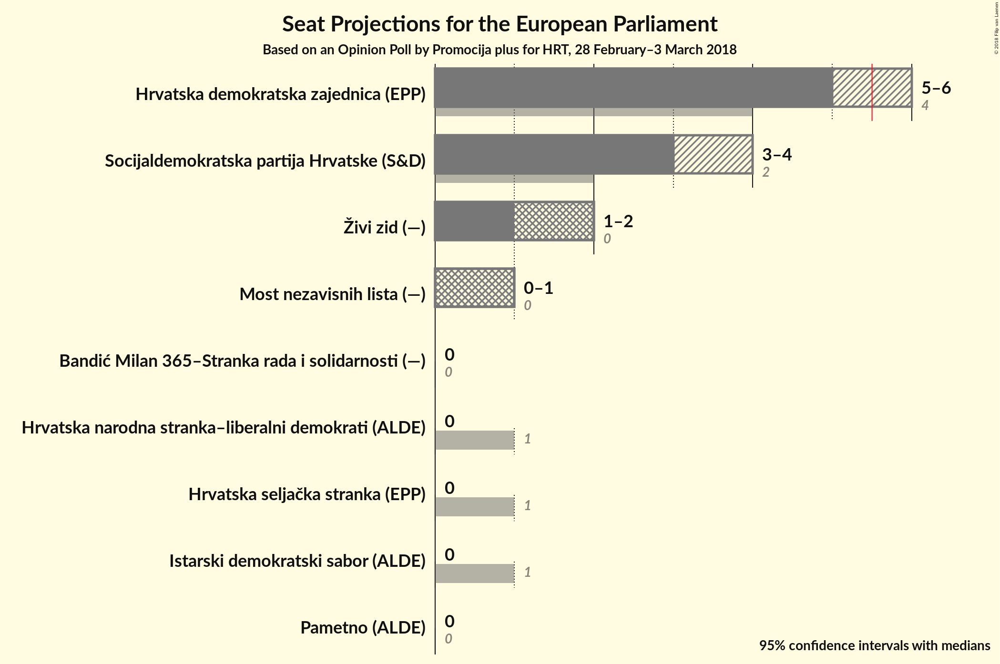
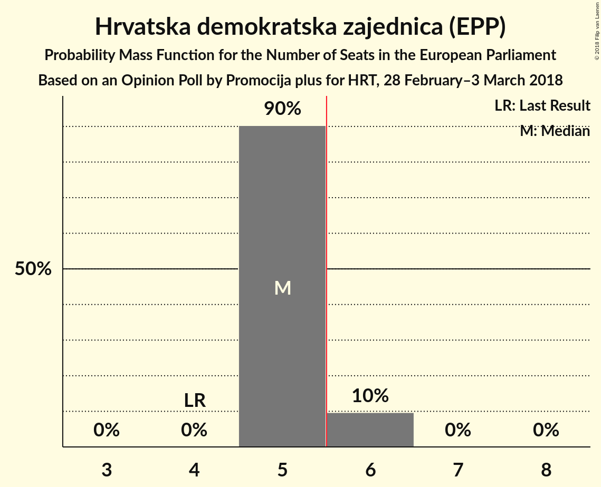
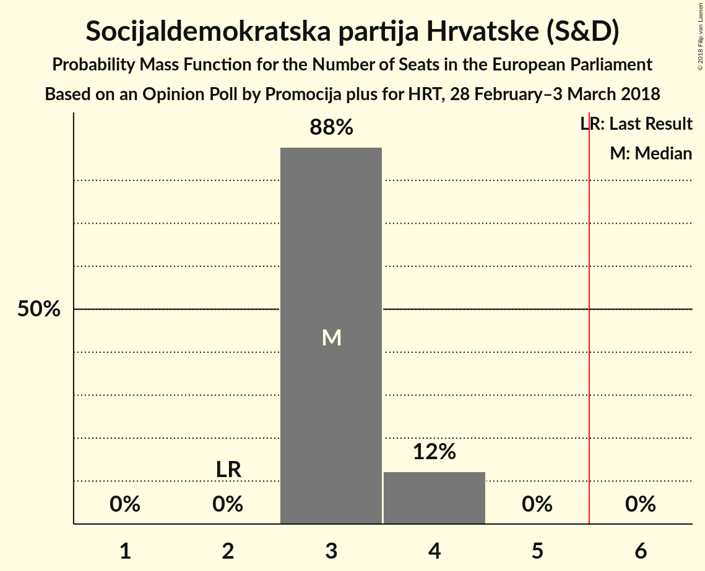
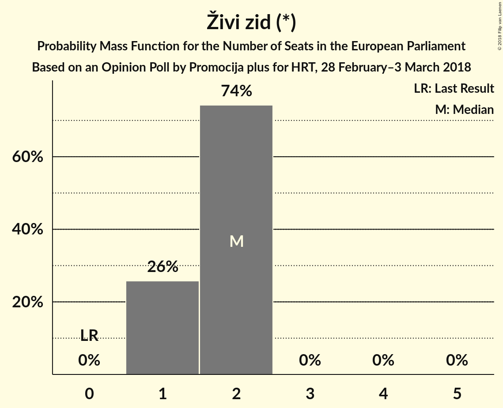
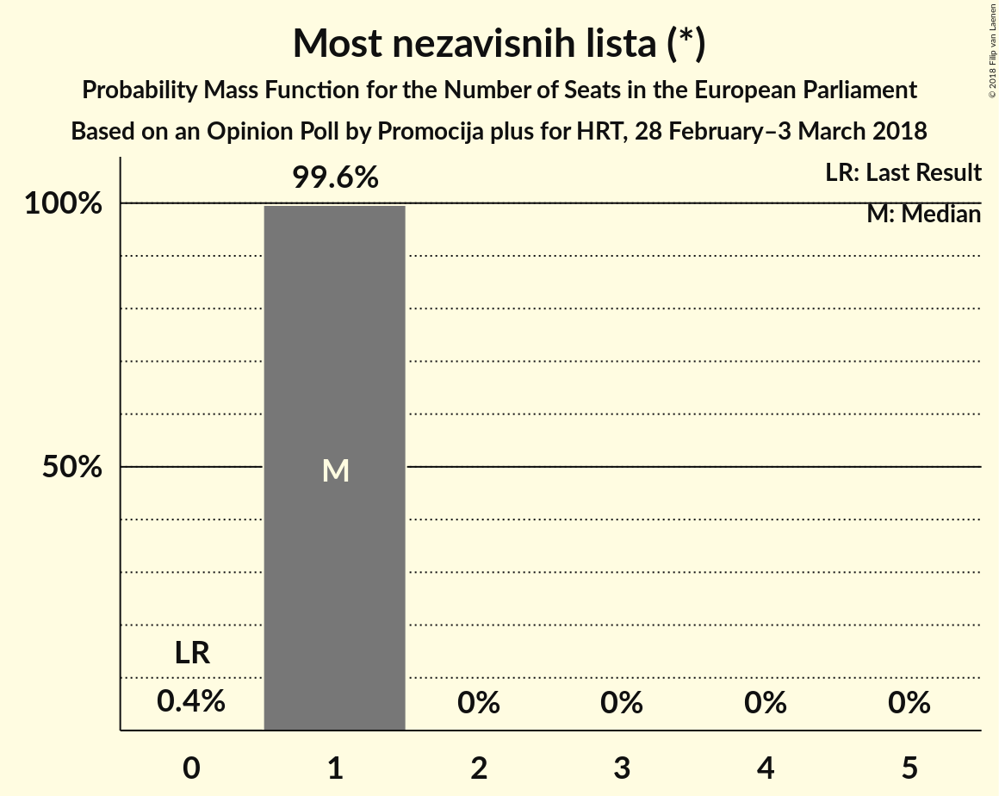
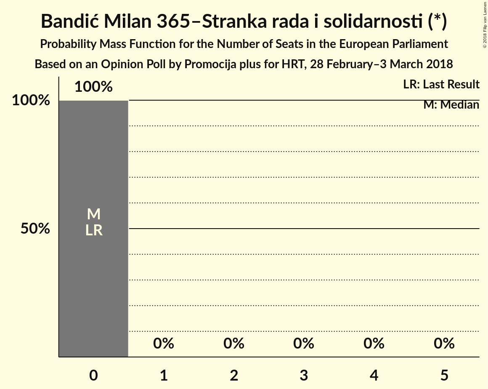
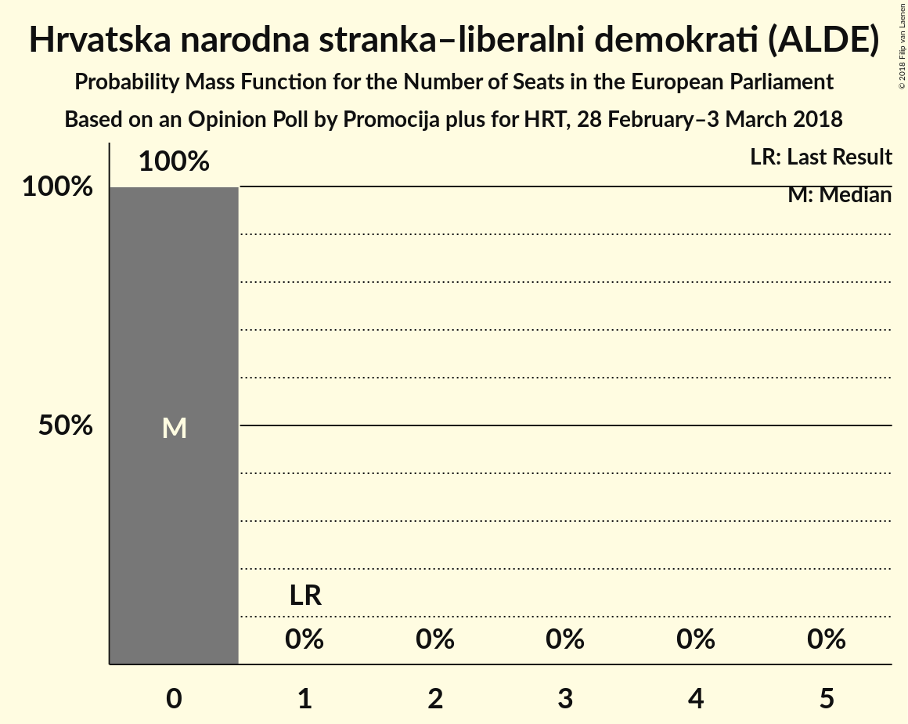
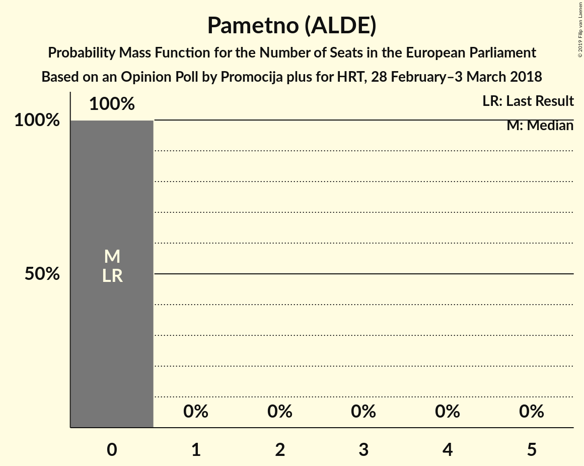
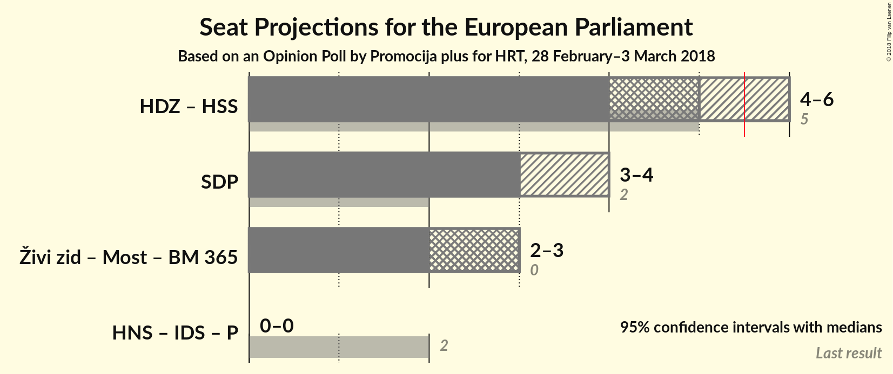

# Opinion Poll by Promocija plus for HRT, 28 February–3 March 2018

<a href="#voting-intentions">Voting Intentions</a> | <a href="#seats">Seats</a> | <a href="#coalitions">Coalitions</a> | <a href="#technical-information">Technical Information</a>

## Voting Intentions

### Confidence Intervals

| Party | Last Result | Poll Result | 80% Confidence Interval | 90% Confidence Interval | 95% Confidence Interval | 99% Confidence Interval |
|:-----:|:-----------:|:-----------:|:-----------------------:|:-----------------------:|:-----------------------:|:-----------------------:|
| Hrvatska demokratska zajednica (EPP) | 41.4% | 33.8% | 32.0–35.7% |31.5–36.2% |31.1–36.7% |30.2–37.6% |
| Socijaldemokratska partija Hrvatske (S&D) | 29.9% | 24.3% | 22.7–26.1% |22.3–26.5% |21.9–27.0% |21.2–27.8% |
| Živi zid (*) | 0.5% | 12.8% | 11.6–14.2% |11.2–14.6% |11.0–14.9% |10.4–15.6% |
| Most nezavisnih lista (*) | 0.0% | 8.3% | 7.3–9.4% |7.0–9.8% |6.8–10.1% |6.4–10.7% |
| Amsterdamska koalicija (ALDE) | 0.0% | 4.8% | 4.0–5.7% |3.8–6.0% |3.7–6.2% |3.4–6.7% |
| Bandić Milan 365–Stranka rada i solidarnosti (*) | 0.0% | 2.6% | 2.1–3.4% |2.0–3.6% |1.8–3.7% |1.6–4.1% |
| Hrvatska narodna stranka–liberalni demokrati (ALDE) | 29.9% | 2.3% | 1.9–3.0% |1.7–3.2% |1.6–3.4% |1.4–3.8% |
| Pametno (ALDE) | 0.0% | 1.6% | 1.2–2.2% |1.1–2.4% |1.0–2.6% |0.9–2.9% |

*Note:* The poll result column reflects the actual value used in the calculations. Published results may vary slightly, and in addition be rounded to fewer digits.

## Seats

### Confidence Intervals

| Party | Last Result | Median | 80% Confidence Interval | 90% Confidence Interval | 95% Confidence Interval | 99% Confidence Interval |
|:-----:|:-----------:|:------:|:-----------------------:|:-----------------------:|:-----------------------:|:-----------------------:|
| <a href="#hrvatska-demokratska-zajednica-(epp)">Hrvatska demokratska zajednica (EPP)</a> | 4 | 5 | 5 |5 |4–5 |4–6 |
| <a href="#socijaldemokratska-partija-hrvatske-(s&d)">Socijaldemokratska partija Hrvatske (S&D)</a> | 2 | 3 | 3–4 |3–4 |3–4 |3–4 |
| <a href="#živi-zid-(*)">Živi zid (*)</a> | 0 | 2 | 1–2 |1–2 |1–2 |1–2 |
| <a href="#most-nezavisnih-lista-(*)">Most nezavisnih lista (*)</a> | 0 | 1 | 1 |1 |1 |1 |
| <a href="#amsterdamska-koalicija-(alde)">Amsterdamska koalicija (ALDE)</a> | 0 | 0 | 0 |0 |0 |0–1 |
| <a href="#bandić-milan-365–stranka-rada-i-solidarnosti-(*)">Bandić Milan 365–Stranka rada i solidarnosti (*)</a> | 0 | 0 | 0 |0 |0 |0 |
| <a href="#hrvatska-narodna-stranka–liberalni-demokrati-(alde)">Hrvatska narodna stranka–liberalni demokrati (ALDE)</a> | 1 | 0 | 0 |0 |0 |0 |
| <a href="#pametno-(alde)">Pametno (ALDE)</a> | 0 | 0 | 0 |0 |0 |0 |

### Hrvatska demokratska zajednica (EPP)

*For a full overview of the results for this party, see the [Hrvatska demokratska zajednica (EPP)](party-hrvatskademokratskazajednicaepp.html) page.*

| Number of Seats | Probability | Accumulated | Special Marks |
|:---------------:|:-----------:|:-----------:|:-------------:|
| 4 | 4% | 100% | Last Result |
| 5 | 93% | 96% | Median |
| 6 | 2% | 2% | Majority |
| 7 | 0% | 0% |  |

### Socijaldemokratska partija Hrvatske (S&D)

*For a full overview of the results for this party, see the [Socijaldemokratska partija Hrvatske (S&D)](party-socijaldemokratskapartijahrvatskesd.html) page.*

| Number of Seats | Probability | Accumulated | Special Marks |
|:---------------:|:-----------:|:-----------:|:-------------:|
| 2 | 0% | 100% | Last Result |
| 3 | 72% | 100% | Median |
| 4 | 28% | 28% |  |
| 5 | 0% | 0% |  |

### Živi zid (*)

*For a full overview of the results for this party, see the [Živi zid (*)](party-živizid.html) page.*

| Number of Seats | Probability | Accumulated | Special Marks |
|:---------------:|:-----------:|:-----------:|:-------------:|
| 0 | 0% | 100% | Last Result |
| 1 | 29% | 100% |  |
| 2 | 71% | 71% | Median |
| 3 | 0% | 0% |  |

### Most nezavisnih lista (*)

*For a full overview of the results for this party, see the [Most nezavisnih lista (*)](party-mostnezavisnihlista.html) page.*

| Number of Seats | Probability | Accumulated | Special Marks |
|:---------------:|:-----------:|:-----------:|:-------------:|
| 0 | 0.3% | 100% | Last Result |
| 1 | 99.7% | 99.7% | Median |
| 2 | 0% | 0% |  |

### Amsterdamska koalicija (ALDE)

*For a full overview of the results for this party, see the [Amsterdamska koalicija (ALDE)](party-amsterdamskakoalicijaalde.html) page.*

| Number of Seats | Probability | Accumulated | Special Marks |
|:---------------:|:-----------:|:-----------:|:-------------:|
| 0 | 98% | 100% | Last Result, Median |
| 1 | 2% | 2% |  |
| 2 | 0% | 0% |  |

### Bandić Milan 365–Stranka rada i solidarnosti (*)

*For a full overview of the results for this party, see the [Bandić Milan 365–Stranka rada i solidarnosti (*)](party-bandićmilan365–strankaradaisolidarnosti.html) page.*

| Number of Seats | Probability | Accumulated | Special Marks |
|:---------------:|:-----------:|:-----------:|:-------------:|
| 0 | 100% | 100% | Last Result, Median |

### Hrvatska narodna stranka–liberalni demokrati (ALDE)

*For a full overview of the results for this party, see the [Hrvatska narodna stranka–liberalni demokrati (ALDE)](party-hrvatskanarodnastranka–liberalnidemokratialde.html) page.*

| Number of Seats | Probability | Accumulated | Special Marks |
|:---------------:|:-----------:|:-----------:|:-------------:|
| 0 | 100% | 100% | Median |
| 1 | 0% | 0% | Last Result |

### Pametno (ALDE)

*For a full overview of the results for this party, see the [Pametno (ALDE)](party-pametnoalde.html) page.*

| Number of Seats | Probability | Accumulated | Special Marks |
|:---------------:|:-----------:|:-----------:|:-------------:|
| 0 | 100% | 100% | Last Result, Median |

## Coalitions

### Confidence Intervals

| Coalition | Last Result | Median | Majority? | 80% Confidence Interval | 90% Confidence Interval | 95% Confidence Interval | 99% Confidence Interval |
|:---------:|:-----------:|:------:|:---------:|:-----------------------:|:-----------------------:|:-----------------------:|:-----------------------:|
| Hrvatska demokratska zajednica (EPP) | 4 | 5 | 2% | 5 | 5 | 4–5 | 4–6 |
| Socijaldemokratska partija Hrvatske (S&D) | 2 | 3 | 0% | 3–4 | 3–4 | 3–4 | 3–4 |
| Živi zid (*) – Most nezavisnih lista (*) – Bandić Milan 365–Stranka rada i solidarnosti (*) | 0 | 3 | 0% | 2–3 | 2–3 | 2–3 | 2–3 |
| Amsterdamska koalicija (ALDE) – Hrvatska narodna stranka–liberalni demokrati (ALDE) – Pametno (ALDE) | 1 | 0 | 0% | 0 | 0 | 0 | 0–1 |

### Hrvatska demokratska zajednica (EPP)

| Number of Seats | Probability | Accumulated | Special Marks |
|:---------------:|:-----------:|:-----------:|:-------------:|
| 4 | 4% | 100% | Last Result |
| 5 | 93% | 96% | Median |
| 6 | 2% | 2% | Majority |
| 7 | 0% | 0% |  |

### Socijaldemokratska partija Hrvatske (S&D)

| Number of Seats | Probability | Accumulated | Special Marks |
|:---------------:|:-----------:|:-----------:|:-------------:|
| 2 | 0% | 100% | Last Result |
| 3 | 72% | 100% | Median |
| 4 | 28% | 28% |  |
| 5 | 0% | 0% |  |

### Živi zid (*) – Most nezavisnih lista (*) – Bandić Milan 365–Stranka rada i solidarnosti (*)

| Number of Seats | Probability | Accumulated | Special Marks |
|:---------------:|:-----------:|:-----------:|:-------------:|
| 0 | 0% | 100% | Last Result |
| 1 | 0% | 100% |  |
| 2 | 29% | 100% |  |
| 3 | 71% | 71% | Median |
| 4 | 0% | 0% |  |

### Amsterdamska koalicija (ALDE) – Hrvatska narodna stranka–liberalni demokrati (ALDE) – Pametno (ALDE)

| Number of Seats | Probability | Accumulated | Special Marks |
|:---------------:|:-----------:|:-----------:|:-------------:|
| 0 | 98% | 100% | Median |
| 1 | 2% | 2% | Last Result |
| 2 | 0% | 0% |  |

## Technical Information

### Opinion Poll

+ **Polling firm:** Promocija plus
+ **Commissioner(s):** HRT
+ **Fieldwork period:** 28 February–3 March 2018

### Calculations

+ **Sample size:** 1109
+ **Simulations done:** 1,048,576
+ **Error estimate:** 0.64%

