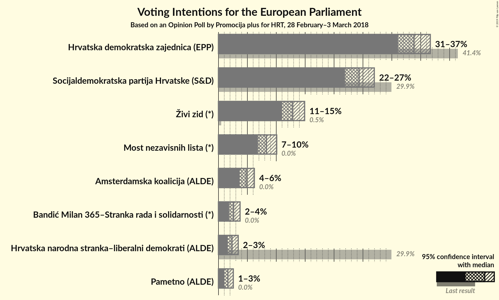
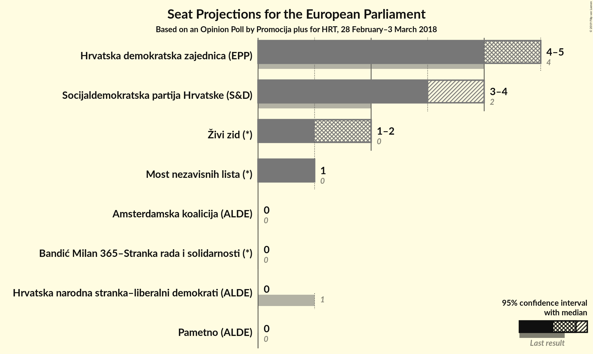

# Opinion Poll by Promocija plus for HRT, 28 February–3 March 2018

<a href="#voting-intentions">Voting Intentions</a> | <a href="#seats">Seats</a> | <a href="#coalitions">Coalitions</a> | <a href="#technical-information">Technical Information</a>

## Voting Intentions

### Confidence Intervals

| Party | Last Result | Poll Result | 80% Confidence Interval | 90% Confidence Interval | 95% Confidence Interval | 99% Confidence Interval |
|:-----:|:-----------:|:-----------:|:-----------------------:|:-----------------------:|:-----------------------:|:-----------------------:|
| Hrvatska demokratska zajednica (EPP) | 41.4% | 33.8% | 32.0–35.7% |31.5–36.2% |31.1–36.7% |30.2–37.6% |
| Socijaldemokratska partija Hrvatske (S&D) | 29.9% | 24.3% | 22.7–26.1% |22.3–26.5% |21.9–27.0% |21.2–27.8% |
| Živi zid (*) | 0.5% | 12.8% | 11.6–14.2% |11.2–14.6% |11.0–14.9% |10.4–15.6% |
| Most nezavisnih lista (*) | 0.0% | 8.3% | 7.3–9.4% |7.0–9.8% |6.8–10.1% |6.4–10.7% |
| Amsterdamska koalicija (ALDE) | 0.0% | 4.8% | N/A |N/A |N/A |N/A |
| Bandić Milan 365–Stranka rada i solidarnosti (*) | 0.0% | 2.6% | 2.1–3.4% |2.0–3.6% |1.8–3.7% |1.6–4.1% |
| Hrvatska narodna stranka–liberalni demokrati (ALDE) | 29.9% | 2.3% | 1.9–3.0% |1.7–3.2% |1.6–3.4% |1.4–3.8% |
| Pametno (ALDE) | 0.0% | 1.6% | 1.2–2.2% |1.1–2.4% |1.0–2.6% |0.9–2.9% |

*Note:* The poll result column reflects the actual value used in the calculations. Published results may vary slightly, and in addition be rounded to fewer digits.

## Seats

### Confidence Intervals

| Party | Last Result | Median | 80% Confidence Interval | 90% Confidence Interval | 95% Confidence Interval | 99% Confidence Interval |
|:-----:|:-----------:|:------:|:-----------------------:|:-----------------------:|:-----------------------:|:-----------------------:|
| <a href="#hrvatska-demokratska-zajednica-(epp)">Hrvatska demokratska zajednica (EPP)</a> | 4 | 5 | 5 |5 |4–6 |4–6 |
| <a href="#socijaldemokratska-partija-hrvatske-(s&d)">Socijaldemokratska partija Hrvatske (S&D)</a> | 2 | 3 | 3–4 |3–4 |3–4 |3–4 |
| <a href="#živi-zid-(*)">Živi zid (*)</a> | 0 | 2 | 1–2 |1–2 |1–2 |1–2 |
| <a href="#most-nezavisnih-lista-(*)">Most nezavisnih lista (*)</a> | 0 | 1 | 1 |1 |1 |1 |
| <a href="#amsterdamska-koalicija-(alde)">Amsterdamska koalicija (ALDE)</a> | 0 | N/A | N/A |N/A |N/A |N/A |
| <a href="#bandić-milan-365–stranka-rada-i-solidarnosti-(*)">Bandić Milan 365–Stranka rada i solidarnosti (*)</a> | 0 | 0 | 0 |0 |0 |0 |
| <a href="#hrvatska-narodna-stranka–liberalni-demokrati-(alde)">Hrvatska narodna stranka–liberalni demokrati (ALDE)</a> | 1 | 0 | 0 |0 |0 |0 |
| <a href="#pametno-(alde)">Pametno (ALDE)</a> | 0 | 0 | 0 |0 |0 |0 |

