# Opinion Poll by 2x1 Komunikacije for CroElecto, 17 March 2018

<a href="#voting-intentions">Voting Intentions</a> | <a href="#seats">Seats</a> | <a href="#coalitions">Coalitions</a> | <a href="#technical-information">Technical Information</a>

## Voting Intentions

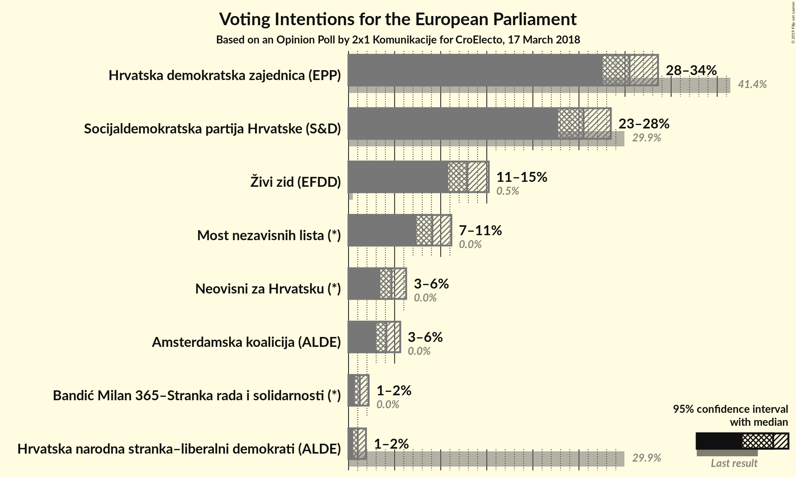

### Confidence Intervals

| Party | Last Result | Poll Result | 80% Confidence Interval | 90% Confidence Interval | 95% Confidence Interval | 99% Confidence Interval |
|:-----:|:-----------:|:-----------:|:-----------------------:|:-----------------------:|:-----------------------:|:-----------------------:|
| Hrvatska demokratska zajednica (EPP) | 41.4% | 30.5% | 28.6–32.5% |28.0–33.1% |27.6–33.6% |26.7–34.6% |
| Socijaldemokratska partija Hrvatske (S&D) | 29.9% | 25.5% | 23.7–27.4% |23.2–28.0% |22.8–28.5% |21.9–29.4% |
| Živi zid (EFDD) | 0.5% | 12.9% | 11.5–14.4% |11.1–14.8% |10.8–15.2% |10.2–16.0% |
| Most nezavisnih lista (*) | 0.0% | 9.1% | 8.0–10.4% |7.7–10.8% |7.4–11.2% |6.9–11.8% |
| Neovisni za Hrvatsku (*) | 0.0% | 4.7% | 3.9–5.7% |3.6–6.0% |3.5–6.2% |3.1–6.8% |
| Amsterdamska koalicija (ALDE) | 0.0% | 4.1% | 3.4–5.1% |3.2–5.4% |3.0–5.6% |2.7–6.1% |
| Bandić Milan 365–Stranka rada i solidarnosti (*) | 0.0% | 1.2% | 0.9–1.8% |0.8–2.0% |0.7–2.2% |0.5–2.5% |
| Hrvatska narodna stranka–liberalni demokrati (ALDE) | 29.9% | 1.0% | 0.7–1.6% |0.6–1.7% |0.5–1.9% |0.4–2.2% |

*Note:* The poll result column reflects the actual value used in the calculations. Published results may vary slightly, and in addition be rounded to fewer digits.

## Seats

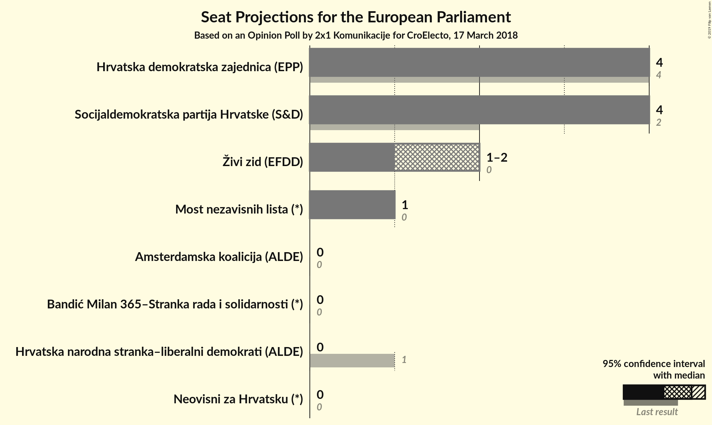

### Confidence Intervals

| Party | Last Result | Median | 80% Confidence Interval | 90% Confidence Interval | 95% Confidence Interval | 99% Confidence Interval |
|:-----:|:-----------:|:------:|:-----------------------:|:-----------------------:|:-----------------------:|:-----------------------:|
| <a href="#hrvatska-demokratska-zajednica-(epp)">Hrvatska demokratska zajednica (EPP)</a> | 4 | 4 | 4 |4 |4 |4–5 |
| <a href="#socijaldemokratska-partija-hrvatske-(s&d)">Socijaldemokratska partija Hrvatske (S&D)</a> | 2 | 4 | 4 |4 |4 |3–4 |
| <a href="#živi-zid-(efdd)">Živi zid (EFDD)</a> | 0 | 2 | 1–2 |1–2 |1–2 |1–2 |
| <a href="#most-nezavisnih-lista-(*)">Most nezavisnih lista (*)</a> | 0 | 1 | 1 |1 |1 |1–2 |
| <a href="#neovisni-za-hrvatsku-(*)">Neovisni za Hrvatsku (*)</a> | 0 | 0 | 0 |0 |0 |0 |
| <a href="#amsterdamska-koalicija-(alde)">Amsterdamska koalicija (ALDE)</a> | 0 | 0 | 0 |0 |0 |0 |
| <a href="#bandić-milan-365–stranka-rada-i-solidarnosti-(*)">Bandić Milan 365–Stranka rada i solidarnosti (*)</a> | 0 | 0 | 0 |0 |0 |0 |
| <a href="#hrvatska-narodna-stranka–liberalni-demokrati-(alde)">Hrvatska narodna stranka–liberalni demokrati (ALDE)</a> | 1 | 0 | 0 |0 |0 |0 |

### Hrvatska demokratska zajednica (EPP)

*For a full overview of the results for this party, see the [Hrvatska demokratska zajednica (EPP)](party-hrvatskademokratskazajednicaepp.html) page.*

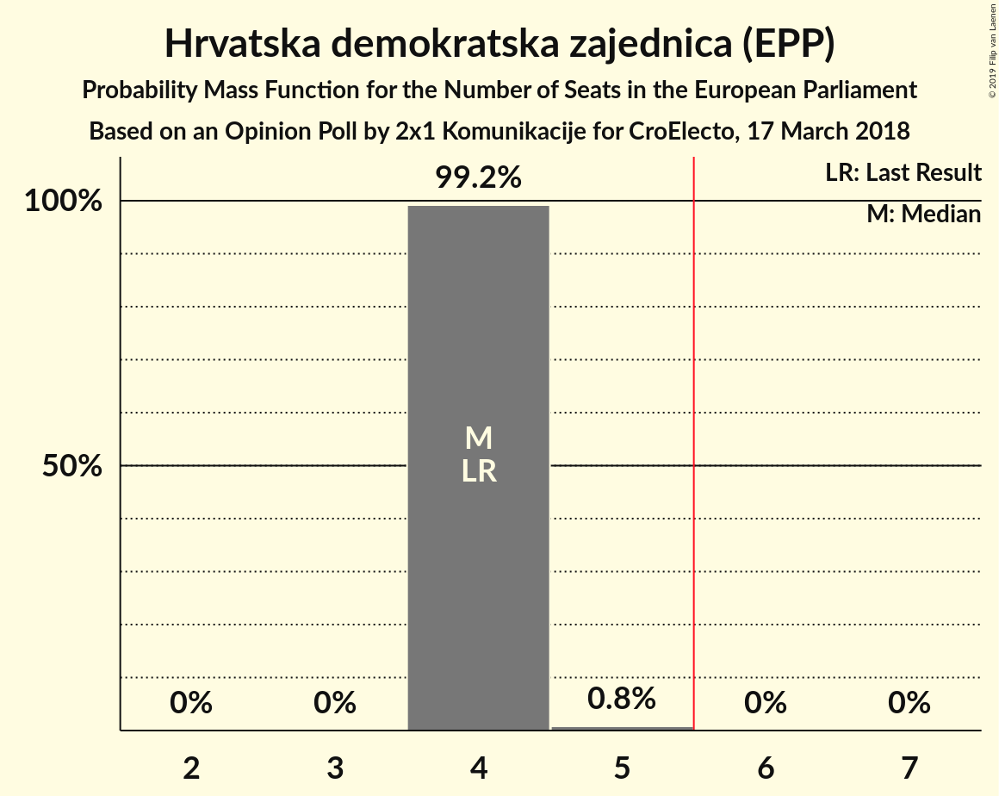

| Number of Seats | Probability | Accumulated | Special Marks |
|:---------------:|:-----------:|:-----------:|:-------------:|
| 4 | 99.2% | 100% | Last Result, Median |
| 5 | 0.8% | 0.8% |  |
| 6 | 0% | 0% | Majority |

### Socijaldemokratska partija Hrvatske (S&D)

*For a full overview of the results for this party, see the [Socijaldemokratska partija Hrvatske (S&D)](party-socijaldemokratskapartijahrvatskesd.html) page.*

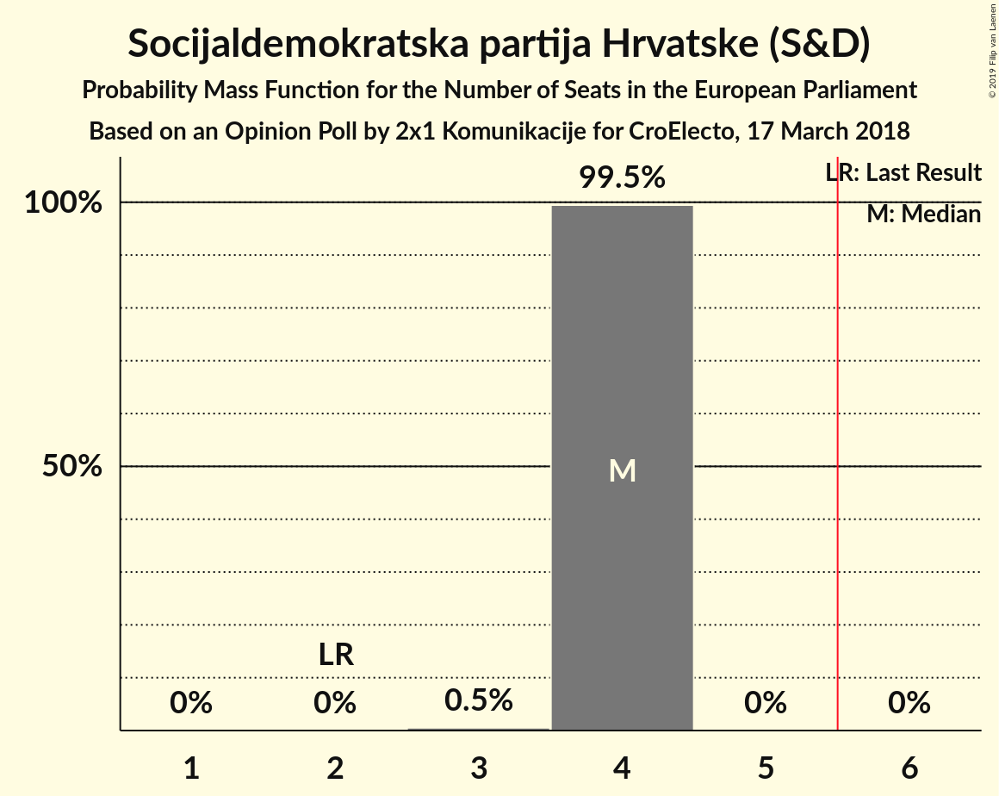

| Number of Seats | Probability | Accumulated | Special Marks |
|:---------------:|:-----------:|:-----------:|:-------------:|
| 2 | 0% | 100% | Last Result |
| 3 | 0.5% | 100% |  |
| 4 | 99.5% | 99.5% | Median |
| 5 | 0% | 0% |  |

### Živi zid (EFDD)

*For a full overview of the results for this party, see the [Živi zid (EFDD)](party-živizidefdd.html) page.*

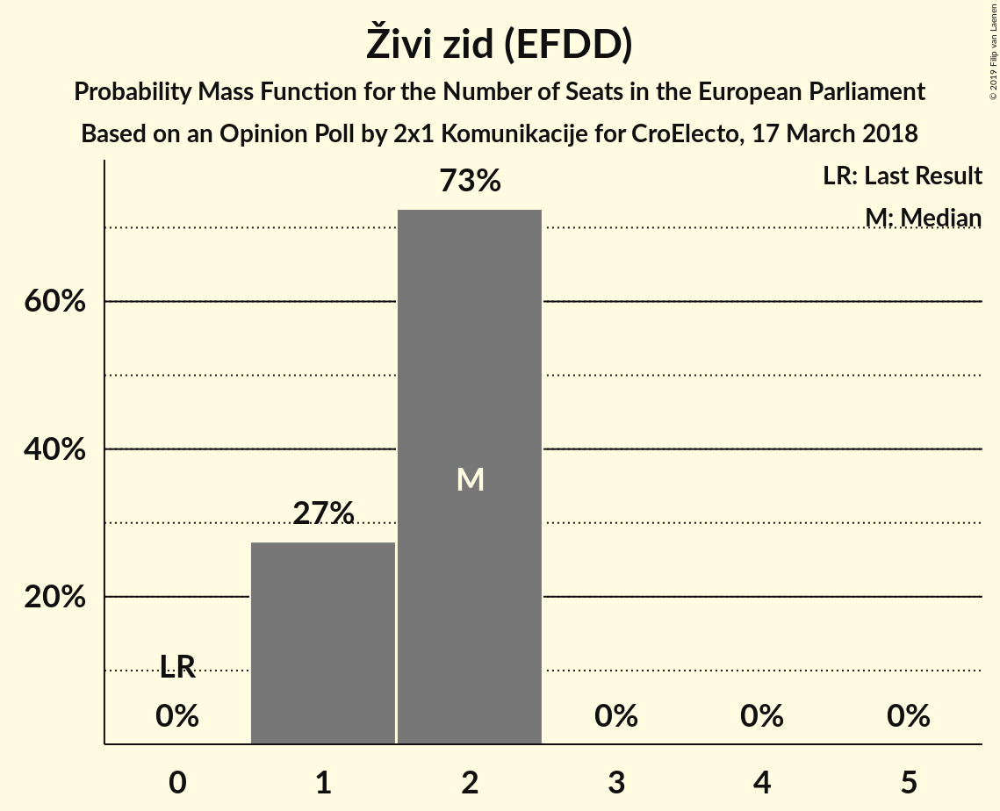

| Number of Seats | Probability | Accumulated | Special Marks |
|:---------------:|:-----------:|:-----------:|:-------------:|
| 0 | 0% | 100% | Last Result |
| 1 | 25% | 100% |  |
| 2 | 75% | 75% | Median |
| 3 | 0% | 0% |  |

### Most nezavisnih lista (*)

*For a full overview of the results for this party, see the [Most nezavisnih lista (*)](party-mostnezavisnihlista.html) page.*

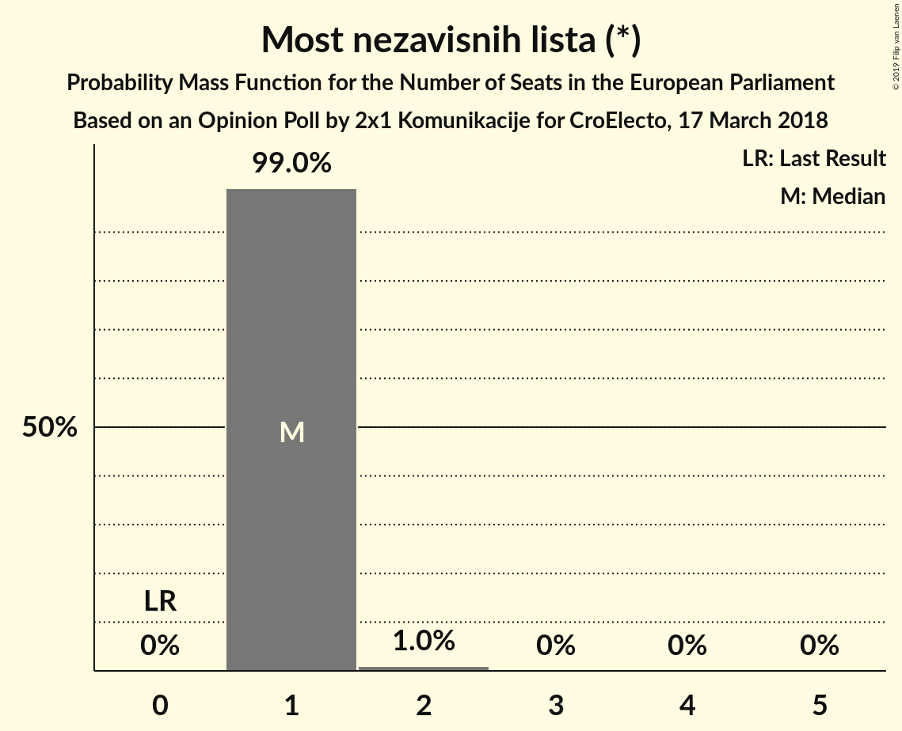

| Number of Seats | Probability | Accumulated | Special Marks |
|:---------------:|:-----------:|:-----------:|:-------------:|
| 0 | 0% | 100% | Last Result |
| 1 | 99.0% | 100% | Median |
| 2 | 1.0% | 1.0% |  |
| 3 | 0% | 0% |  |

### Neovisni za Hrvatsku (*)

*For a full overview of the results for this party, see the [Neovisni za Hrvatsku (*)](party-neovisnizahrvatsku.html) page.*

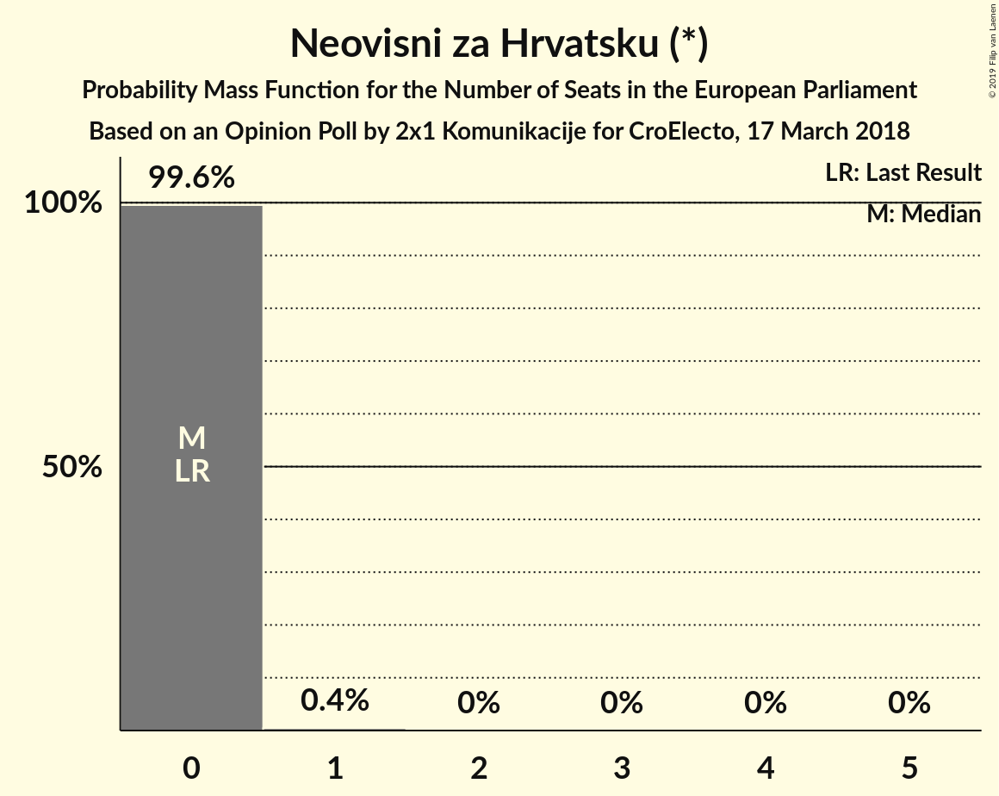

| Number of Seats | Probability | Accumulated | Special Marks |
|:---------------:|:-----------:|:-----------:|:-------------:|
| 0 | 99.6% | 100% | Last Result, Median |
| 1 | 0.4% | 0.4% |  |
| 2 | 0% | 0% |  |

### Amsterdamska koalicija (ALDE)

*For a full overview of the results for this party, see the [Amsterdamska koalicija (ALDE)](party-amsterdamskakoalicijaalde.html) page.*

| Number of Seats | Probability | Accumulated | Special Marks |
|:---------------:|:-----------:|:-----------:|:-------------:|
| 0 | 100% | 100% | Last Result, Median |

### Bandić Milan 365–Stranka rada i solidarnosti (*)

*For a full overview of the results for this party, see the [Bandić Milan 365–Stranka rada i solidarnosti (*)](party-bandićmilan365–strankaradaisolidarnosti.html) page.*

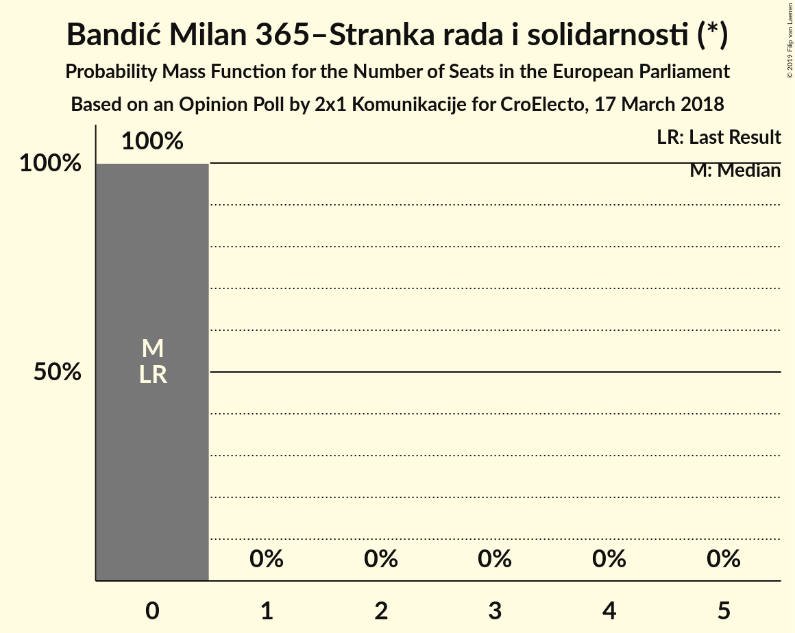

| Number of Seats | Probability | Accumulated | Special Marks |
|:---------------:|:-----------:|:-----------:|:-------------:|
| 0 | 100% | 100% | Last Result, Median |

### Hrvatska narodna stranka–liberalni demokrati (ALDE)

*For a full overview of the results for this party, see the [Hrvatska narodna stranka–liberalni demokrati (ALDE)](party-hrvatskanarodnastranka–liberalnidemokratialde.html) page.*

| Number of Seats | Probability | Accumulated | Special Marks |
|:---------------:|:-----------:|:-----------:|:-------------:|
| 0 | 100% | 100% | Median |
| 1 | 0% | 0% | Last Result |

## Coalitions

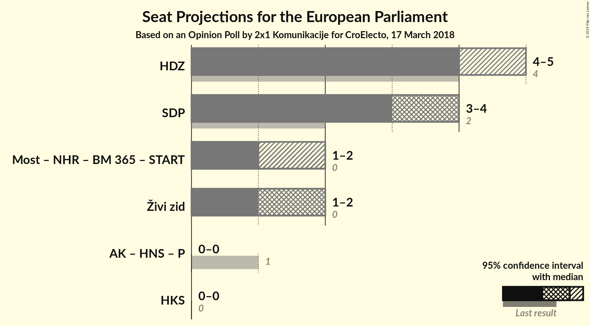

### Confidence Intervals

| Coalition | Last Result | Median | Majority? | 80% Confidence Interval | 90% Confidence Interval | 95% Confidence Interval | 99% Confidence Interval |
|:---------:|:-----------:|:------:|:---------:|:-----------------------:|:-----------------------:|:-----------------------:|:-----------------------:|
| Hrvatska demokratska zajednica (EPP) | 4 | 4 | 0% | 4 | 4 | 4 | 4–5 |
| Socijaldemokratska partija Hrvatske (S&D) | 2 | 4 | 0% | 4 | 4 | 4 | 3–4 |
| Živi zid (EFDD) | 0 | 2 | 0% | 1–2 | 1–2 | 1–2 | 1–2 |

### Hrvatska demokratska zajednica (EPP)

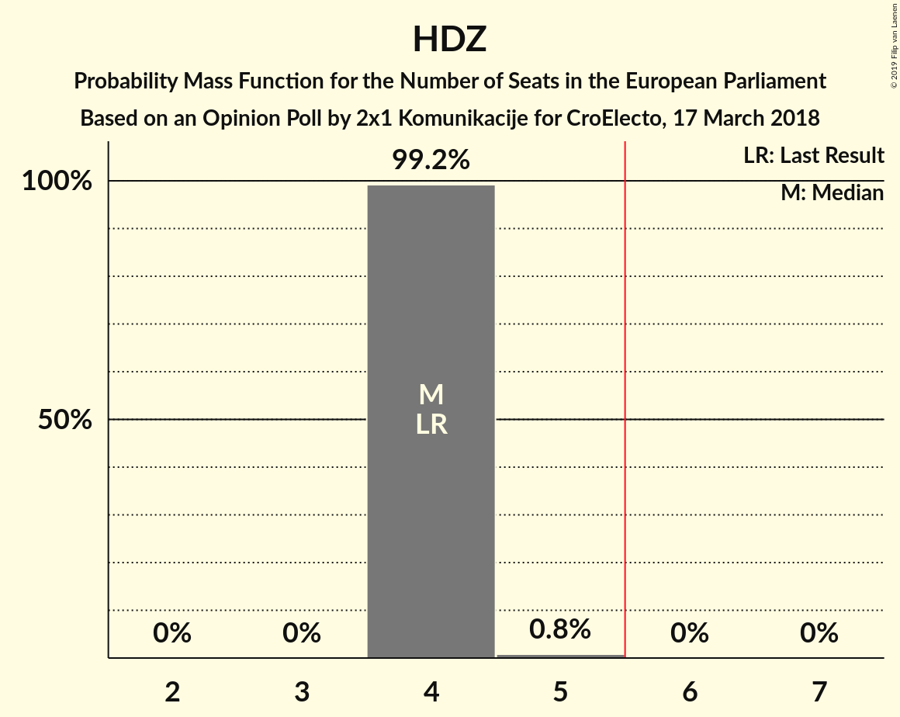

| Number of Seats | Probability | Accumulated | Special Marks |
|:---------------:|:-----------:|:-----------:|:-------------:|
| 4 | 99.2% | 100% | Last Result, Median |
| 5 | 0.8% | 0.8% |  |
| 6 | 0% | 0% | Majority |

### Socijaldemokratska partija Hrvatske (S&D)

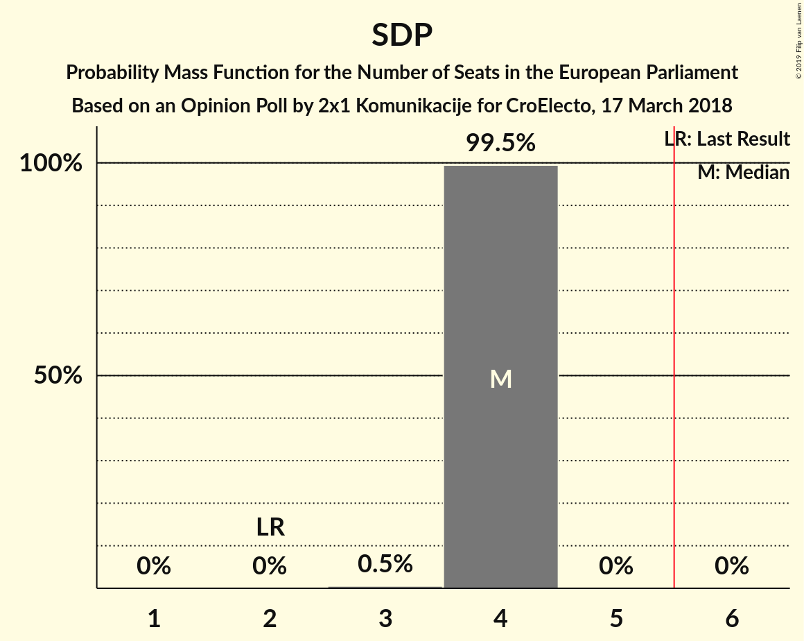

| Number of Seats | Probability | Accumulated | Special Marks |
|:---------------:|:-----------:|:-----------:|:-------------:|
| 2 | 0% | 100% | Last Result |
| 3 | 0.5% | 100% |  |
| 4 | 99.5% | 99.5% | Median |
| 5 | 0% | 0% |  |

### Živi zid (EFDD)

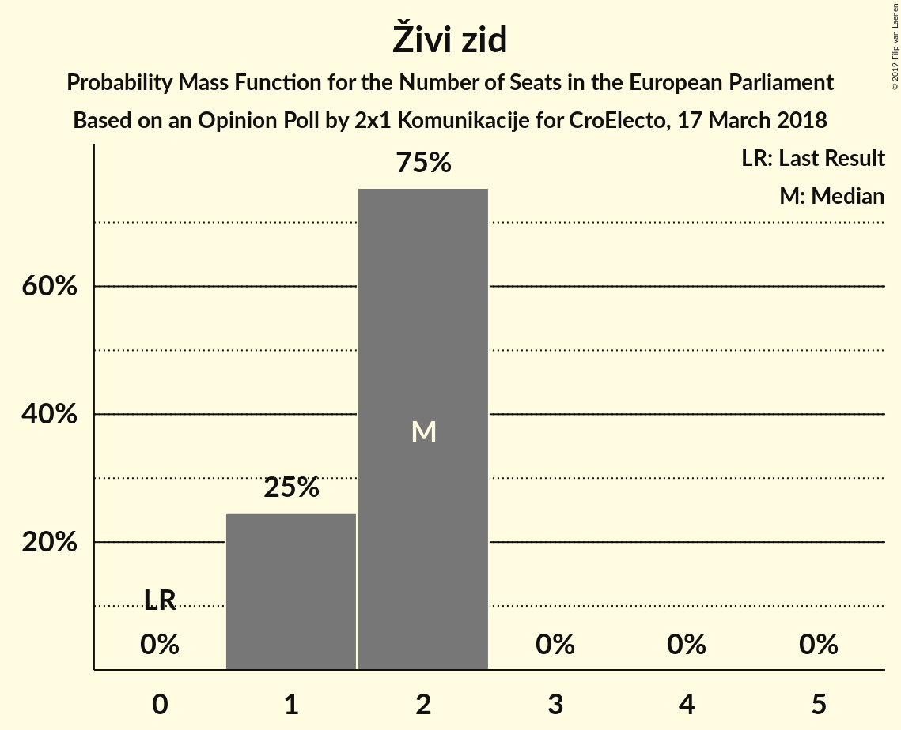

| Number of Seats | Probability | Accumulated | Special Marks |
|:---------------:|:-----------:|:-----------:|:-------------:|
| 0 | 0% | 100% | Last Result |
| 1 | 25% | 100% |  |
| 2 | 75% | 75% | Median |
| 3 | 0% | 0% |  |

## Technical Information

### Opinion Poll

+ **Polling firm:** 2x1 Komunikacije
+ **Commissioner(s):** CroElecto
+ **Fieldwork period:** 17 March 2018

### Calculations

+ **Sample size:** 902
+ **Simulations done:** 1,024
+ **Error estimate:** 2.99%

