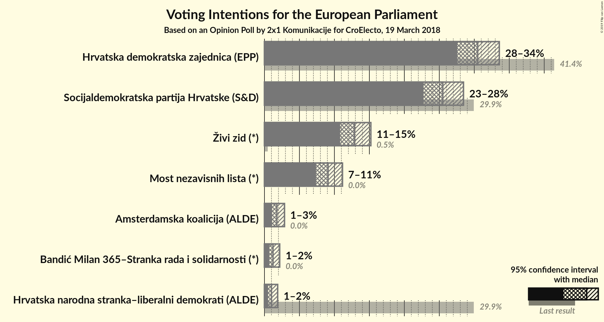
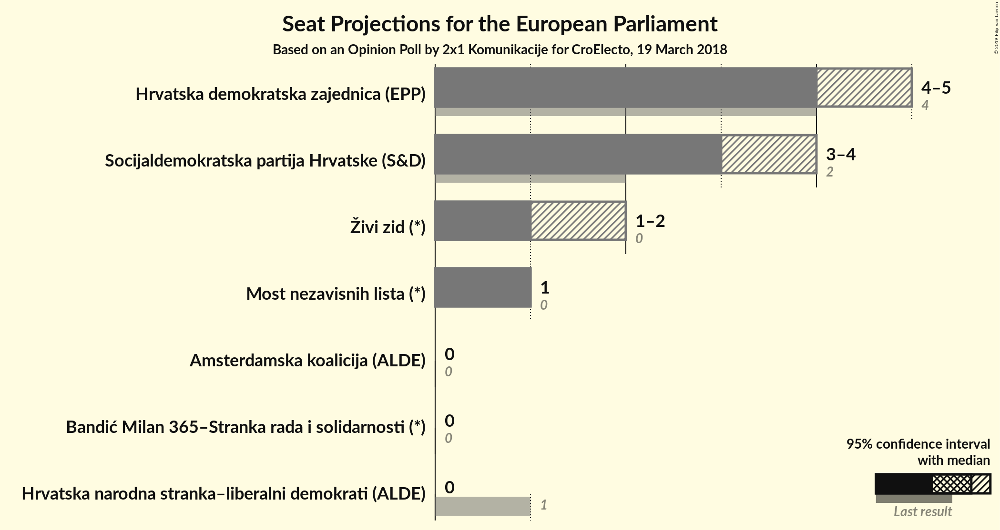

# Opinion Poll by 2x1 Komunikacije for CroElecto, 19 March 2018

<a href="#voting-intentions">Voting Intentions</a> | <a href="#seats">Seats</a> | <a href="#coalitions">Coalitions</a> | <a href="#technical-information">Technical Information</a>

## Voting Intentions

### Confidence Intervals

| Party | Last Result | Poll Result | 80% Confidence Interval | 90% Confidence Interval | 95% Confidence Interval | 99% Confidence Interval |
|:-----:|:-----------:|:-----------:|:-----------------------:|:-----------------------:|:-----------------------:|:-----------------------:|
| Hrvatska demokratska zajednica (EPP) | 41.4% | 30.5% | 28.6–32.5% |28.0–33.1% |27.6–33.6% |26.7–34.6% |
| Socijaldemokratska partija Hrvatske (S&D) | 29.9% | 25.5% | 23.7–27.4% |23.2–28.0% |22.8–28.5% |21.9–29.4% |
| Živi zid (*) | 0.5% | 12.9% | 11.5–14.4% |11.1–14.8% |10.8–15.2% |10.2–16.0% |
| Most nezavisnih lista (*) | 0.0% | 9.1% | 8.0–10.4% |7.7–10.8% |7.4–11.2% |6.9–11.8% |
| Amsterdamska koalicija (ALDE) | 0.0% | 1.8% | N/A |N/A |N/A |N/A |
| Bandić Milan 365–Stranka rada i solidarnosti (*) | 0.0% | 1.2% | 0.9–1.8% |0.8–2.0% |0.7–2.2% |0.5–2.5% |
| Hrvatska narodna stranka–liberalni demokrati (ALDE) | 29.9% | 1.0% | 0.7–1.6% |0.6–1.7% |0.5–1.9% |0.4–2.2% |

*Note:* The poll result column reflects the actual value used in the calculations. Published results may vary slightly, and in addition be rounded to fewer digits.

## Seats

### Confidence Intervals

| Party | Last Result | Median | 80% Confidence Interval | 90% Confidence Interval | 95% Confidence Interval | 99% Confidence Interval |
|:-----:|:-----------:|:------:|:-----------------------:|:-----------------------:|:-----------------------:|:-----------------------:|
| <a href="#hrvatska-demokratska-zajednica-(epp)">Hrvatska demokratska zajednica (EPP)</a> | 4 | 4 | 4–5 |4–5 |4–5 |3–5 |
| <a href="#socijaldemokratska-partija-hrvatske-(s&d)">Socijaldemokratska partija Hrvatske (S&D)</a> | 2 | 3 | 3–4 |3–4 |3–4 |3–4 |
| <a href="#živi-zid-(*)">Živi zid (*)</a> | 0 | 1 | 1–2 |1–2 |1–2 |1–2 |
| <a href="#most-nezavisnih-lista-(*)">Most nezavisnih lista (*)</a> | 0 | 1 | 1 |1 |1 |1 |
| <a href="#amsterdamska-koalicija-(alde)">Amsterdamska koalicija (ALDE)</a> | 0 | N/A | N/A |N/A |N/A |N/A |
| <a href="#bandić-milan-365–stranka-rada-i-solidarnosti-(*)">Bandić Milan 365–Stranka rada i solidarnosti (*)</a> | 0 | 0 | 0 |0 |0 |0 |
| <a href="#hrvatska-narodna-stranka–liberalni-demokrati-(alde)">Hrvatska narodna stranka–liberalni demokrati (ALDE)</a> | 1 | 0 | 0 |0 |0 |0 |

