# Opinion Poll by IPSOS PULS for Nova TV, 1–20 March 2018

<a href="#voting-intentions">Voting Intentions</a> | <a href="#seats">Seats</a> | <a href="#coalitions">Coalitions</a> | <a href="#technical-information">Technical Information</a>

## Voting Intentions

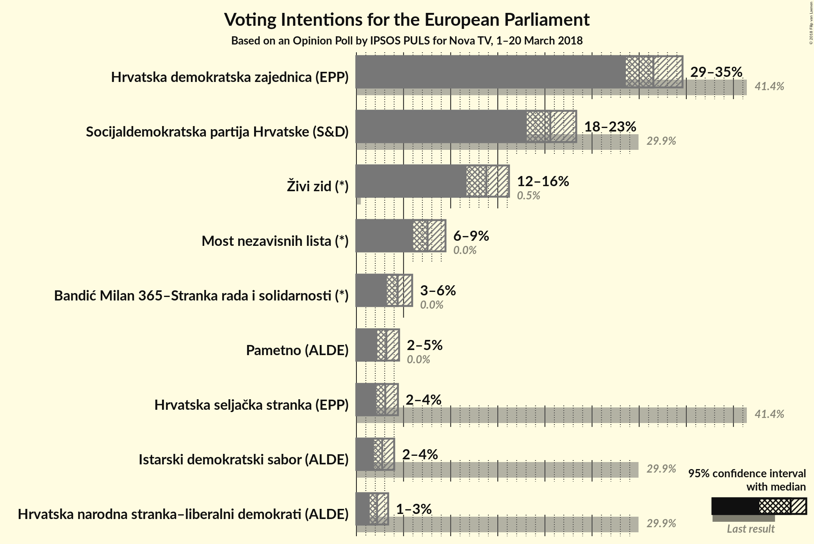

### Confidence Intervals

| Party | Last Result | Poll Result | 80% Confidence Interval | 90% Confidence Interval | 95% Confidence Interval | 99% Confidence Interval |
|:-----:|:-----------:|:-----------:|:-----------------------:|:-----------------------:|:-----------------------:|:-----------------------:|
| Hrvatska demokratska zajednica (EPP) | 41.4% | 31.5% | 29.6–33.5% |29.0–34.1% |28.6–34.6% |27.7–35.6% |
| Socijaldemokratska partija Hrvatske (S&D) | 29.9% | 20.6% | 18.9–22.4% |18.5–22.9% |18.1–23.3% |17.3–24.2% |
| Živi zid (*) | 0.5% | 13.8% | 12.4–15.3% |12.0–15.8% |11.7–16.2% |11.1–16.9% |
| Most nezavisnih lista (*) | 0.0% | 7.5% | 6.5–8.8% |6.2–9.1% |6.0–9.4% |5.5–10.1% |
| Amsterdamska koalicija (ALDE) | 0.0% | 5.8% | 4.9–6.9% |4.7–7.2% |4.5–7.5% |4.1–8.1% |
| Bandić Milan 365–Stranka rada i solidarnosti (*) | 0.0% | 4.4% | 3.6–5.4% |3.4–5.7% |3.2–5.9% |2.9–6.4% |
| Pametno (ALDE) | 0.0% | 3.2% | 2.5–4.1% |2.4–4.3% |2.2–4.5% |2.0–5.0% |
| Hrvatska narodna stranka–liberalni demokrati (ALDE) | 29.9% | 2.2% | 1.7–3.0% |1.5–3.2% |1.4–3.4% |1.2–3.8% |

*Note:* The poll result column reflects the actual value used in the calculations. Published results may vary slightly, and in addition be rounded to fewer digits.

## Seats

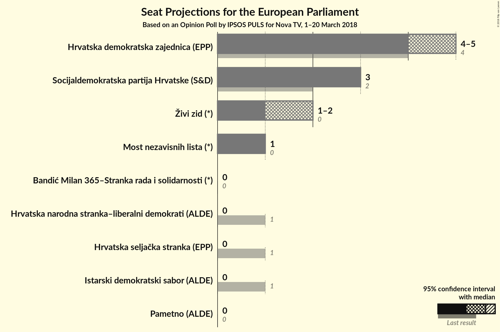

### Confidence Intervals

| Party | Last Result | Median | 80% Confidence Interval | 90% Confidence Interval | 95% Confidence Interval | 99% Confidence Interval |
|:-----:|:-----------:|:------:|:-----------------------:|:-----------------------:|:-----------------------:|:-----------------------:|
| <a href="#hrvatska-demokratska-zajednica-(epp)">Hrvatska demokratska zajednica (EPP)</a> | 4 | 5 | 4–5 |4–5 |4–5 |4–5 |
| <a href="#socijaldemokratska-partija-hrvatske-(s&d)">Socijaldemokratska partija Hrvatske (S&D)</a> | 2 | 3 | 3 |2–3 |2–3 |2–4 |
| <a href="#živi-zid-(*)">Živi zid (*)</a> | 0 | 2 | 2 |1–2 |1–2 |1–2 |
| <a href="#most-nezavisnih-lista-(*)">Most nezavisnih lista (*)</a> | 0 | 1 | 1 |1 |0–1 |0–1 |
| <a href="#amsterdamska-koalicija-(alde)">Amsterdamska koalicija (ALDE)</a> | 0 | 0 | 0–1 |0–1 |0–1 |0–1 |
| <a href="#bandić-milan-365–stranka-rada-i-solidarnosti-(*)">Bandić Milan 365–Stranka rada i solidarnosti (*)</a> | 0 | 0 | 0 |0 |0 |0–1 |
| <a href="#pametno-(alde)">Pametno (ALDE)</a> | 0 | 0 | 0 |0 |0 |0 |
| <a href="#hrvatska-narodna-stranka–liberalni-demokrati-(alde)">Hrvatska narodna stranka–liberalni demokrati (ALDE)</a> | 1 | 0 | 0 |0 |0 |0 |

### Hrvatska demokratska zajednica (EPP)

*For a full overview of the results for this party, see the [Hrvatska demokratska zajednica (EPP)](party-hrvatskademokratskazajednicaepp.html) page.*

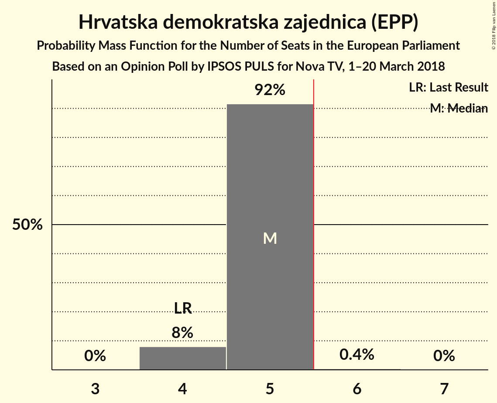

| Number of Seats | Probability | Accumulated | Special Marks |
|:---------------:|:-----------:|:-----------:|:-------------:|
| 4 | 32% | 100% | Last Result |
| 5 | 68% | 68% | Median |
| 6 | 0.3% | 0.3% | Majority |
| 7 | 0% | 0% |  |

### Socijaldemokratska partija Hrvatske (S&D)

*For a full overview of the results for this party, see the [Socijaldemokratska partija Hrvatske (S&D)](party-socijaldemokratskapartijahrvatskesd.html) page.*

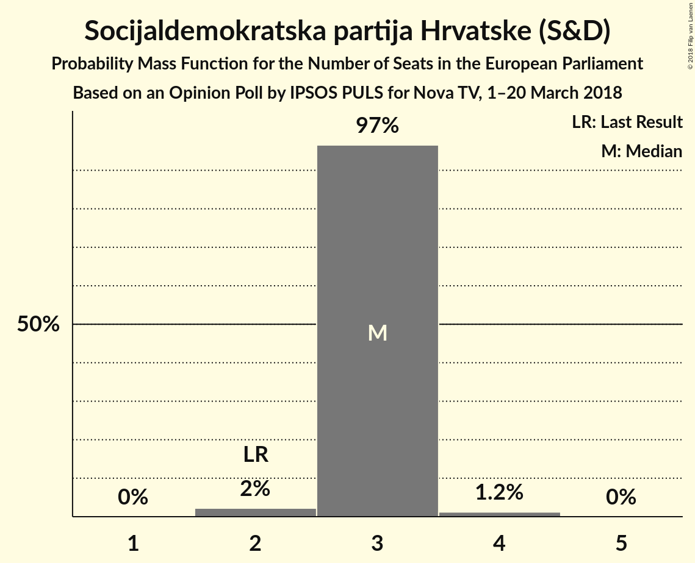

| Number of Seats | Probability | Accumulated | Special Marks |
|:---------------:|:-----------:|:-----------:|:-------------:|
| 2 | 6% | 100% | Last Result |
| 3 | 93% | 94% | Median |
| 4 | 0.8% | 0.8% |  |
| 5 | 0% | 0% |  |

### Živi zid (*)

*For a full overview of the results for this party, see the [Živi zid (*)](party-živizid.html) page.*

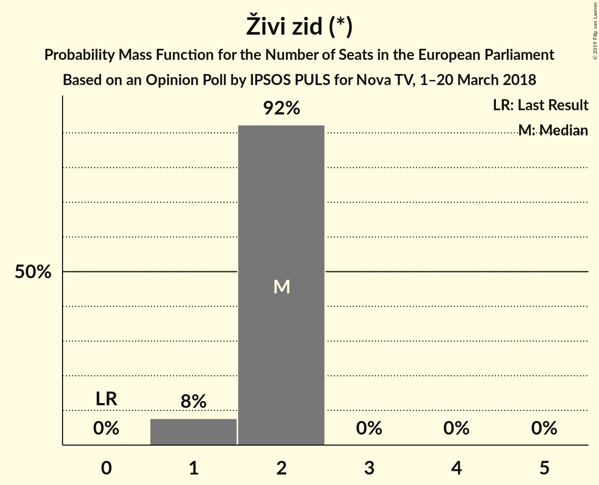

| Number of Seats | Probability | Accumulated | Special Marks |
|:---------------:|:-----------:|:-----------:|:-------------:|
| 0 | 0% | 100% | Last Result |
| 1 | 8% | 100% |  |
| 2 | 92% | 92% | Median |
| 3 | 0% | 0% |  |

### Most nezavisnih lista (*)

*For a full overview of the results for this party, see the [Most nezavisnih lista (*)](party-mostnezavisnihlista.html) page.*

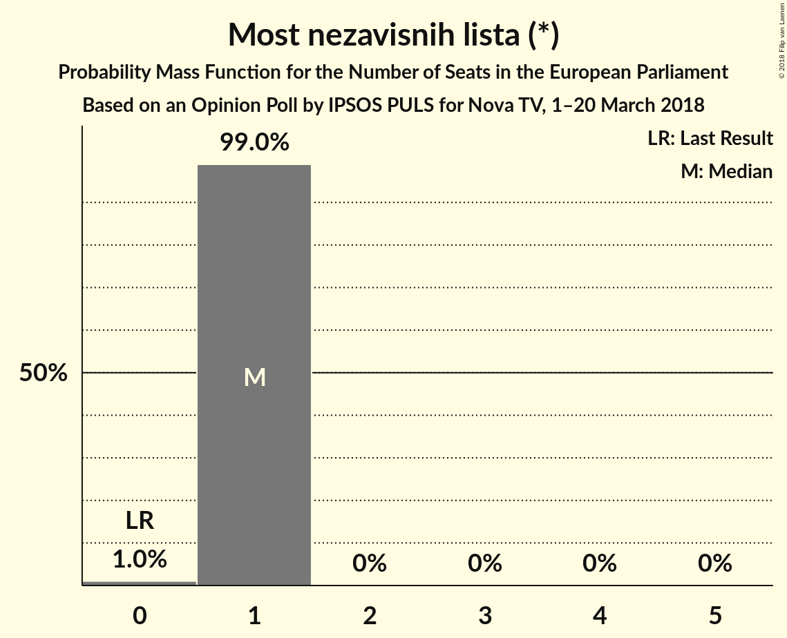

| Number of Seats | Probability | Accumulated | Special Marks |
|:---------------:|:-----------:|:-----------:|:-------------:|
| 0 | 3% | 100% | Last Result |
| 1 | 97% | 97% | Median |
| 2 | 0% | 0% |  |

### Amsterdamska koalicija (ALDE)

*For a full overview of the results for this party, see the [Amsterdamska koalicija (ALDE)](party-amsterdamskakoalicijaalde.html) page.*

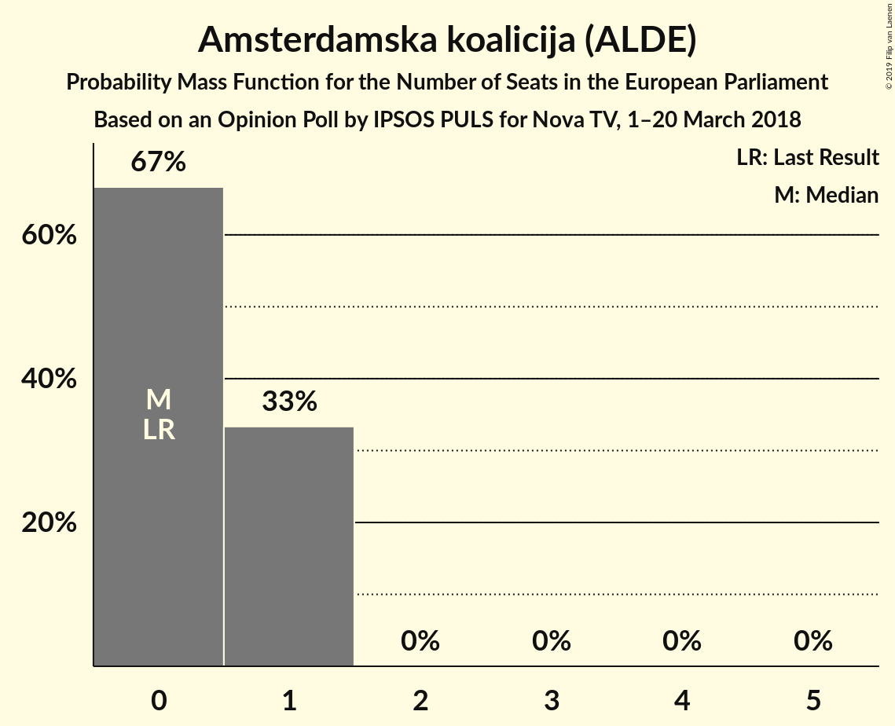

| Number of Seats | Probability | Accumulated | Special Marks |
|:---------------:|:-----------:|:-----------:|:-------------:|
| 0 | 67% | 100% | Last Result, Median |
| 1 | 33% | 33% |  |
| 2 | 0% | 0% |  |

### Bandić Milan 365–Stranka rada i solidarnosti (*)

*For a full overview of the results for this party, see the [Bandić Milan 365–Stranka rada i solidarnosti (*)](party-bandićmilan365–strankaradaisolidarnosti.html) page.*

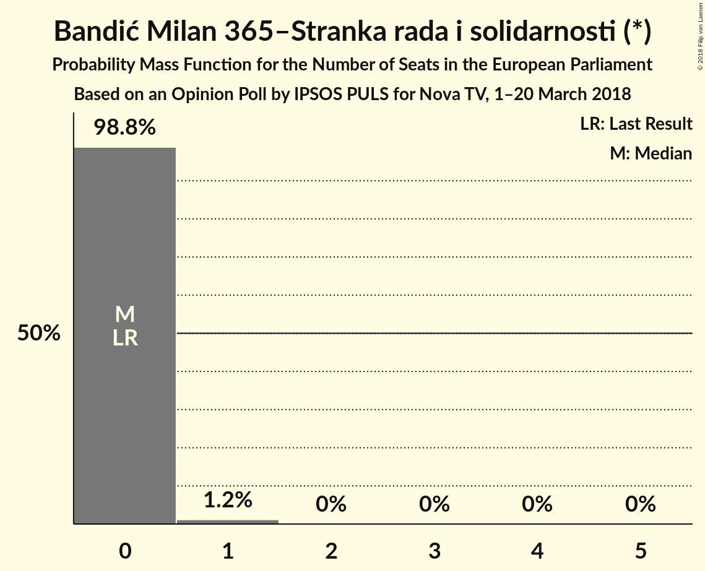

| Number of Seats | Probability | Accumulated | Special Marks |
|:---------------:|:-----------:|:-----------:|:-------------:|
| 0 | 98.7% | 100% | Last Result, Median |
| 1 | 1.3% | 1.3% |  |
| 2 | 0% | 0% |  |

### Pametno (ALDE)

*For a full overview of the results for this party, see the [Pametno (ALDE)](party-pametnoalde.html) page.*

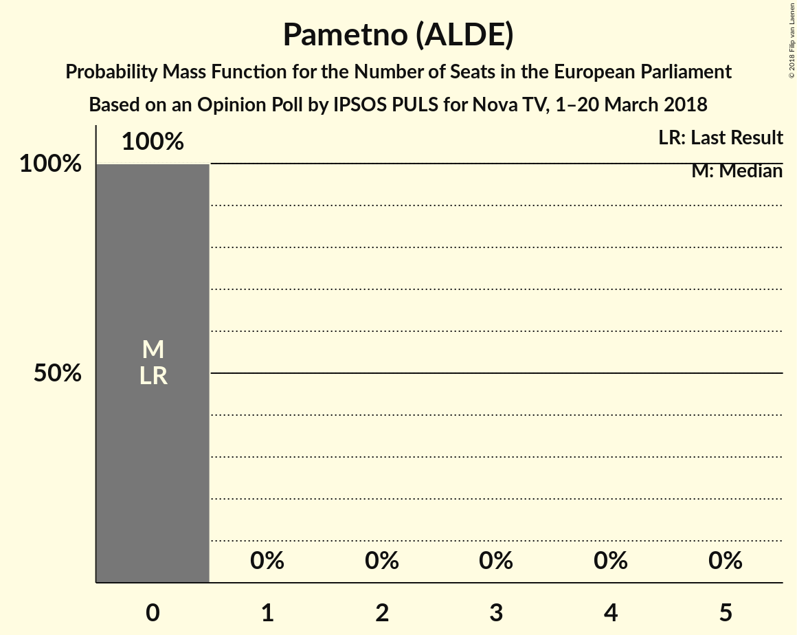

| Number of Seats | Probability | Accumulated | Special Marks |
|:---------------:|:-----------:|:-----------:|:-------------:|
| 0 | 100% | 100% | Last Result, Median |

### Hrvatska narodna stranka–liberalni demokrati (ALDE)

*For a full overview of the results for this party, see the [Hrvatska narodna stranka–liberalni demokrati (ALDE)](party-hrvatskanarodnastranka–liberalnidemokratialde.html) page.*

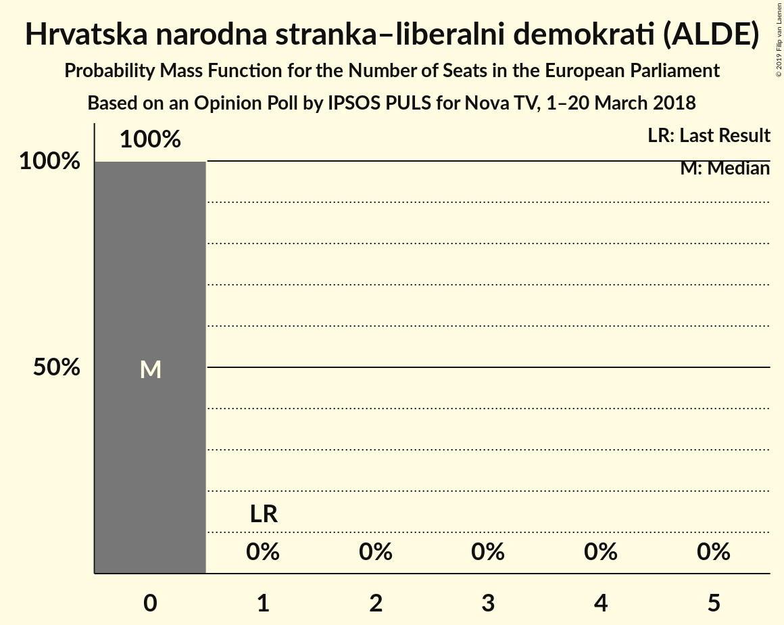

| Number of Seats | Probability | Accumulated | Special Marks |
|:---------------:|:-----------:|:-----------:|:-------------:|
| 0 | 100% | 100% | Median |
| 1 | 0% | 0% | Last Result |

## Coalitions

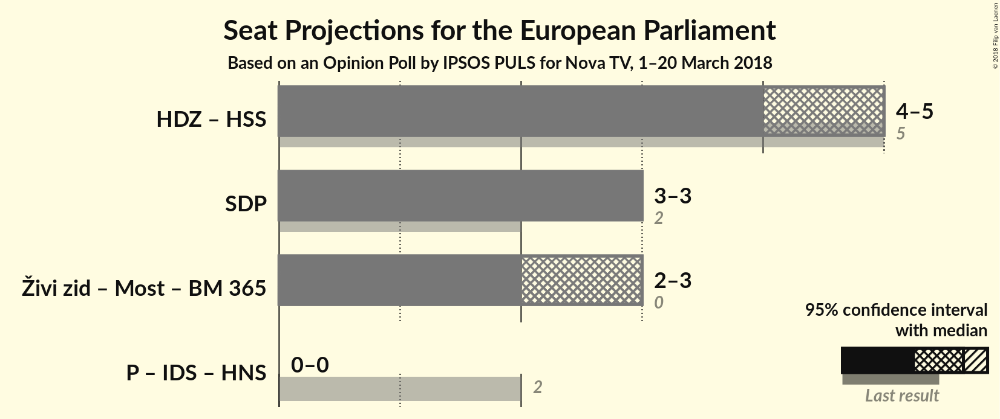

### Confidence Intervals

| Coalition | Last Result | Median | Majority? | 80% Confidence Interval | 90% Confidence Interval | 95% Confidence Interval | 99% Confidence Interval |
|:---------:|:-----------:|:------:|:---------:|:-----------------------:|:-----------------------:|:-----------------------:|:-----------------------:|
| Hrvatska demokratska zajednica (EPP) | 4 | 5 | 0.3% | 4–5 | 4–5 | 4–5 | 4–5 |
| Živi zid (*) – Most nezavisnih lista (*) – Bandić Milan 365–Stranka rada i solidarnosti (*) | 0 | 3 | 0% | 2–3 | 2–3 | 2–3 | 2–4 |
| Socijaldemokratska partija Hrvatske (S&D) | 2 | 3 | 0% | 3 | 2–3 | 2–3 | 2–4 |
| Amsterdamska koalicija (ALDE) – Pametno (ALDE) – Hrvatska narodna stranka–liberalni demokrati (ALDE) | 1 | 0 | 0% | 0–1 | 0–1 | 0–1 | 0–1 |

### Hrvatska demokratska zajednica (EPP)

| Number of Seats | Probability | Accumulated | Special Marks |
|:---------------:|:-----------:|:-----------:|:-------------:|
| 4 | 32% | 100% | Last Result |
| 5 | 68% | 68% | Median |
| 6 | 0.3% | 0.3% | Majority |
| 7 | 0% | 0% |  |

### Živi zid (*) – Most nezavisnih lista (*) – Bandić Milan 365–Stranka rada i solidarnosti (*)

| Number of Seats | Probability | Accumulated | Special Marks |
|:---------------:|:-----------:|:-----------:|:-------------:|
| 0 | 0% | 100% | Last Result |
| 1 | 0.1% | 100% |  |
| 2 | 10% | 99.9% |  |
| 3 | 89% | 90% | Median |
| 4 | 1.0% | 1.0% |  |
| 5 | 0% | 0% |  |

### Socijaldemokratska partija Hrvatske (S&D)

| Number of Seats | Probability | Accumulated | Special Marks |
|:---------------:|:-----------:|:-----------:|:-------------:|
| 2 | 6% | 100% | Last Result |
| 3 | 93% | 94% | Median |
| 4 | 0.8% | 0.8% |  |
| 5 | 0% | 0% |  |

### Amsterdamska koalicija (ALDE) – Pametno (ALDE) – Hrvatska narodna stranka–liberalni demokrati (ALDE)

| Number of Seats | Probability | Accumulated | Special Marks |
|:---------------:|:-----------:|:-----------:|:-------------:|
| 0 | 67% | 100% | Median |
| 1 | 33% | 33% | Last Result |
| 2 | 0% | 0% |  |

## Technical Information

### Opinion Poll

+ **Polling firm:** IPSOS PULS
+ **Commissioner(s):** Nova TV
+ **Fieldwork period:** 1–20 March 2018

### Calculations

+ **Sample size:** 914
+ **Simulations done:** 1,048,576
+ **Error estimate:** 0.79%

