# Opinion Poll by Promocija plus for HRT, 8 April 2018

<a href="#voting-intentions">Voting Intentions</a> | <a href="#seats">Seats</a> | <a href="#coalitions">Coalitions</a> | <a href="#technical-information">Technical Information</a>

## Voting Intentions

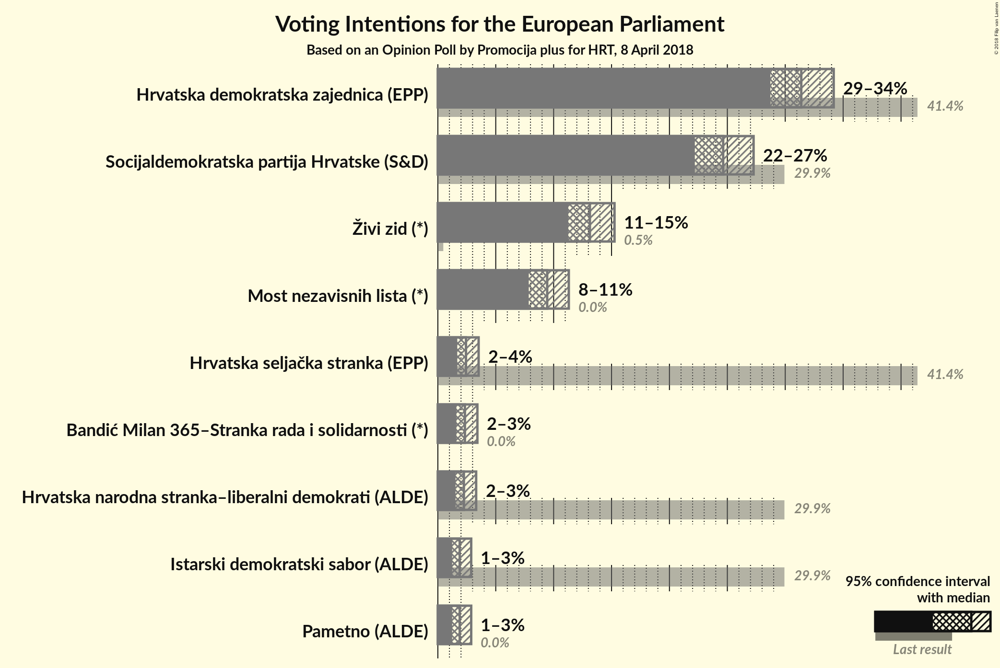

### Confidence Intervals

| Party | Last Result | Poll Result | 80% Confidence Interval | 90% Confidence Interval | 95% Confidence Interval | 99% Confidence Interval |
|:-----:|:-----------:|:-----------:|:-----------------------:|:-----------------------:|:-----------------------:|:-----------------------:|
| Hrvatska demokratska zajednica (EPP) | 41.4% | 31.4% | 29.6–33.2% |29.1–33.7% |28.7–34.2% |27.9–35.1% |
| Socijaldemokratska partija Hrvatske (S&D) | 29.9% | 24.6% | 23.0–26.4% |22.6–26.8% |22.2–27.3% |21.4–28.1% |
| Živi zid (*) | 0.5% | 13.1% | 11.9–14.5% |11.6–14.9% |11.3–15.3% |10.7–15.9% |
| Most nezavisnih lista (*) | 0.0% | 9.4% | 8.4–10.7% |8.1–11.0% |7.8–11.3% |7.4–11.9% |
| Hrvatska seljačka stranka (EPP) | 41.4% | 2.4% | 1.9–3.1% |1.8–3.3% |1.7–3.5% |1.5–3.9% |
| Bandić Milan 365–Stranka rada i solidarnosti (*) | 0.0% | 2.3% | 1.8–3.0% |1.7–3.2% |1.6–3.4% |1.4–3.8% |
| Hrvatska narodna stranka–liberalni demokrati (ALDE) | 29.9% | 2.2% | 1.8–2.9% |1.6–3.1% |1.5–3.3% |1.3–3.7% |
| Istarski demokratski sabor (ALDE) | 29.9% | 1.9% | 1.4–2.5% |1.3–2.7% |1.2–2.9% |1.1–3.2% |
| Pametno (ALDE) | 0.0% | 1.9% | 1.4–2.5% |1.3–2.7% |1.2–2.9% |1.1–3.2% |

*Note:* The poll result column reflects the actual value used in the calculations. Published results may vary slightly, and in addition be rounded to fewer digits.

## Seats

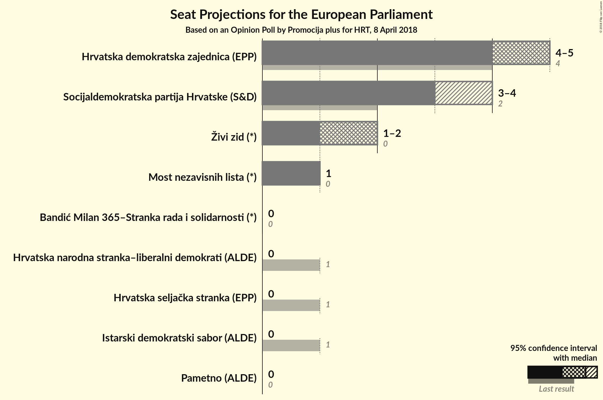

### Confidence Intervals

| Party | Last Result | Median | 80% Confidence Interval | 90% Confidence Interval | 95% Confidence Interval | 99% Confidence Interval |
|:-----:|:-----------:|:------:|:-----------------------:|:-----------------------:|:-----------------------:|:-----------------------:|
| <a href="#hrvatska-demokratska-zajednica-(epp)">Hrvatska demokratska zajednica (EPP)</a> | 4 | 4 | 4–5 |4–5 |4–5 |4–5 |
| <a href="#socijaldemokratska-partija-hrvatske-(s&d)">Socijaldemokratska partija Hrvatske (S&D)</a> | 2 | 4 | 3–4 |3–4 |3–4 |3–4 |
| <a href="#Živi-zid-(*)">Živi zid (*)</a> | 0 | 2 | 1–2 |1–2 |1–2 |1–2 |
| <a href="#most-nezavisnih-lista-(*)">Most nezavisnih lista (*)</a> | 0 | 1 | 1 |1 |1 |1 |
| <a href="#hrvatska-seljačka-stranka-(epp)">Hrvatska seljačka stranka (EPP)</a> | 1 | 0 | 0 |0 |0 |0 |
| <a href="#bandić-milan-365–stranka-rada-i-solidarnosti-(*)">Bandić Milan 365–Stranka rada i solidarnosti (*)</a> | 0 | 0 | 0 |0 |0 |0 |
| <a href="#hrvatska-narodna-stranka–liberalni-demokrati-(alde)">Hrvatska narodna stranka–liberalni demokrati (ALDE)</a> | 1 | 0 | 0 |0 |0 |0 |
| <a href="#istarski-demokratski-sabor-(alde)">Istarski demokratski sabor (ALDE)</a> | 1 | 0 | 0 |0 |0 |0 |
| <a href="#pametno-(alde)">Pametno (ALDE)</a> | 0 | 0 | 0 |0 |0 |0 |

### Hrvatska demokratska zajednica (EPP)

*For a full overview of the results for this party, see the [Hrvatska demokratska zajednica (EPP)](party-hrvatskademokratskazajednicaepp.html) page.*

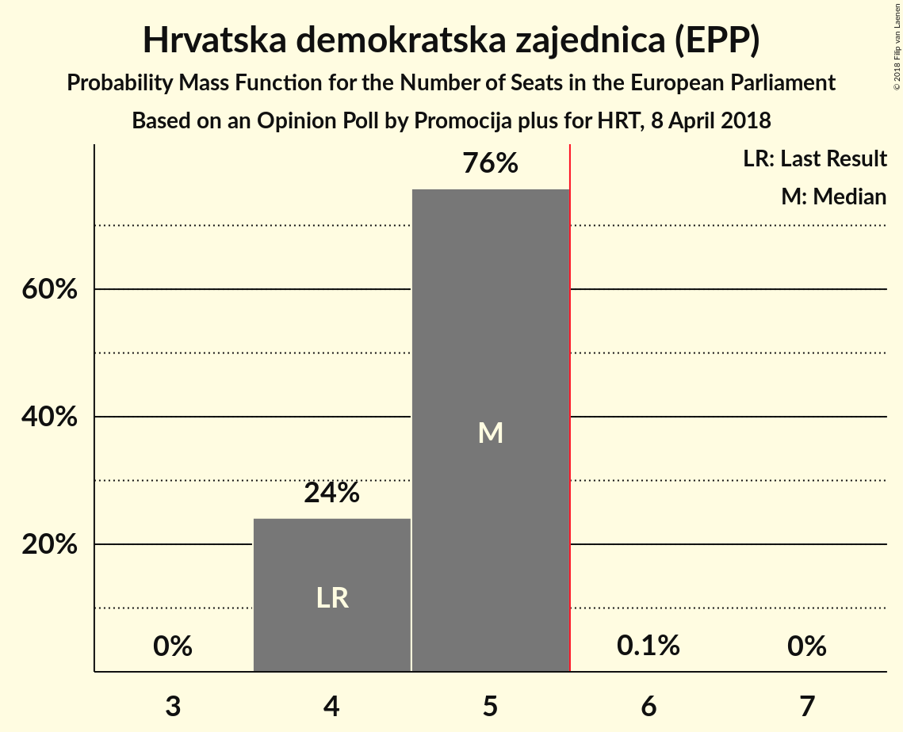

| Number of Seats | Probability | Accumulated | Special Marks |
|:---------------:|:-----------:|:-----------:|:-------------:|
| 4 | 51% | 100% | Last Result, Median |
| 5 | 49% | 49% |  |
| 6 | 0.1% | 0.1% | Majority |
| 7 | 0% | 0% |  |

### Socijaldemokratska partija Hrvatske (S&D)

*For a full overview of the results for this party, see the [Socijaldemokratska partija Hrvatske (S&D)](party-socijaldemokratskapartijahrvatskesd.html) page.*

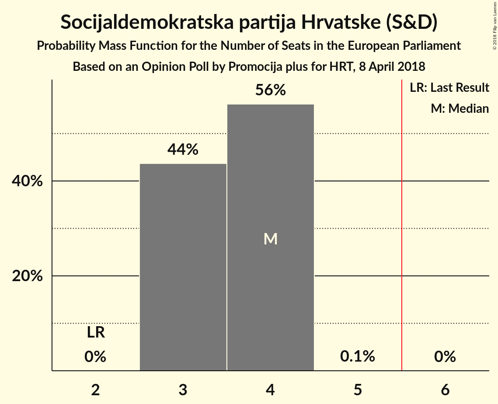

| Number of Seats | Probability | Accumulated | Special Marks |
|:---------------:|:-----------:|:-----------:|:-------------:|
| 2 | 0% | 100% | Last Result |
| 3 | 44% | 100% |  |
| 4 | 56% | 56% | Median |
| 5 | 0.1% | 0.1% |  |
| 6 | 0% | 0% | Majority |

### Živi zid (*)

*For a full overview of the results for this party, see the [Živi zid (*)](party-Živizid.html) page.*

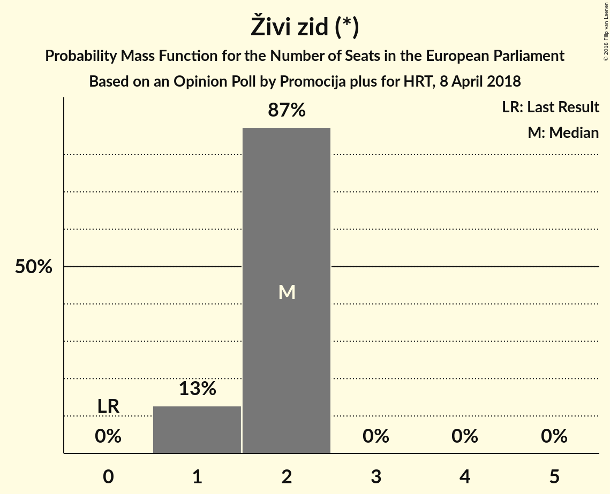

| Number of Seats | Probability | Accumulated | Special Marks |
|:---------------:|:-----------:|:-----------:|:-------------:|
| 0 | 0% | 100% | Last Result |
| 1 | 13% | 100% |  |
| 2 | 87% | 87% | Median |
| 3 | 0% | 0% |  |

### Most nezavisnih lista (*)

*For a full overview of the results for this party, see the [Most nezavisnih lista (*)](party-mostnezavisnihlista.html) page.*

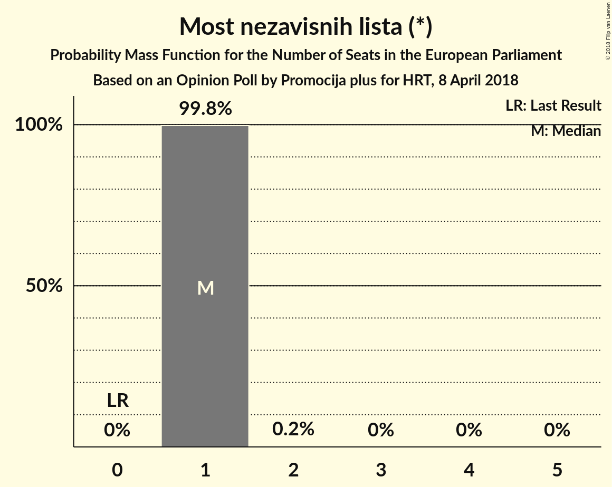

| Number of Seats | Probability | Accumulated | Special Marks |
|:---------------:|:-----------:|:-----------:|:-------------:|
| 0 | 0% | 100% | Last Result |
| 1 | 99.7% | 100% | Median |
| 2 | 0.3% | 0.3% |  |
| 3 | 0% | 0% |  |

### Hrvatska seljačka stranka (EPP)

*For a full overview of the results for this party, see the [Hrvatska seljačka stranka (EPP)](party-hrvatskaseljačkastrankaepp.html) page.*

| Number of Seats | Probability | Accumulated | Special Marks |
|:---------------:|:-----------:|:-----------:|:-------------:|
| 0 | 100% | 100% | Median |
| 1 | 0% | 0% | Last Result |

### Bandić Milan 365–Stranka rada i solidarnosti (*)

*For a full overview of the results for this party, see the [Bandić Milan 365–Stranka rada i solidarnosti (*)](party-bandićmilan365–strankaradaisolidarnosti.html) page.*

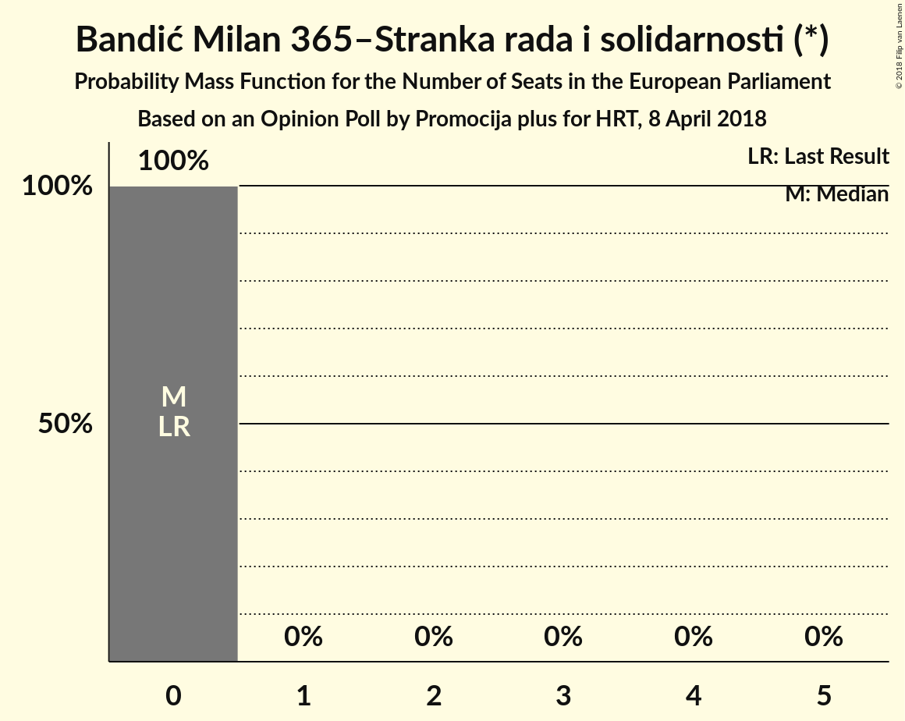

| Number of Seats | Probability | Accumulated | Special Marks |
|:---------------:|:-----------:|:-----------:|:-------------:|
| 0 | 100% | 100% | Last Result, Median |

### Hrvatska narodna stranka–liberalni demokrati (ALDE)

*For a full overview of the results for this party, see the [Hrvatska narodna stranka–liberalni demokrati (ALDE)](party-hrvatskanarodnastranka–liberalnidemokratialde.html) page.*

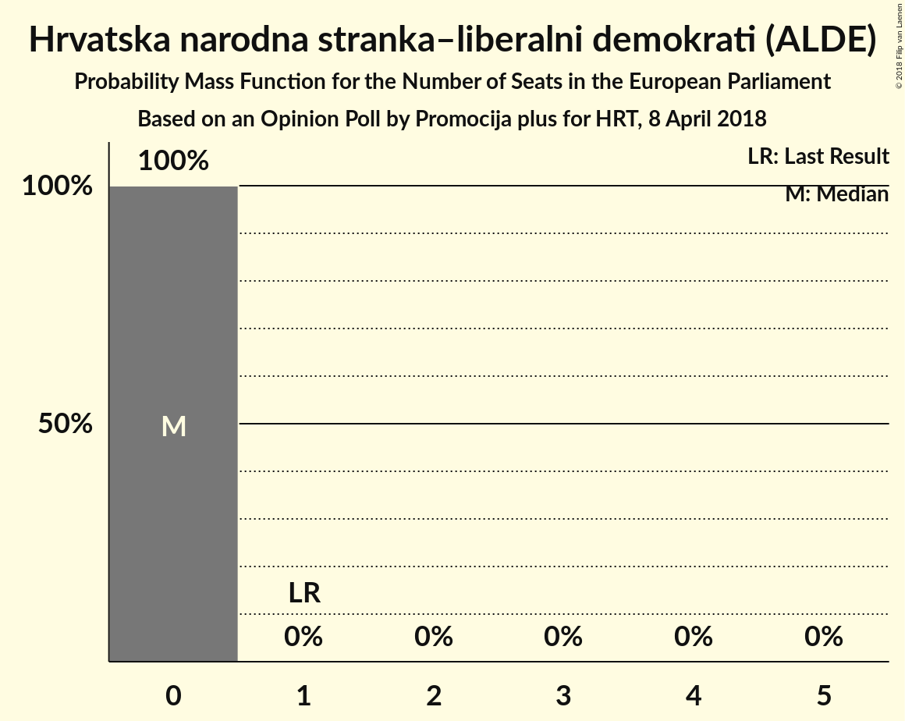

| Number of Seats | Probability | Accumulated | Special Marks |
|:---------------:|:-----------:|:-----------:|:-------------:|
| 0 | 100% | 100% | Median |
| 1 | 0% | 0% | Last Result |

### Istarski demokratski sabor (ALDE)

*For a full overview of the results for this party, see the [Istarski demokratski sabor (ALDE)](party-istarskidemokratskisaboralde.html) page.*

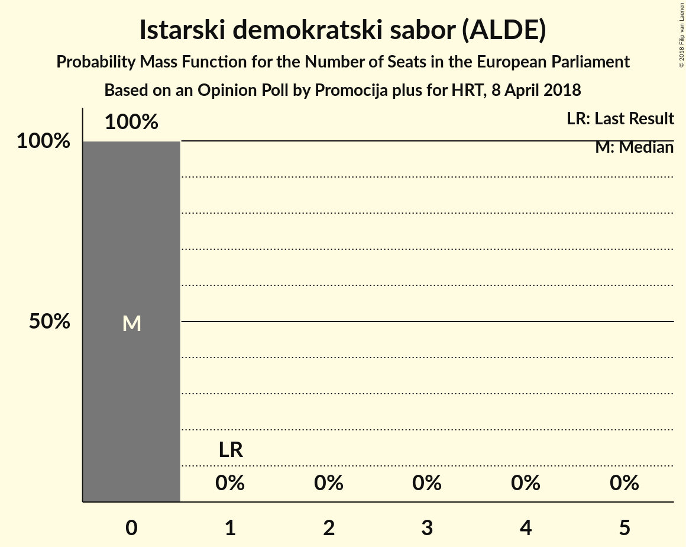

| Number of Seats | Probability | Accumulated | Special Marks |
|:---------------:|:-----------:|:-----------:|:-------------:|
| 0 | 100% | 100% | Median |
| 1 | 0% | 0% | Last Result |

### Pametno (ALDE)

*For a full overview of the results for this party, see the [Pametno (ALDE)](party-pametnoalde.html) page.*

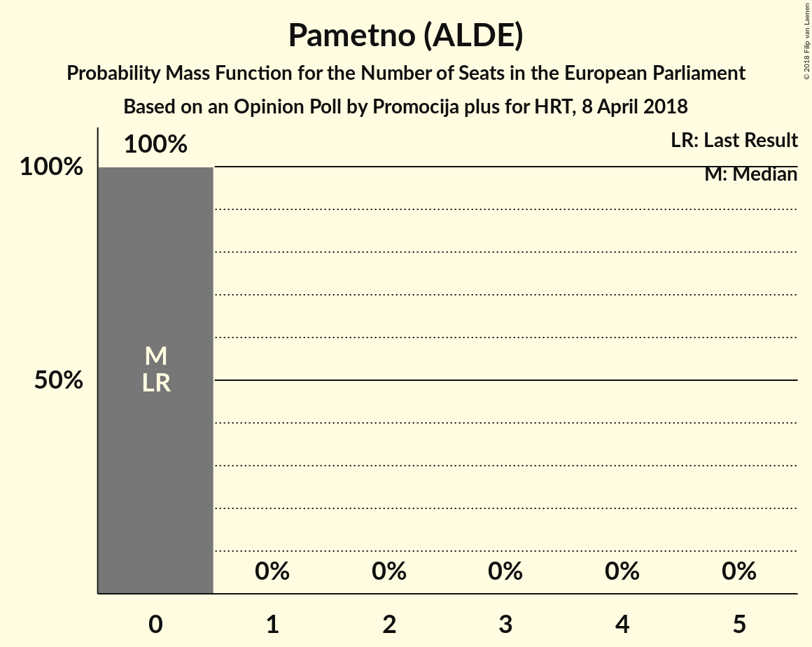

| Number of Seats | Probability | Accumulated | Special Marks |
|:---------------:|:-----------:|:-----------:|:-------------:|
| 0 | 100% | 100% | Last Result, Median |

## Coalitions

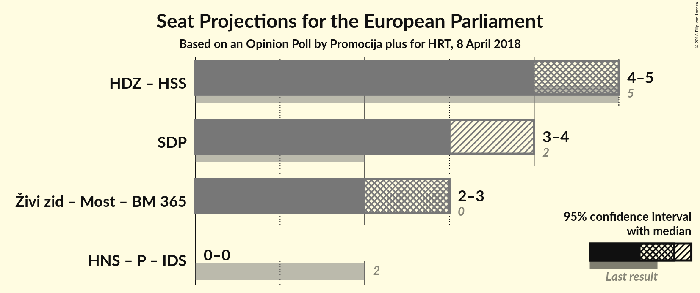

### Confidence Intervals

| Coalition | Last Result | Median | Majority? | 80% Confidence Interval | 90% Confidence Interval | 95% Confidence Interval | 99% Confidence Interval |
|:---------:|:-----------:|:------:|:---------:|:-----------------------:|:-----------------------:|:-----------------------:|:-----------------------:|
| Hrvatska demokratska zajednica (EPP) – Hrvatska seljačka stranka (EPP) | 5 | 4 | 0.1% | 4–5 | 4–5 | 4–5 | 4–5 |
| Socijaldemokratska partija Hrvatske (S&D) | 2 | 4 | 0% | 3–4 | 3–4 | 3–4 | 3–4 |
| Živi zid (*) – Most nezavisnih lista (*) – Bandić Milan 365–Stranka rada i solidarnosti (*) | 0 | 3 | 0% | 2–3 | 2–3 | 2–3 | 2–3 |
| Hrvatska narodna stranka–liberalni demokrati (ALDE) – Istarski demokratski sabor (ALDE) – Pametno (ALDE) | 2 | 0 | 0% | 0 | 0 | 0 | 0 |

### Hrvatska demokratska zajednica (EPP) – Hrvatska seljačka stranka (EPP)

| Number of Seats | Probability | Accumulated | Special Marks |
|:---------------:|:-----------:|:-----------:|:-------------:|
| 4 | 51% | 100% | Median |
| 5 | 49% | 49% | Last Result |
| 6 | 0.1% | 0.1% | Majority |
| 7 | 0% | 0% |  |

### Socijaldemokratska partija Hrvatske (S&D)

| Number of Seats | Probability | Accumulated | Special Marks |
|:---------------:|:-----------:|:-----------:|:-------------:|
| 2 | 0% | 100% | Last Result |
| 3 | 44% | 100% |  |
| 4 | 56% | 56% | Median |
| 5 | 0.1% | 0.1% |  |
| 6 | 0% | 0% | Majority |

### Živi zid (*) – Most nezavisnih lista (*) – Bandić Milan 365–Stranka rada i solidarnosti (*)

| Number of Seats | Probability | Accumulated | Special Marks |
|:---------------:|:-----------:|:-----------:|:-------------:|
| 0 | 0% | 100% | Last Result |
| 1 | 0% | 100% |  |
| 2 | 12% | 100% |  |
| 3 | 88% | 88% | Median |
| 4 | 0% | 0% |  |

### Hrvatska narodna stranka–liberalni demokrati (ALDE) – Istarski demokratski sabor (ALDE) – Pametno (ALDE)

| Number of Seats | Probability | Accumulated | Special Marks |
|:---------------:|:-----------:|:-----------:|:-------------:|
| 0 | 100% | 100% | Median |
| 1 | 0% | 0% |  |
| 2 | 0% | 0% | Last Result |

## Technical Information

### Opinion Poll

+ **Polling firm:** Promocija plus
+ **Commissioner(s):** HRT
+ **Fieldwork period:** 8 April 2018

### Calculations

+ **Sample size:** 1112
+ **Simulations done:** 131,072
+ **Error estimate:** 4.85%

