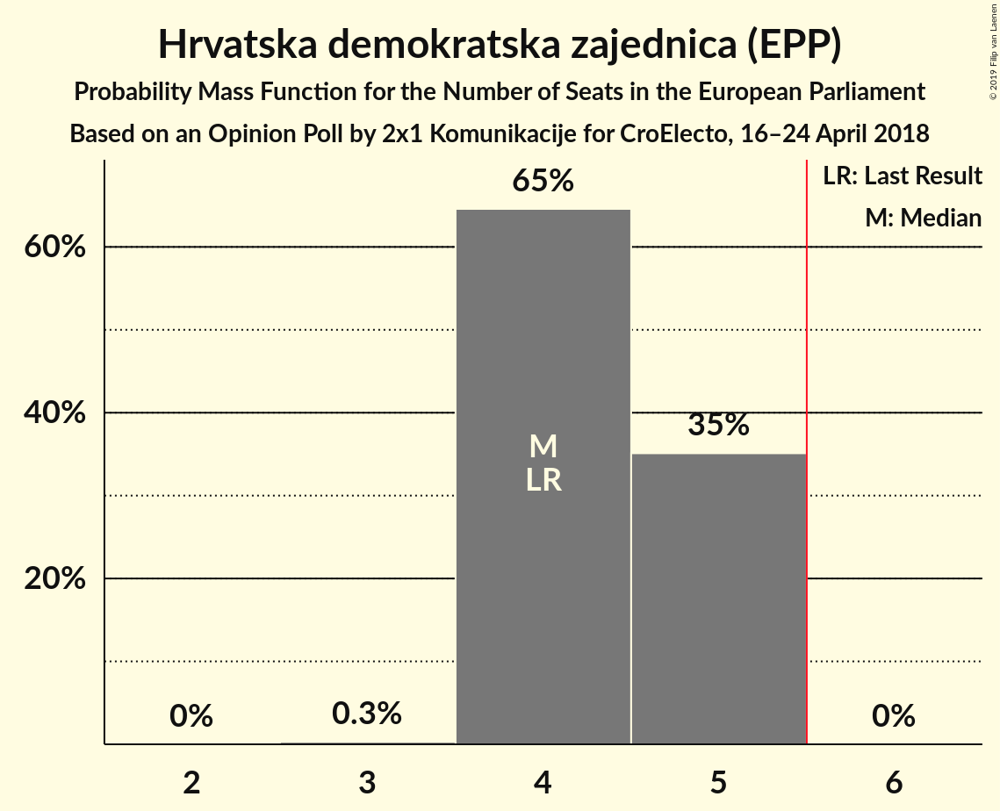
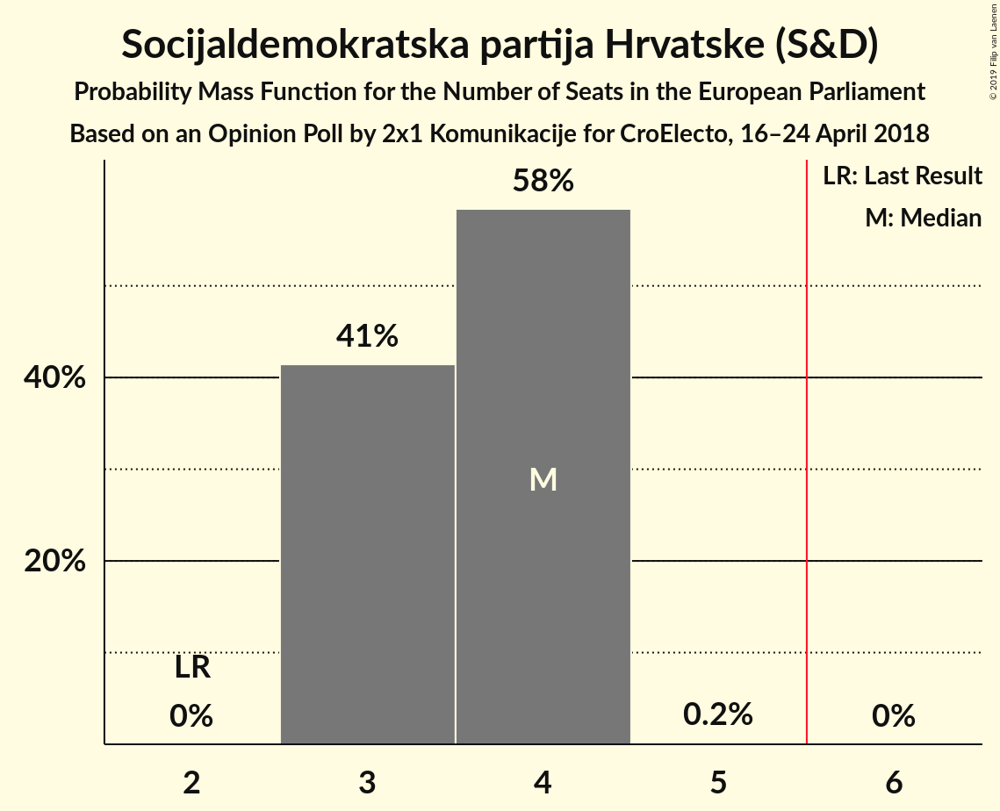
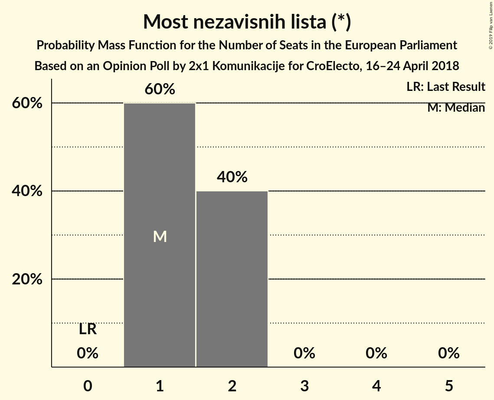
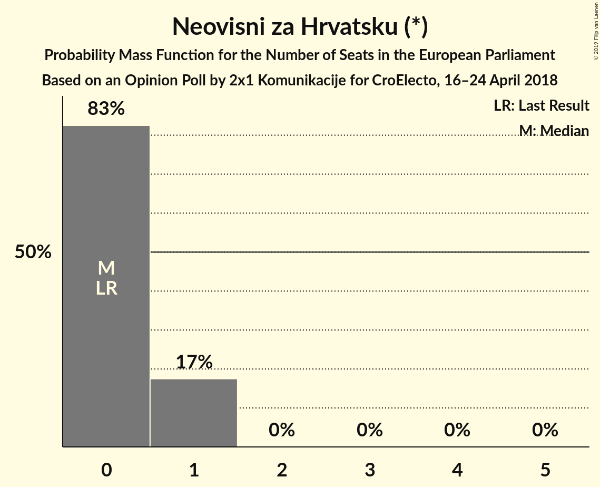
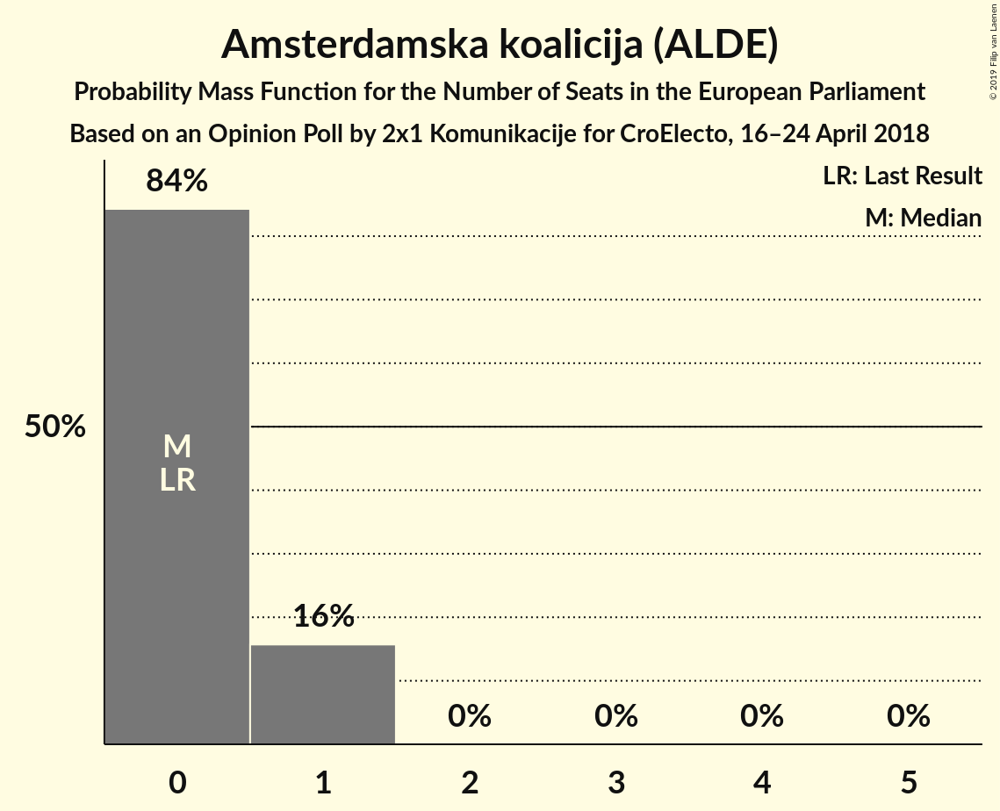
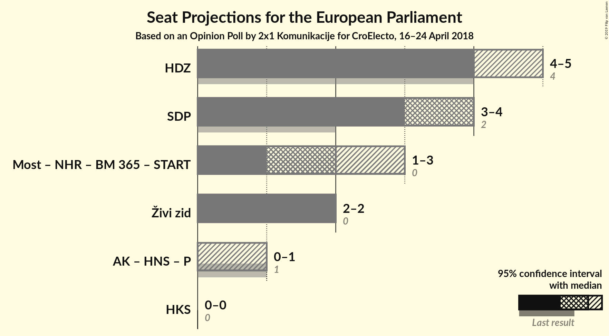
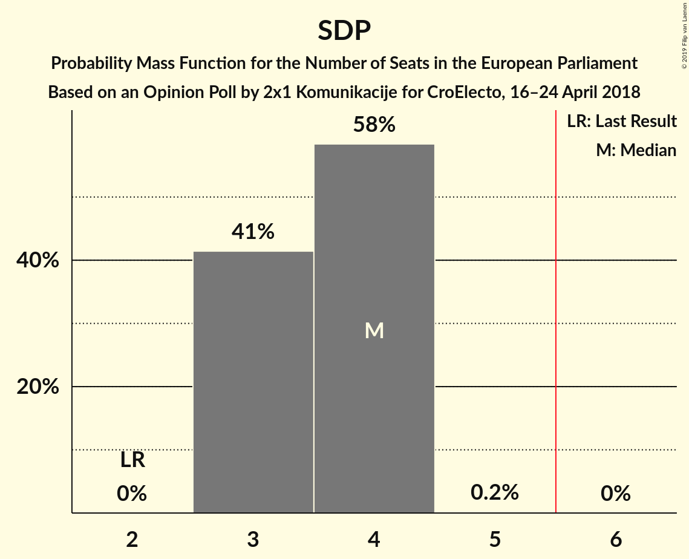
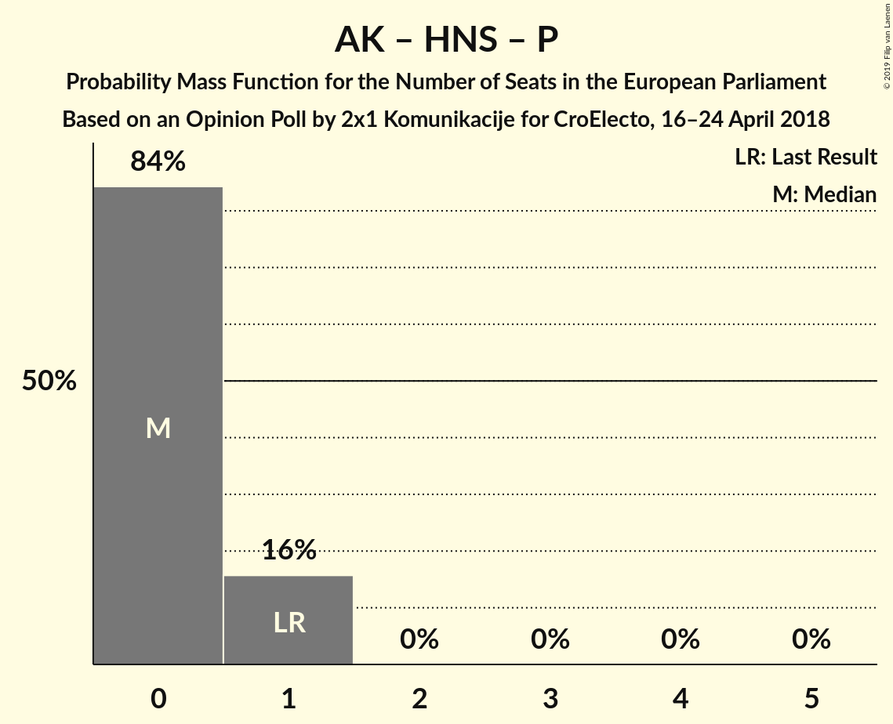

# Opinion Poll by 2x1 Komunikacije for CroElecto, 16–24 April 2018

<a href="#voting-intentions">Voting Intentions</a> | <a href="#seats">Seats</a> | <a href="#coalitions">Coalitions</a> | <a href="#technical-information">Technical Information</a>

## Voting Intentions

### Confidence Intervals

| Party | Last Result | Poll Result | 80% Confidence Interval | 90% Confidence Interval | 95% Confidence Interval | 99% Confidence Interval |
|:-----:|:-----------:|:-----------:|:-----------------------:|:-----------------------:|:-----------------------:|:-----------------------:|
| Hrvatska demokratska zajednica (EPP) | 41.4% | 29.5% | 27.6–31.6% |27.1–32.1% |26.6–32.6% |25.7–33.6% |
| Socijaldemokratska partija Hrvatske (S&D) | 29.9% | 25.0% | 23.2–26.9% |22.7–27.5% |22.3–28.0% |21.4–28.9% |
| Živi zid (EFDD) | 0.5% | 15.2% | 13.7–16.8% |13.3–17.3% |12.9–17.7% |12.3–18.5% |
| Most nezavisnih lista (*) | 0.0% | 11.7% | 10.4–13.2% |10.0–13.6% |9.7–13.9% |9.1–14.7% |
| Neovisni za Hrvatsku (*) | 0.0% | 5.4% | 4.6–6.5% |4.3–6.9% |4.1–7.1% |3.7–7.7% |
| Amsterdamska koalicija (ALDE) | 0.0% | 5.2% | 4.4–6.3% |4.1–6.6% |3.9–6.9% |3.6–7.4% |
| Hrvatska narodna stranka–liberalni demokrati (ALDE) | 29.9% | 1.2% | 0.9–1.9% |0.8–2.1% |0.7–2.2% |0.5–2.6% |
| Pametno (ALDE) | 0.0% | 1.1% | 0.8–1.7% |0.7–1.9% |0.6–2.1% |0.5–2.4% |

*Note:* The poll result column reflects the actual value used in the calculations. Published results may vary slightly, and in addition be rounded to fewer digits.

## Seats

### Confidence Intervals

| Party | Last Result | Median | 80% Confidence Interval | 90% Confidence Interval | 95% Confidence Interval | 99% Confidence Interval |
|:-----:|:-----------:|:------:|:-----------------------:|:-----------------------:|:-----------------------:|:-----------------------:|
| <a href="#hrvatska-demokratska-zajednica-(epp)">Hrvatska demokratska zajednica (EPP)</a> | 4 | 4 | 4–5 |4–5 |4–5 |4–5 |
| <a href="#socijaldemokratska-partija-hrvatske-(s&d)">Socijaldemokratska partija Hrvatske (S&D)</a> | 2 | 4 | 3–4 |3–4 |3–4 |3–4 |
| <a href="#živi-zid-(efdd)">Živi zid (EFDD)</a> | 0 | 2 | 1–2 |1–2 |1–2 |1–2 |
| <a href="#most-nezavisnih-lista-(*)">Most nezavisnih lista (*)</a> | 0 | 1 | 1 |1–2 |1–2 |1–2 |
| <a href="#neovisni-za-hrvatsku-(*)">Neovisni za Hrvatsku (*)</a> | 0 | 1 | 0–1 |0–1 |0–1 |0–1 |
| <a href="#amsterdamska-koalicija-(alde)">Amsterdamska koalicija (ALDE)</a> | 0 | 0 | 0 |0 |0 |0 |
| <a href="#hrvatska-narodna-stranka–liberalni-demokrati-(alde)">Hrvatska narodna stranka–liberalni demokrati (ALDE)</a> | 1 | 0 | 0 |0 |0 |0 |
| <a href="#pametno-(alde)">Pametno (ALDE)</a> | 0 | 0 | 0 |0 |0 |0 |

### Hrvatska demokratska zajednica (EPP)

*For a full overview of the results for this party, see the [Hrvatska demokratska zajednica (EPP)](party-hrvatskademokratskazajednicaepp.html) page.*

| Number of Seats | Probability | Accumulated | Special Marks |
|:---------------:|:-----------:|:-----------:|:-------------:|
| 3 | 0.1% | 100% |  |
| 4 | 87% | 99.9% | Last Result, Median |
| 5 | 13% | 13% |  |
| 6 | 0% | 0% | Majority |

### Socijaldemokratska partija Hrvatske (S&D)

*For a full overview of the results for this party, see the [Socijaldemokratska partija Hrvatske (S&D)](party-socijaldemokratskapartijahrvatskesd.html) page.*

| Number of Seats | Probability | Accumulated | Special Marks |
|:---------------:|:-----------:|:-----------:|:-------------:|
| 2 | 0% | 100% | Last Result |
| 3 | 13% | 100% |  |
| 4 | 87% | 87% | Median |
| 5 | 0% | 0% |  |

### Živi zid (EFDD)

*For a full overview of the results for this party, see the [Živi zid (EFDD)](party-živizidefdd.html) page.*

| Number of Seats | Probability | Accumulated | Special Marks |
|:---------------:|:-----------:|:-----------:|:-------------:|
| 0 | 0% | 100% | Last Result |
| 1 | 11% | 100% |  |
| 2 | 89% | 89% | Median |
| 3 | 0.1% | 0.1% |  |
| 4 | 0% | 0% |  |

### Most nezavisnih lista (*)

*For a full overview of the results for this party, see the [Most nezavisnih lista (*)](party-mostnezavisnihlista.html) page.*

| Number of Seats | Probability | Accumulated | Special Marks |
|:---------------:|:-----------:|:-----------:|:-------------:|
| 0 | 0% | 100% | Last Result |
| 1 | 91% | 100% | Median |
| 2 | 9% | 9% |  |
| 3 | 0% | 0% |  |

### Neovisni za Hrvatsku (*)

*For a full overview of the results for this party, see the [Neovisni za Hrvatsku (*)](party-neovisnizahrvatsku.html) page.*

| Number of Seats | Probability | Accumulated | Special Marks |
|:---------------:|:-----------:|:-----------:|:-------------:|
| 0 | 12% | 100% | Last Result |
| 1 | 88% | 88% | Median |
| 2 | 0% | 0% |  |

### Amsterdamska koalicija (ALDE)

*For a full overview of the results for this party, see the [Amsterdamska koalicija (ALDE)](party-amsterdamskakoalicijaalde.html) page.*

| Number of Seats | Probability | Accumulated | Special Marks |
|:---------------:|:-----------:|:-----------:|:-------------:|
| 0 | 99.5% | 100% | Last Result, Median |
| 1 | 0.5% | 0.5% |  |
| 2 | 0% | 0% |  |

### Hrvatska narodna stranka–liberalni demokrati (ALDE)

*For a full overview of the results for this party, see the [Hrvatska narodna stranka–liberalni demokrati (ALDE)](party-hrvatskanarodnastranka–liberalnidemokratialde.html) page.*

| Number of Seats | Probability | Accumulated | Special Marks |
|:---------------:|:-----------:|:-----------:|:-------------:|
| 0 | 100% | 100% | Median |
| 1 | 0% | 0% | Last Result |

### Pametno (ALDE)

*For a full overview of the results for this party, see the [Pametno (ALDE)](party-pametnoalde.html) page.*

| Number of Seats | Probability | Accumulated | Special Marks |
|:---------------:|:-----------:|:-----------:|:-------------:|
| 0 | 100% | 100% | Last Result, Median |

## Coalitions

### Confidence Intervals

| Coalition | Last Result | Median | Majority? | 80% Confidence Interval | 90% Confidence Interval | 95% Confidence Interval | 99% Confidence Interval |
|:---------:|:-----------:|:------:|:---------:|:-----------------------:|:-----------------------:|:-----------------------:|:-----------------------:|
| Hrvatska demokratska zajednica (EPP) | 4 | 4 | 0% | 4–5 | 4–5 | 4–5 | 4–5 |
| Socijaldemokratska partija Hrvatske (S&D) | 2 | 4 | 0% | 3–4 | 3–4 | 3–4 | 3–4 |
| Živi zid (EFDD) | 0 | 2 | 0% | 1–2 | 1–2 | 1–2 | 1–2 |
| Amsterdamska koalicija (ALDE) – Hrvatska narodna stranka–liberalni demokrati (ALDE) – Pametno (ALDE) | 1 | 0 | 0% | 0 | 0 | 0 | 0 |

### Hrvatska demokratska zajednica (EPP)

| Number of Seats | Probability | Accumulated | Special Marks |
|:---------------:|:-----------:|:-----------:|:-------------:|
| 3 | 0.1% | 100% |  |
| 4 | 87% | 99.9% | Last Result, Median |
| 5 | 13% | 13% |  |
| 6 | 0% | 0% | Majority |

### Socijaldemokratska partija Hrvatske (S&D)

| Number of Seats | Probability | Accumulated | Special Marks |
|:---------------:|:-----------:|:-----------:|:-------------:|
| 2 | 0% | 100% | Last Result |
| 3 | 13% | 100% |  |
| 4 | 87% | 87% | Median |
| 5 | 0% | 0% |  |

### Živi zid (EFDD)

| Number of Seats | Probability | Accumulated | Special Marks |
|:---------------:|:-----------:|:-----------:|:-------------:|
| 0 | 0% | 100% | Last Result |
| 1 | 11% | 100% |  |
| 2 | 89% | 89% | Median |
| 3 | 0.1% | 0.1% |  |
| 4 | 0% | 0% |  |

### Amsterdamska koalicija (ALDE) – Hrvatska narodna stranka–liberalni demokrati (ALDE) – Pametno (ALDE)

| Number of Seats | Probability | Accumulated | Special Marks |
|:---------------:|:-----------:|:-----------:|:-------------:|
| 0 | 99.5% | 100% | Median |
| 1 | 0.5% | 0.5% | Last Result |
| 2 | 0% | 0% |  |

## Technical Information

### Opinion Poll

+ **Polling firm:** 2x1 Komunikacije
+ **Commissioner(s):** CroElecto
+ **Fieldwork period:** 16–24 April 2018

### Calculations

+ **Sample size:** 884
+ **Simulations done:** 1,024
+ **Error estimate:** 2.45%

