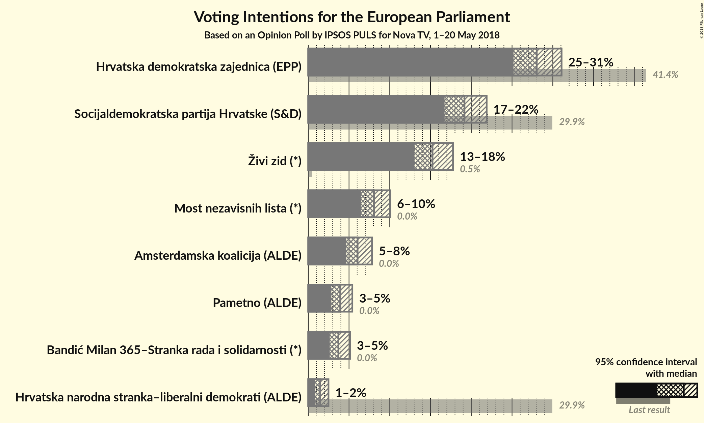
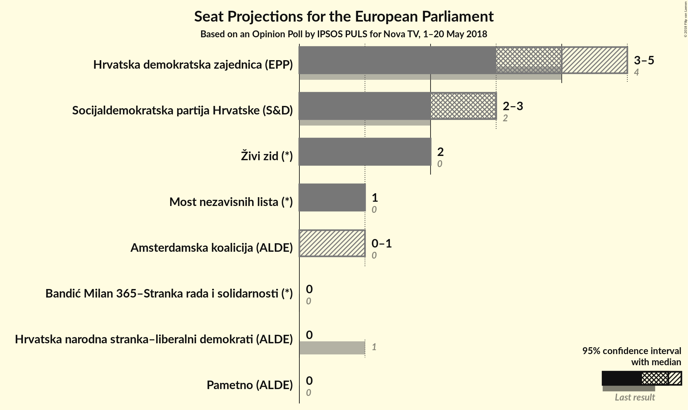

# Opinion Poll by IPSOS PULS for Nova TV, 1–20 May 2018

<a href="#voting-intentions">Voting Intentions</a> | <a href="#seats">Seats</a> | <a href="#coalitions">Coalitions</a> | <a href="#technical-information">Technical Information</a>

## Voting Intentions

### Confidence Intervals

| Party | Last Result | Poll Result | 80% Confidence Interval | 90% Confidence Interval | 95% Confidence Interval | 99% Confidence Interval |
|:-----:|:-----------:|:-----------:|:-----------------------:|:-----------------------:|:-----------------------:|:-----------------------:|
| Hrvatska demokratska zajednica (EPP) | 41.4% | 28.0% | 26.2–30.0% |25.6–30.6% |25.2–31.1% |24.3–32.0% |
| Socijaldemokratska partija Hrvatske (S&D) | 29.9% | 19.2% | 17.6–20.9% |17.1–21.4% |16.7–21.9% |16.0–22.8% |
| Živi zid (*) | 0.5% | 15.2% | 13.8–16.9% |13.4–17.4% |13.0–17.8% |12.4–18.6% |
| Most nezavisnih lista (*) | 0.0% | 8.1% | 7.0–9.4% |6.7–9.7% |6.5–10.1% |6.0–10.7% |
| Amsterdamska koalicija (ALDE) | 0.0% | 6.1% | N/A |N/A |N/A |N/A |
| Pametno (ALDE) | 0.0% | 3.9% | 3.2–4.9% |3.0–5.2% |2.8–5.4% |2.5–5.9% |
| Bandić Milan 365–Stranka rada i solidarnosti (*) | 0.0% | 3.7% | 3.0–4.6% |2.8–4.9% |2.6–5.2% |2.3–5.7% |
| Hrvatska narodna stranka–liberalni demokrati (ALDE) | 29.9% | 1.5% | 1.1–2.1% |0.9–2.3% |0.9–2.5% |0.7–2.8% |

*Note:* The poll result column reflects the actual value used in the calculations. Published results may vary slightly, and in addition be rounded to fewer digits.

## Seats

### Confidence Intervals

| Party | Last Result | Median | 80% Confidence Interval | 90% Confidence Interval | 95% Confidence Interval | 99% Confidence Interval |
|:-----:|:-----------:|:------:|:-----------------------:|:-----------------------:|:-----------------------:|:-----------------------:|
| <a href="#hrvatska-demokratska-zajednica-(epp)">Hrvatska demokratska zajednica (EPP)</a> | 4 | 4 | 4 |4–5 |4–5 |4–5 |
| <a href="#socijaldemokratska-partija-hrvatske-(s&d)">Socijaldemokratska partija Hrvatske (S&D)</a> | 2 | 3 | 3 |2–3 |2–3 |2–3 |
| <a href="#živi-zid-(*)">Živi zid (*)</a> | 0 | 2 | 2 |2 |2 |2–3 |
| <a href="#most-nezavisnih-lista-(*)">Most nezavisnih lista (*)</a> | 0 | 1 | 1 |1 |1 |1 |
| <a href="#amsterdamska-koalicija-(alde)">Amsterdamska koalicija (ALDE)</a> | 0 | N/A | N/A |N/A |N/A |N/A |
| <a href="#pametno-(alde)">Pametno (ALDE)</a> | 0 | 0 | 0 |0 |0 |0 |
| <a href="#bandić-milan-365–stranka-rada-i-solidarnosti-(*)">Bandić Milan 365–Stranka rada i solidarnosti (*)</a> | 0 | 0 | 0 |0 |0 |0 |
| <a href="#hrvatska-narodna-stranka–liberalni-demokrati-(alde)">Hrvatska narodna stranka–liberalni demokrati (ALDE)</a> | 1 | 0 | 0 |0 |0 |0 |

