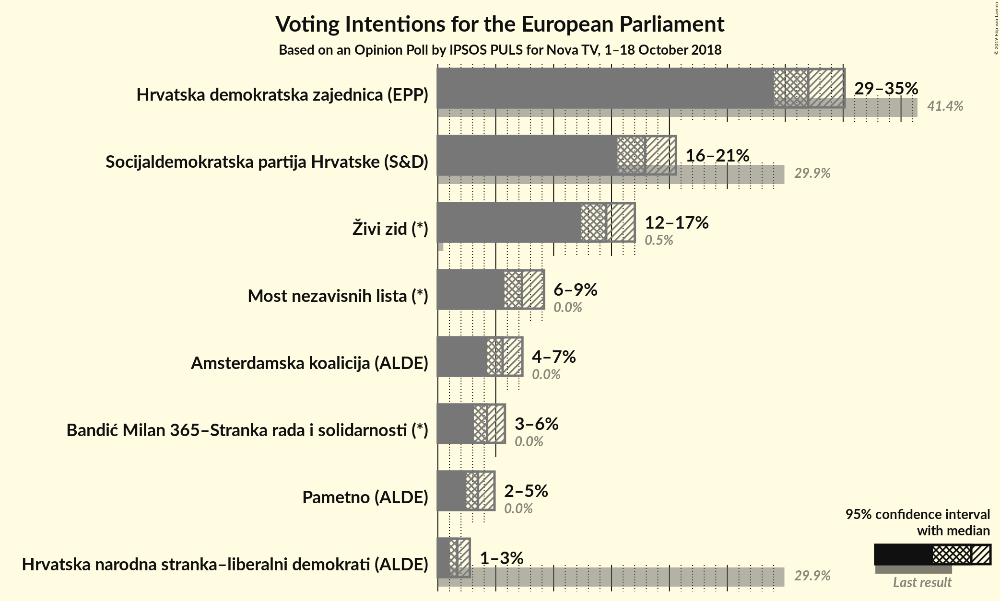

# Opinion Poll by IPSOS PULS for Nova TV, 1–18 October 2018

<a href="#voting-intentions">Voting Intentions</a> | <a href="#seats">Seats</a> | <a href="#coalitions">Coalitions</a> | <a href="#technical-information">Technical Information</a>

## Voting Intentions

### Confidence Intervals

| Party | Last Result | Poll Result | 80% Confidence Interval | 90% Confidence Interval | 95% Confidence Interval | 99% Confidence Interval |
|:-----:|:-----------:|:-----------:|:-----------------------:|:-----------------------:|:-----------------------:|:-----------------------:|
| Hrvatska demokratska zajednica (EPP) | 41.4% | 32.0% | 30.0–34.0% |29.5–34.6% |29.0–35.1% |28.1–36.1% |
| Socijaldemokratska partija Hrvatske (S&D) | 29.9% | 17.9% | 16.3–19.6% |15.9–20.1% |15.5–20.6% |14.8–21.4% |
| Živi zid (*) | 0.5% | 14.5% | 13.1–16.2% |12.7–16.6% |12.4–17.0% |11.7–17.8% |
| Most nezavisnih lista (*) | 0.0% | 7.3% | 6.3–8.5% |6.0–8.9% |5.7–9.2% |5.3–9.8% |
| Amsterdamska koalicija (ALDE) | 0.0% | 5.6% | N/A |N/A |N/A |N/A |
| Bandić Milan 365–Stranka rada i solidarnosti (*) | 0.0% | 4.3% | 3.5–5.3% |3.3–5.5% |3.1–5.8% |2.8–6.3% |
| Pametno (ALDE) | 0.0% | 3.5% | 2.8–4.4% |2.6–4.6% |2.5–4.9% |2.2–5.4% |
| Hrvatska narodna stranka–liberalni demokrati (ALDE) | 29.9% | 1.7% | 1.2–2.4% |1.1–2.6% |1.0–2.8% |0.8–3.1% |

*Note:* The poll result column reflects the actual value used in the calculations. Published results may vary slightly, and in addition be rounded to fewer digits.

## Seats

### Confidence Intervals

| Party | Last Result | Median | 80% Confidence Interval | 90% Confidence Interval | 95% Confidence Interval | 99% Confidence Interval |
|:-----:|:-----------:|:------:|:-----------------------:|:-----------------------:|:-----------------------:|:-----------------------:|
| <a href="#hrvatska-demokratska-zajednica-(epp)">Hrvatska demokratska zajednica (EPP)</a> | 4 | 5 | 4–5 |4–5 |4–5 |4–6 |
| <a href="#socijaldemokratska-partija-hrvatske-(s&d)">Socijaldemokratska partija Hrvatske (S&D)</a> | 2 | 2 | 2–3 |2–3 |2–3 |2–3 |
| <a href="#živi-zid-(*)">Živi zid (*)</a> | 0 | 2 | 2 |2 |2 |1–3 |
| <a href="#most-nezavisnih-lista-(*)">Most nezavisnih lista (*)</a> | 0 | 1 | 1 |1 |0–1 |0–1 |
| <a href="#amsterdamska-koalicija-(alde)">Amsterdamska koalicija (ALDE)</a> | 0 | N/A | N/A |N/A |N/A |N/A |
| <a href="#bandić-milan-365–stranka-rada-i-solidarnosti-(*)">Bandić Milan 365–Stranka rada i solidarnosti (*)</a> | 0 | 0 | 0 |0 |0 |0–1 |
| <a href="#pametno-(alde)">Pametno (ALDE)</a> | 0 | 0 | 0 |0 |0 |0 |
| <a href="#hrvatska-narodna-stranka–liberalni-demokrati-(alde)">Hrvatska narodna stranka–liberalni demokrati (ALDE)</a> | 1 | 0 | 0 |0 |0 |0 |

