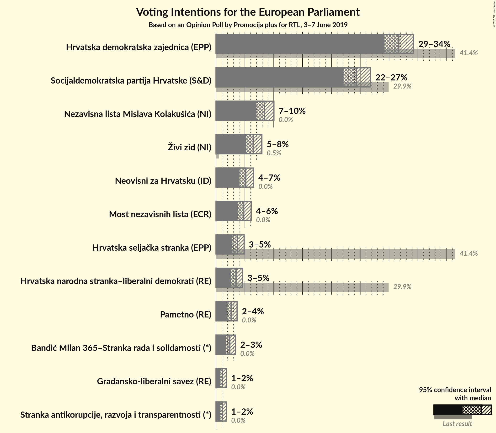
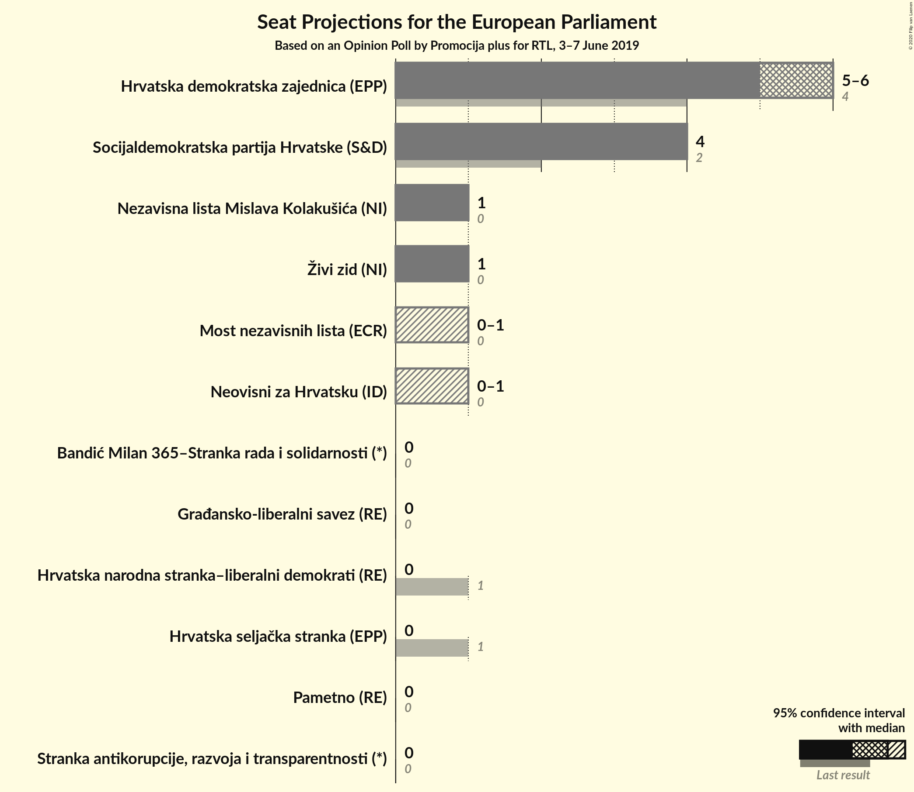

# Opinion Poll by Promocija plus for RTL, 3–7 June 2019

<a href="#voting-intentions">Voting Intentions</a> | <a href="#seats">Seats</a> | <a href="#coalitions">Coalitions</a> | <a href="#technical-information">Technical Information</a>

## Voting Intentions

### Confidence Intervals

| Party | Last Result | Poll Result | 80% Confidence Interval | 90% Confidence Interval | 95% Confidence Interval | 99% Confidence Interval |
|:-----:|:-----------:|:-----------:|:-----------------------:|:-----------------------:|:-----------------------:|:-----------------------:|
| Hrvatska demokratska zajednica (EPP) | 41.4% | 31.7% | 30.1–33.4% |29.6–33.9% |29.2–34.3% |28.5–35.1% |
| Socijaldemokratska partija Hrvatske (S&D) | 29.9% | 24.4% | 22.9–26.0% |22.5–26.4% |22.1–26.8% |21.4–27.6% |
| Nezavisna lista Mislava Kolakušića (NI) | 0.0% | 8.4% | 7.5–9.4% |7.2–9.8% |7.0–10.0% |6.6–10.6% |
| Živi zid (EFDD) | 0.5% | 6.5% | 5.7–7.4% |5.4–7.7% |5.2–7.9% |4.9–8.4% |
| Neovisni za Hrvatsku (EAPN) | 0.0% | 5.2% | 4.4–6.0% |4.2–6.3% |4.1–6.5% |3.8–7.0% |
| Most nezavisnih lista (ECR) | 0.0% | 4.8% | 4.1–5.6% |3.9–5.9% |3.7–6.1% |3.4–6.5% |
| Hrvatska seljačka stranka (EPP) | 41.4% | 3.7% | 3.1–4.5% |2.9–4.7% |2.8–4.9% |2.5–5.3% |
| Hrvatska narodna stranka–liberalni demokrati (ALDE) | 29.9% | 3.5% | 2.9–4.2% |2.7–4.4% |2.6–4.6% |2.3–5.0% |
| Pametno (ALDE) | 0.0% | 2.6% | 2.1–3.3% |2.0–3.5% |1.9–3.6% |1.7–4.0% |
| Bandić Milan 365–Stranka rada i solidarnosti (*) | 0.0% | 2.4% | 1.9–3.0% |1.8–3.2% |1.7–3.4% |1.5–3.7% |
| Stranka antikorupcije, razvoja i transparentnosti (*) | 0.0% | 1.1% | 0.8–1.6% |0.7–1.7% |0.6–1.8% |0.5–2.1% |
| Građansko-liberalni savez (ALDE) | N/A | 1.1% | 0.8–1.6% |0.7–1.7% |0.6–1.8% |0.5–2.1% |

*Note:* The poll result column reflects the actual value used in the calculations. Published results may vary slightly, and in addition be rounded to fewer digits.

## Seats

### Confidence Intervals

| Party | Last Result | Median | 80% Confidence Interval | 90% Confidence Interval | 95% Confidence Interval | 99% Confidence Interval |
|:-----:|:-----------:|:------:|:-----------------------:|:-----------------------:|:-----------------------:|:-----------------------:|
| <a href="#hrvatska-demokratska-zajednica-(epp)">Hrvatska demokratska zajednica (EPP)</a> | 4 | 5 | 5 |5 |5 |4–5 |
| <a href="#socijaldemokratska-partija-hrvatske-(s&d)">Socijaldemokratska partija Hrvatske (S&D)</a> | 2 | 4 | 4 |4 |3–4 |3–4 |
| <a href="#nezavisna-lista-mislava-kolakušića-(ni)">Nezavisna lista Mislava Kolakušića (NI)</a> | 0 | 1 | 1 |1 |1 |1 |
| <a href="#živi-zid-(efdd)">Živi zid (EFDD)</a> | 0 | 1 | 1 |1 |1 |0–1 |
| <a href="#neovisni-za-hrvatsku-(eapn)">Neovisni za Hrvatsku (EAPN)</a> | 0 | 0 | 0 |0 |0 |0–1 |
| <a href="#most-nezavisnih-lista-(ecr)">Most nezavisnih lista (ECR)</a> | 0 | 0 | 0 |0 |0 |0–1 |
| <a href="#hrvatska-seljačka-stranka-(epp)">Hrvatska seljačka stranka (EPP)</a> | 1 | 0 | 0 |0 |0 |0 |
| <a href="#hrvatska-narodna-stranka–liberalni-demokrati-(alde)">Hrvatska narodna stranka–liberalni demokrati (ALDE)</a> | 1 | 0 | 0 |0 |0 |0 |
| <a href="#pametno-(alde)">Pametno (ALDE)</a> | 0 | 0 | 0 |0 |0 |0 |
| <a href="#bandić-milan-365–stranka-rada-i-solidarnosti-(*)">Bandić Milan 365–Stranka rada i solidarnosti (*)</a> | 0 | 0 | 0 |0 |0 |0 |
| <a href="#stranka-antikorupcije,-razvoja-i-transparentnosti-(*)">Stranka antikorupcije, razvoja i transparentnosti (*)</a> | 0 | 0 | 0 |0 |0 |0 |
| <a href="#građansko-liberalni-savez-(alde)">Građansko-liberalni savez (ALDE)</a> | N/A | 0 | 0 |0 |0 |0 |

