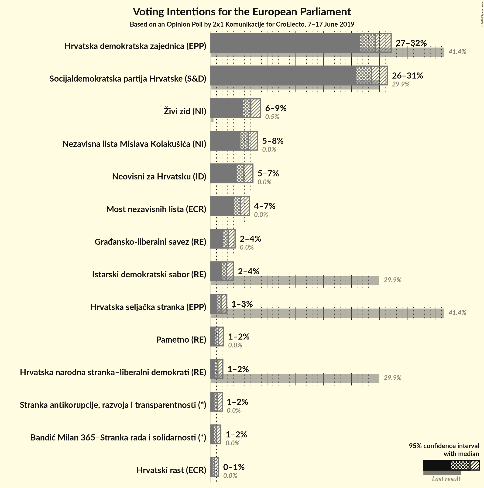
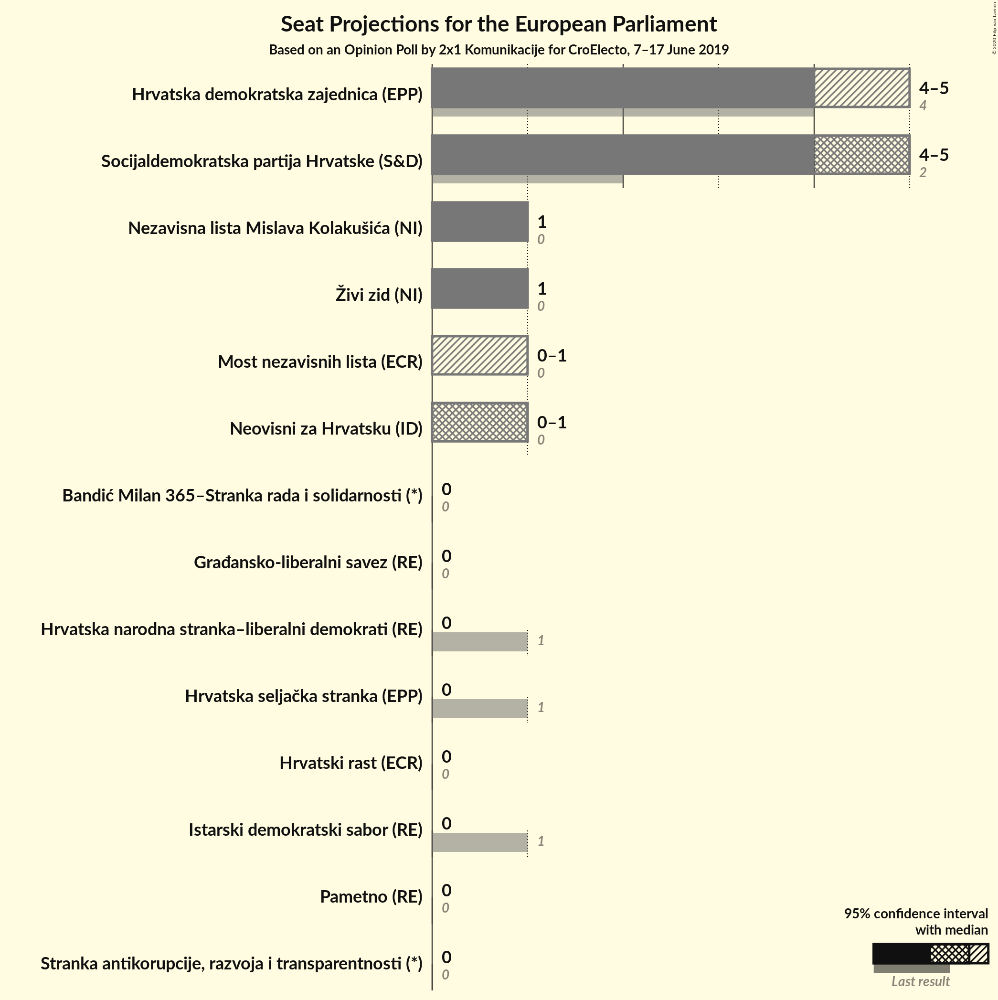

# Opinion Poll by 2x1 Komunikacije for CroElecto, 7–17 June 2019

<a href="#voting-intentions">Voting Intentions</a> | <a href="#seats">Seats</a> | <a href="#coalitions">Coalitions</a> | <a href="#technical-information">Technical Information</a>

## Voting Intentions

### Confidence Intervals

| Party | Last Result | Poll Result | 80% Confidence Interval | 90% Confidence Interval | 95% Confidence Interval | 99% Confidence Interval |
|:-----:|:-----------:|:-----------:|:-----------------------:|:-----------------------:|:-----------------------:|:-----------------------:|
| Hrvatska demokratska zajednica (EPP) | 41.4% | 29.2% | 27.4–31.1% |26.9–31.6% |26.5–32.0% |25.7–33.0% |
| Socijaldemokratska partija Hrvatske (S&D) | 29.9% | 28.5% | 26.8–30.4% |26.3–30.9% |25.9–31.4% |25.0–32.3% |
| Živi zid (NI) | 0.5% | 7.1% | 6.2–8.2% |5.9–8.6% |5.7–8.8% |5.3–9.4% |
| Nezavisna lista Mislava Kolakušića (NI) | 0.0% | 6.6% | 5.7–7.7% |5.5–8.0% |5.3–8.3% |4.9–8.9% |
| Neovisni za Hrvatsku (ID) | 0.0% | 5.9% | 5.0–6.9% |4.8–7.2% |4.6–7.5% |4.2–8.0% |
| Most nezavisnih lista (ECR) | 0.0% | 5.3% | 4.5–6.3% |4.3–6.6% |4.1–6.8% |3.7–7.3% |
| Građansko-liberalni savez (RE) | N/A | 3.1% | 2.5–3.9% |2.3–4.1% |2.2–4.3% |1.9–4.7% |
| Istarski demokratski sabor (RE) | 29.9% | 2.8% | 2.2–3.6% |2.1–3.8% |2.0–4.0% |1.7–4.4% |
| Hrvatska seljačka stranka (EPP) | 41.4% | 1.8% | 1.4–2.5% |1.3–2.7% |1.2–2.8% |1.0–3.2% |
| Pametno (RE) | 0.0% | 1.3% | 1.0–1.9% |0.9–2.1% |0.8–2.3% |0.7–2.6% |
| Hrvatska narodna stranka–liberalni demokrati (RE) | 29.9% | 1.2% | 0.9–1.8% |0.8–2.0% |0.7–2.1% |0.6–2.4% |
| Stranka antikorupcije, razvoja i transparentnosti (*) | 0.0% | 1.2% | 0.8–1.7% |0.7–1.9% |0.7–2.0% |0.5–2.3% |
| Bandić Milan 365–Stranka rada i solidarnosti (*) | 0.0% | 1.0% | 0.7–1.5% |0.6–1.6% |0.5–1.8% |0.4–2.0% |
| Hrvatski rast (ECR) | 0.0% | 0.7% | 0.4–1.1% |0.4–1.3% |0.3–1.4% |0.2–1.6% |

*Note:* The poll result column reflects the actual value used in the calculations. Published results may vary slightly, and in addition be rounded to fewer digits.

## Seats

### Confidence Intervals

| Party | Last Result | Median | 80% Confidence Interval | 90% Confidence Interval | 95% Confidence Interval | 99% Confidence Interval |
|:-----:|:-----------:|:------:|:-----------------------:|:-----------------------:|:-----------------------:|:-----------------------:|
| <a href="#hrvatska-demokratska-zajednica-(epp)">Hrvatska demokratska zajednica (EPP)</a> | 4 | 4 | 4–5 |4–5 |4–5 |4–6 |
| <a href="#socijaldemokratska-partija-hrvatske-(s&d)">Socijaldemokratska partija Hrvatske (S&D)</a> | 2 | 4 | 4–5 |4–5 |4–5 |3–5 |
| <a href="#živi-zid-(ni)">Živi zid (NI)</a> | 0 | 1 | 1 |1 |0–1 |0–1 |
| <a href="#nezavisna-lista-mislava-kolakušića-(ni)">Nezavisna lista Mislava Kolakušića (NI)</a> | 0 | 1 | 0–1 |0–1 |0–1 |0–1 |
| <a href="#neovisni-za-hrvatsku-(id)">Neovisni za Hrvatsku (ID)</a> | 0 | 0 | 0–1 |0–1 |0–1 |0–1 |
| <a href="#most-nezavisnih-lista-(ecr)">Most nezavisnih lista (ECR)</a> | 0 | 0 | 0–1 |0–1 |0–1 |0–1 |
| <a href="#građansko-liberalni-savez-(re)">Građansko-liberalni savez (RE)</a> | N/A | 0 | 0 |0 |0 |0 |
| <a href="#istarski-demokratski-sabor-(re)">Istarski demokratski sabor (RE)</a> | 1 | 0 | 0 |0 |0 |0 |
| <a href="#hrvatska-seljačka-stranka-(epp)">Hrvatska seljačka stranka (EPP)</a> | 1 | 0 | 0 |0 |0 |0 |
| <a href="#pametno-(re)">Pametno (RE)</a> | 0 | 0 | 0 |0 |0 |0 |
| <a href="#hrvatska-narodna-stranka–liberalni-demokrati-(re)">Hrvatska narodna stranka–liberalni demokrati (RE)</a> | 1 | 0 | 0 |0 |0 |0 |
| <a href="#stranka-antikorupcije,-razvoja-i-transparentnosti-(*)">Stranka antikorupcije, razvoja i transparentnosti (*)</a> | 0 | 0 | 0 |0 |0 |0 |
| <a href="#bandić-milan-365–stranka-rada-i-solidarnosti-(*)">Bandić Milan 365–Stranka rada i solidarnosti (*)</a> | 0 | 0 | 0 |0 |0 |0 |
| <a href="#hrvatski-rast-(ecr)">Hrvatski rast (ECR)</a> | 0 | 0 | 0 |0 |0 |0 |

