# Opinion Poll by Promocija plus for RTL, 1–5 July 2019

<a href="#voting-intentions">Voting Intentions</a> | <a href="#seats">Seats</a> | <a href="#coalitions">Coalitions</a> | <a href="#technical-information">Technical Information</a>

## Voting Intentions

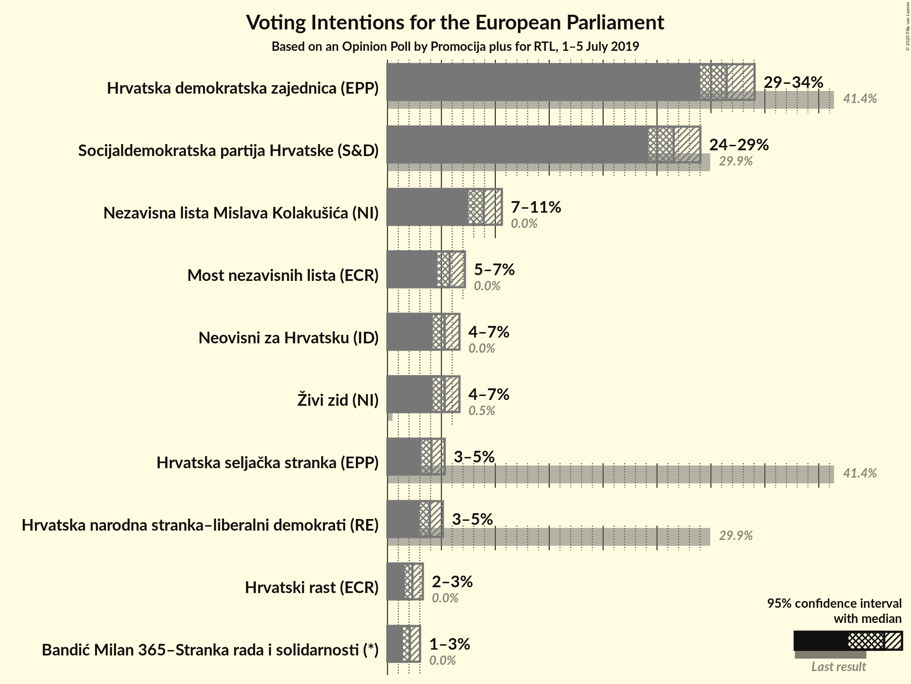

### Confidence Intervals

| Party | Last Result | Poll Result | 80% Confidence Interval | 90% Confidence Interval | 95% Confidence Interval | 99% Confidence Interval |
|:-----:|:-----------:|:-----------:|:-----------------------:|:-----------------------:|:-----------------------:|:-----------------------:|
| Hrvatska demokratska zajednica (EPP) | 41.4% | 31.5% | 29.8–33.2% |29.4–33.6% |29.0–34.0% |28.2–34.9% |
| Socijaldemokratska partija Hrvatske (S&D) | 29.9% | 26.5% | 25.0–28.2% |24.6–28.6% |24.2–29.0% |23.5–29.8% |
| Nezavisna lista Mislava Kolakušića (NI) | 0.0% | 8.9% | 8.0–10.0% |7.7–10.3% |7.5–10.6% |7.1–11.2% |
| Most nezavisnih lista (ECR) | 0.0% | 5.8% | 5.0–6.7% |4.8–7.0% |4.6–7.2% |4.3–7.6% |
| Živi zid (NI) | 0.5% | 5.3% | 4.6–6.2% |4.4–6.4% |4.2–6.7% |3.9–7.1% |
| Neovisni za Hrvatsku (ID) | 0.0% | 5.3% | 4.6–6.2% |4.4–6.4% |4.2–6.7% |3.9–7.1% |
| Hrvatska seljačka stranka (EPP) | 41.4% | 4.1% | 3.4–4.9% |3.3–5.1% |3.1–5.3% |2.9–5.7% |
| Hrvatska narodna stranka–liberalni demokrati (RE) | 29.9% | 3.9% | 3.3–4.7% |3.1–4.9% |3.0–5.1% |2.7–5.5% |
| Hrvatski rast (ECR) | 0.0% | 2.3% | 1.8–2.9% |1.7–3.1% |1.6–3.3% |1.4–3.6% |
| Bandić Milan 365–Stranka rada i solidarnosti (*) | 0.0% | 2.1% | 1.6–2.7% |1.5–2.9% |1.4–3.0% |1.2–3.3% |

*Note:* The poll result column reflects the actual value used in the calculations. Published results may vary slightly, and in addition be rounded to fewer digits.

## Seats

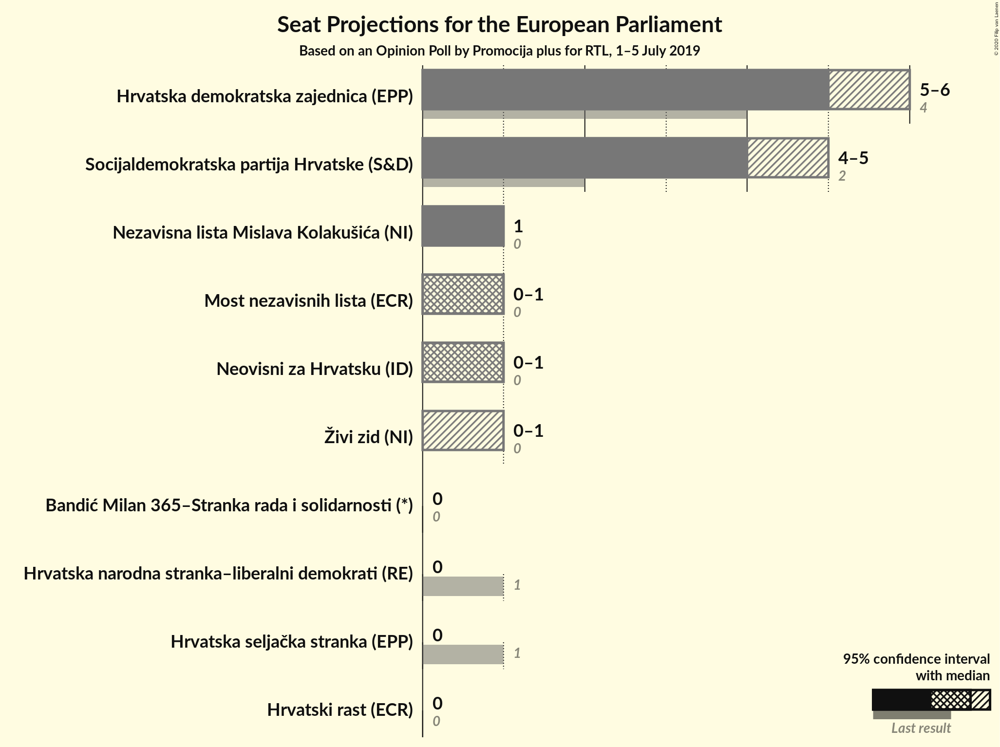

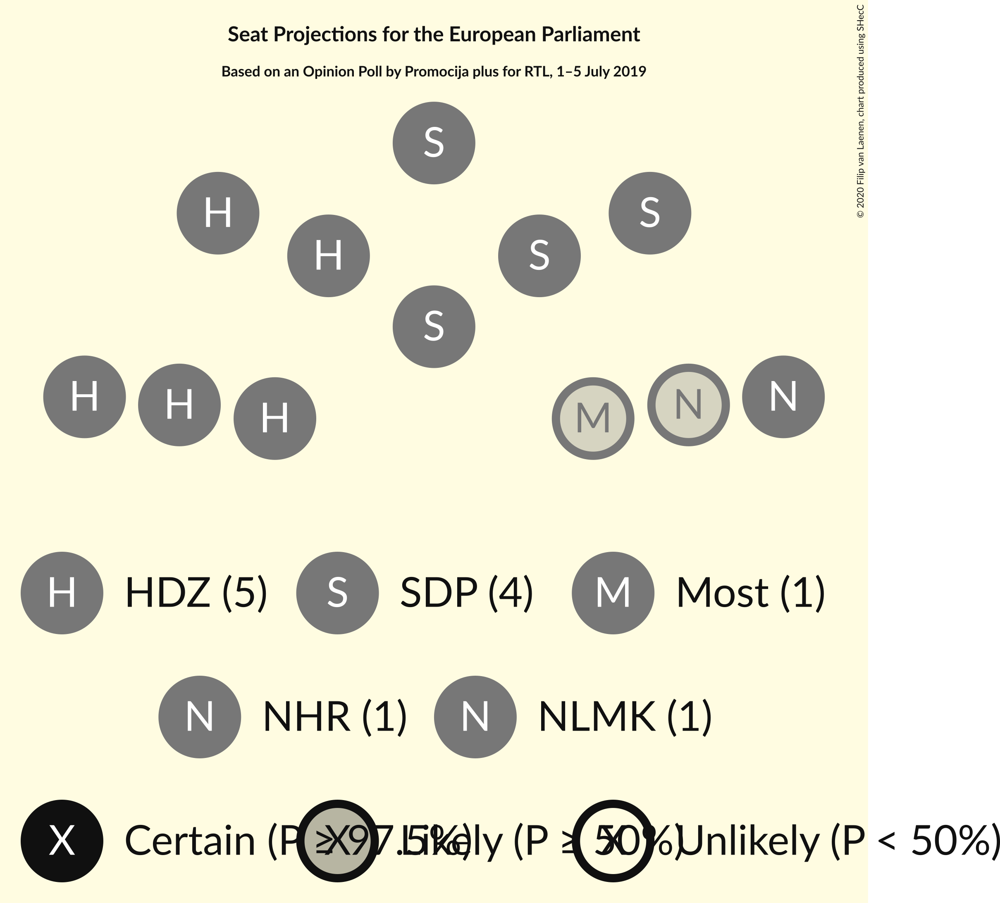

### Confidence Intervals

| Party | Last Result | Median | 80% Confidence Interval | 90% Confidence Interval | 95% Confidence Interval | 99% Confidence Interval |
|:-----:|:-----------:|:------:|:-----------------------:|:-----------------------:|:-----------------------:|:-----------------------:|
| <a href="#hrvatska-demokratska-zajednica-(epp)">Hrvatska demokratska zajednica (EPP)</a> | 4 | 5 | 5–6 |5–6 |5–6 |4–6 |
| <a href="#socijaldemokratska-partija-hrvatske-(s&d)">Socijaldemokratska partija Hrvatske (S&D)</a> | 2 | 4 | 4–5 |4–5 |4–5 |4–5 |
| <a href="#nezavisna-lista-mislava-kolakušića-(ni)">Nezavisna lista Mislava Kolakušića (NI)</a> | 0 | 1 | 1 |1 |1 |1–2 |
| <a href="#most-nezavisnih-lista-(ecr)">Most nezavisnih lista (ECR)</a> | 0 | 1 | 0–1 |0–1 |0–1 |0–1 |
| <a href="#živi-zid-(ni)">Živi zid (NI)</a> | 0 | 0 | 0–1 |0–1 |0–1 |0–1 |
| <a href="#neovisni-za-hrvatsku-(id)">Neovisni za Hrvatsku (ID)</a> | 0 | 1 | 0–1 |0–1 |0–1 |0–1 |
| <a href="#hrvatska-seljačka-stranka-(epp)">Hrvatska seljačka stranka (EPP)</a> | 1 | 0 | 0 |0 |0 |0–1 |
| <a href="#hrvatska-narodna-stranka–liberalni-demokrati-(re)">Hrvatska narodna stranka–liberalni demokrati (RE)</a> | 1 | 0 | 0 |0 |0 |0 |
| <a href="#hrvatski-rast-(ecr)">Hrvatski rast (ECR)</a> | 0 | 0 | 0 |0 |0 |0 |
| <a href="#bandić-milan-365–stranka-rada-i-solidarnosti-(*)">Bandić Milan 365–Stranka rada i solidarnosti (*)</a> | 0 | 0 | 0 |0 |0 |0 |

### Hrvatska demokratska zajednica (EPP)

*For a full overview of the results for this party, see the [Hrvatska demokratska zajednica (EPP)](party-hrvatskademokratskazajednicaepp.html) page.*

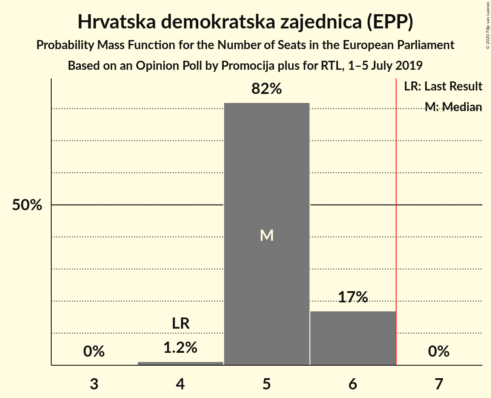

| Number of Seats | Probability | Accumulated | Special Marks |
|:---------------:|:-----------:|:-----------:|:-------------:|
| 4 | 1.2% | 100% | Last Result |
| 5 | 82% | 98.8% | Median |
| 6 | 17% | 17% |  |
| 7 | 0% | 0% | Majority |

### Socijaldemokratska partija Hrvatske (S&D)

*For a full overview of the results for this party, see the [Socijaldemokratska partija Hrvatske (S&D)](party-socijaldemokratskapartijahrvatskesd.html) page.*

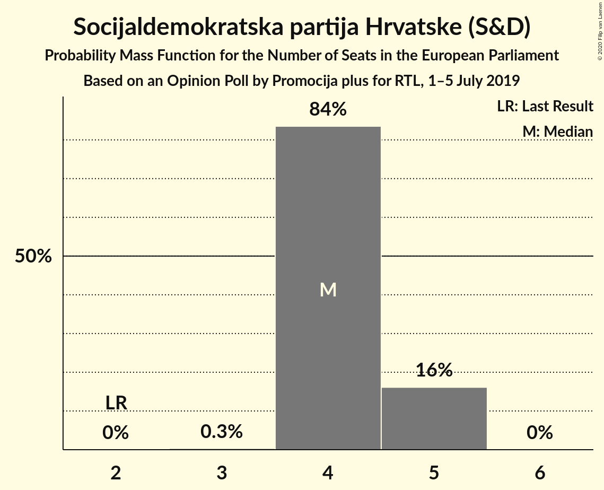

| Number of Seats | Probability | Accumulated | Special Marks |
|:---------------:|:-----------:|:-----------:|:-------------:|
| 2 | 0% | 100% | Last Result |
| 3 | 0.3% | 100% |  |
| 4 | 84% | 99.7% | Median |
| 5 | 16% | 16% |  |
| 6 | 0% | 0% |  |

### Nezavisna lista Mislava Kolakušića (NI)

*For a full overview of the results for this party, see the [Nezavisna lista Mislava Kolakušića (NI)](party-nezavisnalistamislavakolakušićani.html) page.*

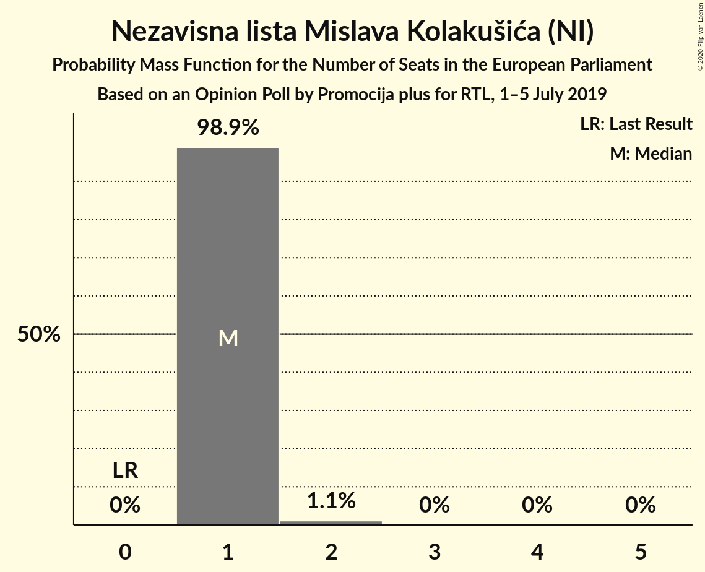

| Number of Seats | Probability | Accumulated | Special Marks |
|:---------------:|:-----------:|:-----------:|:-------------:|
| 0 | 0% | 100% | Last Result |
| 1 | 98.9% | 100% | Median |
| 2 | 1.1% | 1.1% |  |
| 3 | 0% | 0% |  |

### Most nezavisnih lista (ECR)

*For a full overview of the results for this party, see the [Most nezavisnih lista (ECR)](party-mostnezavisnihlistaecr.html) page.*

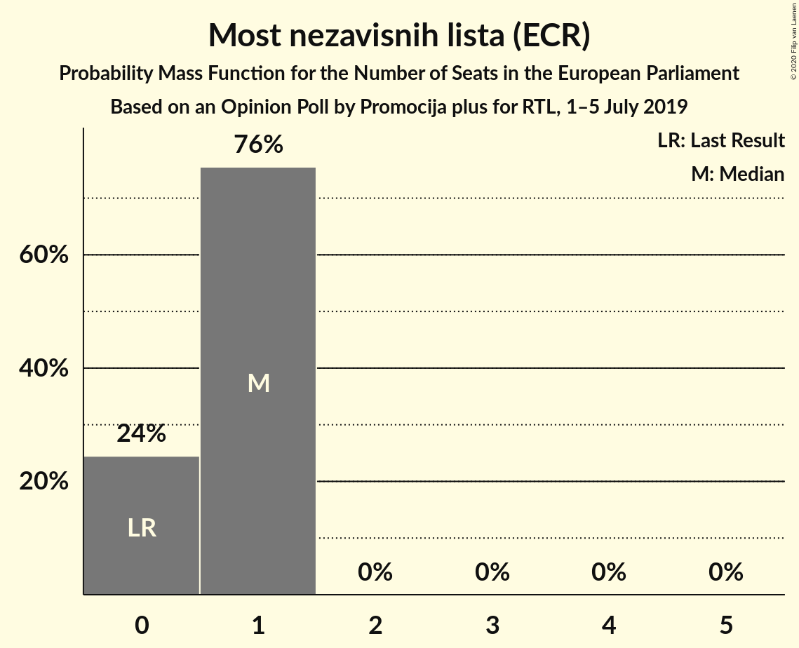

| Number of Seats | Probability | Accumulated | Special Marks |
|:---------------:|:-----------:|:-----------:|:-------------:|
| 0 | 24% | 100% | Last Result |
| 1 | 76% | 76% | Median |
| 2 | 0% | 0% |  |

### Živi zid (NI)

*For a full overview of the results for this party, see the [Živi zid (NI)](party-živizidni.html) page.*

| Number of Seats | Probability | Accumulated | Special Marks |
|:---------------:|:-----------:|:-----------:|:-------------:|
| 0 | 64% | 100% | Last Result, Median |
| 1 | 36% | 36% |  |
| 2 | 0% | 0% |  |

### Neovisni za Hrvatsku (ID)

*For a full overview of the results for this party, see the [Neovisni za Hrvatsku (ID)](party-neovisnizahrvatskuid.html) page.*

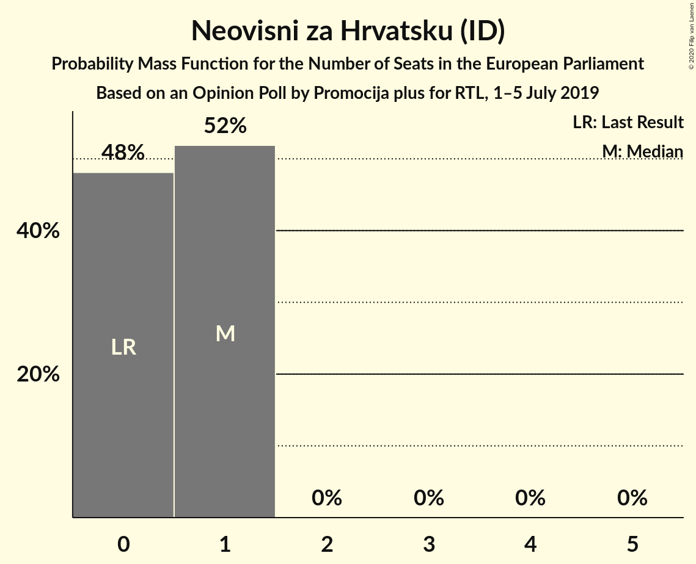

| Number of Seats | Probability | Accumulated | Special Marks |
|:---------------:|:-----------:|:-----------:|:-------------:|
| 0 | 48% | 100% | Last Result |
| 1 | 52% | 52% | Median |
| 2 | 0% | 0% |  |

### Hrvatska seljačka stranka (EPP)

*For a full overview of the results for this party, see the [Hrvatska seljačka stranka (EPP)](party-hrvatskaseljačkastrankaepp.html) page.*

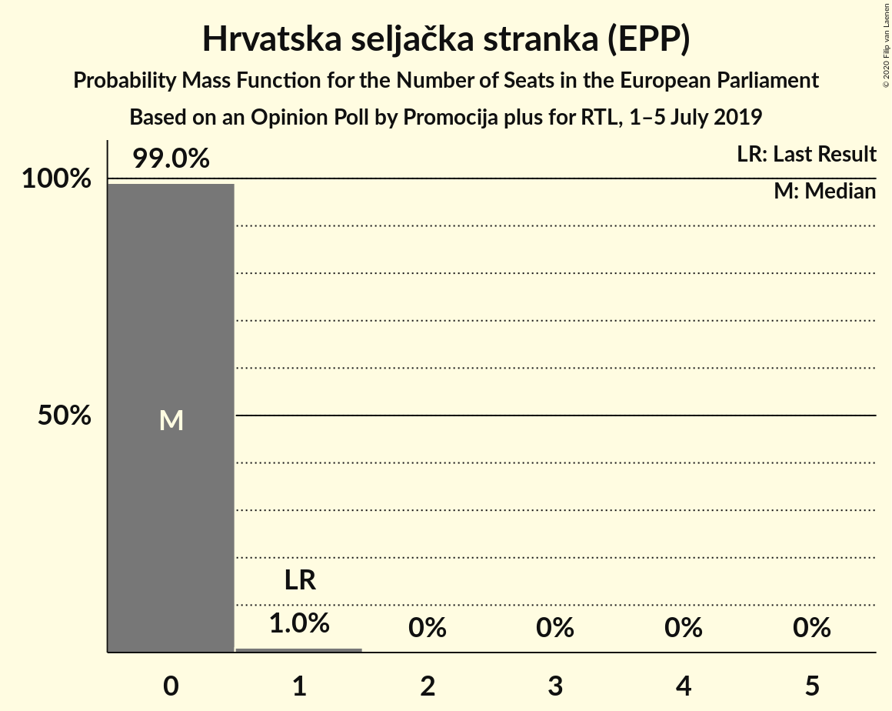

| Number of Seats | Probability | Accumulated | Special Marks |
|:---------------:|:-----------:|:-----------:|:-------------:|
| 0 | 99.0% | 100% | Median |
| 1 | 1.0% | 1.0% | Last Result |
| 2 | 0% | 0% |  |

### Hrvatska narodna stranka–liberalni demokrati (RE)

*For a full overview of the results for this party, see the [Hrvatska narodna stranka–liberalni demokrati (RE)](party-hrvatskanarodnastranka–liberalnidemokratire.html) page.*

| Number of Seats | Probability | Accumulated | Special Marks |
|:---------------:|:-----------:|:-----------:|:-------------:|
| 0 | 99.7% | 100% | Median |
| 1 | 0.3% | 0.3% | Last Result |
| 2 | 0% | 0% |  |

### Hrvatski rast (ECR)

*For a full overview of the results for this party, see the [Hrvatski rast (ECR)](party-hrvatskirastecr.html) page.*

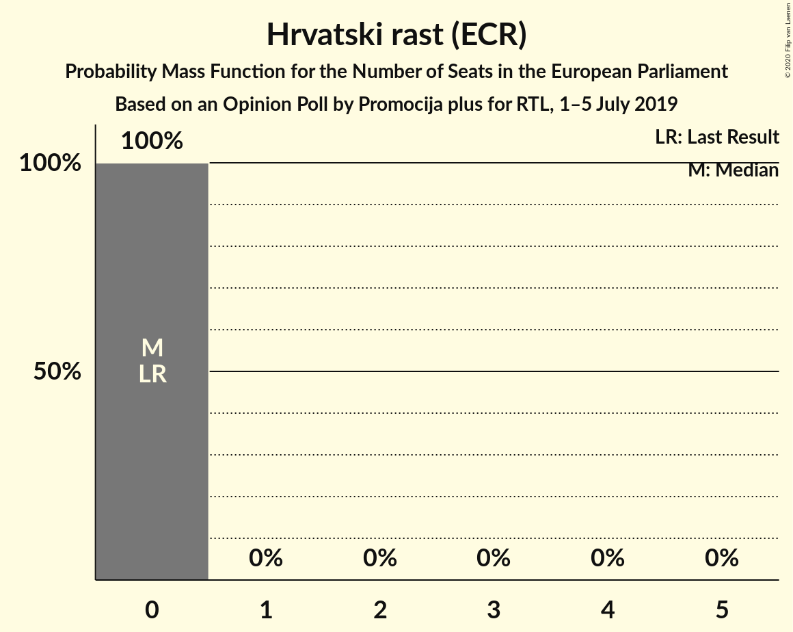

| Number of Seats | Probability | Accumulated | Special Marks |
|:---------------:|:-----------:|:-----------:|:-------------:|
| 0 | 100% | 100% | Last Result, Median |

### Bandić Milan 365–Stranka rada i solidarnosti (*)

*For a full overview of the results for this party, see the [Bandić Milan 365–Stranka rada i solidarnosti (*)](party-bandićmilan365–strankaradaisolidarnosti.html) page.*

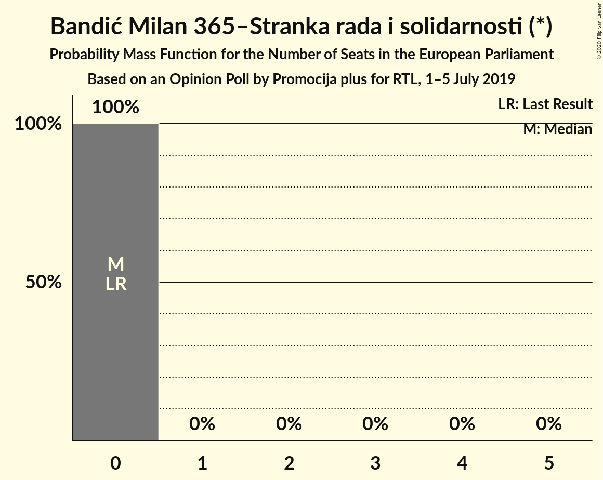

| Number of Seats | Probability | Accumulated | Special Marks |
|:---------------:|:-----------:|:-----------:|:-------------:|
| 0 | 100% | 100% | Last Result, Median |

## Coalitions

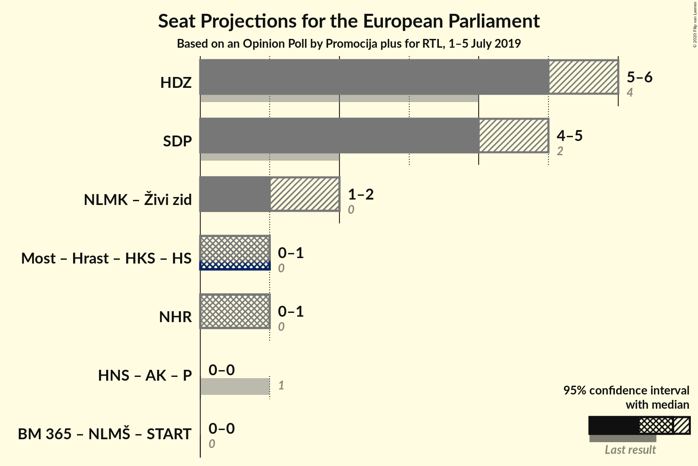

### Confidence Intervals

| Coalition | Last Result | Median | Majority? | 80% Confidence Interval | 90% Confidence Interval | 95% Confidence Interval | 99% Confidence Interval |
|:---------:|:-----------:|:------:|:---------:|:-----------------------:|:-----------------------:|:-----------------------:|:-----------------------:|
| Hrvatska demokratska zajednica (EPP) | 4 | 5 | 0% | 5–6 | 5–6 | 5–6 | 4–6 |
| Socijaldemokratska partija Hrvatske (S&D) | 2 | 4 | 0% | 4–5 | 4–5 | 4–5 | 4–5 |
| Nezavisna lista Mislava Kolakušića (NI) – Živi zid (NI) | 0 | 1 | 0% | 1–2 | 1–2 | 1–2 | 1–3 |
| Neovisni za Hrvatsku (ID) | 0 | 1 | 0% | 0–1 | 0–1 | 0–1 | 0–1 |

### Hrvatska demokratska zajednica (EPP)

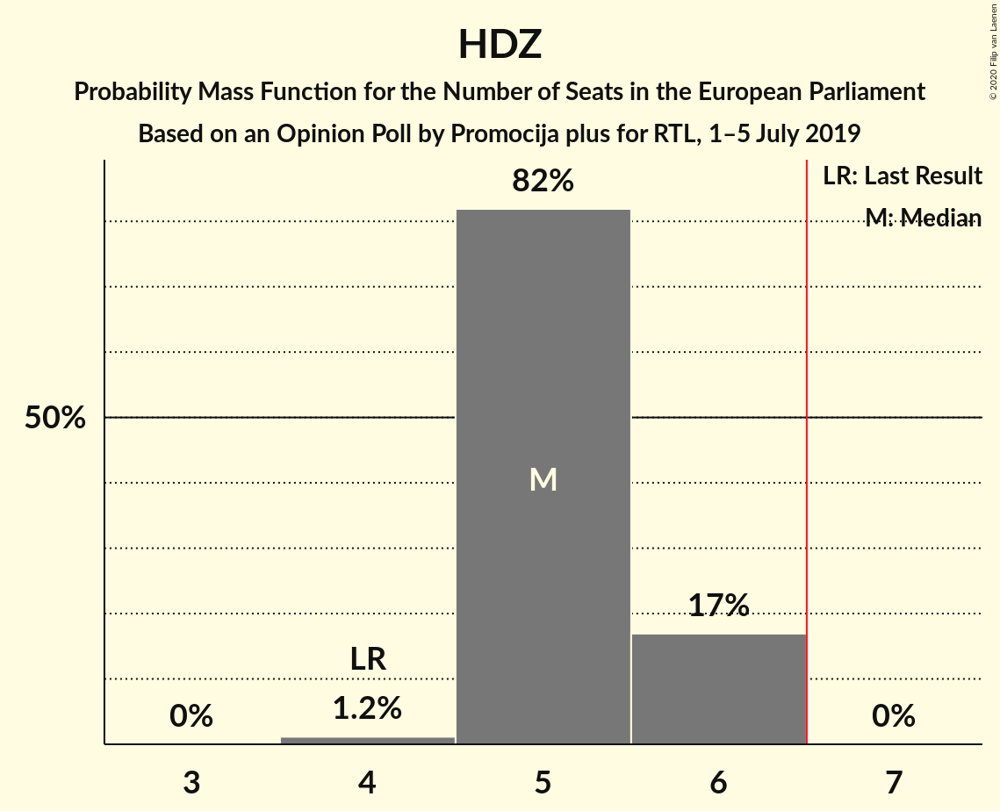

| Number of Seats | Probability | Accumulated | Special Marks |
|:---------------:|:-----------:|:-----------:|:-------------:|
| 4 | 1.2% | 100% | Last Result |
| 5 | 82% | 98.8% | Median |
| 6 | 17% | 17% |  |
| 7 | 0% | 0% | Majority |

### Socijaldemokratska partija Hrvatske (S&D)

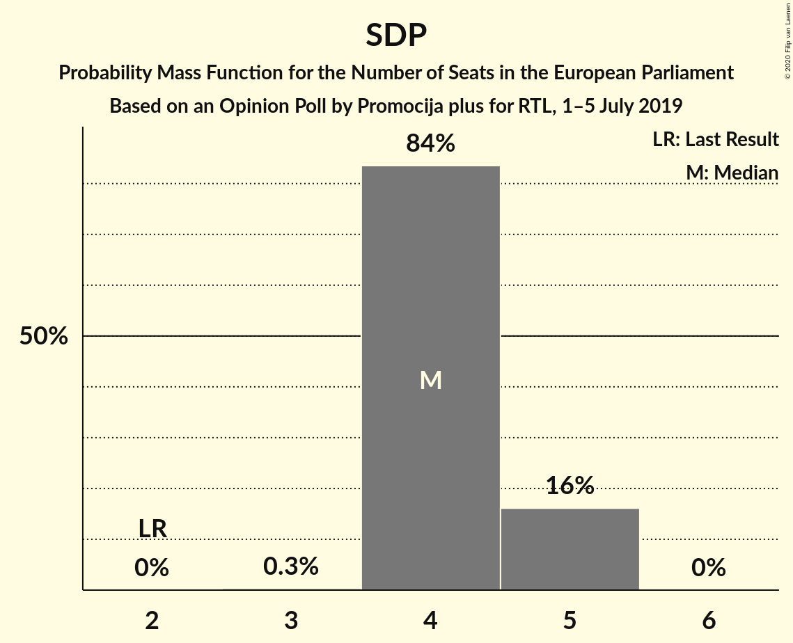

| Number of Seats | Probability | Accumulated | Special Marks |
|:---------------:|:-----------:|:-----------:|:-------------:|
| 2 | 0% | 100% | Last Result |
| 3 | 0.3% | 100% |  |
| 4 | 84% | 99.7% | Median |
| 5 | 16% | 16% |  |
| 6 | 0% | 0% |  |

### Nezavisna lista Mislava Kolakušića (NI) – Živi zid (NI)

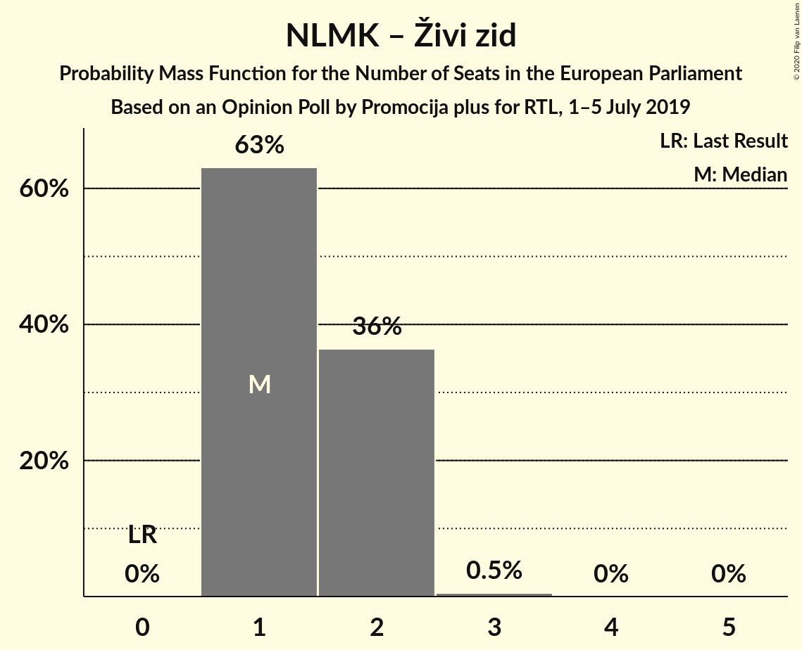

| Number of Seats | Probability | Accumulated | Special Marks |
|:---------------:|:-----------:|:-----------:|:-------------:|
| 0 | 0% | 100% | Last Result |
| 1 | 63% | 100% | Median |
| 2 | 36% | 37% |  |
| 3 | 0.5% | 0.5% |  |
| 4 | 0% | 0% |  |

### Neovisni za Hrvatsku (ID)

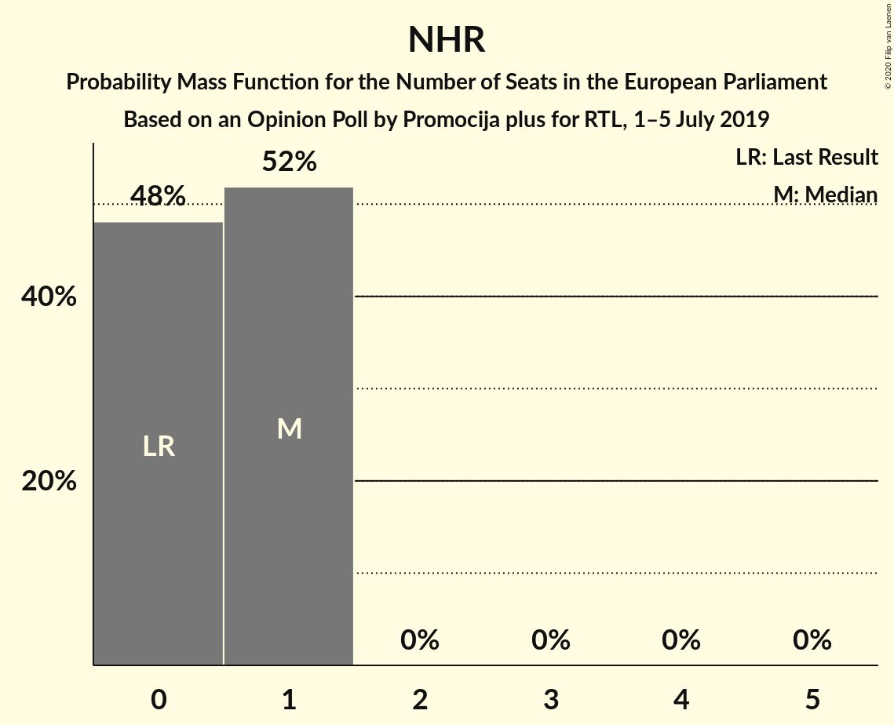

| Number of Seats | Probability | Accumulated | Special Marks |
|:---------------:|:-----------:|:-----------:|:-------------:|
| 0 | 48% | 100% | Last Result |
| 1 | 52% | 52% | Median |
| 2 | 0% | 0% |  |

## Technical Information

### Opinion Poll

+ **Polling firm:** Promocija plus
+ **Commissioner(s):** RTL
+ **Fieldwork period:** 1–5 July 2019

### Calculations

+ **Sample size:** 1300
+ **Simulations done:** 1,048,576
+ **Error estimate:** 1.17%

