# Opinion Poll by 2x1 Komunikacije for CroElecto, 8–15 July 2019

<a href="#voting-intentions">Voting Intentions</a> | <a href="#seats">Seats</a> | <a href="#coalitions">Coalitions</a> | <a href="#technical-information">Technical Information</a>

## Voting Intentions

### Confidence Intervals

| Party | Last Result | Poll Result | 80% Confidence Interval | 90% Confidence Interval | 95% Confidence Interval | 99% Confidence Interval |
|:-----:|:-----------:|:-----------:|:-----------------------:|:-----------------------:|:-----------------------:|:-----------------------:|
| Socijaldemokratska partija Hrvatske (S&D) | 29.9% | 32.3% | 30.1–34.5% |29.5–35.1% |29.0–35.7% |28.0–36.8% |
| Hrvatska demokratska zajednica (EPP) | 41.4% | 29.3% | 27.3–31.5% |26.7–32.2% |26.2–32.7% |25.2–33.8% |
| Nezavisna lista Mislava Kolakušića (NI) | 0.0% | 4.0% | 3.2–5.1% |3.0–5.4% |2.8–5.6% |2.5–6.2% |
| Živi zid (NI) | 0.5% | 3.9% | 3.1–4.9% |2.9–5.2% |2.7–5.5% |2.4–6.0% |
| Neovisni za Hrvatsku (ID) | 0.0% | 3.7% | 3.0–4.8% |2.8–5.1% |2.6–5.3% |2.3–5.9% |
| Most nezavisnih lista (ECR) | 0.0% | 2.7% | 2.0–3.6% |1.9–3.8% |1.7–4.1% |1.5–4.6% |
| Istarski demokratski sabor (RE) | 29.9% | 1.2% | 0.8–1.9% |0.7–2.1% |0.6–2.3% |0.5–2.6% |
| Građansko-liberalni savez (RE) | 0.0% | 1.2% | 0.8–1.9% |0.7–2.1% |0.6–2.3% |0.5–2.6% |

*Note:* The poll result column reflects the actual value used in the calculations. Published results may vary slightly, and in addition be rounded to fewer digits.

## Seats

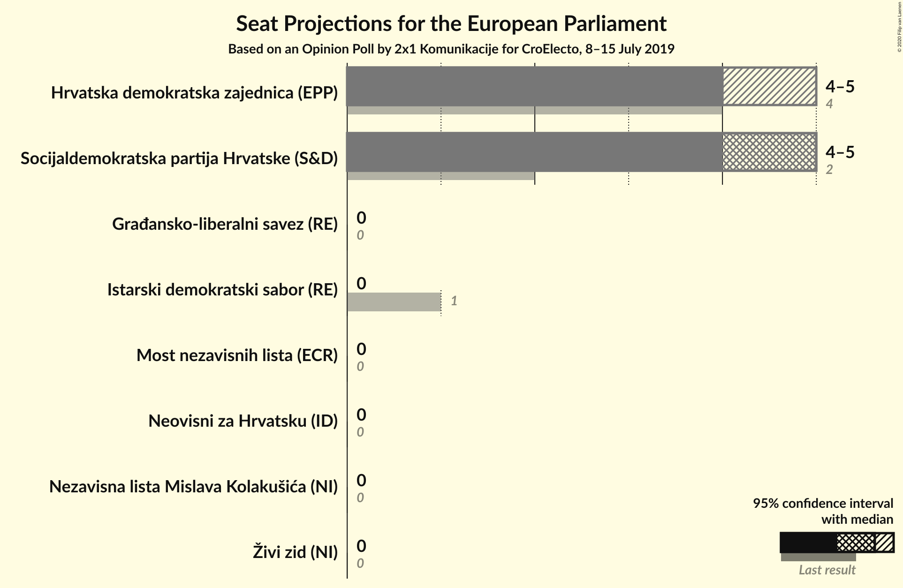

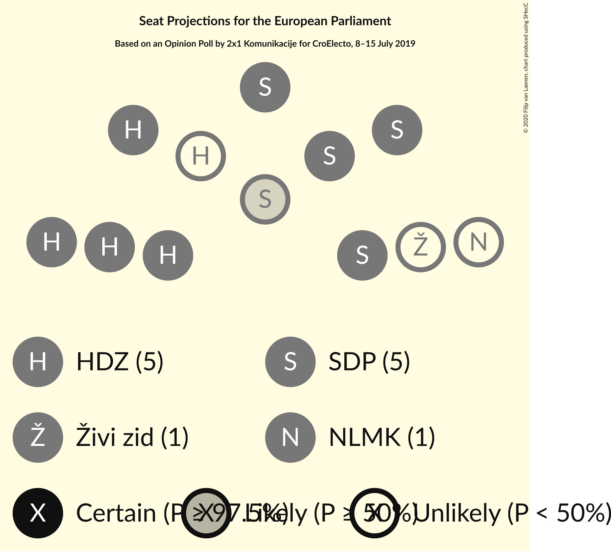

### Confidence Intervals

| Party | Last Result | Median | 80% Confidence Interval | 90% Confidence Interval | 95% Confidence Interval | 99% Confidence Interval |
|:-----:|:-----------:|:------:|:-----------------------:|:-----------------------:|:-----------------------:|:-----------------------:|
| <a href="#socijaldemokratska-partija-hrvatske-(s&d)">Socijaldemokratska partija Hrvatske (S&D)</a> | 2 | 4 | 4–5 |4–5 |4–5 |4–6 |
| <a href="#hrvatska-demokratska-zajednica-(epp)">Hrvatska demokratska zajednica (EPP)</a> | 4 | 4 | 4–5 |4–5 |4–5 |3–5 |
| <a href="#nezavisna-lista-mislava-kolakušića-(ni)">Nezavisna lista Mislava Kolakušića (NI)</a> | 0 | 0 | 0 |0–1 |0–1 |0–1 |
| <a href="#živi-zid-(ni)">Živi zid (NI)</a> | 0 | 0 | 0 |0–1 |0–1 |0–1 |
| <a href="#neovisni-za-hrvatsku-(id)">Neovisni za Hrvatsku (ID)</a> | 0 | 0 | 0 |0 |0 |0 |
| <a href="#most-nezavisnih-lista-(ecr)">Most nezavisnih lista (ECR)</a> | 0 | 0 | 0 |0 |0 |0 |
| <a href="#istarski-demokratski-sabor-(re)">Istarski demokratski sabor (RE)</a> | 1 | 0 | 0 |0 |0 |0 |
| <a href="#građansko-liberalni-savez-(re)">Građansko-liberalni savez (RE)</a> | 0 | 0 | 0 |0 |0 |0 |

### Socijaldemokratska partija Hrvatske (S&D)

*For a full overview of the results for this party, see the [Socijaldemokratska partija Hrvatske (S&D)](party-socijaldemokratskapartijahrvatskesd.html) page.*

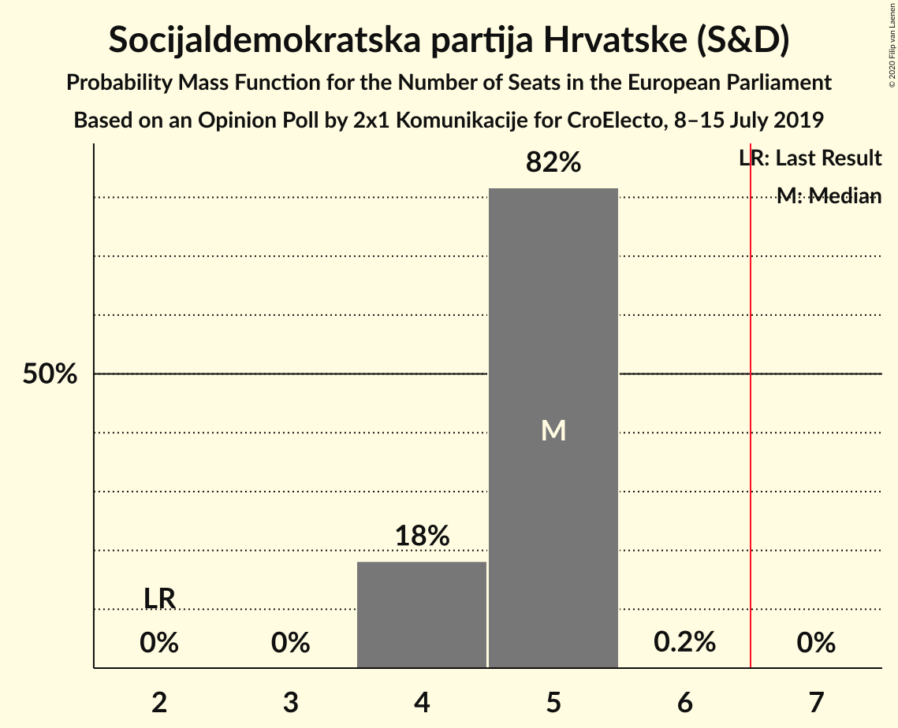

| Number of Seats | Probability | Accumulated | Special Marks |
|:---------------:|:-----------:|:-----------:|:-------------:|
| 2 | 0% | 100% | Last Result |
| 3 | 0% | 100% |  |
| 4 | 67% | 100% | Median |
| 5 | 32% | 33% |  |
| 6 | 0.7% | 0.7% |  |
| 7 | 0% | 0% | Majority |

### Hrvatska demokratska zajednica (EPP)

*For a full overview of the results for this party, see the [Hrvatska demokratska zajednica (EPP)](party-hrvatskademokratskazajednicaepp.html) page.*

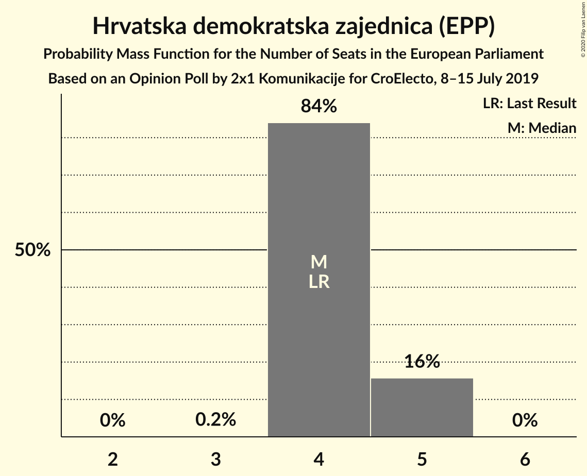

| Number of Seats | Probability | Accumulated | Special Marks |
|:---------------:|:-----------:|:-----------:|:-------------:|
| 3 | 0.6% | 100% |  |
| 4 | 64% | 99.4% | Last Result, Median |
| 5 | 35% | 35% |  |
| 6 | 0% | 0% |  |

### Nezavisna lista Mislava Kolakušića (NI)

*For a full overview of the results for this party, see the [Nezavisna lista Mislava Kolakušića (NI)](party-nezavisnalistamislavakolakušićani.html) page.*

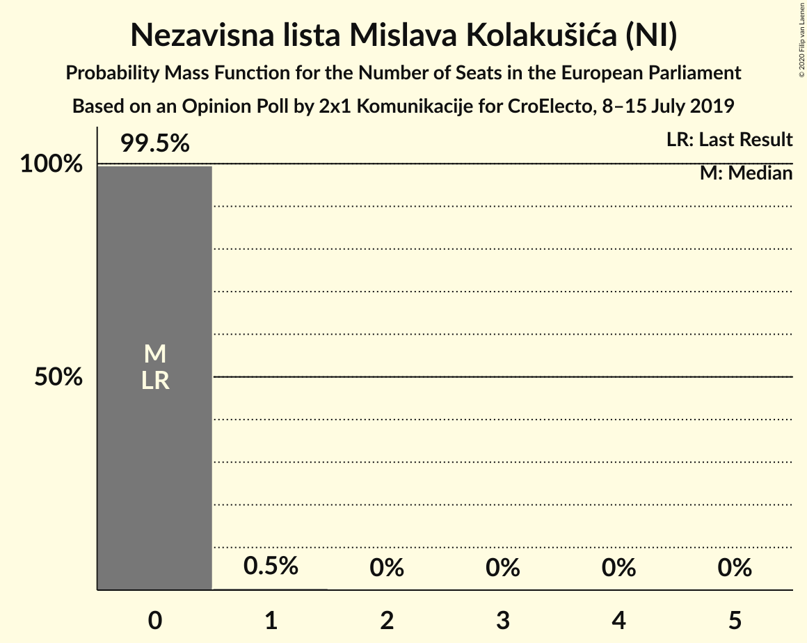

| Number of Seats | Probability | Accumulated | Special Marks |
|:---------------:|:-----------:|:-----------:|:-------------:|
| 0 | 92% | 100% | Last Result, Median |
| 1 | 8% | 8% |  |
| 2 | 0% | 0% |  |

### Živi zid (NI)

*For a full overview of the results for this party, see the [Živi zid (NI)](party-živizidni.html) page.*

| Number of Seats | Probability | Accumulated | Special Marks |
|:---------------:|:-----------:|:-----------:|:-------------:|
| 0 | 93% | 100% | Last Result, Median |
| 1 | 7% | 7% |  |
| 2 | 0% | 0% |  |

### Neovisni za Hrvatsku (ID)

*For a full overview of the results for this party, see the [Neovisni za Hrvatsku (ID)](party-neovisnizahrvatskuid.html) page.*

| Number of Seats | Probability | Accumulated | Special Marks |
|:---------------:|:-----------:|:-----------:|:-------------:|
| 0 | 100% | 100% | Last Result, Median |

### Most nezavisnih lista (ECR)

*For a full overview of the results for this party, see the [Most nezavisnih lista (ECR)](party-mostnezavisnihlistaecr.html) page.*

| Number of Seats | Probability | Accumulated | Special Marks |
|:---------------:|:-----------:|:-----------:|:-------------:|
| 0 | 99.9% | 100% | Last Result, Median |
| 1 | 0.1% | 0.1% |  |
| 2 | 0% | 0% |  |

### Istarski demokratski sabor (RE)

*For a full overview of the results for this party, see the [Istarski demokratski sabor (RE)](party-istarskidemokratskisaborre.html) page.*

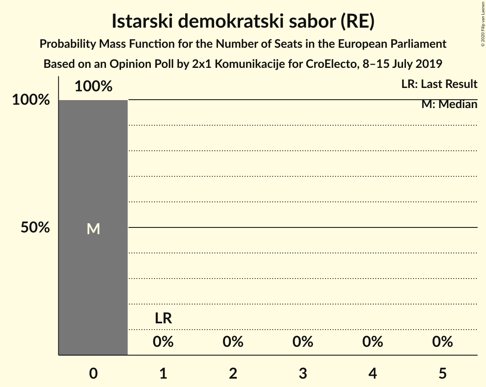

| Number of Seats | Probability | Accumulated | Special Marks |
|:---------------:|:-----------:|:-----------:|:-------------:|
| 0 | 100% | 100% | Median |
| 1 | 0% | 0% | Last Result |

### Građansko-liberalni savez (RE)

*For a full overview of the results for this party, see the [Građansko-liberalni savez (RE)](party-građansko-liberalnisavezre.html) page.*

| Number of Seats | Probability | Accumulated | Special Marks |
|:---------------:|:-----------:|:-----------:|:-------------:|
| 0 | 100% | 100% | Last Result, Median |

## Coalitions

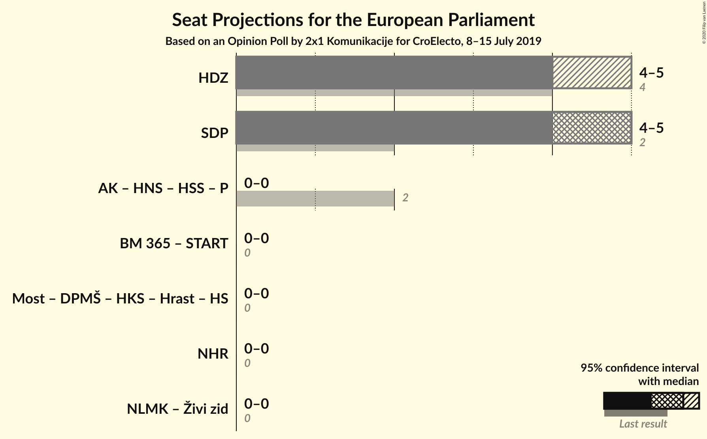

### Confidence Intervals

| Coalition | Last Result | Median | Majority? | 80% Confidence Interval | 90% Confidence Interval | 95% Confidence Interval | 99% Confidence Interval |
|:---------:|:-----------:|:------:|:---------:|:-----------------------:|:-----------------------:|:-----------------------:|:-----------------------:|
| Hrvatska demokratska zajednica (EPP) | 4 | 4 | 0% | 4–5 | 4–5 | 4–5 | 3–5 |
| Socijaldemokratska partija Hrvatske (S&D) | 2 | 4 | 0% | 4–5 | 4–5 | 4–5 | 4–6 |
| Nezavisna lista Mislava Kolakušića (NI) – Živi zid (NI) | 0 | 0 | 0% | 0–1 | 0–1 | 0–1 | 0–1 |
| Neovisni za Hrvatsku (ID) | 0 | 0 | 0% | 0 | 0 | 0 | 0 |

### Hrvatska demokratska zajednica (EPP)

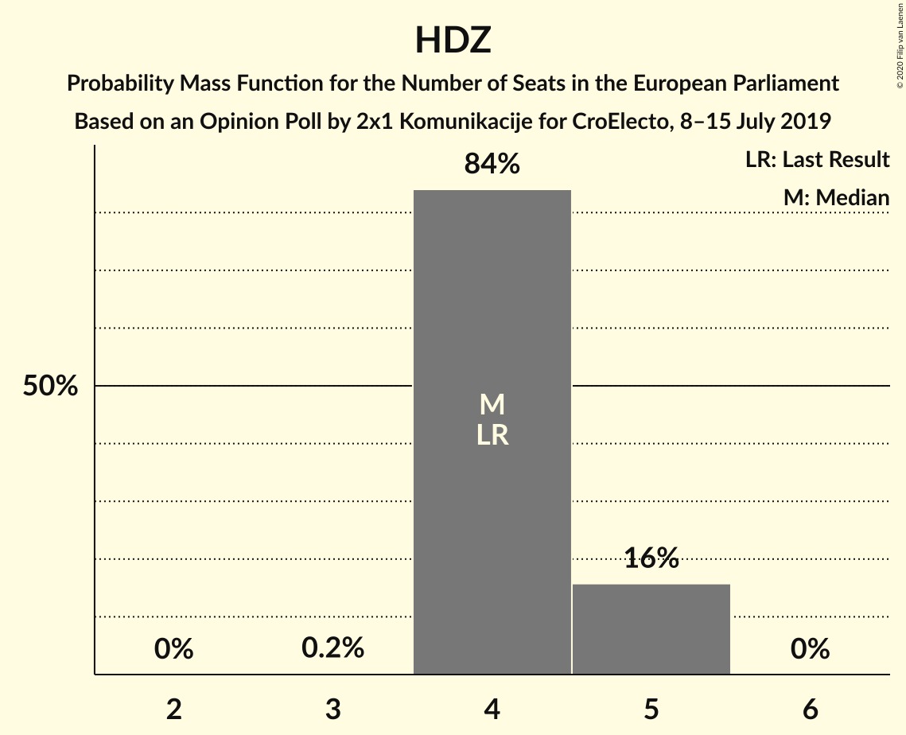

| Number of Seats | Probability | Accumulated | Special Marks |
|:---------------:|:-----------:|:-----------:|:-------------:|
| 3 | 0.6% | 100% |  |
| 4 | 64% | 99.4% | Last Result, Median |
| 5 | 35% | 35% |  |
| 6 | 0% | 0% |  |

### Socijaldemokratska partija Hrvatske (S&D)

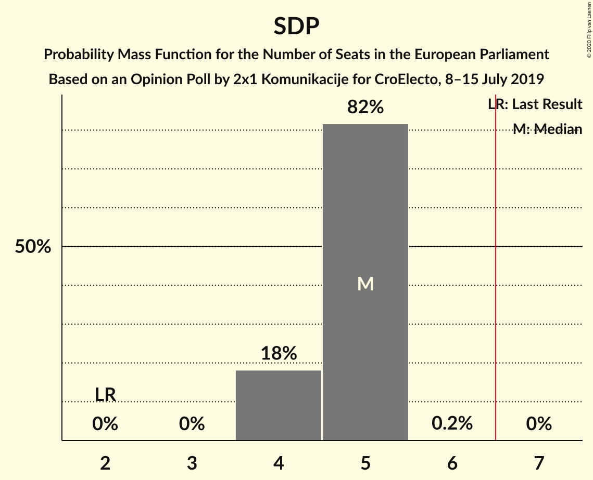

| Number of Seats | Probability | Accumulated | Special Marks |
|:---------------:|:-----------:|:-----------:|:-------------:|
| 2 | 0% | 100% | Last Result |
| 3 | 0% | 100% |  |
| 4 | 67% | 100% | Median |
| 5 | 32% | 33% |  |
| 6 | 0.7% | 0.7% |  |
| 7 | 0% | 0% | Majority |

### Nezavisna lista Mislava Kolakušića (NI) – Živi zid (NI)

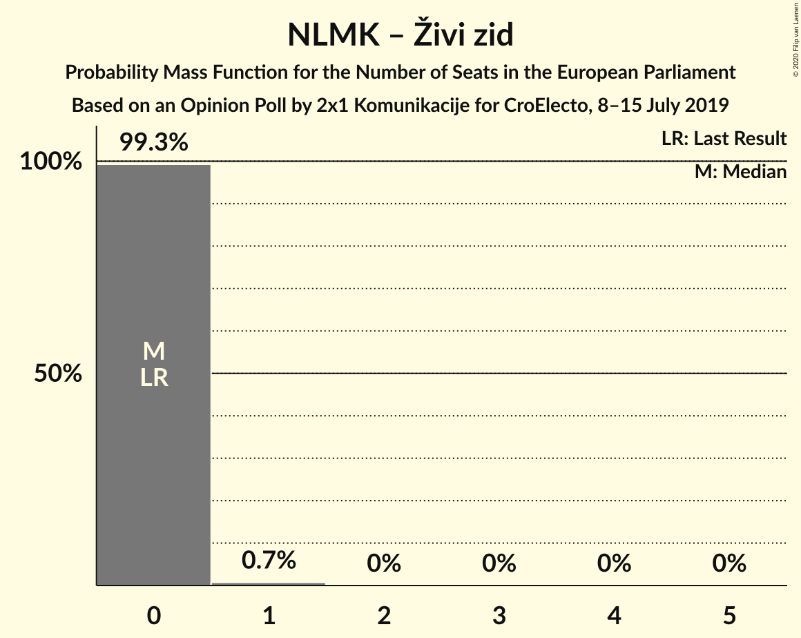

| Number of Seats | Probability | Accumulated | Special Marks |
|:---------------:|:-----------:|:-----------:|:-------------:|
| 0 | 85% | 100% | Last Result, Median |
| 1 | 15% | 15% |  |
| 2 | 0% | 0% |  |

### Neovisni za Hrvatsku (ID)

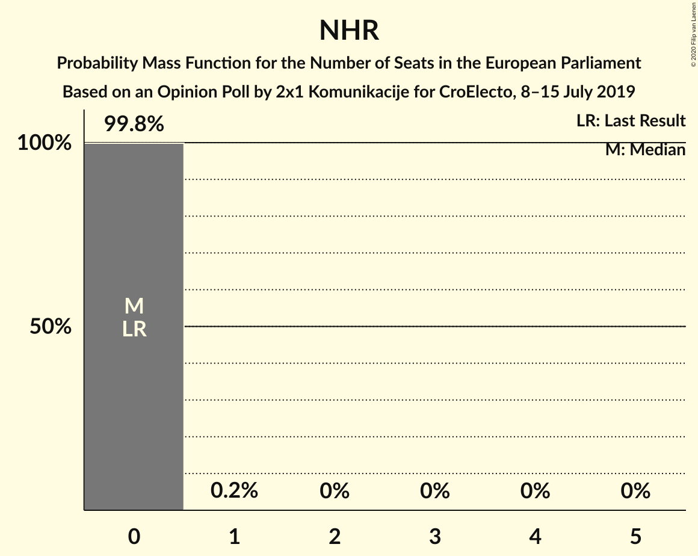

| Number of Seats | Probability | Accumulated | Special Marks |
|:---------------:|:-----------:|:-----------:|:-------------:|
| 0 | 100% | 100% | Last Result, Median |

## Technical Information

### Opinion Poll

+ **Polling firm:** 2x1 Komunikacije
+ **Commissioner(s):** CroElecto
+ **Fieldwork period:** 8–15 July 2019

### Calculations

+ **Sample size:** 753
+ **Simulations done:** 1,024
+ **Error estimate:** 3.06%

