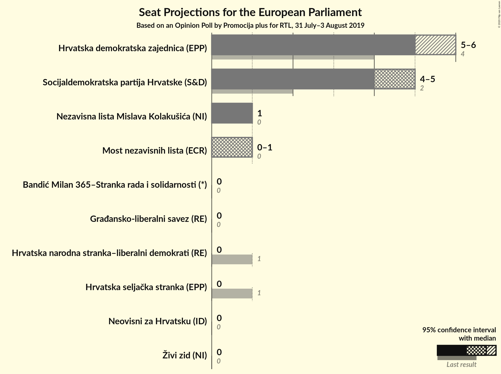

# Opinion Poll by Promocija plus for RTL, 31 July–3 August 2019

<a href="#voting-intentions">Voting Intentions</a> | <a href="#seats">Seats</a> | <a href="#coalitions">Coalitions</a> | <a href="#technical-information">Technical Information</a>

## Voting Intentions

### Confidence Intervals

| Party | Last Result | Poll Result | 80% Confidence Interval | 90% Confidence Interval | 95% Confidence Interval | 99% Confidence Interval |
|:-----:|:-----------:|:-----------:|:-----------------------:|:-----------------------:|:-----------------------:|:-----------------------:|
| Hrvatska demokratska zajednica (EPP) | 41.4% | 34.0% | 32.3–35.9% |31.8–36.4% |31.3–36.9% |30.5–37.8% |
| Socijaldemokratska partija Hrvatske (S&D) | 29.9% | 29.2% | 27.5–31.0% |27.0–31.5% |26.6–31.9% |25.8–32.8% |
| Nezavisna lista Mislava Kolakušića (NI) | 0.0% | 7.3% | 6.4–8.4% |6.1–8.7% |5.9–8.9% |5.5–9.5% |
| Most nezavisnih lista (ECR) | 0.0% | 6.0% | 5.2–7.0% |5.0–7.3% |4.8–7.6% |4.4–8.1% |
| Hrvatska seljačka stranka (EPP) | 41.4% | 4.3% | 3.7–5.2% |3.5–5.5% |3.3–5.7% |3.0–6.2% |
| Neovisni za Hrvatsku (ID) | 0.0% | 4.3% | 3.7–5.2% |3.5–5.5% |3.3–5.7% |3.0–6.2% |
| Živi zid (NI) | 0.5% | 3.2% | 2.6–4.0% |2.4–4.2% |2.3–4.4% |2.1–4.8% |
| Hrvatska narodna stranka–liberalni demokrati (RE) | 29.9% | 2.8% | 2.3–3.6% |2.1–3.8% |2.0–4.0% |1.8–4.4% |
| Bandić Milan 365–Stranka rada i solidarnosti (*) | 0.0% | 2.5% | 2.0–3.2% |1.8–3.4% |1.7–3.6% |1.5–3.9% |
| Građansko-liberalni savez (RE) | N/A | 1.8% | 1.4–2.4% |1.2–2.6% |1.1–2.7% |1.0–3.1% |

*Note:* The poll result column reflects the actual value used in the calculations. Published results may vary slightly, and in addition be rounded to fewer digits.

## Seats

### Confidence Intervals

| Party | Last Result | Median | 80% Confidence Interval | 90% Confidence Interval | 95% Confidence Interval | 99% Confidence Interval |
|:-----:|:-----------:|:------:|:-----------------------:|:-----------------------:|:-----------------------:|:-----------------------:|
| <a href="#hrvatska-demokratska-zajednica-(epp)">Hrvatska demokratska zajednica (EPP)</a> | 4 | 5 | 5–6 |5–6 |5–6 |4–6 |
| <a href="#socijaldemokratska-partija-hrvatske-(s&d)">Socijaldemokratska partija Hrvatske (S&D)</a> | 2 | 4 | 4–5 |4–5 |4–5 |4–5 |
| <a href="#nezavisna-lista-mislava-kolakušića-(ni)">Nezavisna lista Mislava Kolakušića (NI)</a> | 0 | 1 | 1 |1 |1 |0–1 |
| <a href="#most-nezavisnih-lista-(ecr)">Most nezavisnih lista (ECR)</a> | 0 | 1 | 0–1 |0–1 |0–1 |0–1 |
| <a href="#hrvatska-seljačka-stranka-(epp)">Hrvatska seljačka stranka (EPP)</a> | 1 | 0 | 0 |0 |0 |0–1 |
| <a href="#neovisni-za-hrvatsku-(id)">Neovisni za Hrvatsku (ID)</a> | 0 | 0 | 0 |0 |0 |0–1 |
| <a href="#živi-zid-(ni)">Živi zid (NI)</a> | 0 | 0 | 0 |0 |0 |0 |
| <a href="#hrvatska-narodna-stranka–liberalni-demokrati-(re)">Hrvatska narodna stranka–liberalni demokrati (RE)</a> | 1 | 0 | 0 |0 |0 |0 |
| <a href="#bandić-milan-365–stranka-rada-i-solidarnosti-(*)">Bandić Milan 365–Stranka rada i solidarnosti (*)</a> | 0 | 0 | 0 |0 |0 |0 |
| <a href="#građansko-liberalni-savez-(re)">Građansko-liberalni savez (RE)</a> | N/A | 0 | 0 |0 |0 |0 |

