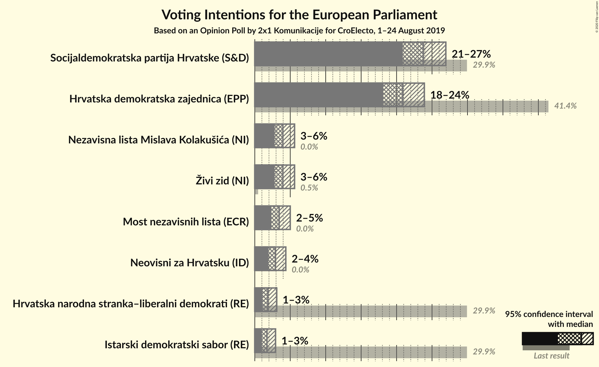
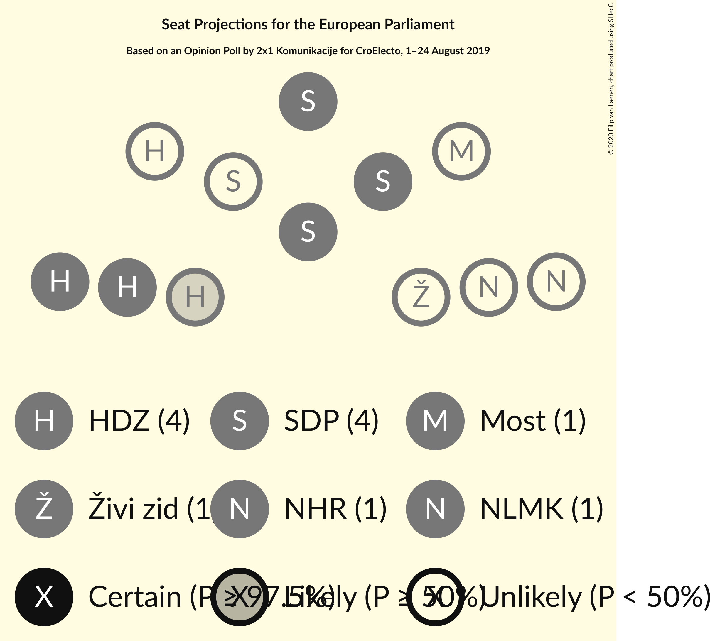
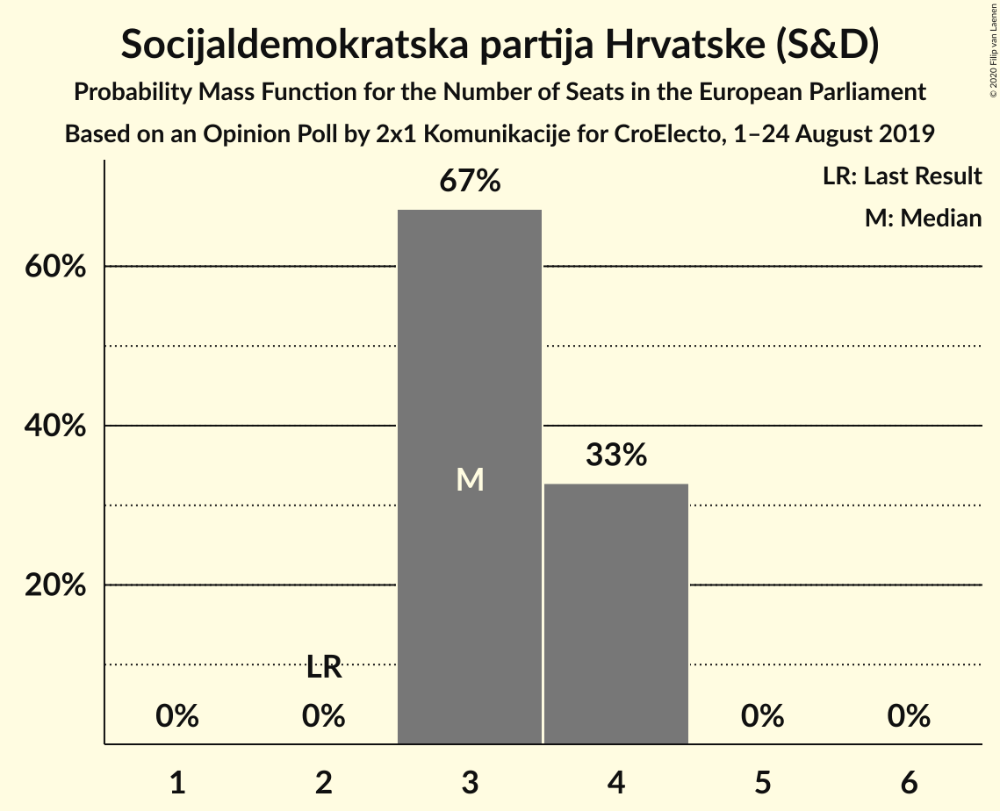
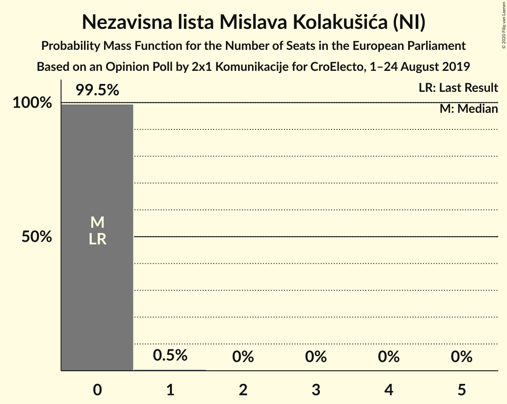
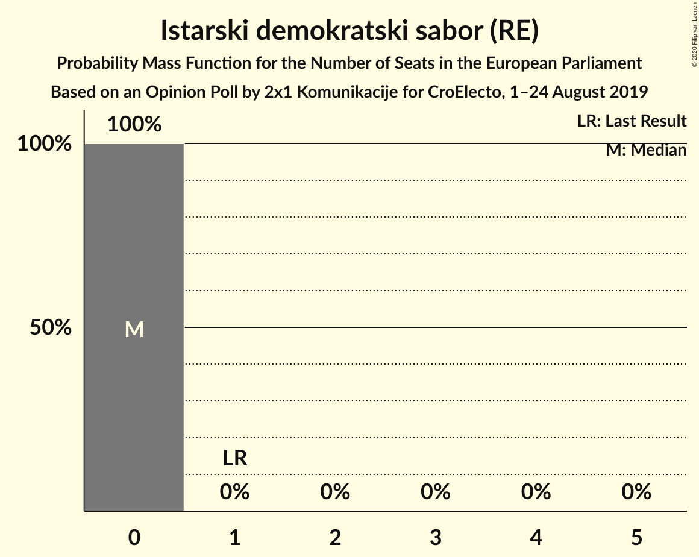
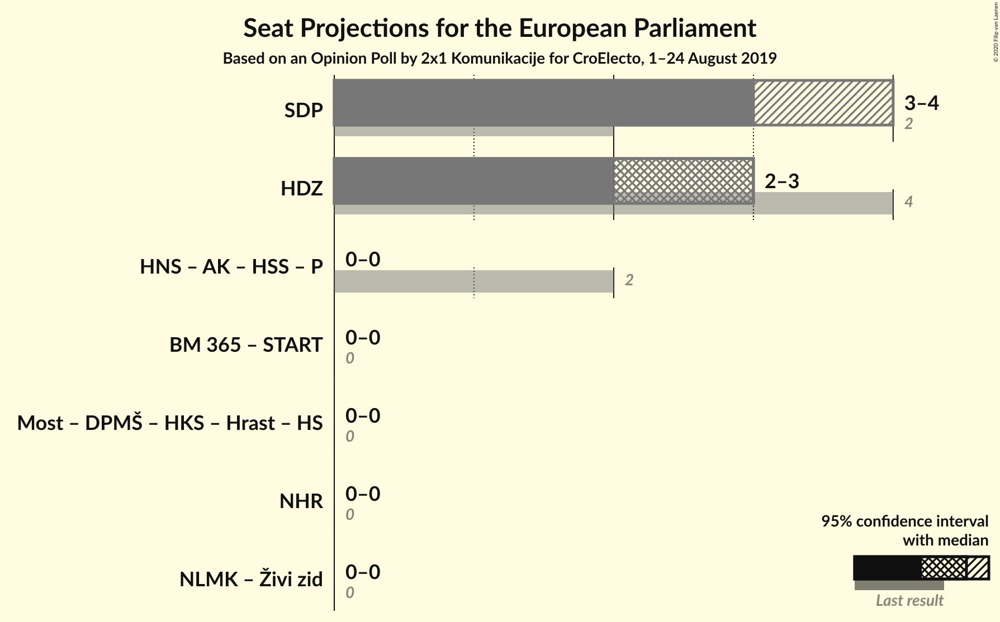
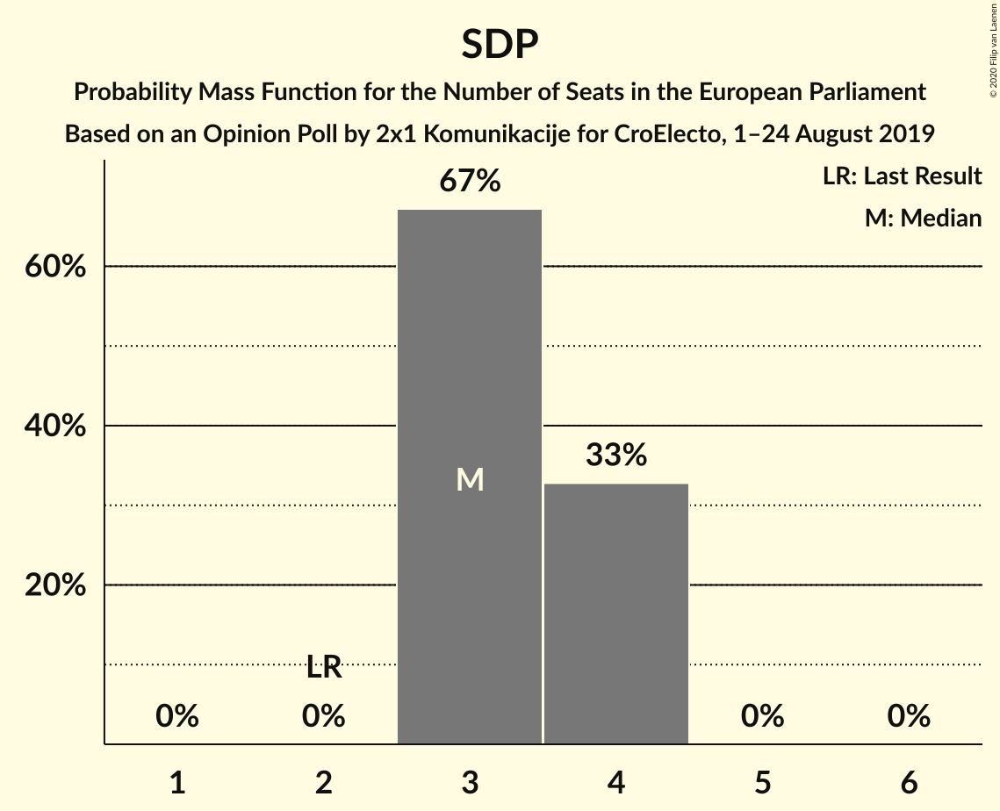
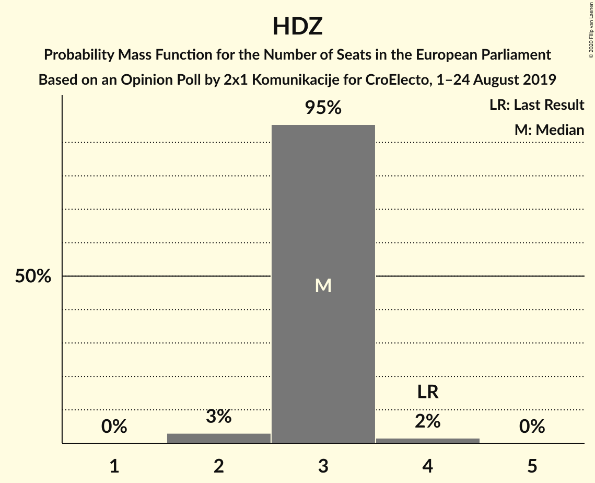
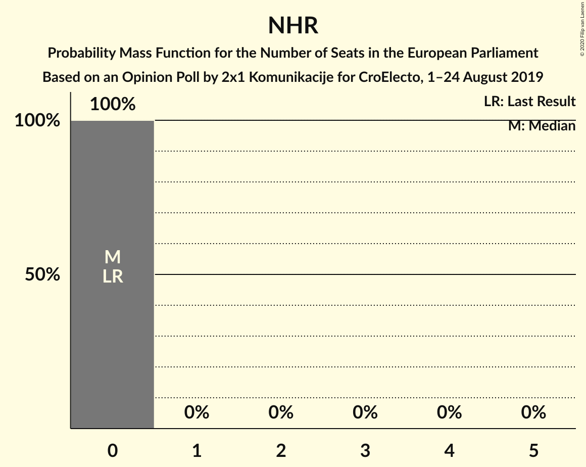
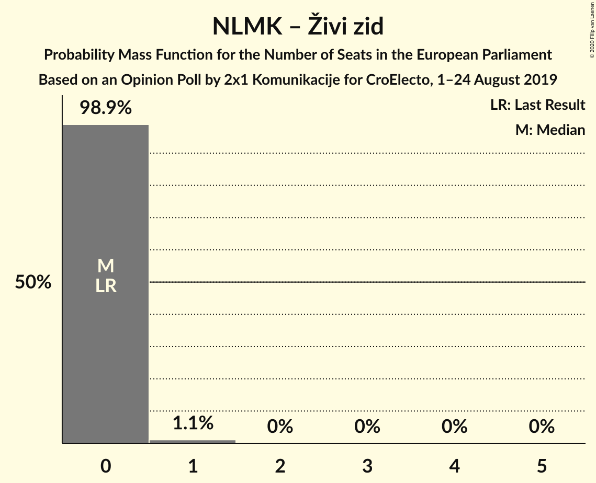

# Opinion Poll by 2x1 Komunikacije for CroElecto, 1–24 August 2019

<a href="#voting-intentions">Voting Intentions</a> | <a href="#seats">Seats</a> | <a href="#coalitions">Coalitions</a> | <a href="#technical-information">Technical Information</a>

## Voting Intentions

### Confidence Intervals

| Party | Last Result | Poll Result | 80% Confidence Interval | 90% Confidence Interval | 95% Confidence Interval | 99% Confidence Interval |
|:-----:|:-----------:|:-----------:|:-----------------------:|:-----------------------:|:-----------------------:|:-----------------------:|
| Socijaldemokratska partija Hrvatske (S&D) | 29.9% | 23.8% | 21.9–25.8% |21.3–26.4% |20.9–26.9% |20.0–28.0% |
| Hrvatska demokratska zajednica (EPP) | 41.4% | 20.9% | 19.1–22.9% |18.6–23.4% |18.1–23.9% |17.3–24.9% |
| Živi zid (NI) | 0.5% | 4.0% | 3.2–5.0% |3.0–5.3% |2.8–5.6% |2.5–6.2% |
| Nezavisna lista Mislava Kolakušića (NI) | 0.0% | 4.0% | 3.2–5.0% |3.0–5.3% |2.8–5.6% |2.5–6.2% |
| Most nezavisnih lista (ECR) | 0.0% | 3.4% | 2.7–4.5% |2.5–4.7% |2.3–5.0% |2.1–5.5% |
| Neovisni za Hrvatsku (ID) | 0.0% | 2.9% | 2.3–3.9% |2.1–4.1% |1.9–4.4% |1.7–4.9% |
| Hrvatska narodna stranka–liberalni demokrati (RE) | 29.9% | 1.8% | 1.4–2.7% |1.2–2.9% |1.1–3.1% |0.9–3.5% |
| Istarski demokratski sabor (RE) | 29.9% | 1.7% | 1.2–2.5% |1.1–2.7% |1.0–2.9% |0.8–3.3% |

*Note:* The poll result column reflects the actual value used in the calculations. Published results may vary slightly, and in addition be rounded to fewer digits.

## Seats

### Confidence Intervals

| Party | Last Result | Median | 80% Confidence Interval | 90% Confidence Interval | 95% Confidence Interval | 99% Confidence Interval |
|:-----:|:-----------:|:------:|:-----------------------:|:-----------------------:|:-----------------------:|:-----------------------:|
| <a href="#socijaldemokratska-partija-hrvatske-(s&d)">Socijaldemokratska partija Hrvatske (S&D)</a> | 2 | 3 | 3 |3 |3–4 |3–4 |
| <a href="#hrvatska-demokratska-zajednica-(epp)">Hrvatska demokratska zajednica (EPP)</a> | 4 | 3 | 2–3 |2–3 |2–3 |2–3 |
| <a href="#živi-zid-(ni)">Živi zid (NI)</a> | 0 | 0 | 0 |0 |0 |0 |
| <a href="#nezavisna-lista-mislava-kolakušića-(ni)">Nezavisna lista Mislava Kolakušića (NI)</a> | 0 | 0 | 0 |0 |0 |0 |
| <a href="#most-nezavisnih-lista-(ecr)">Most nezavisnih lista (ECR)</a> | 0 | 0 | 0 |0 |0 |0 |
| <a href="#neovisni-za-hrvatsku-(id)">Neovisni za Hrvatsku (ID)</a> | 0 | 0 | 0 |0 |0 |0 |
| <a href="#hrvatska-narodna-stranka–liberalni-demokrati-(re)">Hrvatska narodna stranka–liberalni demokrati (RE)</a> | 1 | 0 | 0 |0 |0 |0 |
| <a href="#istarski-demokratski-sabor-(re)">Istarski demokratski sabor (RE)</a> | 1 | 0 | 0 |0 |0 |0 |

### Socijaldemokratska partija Hrvatske (S&D)

*For a full overview of the results for this party, see the [Socijaldemokratska partija Hrvatske (S&D)](party-socijaldemokratskapartijahrvatskesd.html) page.*

| Number of Seats | Probability | Accumulated | Special Marks |
|:---------------:|:-----------:|:-----------:|:-------------:|
| 2 | 0.4% | 100% | Last Result |
| 3 | 96% | 99.6% | Median |
| 4 | 4% | 4% |  |
| 5 | 0% | 0% |  |

### Hrvatska demokratska zajednica (EPP)

*For a full overview of the results for this party, see the [Hrvatska demokratska zajednica (EPP)](party-hrvatskademokratskazajednicaepp.html) page.*

| Number of Seats | Probability | Accumulated | Special Marks |
|:---------------:|:-----------:|:-----------:|:-------------:|
| 2 | 14% | 100% |  |
| 3 | 86% | 86% | Median |
| 4 | 0% | 0% | Last Result |

### Živi zid (NI)

*For a full overview of the results for this party, see the [Živi zid (NI)](party-živizidni.html) page.*

| Number of Seats | Probability | Accumulated | Special Marks |
|:---------------:|:-----------:|:-----------:|:-------------:|
| 0 | 99.9% | 100% | Last Result, Median |
| 1 | 0.1% | 0.1% |  |
| 2 | 0% | 0% |  |

### Nezavisna lista Mislava Kolakušića (NI)

*For a full overview of the results for this party, see the [Nezavisna lista Mislava Kolakušića (NI)](party-nezavisnalistamislavakolakušićani.html) page.*

| Number of Seats | Probability | Accumulated | Special Marks |
|:---------------:|:-----------:|:-----------:|:-------------:|
| 0 | 99.9% | 100% | Last Result, Median |
| 1 | 0.1% | 0.1% |  |
| 2 | 0% | 0% |  |

### Most nezavisnih lista (ECR)

*For a full overview of the results for this party, see the [Most nezavisnih lista (ECR)](party-mostnezavisnihlistaecr.html) page.*

| Number of Seats | Probability | Accumulated | Special Marks |
|:---------------:|:-----------:|:-----------:|:-------------:|
| 0 | 100% | 100% | Last Result, Median |

### Neovisni za Hrvatsku (ID)

*For a full overview of the results for this party, see the [Neovisni za Hrvatsku (ID)](party-neovisnizahrvatskuid.html) page.*

| Number of Seats | Probability | Accumulated | Special Marks |
|:---------------:|:-----------:|:-----------:|:-------------:|
| 0 | 100% | 100% | Last Result, Median |

### Hrvatska narodna stranka–liberalni demokrati (RE)

*For a full overview of the results for this party, see the [Hrvatska narodna stranka–liberalni demokrati (RE)](party-hrvatskanarodnastranka–liberalnidemokratire.html) page.*

| Number of Seats | Probability | Accumulated | Special Marks |
|:---------------:|:-----------:|:-----------:|:-------------:|
| 0 | 100% | 100% | Median |
| 1 | 0% | 0% | Last Result |

### Istarski demokratski sabor (RE)

*For a full overview of the results for this party, see the [Istarski demokratski sabor (RE)](party-istarskidemokratskisaborre.html) page.*

| Number of Seats | Probability | Accumulated | Special Marks |
|:---------------:|:-----------:|:-----------:|:-------------:|
| 0 | 100% | 100% | Median |
| 1 | 0% | 0% | Last Result |

## Coalitions

### Confidence Intervals

| Coalition | Last Result | Median | Majority? | 80% Confidence Interval | 90% Confidence Interval | 95% Confidence Interval | 99% Confidence Interval |
|:---------:|:-----------:|:------:|:---------:|:-----------------------:|:-----------------------:|:-----------------------:|:-----------------------:|
| Socijaldemokratska partija Hrvatske (S&D) | 2 | 3 | 0% | 3 | 3 | 3–4 | 3–4 |
| Hrvatska demokratska zajednica (EPP) | 4 | 3 | 0% | 2–3 | 2–3 | 2–3 | 2–3 |
| Neovisni za Hrvatsku (ID) | 0 | 0 | 0% | 0 | 0 | 0 | 0 |
| Nezavisna lista Mislava Kolakušića (NI) – Živi zid (NI) | 0 | 0 | 0% | 0 | 0 | 0 | 0 |

### Socijaldemokratska partija Hrvatske (S&D)

| Number of Seats | Probability | Accumulated | Special Marks |
|:---------------:|:-----------:|:-----------:|:-------------:|
| 2 | 0.4% | 100% | Last Result |
| 3 | 96% | 99.6% | Median |
| 4 | 4% | 4% |  |
| 5 | 0% | 0% |  |

### Hrvatska demokratska zajednica (EPP)

| Number of Seats | Probability | Accumulated | Special Marks |
|:---------------:|:-----------:|:-----------:|:-------------:|
| 2 | 14% | 100% |  |
| 3 | 86% | 86% | Median |
| 4 | 0% | 0% | Last Result |

### Neovisni za Hrvatsku (ID)

| Number of Seats | Probability | Accumulated | Special Marks |
|:---------------:|:-----------:|:-----------:|:-------------:|
| 0 | 100% | 100% | Last Result, Median |

### Nezavisna lista Mislava Kolakušića (NI) – Živi zid (NI)

| Number of Seats | Probability | Accumulated | Special Marks |
|:---------------:|:-----------:|:-----------:|:-------------:|
| 0 | 99.8% | 100% | Last Result, Median |
| 1 | 0.2% | 0.2% |  |
| 2 | 0% | 0% |  |

## Technical Information

### Opinion Poll

+ **Polling firm:** 2x1 Komunikacije
+ **Commissioner(s):** CroElecto
+ **Fieldwork period:** 1–24 August 2019

### Calculations

+ **Sample size:** 757
+ **Simulations done:** 1,048,576
+ **Error estimate:** 0.88%

