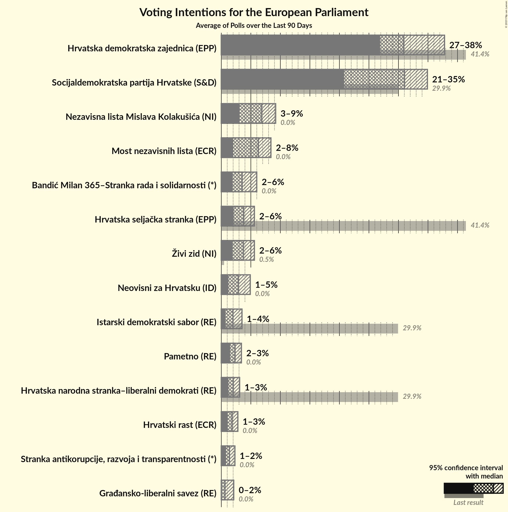

# Poll Average

<a href="#voting-intentions">Voting Intentions</a> | <a href="#seats">Seats</a> | <a href="#coalitions">Coalitions</a> | <a href="#technical-information">Technical Information</a>

## Summary

The table below lists the polls on which the average is based. They are the most recent polls (less than 90 days old) registered and analyzed so far.

| Period     | Polling firm/Commissioner(s) | HDZ | HSS | SDP | HNS | IDS | Živi zid | P | BM 365 | Most | NLMK | Hrast | AK | NHR | START | HKS |
|:----------:|:----------------------------:|:--:|:--:|:--:|:--:|:--:|:--:|:--:|:--:|:--:|:--:|:--:|:--:|:--:|:--:|:--:|
| 26 May 2019 | General Election | 41.4%   4 | 41.4%   1 | 29.9%   2 | 29.9%   1 | 29.9%   1 | 0.5%   0 | 0.0%   0 | 0.0%   0 | 0.0%   0 | 0.0%   0 | 0.0%   0 | 0.0%   0 | 0.0%   0 | 0.0%   0 | 0.0%   0 |
| N/A | Poll Average | 27–33%   4–5 | 2–4%   0 | 21–35%   3–5 | 1–3%   0 | 1–4%   0 | 2–6%   0 | 2–3%   0 | 4–6%   0–1 | 2–8%   0–1 | 3–8%   0–1 | 1–3%   0 | N/A   N/A | 1–5%   0 | 1–2%   0 | N/A   N/A |
| [1–23 September 2019](2019-09-23-Promocijaplus.html) | Promocija plus   HRT | 29–34%   4–5 | 3–5%   0 | 26–30%   3–4 | N/A   N/A | N/A   N/A | 2–3%   0 | N/A   N/A | N/A   N/A | 5–7%   0–1 | 6–8%   0–1 | N/A   N/A | N/A   N/A | 2–4%   0 | N/A   N/A | N/A   N/A |
| [1–20 September 2019](2019-09-20-IPSOSPLUS.html) | IPSOS PLUS   Dnevnik | 27–33%   4–5 | 2–4%   0 | 20–25%   3–4 | 1–3%   0 | 2–4%   0 | 3–6%   0–1 | 1–3%   0 | 4–6%   0–1 | 5–8%   0–1 | 5–9%   0–1 | 1–3%   0 | N/A   N/A | 1–3%   0 | 1–2%   0 | N/A   N/A |
| [8–15 July 2019](2019-07-15-2x1Komunikacije.html) | 2x1 Komunikacije   CroElecto | 26–33%   3–4 | N/A   N/A | 29–36%   4–5 | N/A   N/A | 1–2%   0 | 3–5%   0 | N/A   N/A | N/A   N/A | 2–4%   0 | 3–6%   0 | N/A   N/A | N/A   N/A | 3–5%   0 | N/A   N/A | N/A   N/A |
| 26 May 2019 | General Election | 41.4%   4 | 41.4%   1 | 29.9%   2 | 29.9%   1 | 29.9%   1 | 0.5%   0 | 0.0%   0 | 0.0%   0 | 0.0%   0 | 0.0%   0 | 0.0%   0 | 0.0%   0 | 0.0%   0 | 0.0%   0 | 0.0%   0 |

Only polls for which at least the sample size has been published are included in the table above.

**Legend:**
+ **Top half of each row:** Voting intentions (95% confidence interval)
+ **Bottom half of each row:** Seat projections for the European Parliament (95% confidence interval)
+ **HDZ:** Hrvatska demokratska zajednica (EPP)
+ **HSS:** Hrvatska seljačka stranka (EPP)
+ **SDP:** Socijaldemokratska partija Hrvatske (S&D)
+ **HNS:** Hrvatska narodna stranka–liberalni demokrati (RE)
+ **IDS:** Istarski demokratski sabor (RE)
+ **Živi zid:** Živi zid (NI)
+ **P:** Pametno (RE)
+ **BM 365:** Bandić Milan 365–Stranka rada i solidarnosti (*)
+ **Most:** Most nezavisnih lista (ECR)
+ **NLMK:** Nezavisna lista Mislava Kolakušića (NI)
+ **Hrast:** Hrvatski rast (ECR)
+ **AK:** Amsterdamska koalicija (RE)
+ **NHR:** Neovisni za Hrvatsku (ID)
+ **START:** Stranka antikorupcije, razvoja i transparentnosti (*)
+ **HKS:** Hrvatska konzervativna stranka (ECR)
+ **N/A (single party):** Party not included the published results
+ **N/A (entire row):** Calculation for this opinion poll not started yet

## Voting Intentions

### Confidence Intervals

| Party | Last Result | Median | 80% Confidence Interval | 90% Confidence Interval | 95% Confidence Interval | 99% Confidence Interval |
|:-----:|:-----------:|:------:|:-----------------------:|:-----------------------:|:-----------------------:|:-----------------------:|
| <a href="#hrvatska-demokratska-zajednica-(epp)">Hrvatska demokratska zajednica (EPP)</a> | 41.4% | 30.4% | 28.1–32.4% |27.5–32.9% | 26.9–33.4% | 25.8–34.3% |
| <a href="#hrvatska-seljačka-stranka-(epp)">Hrvatska seljačka stranka (EPP)</a> | 41.4% | 3.3% | 2.5–4.0% |2.3–4.3% | 2.1–4.5% | 1.8–4.8% |
| <a href="#socijaldemokratska-partija-hrvatske-(s&d)">Socijaldemokratska partija Hrvatske (S&D)</a> | 29.9% | 28.1% | 21.9–33.2% |21.3–34.1% | 20.8–34.8% | 19.8–36.1% |
| <a href="#hrvatska-narodna-stranka–liberalni-demokrati-(re)">Hrvatska narodna stranka–liberalni demokrati (RE)</a> | 29.9% | 1.8% | 1.3–2.4% |1.2–2.6% | 1.1–2.8% | 0.9–3.1% |
| <a href="#istarski-demokratski-sabor-(re)">Istarski demokratski sabor (RE)</a> | 29.9% | 2.0% | 1.0–3.1% |0.8–3.3% | 0.7–3.5% | 0.6–4.0% |
| <a href="#živi-zid-(ni)">Živi zid (NI)</a> | 0.5% | 3.7% | 2.3–5.0% |2.1–5.3% | 2.0–5.6% | 1.7–6.1% |
| <a href="#pametno-(re)">Pametno (RE)</a> | 0.0% | 2.3% | 1.7–3.0% |1.6–3.2% | 1.5–3.4% | 1.3–3.8% |
| <a href="#bandić-milan-365–stranka-rada-i-solidarnosti-(*)">Bandić Milan 365–Stranka rada i solidarnosti (*)</a> | 0.0% | 4.8% | 3.9–5.7% |3.7–6.0% | 3.5–6.2% | 3.2–6.7% |
| <a href="#most-nezavisnih-lista-(ecr)">Most nezavisnih lista (ECR)</a> | 0.0% | 5.6% | 2.4–6.9% |2.2–7.3% | 2.0–7.6% | 1.6–8.2% |
| <a href="#nezavisna-lista-mislava-kolakušića-(ni)">Nezavisna lista Mislava Kolakušića (NI)</a> | 0.0% | 6.3% | 3.7–7.6% |3.4–8.0% | 3.1–8.3% | 2.7–8.9% |
| <a href="#hrvatski-rast-(ecr)">Hrvatski rast (ECR)</a> | 0.0% | 1.8% | 1.3–2.4% |1.2–2.6% | 1.1–2.8% | 0.9–3.1% |
| <a href="#amsterdamska-koalicija-(re)">Amsterdamska koalicija (RE)</a> | 0.0% | N/A | N/A |N/A | N/A | N/A |
| <a href="#neovisni-za-hrvatsku-(id)">Neovisni za Hrvatsku (ID)</a> | 0.0% | 2.7% | 1.5–4.2% |1.3–4.6% | 1.2–4.9% | 1.0–5.5% |
| <a href="#stranka-antikorupcije,-razvoja-i-transparentnosti-(*)">Stranka antikorupcije, razvoja i transparentnosti (*)</a> | 0.0% | 1.4% | 1.0–1.9% |0.9–2.1% | 0.8–2.3% | 0.6–2.6% |
| <a href="#hrvatska-konzervativna-stranka-(ecr)">Hrvatska konzervativna stranka (ECR)</a> | 0.0% | N/A | N/A |N/A | N/A | N/A |

