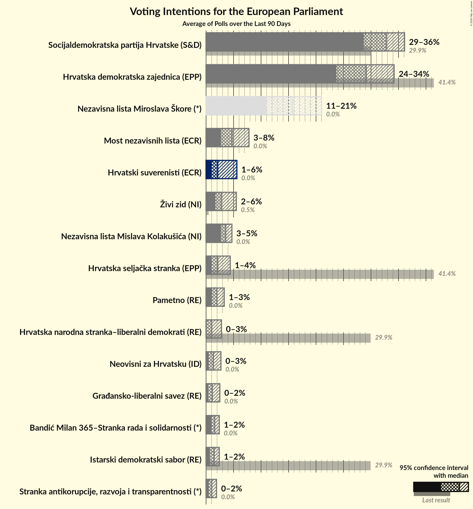

# Poll Average

<a href="#voting-intentions">Voting Intentions</a> | <a href="#seats">Seats</a> | <a href="#coalitions">Coalitions</a> | <a href="#technical-information">Technical Information</a>

## Summary

The table below lists the polls on which the average is based. They are the most recent polls (less than 90 days old) registered and analyzed so far.

| Period     | Polling firm/Commissioner(s) | HDZ | HSS | SDP | HNS | IDS | Živi zid | P | BM 365 | Most | NLMK | Hrast | HS | NLMŠ | AK | NHR | START | HKS | GLAS |
|:----------:|:----------------------------:|:--:|:--:|:--:|:--:|:--:|:--:|:--:|:--:|:--:|:--:|:--:|:--:|:--:|:--:|:--:|:--:|:--:|:--:|
| 26 May 2019 | General Election | 41.4%   4 | 41.4%   1 | 29.9%   2 | 29.9%   1 | 29.9%   1 | 0.5%   0 | 0.0%   0 | 0.0%   0 | 0.0%   0 | 0.0%   0 | 0.0%   0 | 0.0%   0 | 0.0%   0 | 0.0%   0 | 0.0%   0 | 0.0%   0 | 0.0%   0 | 0.0%   0 |
| N/A | Poll Average | 24–34%   3–5 | 1–4%   0 | 29–36%   4–6 | 0–3%   0 | 1–2%   0 | 2–6%   0 | 1–3%   0 | 1–2%   0 | 3–8%   0–1 | 3–5%   0 | N/A   N/A | N/A   N/A | N/A   N/A | N/A   N/A | 0–3%   0 | 0–2%   0 | N/A   N/A | 0–2%   0 |
| [21–22 January 2020](2020-01-22-IPSOSPULS.html) | IPSOS PULS   Dnevnik | 26–32%   4 | 1–2%   0 | 28–34%   4–5 | 0–1%   0 | 1–2%   0 | 1–3%   0 | 2–4%   0 | N/A   N/A | 2–5%   0 | N/A   N/A | N/A   N/A | N/A   N/A | N/A   N/A | N/A   N/A | N/A   N/A | 1–2%   0 | N/A   N/A | 1–3%   0 |
| [9–16 January 2020](2020-01-16-2x1Komunikacije.html) | 2x1 Komunikacije   CroElecto | 23–28%   3–4 | 1–3%   0 | 31–37%   4–5 | N/A   N/A | 1–3%   0 | 3–6%   0 | N/A   N/A | N/A   N/A | 4–6%   0 | N/A   N/A | N/A   N/A | N/A   N/A | N/A   N/A | N/A   N/A | 1–3%   0 | N/A   N/A | N/A   N/A | N/A   N/A |
| [7–11 January 2020](2020-01-11-Promocijaplus.html) | Promocija plus   HRT | 30–35%   5 | 3–5%   0 | 31–36%   5–6 | 1–3%   0 | 1–2%   0 | 2–4%   0 | 1–2%   0 | 1–2%   0 | 5–8%   0–1 | 3–5%   0 | N/A   N/A | N/A   N/A | N/A   N/A | N/A   N/A | 0–2%   0 | 0–2%   0 | N/A   N/A | 0–1%   0 |
| 26 May 2019 | General Election | 41.4%   4 | 41.4%   1 | 29.9%   2 | 29.9%   1 | 29.9%   1 | 0.5%   0 | 0.0%   0 | 0.0%   0 | 0.0%   0 | 0.0%   0 | 0.0%   0 | 0.0%   0 | 0.0%   0 | 0.0%   0 | 0.0%   0 | 0.0%   0 | 0.0%   0 | 0.0%   0 |

Only polls for which at least the sample size has been published are included in the table above.

**Legend:**
+ **Top half of each row:** Voting intentions (95% confidence interval)
+ **Bottom half of each row:** Seat projections for the European Parliament (95% confidence interval)
+ **HDZ:** Hrvatska demokratska zajednica (EPP)
+ **HSS:** Hrvatska seljačka stranka (EPP)
+ **SDP:** Socijaldemokratska partija Hrvatske (S&D)
+ **HNS:** Hrvatska narodna stranka–liberalni demokrati (RE)
+ **IDS:** Istarski demokratski sabor (RE)
+ **Živi zid:** Živi zid (NI)
+ **P:** Pametno (RE)
+ **BM 365:** Bandić Milan 365–Stranka rada i solidarnosti (*)
+ **Most:** Most nezavisnih lista (ECR)
+ **NLMK:** Nezavisna lista Mislava Kolakušića (NI)
+ **Hrast:** Hrvatski rast (ECR)
+ **HS:** Hrvatski suverenisti
+ **NLMŠ:** Nezavisna lista Miroslava Škore
+ **AK:** Amsterdamska koalicija (RE)
+ **NHR:** Neovisni za Hrvatsku (ID)
+ **START:** Stranka antikorupcije, razvoja i transparentnosti (*)
+ **HKS:** Hrvatska konzervativna stranka (ECR)
+ **GLAS:** Građansko-liberalni savez (RE)
+ **N/A (single party):** Party not included the published results
+ **N/A (entire row):** Calculation for this opinion poll not started yet

## Voting Intentions

### Confidence Intervals

| Party | Last Result | Median | 80% Confidence Interval | 90% Confidence Interval | 95% Confidence Interval | 99% Confidence Interval |
|:-----:|:-----------:|:------:|:-----------------------:|:-----------------------:|:-----------------------:|:-----------------------:|
| <a href="#hrvatska-demokratska-zajednica-(epp)">Hrvatska demokratska zajednica (EPP)</a> | 41.4% | 29.1% | 25.0–33.0% |24.3–33.7% | 23.7–34.2% | 22.8–35.2% |
| <a href="#hrvatska-seljačka-stranka-(epp)">Hrvatska seljačka stranka (EPP)</a> | 41.4% | 2.1% | 1.3–3.9% |1.1–4.1% | 1.0–4.4% | 0.8–4.8% |
| <a href="#socijaldemokratska-partija-hrvatske-(s&d)">Socijaldemokratska partija Hrvatske (S&D)</a> | 29.9% | 32.8% | 30.0–35.0% |29.3–35.6% | 28.7–36.1% | 27.7–37.0% |
| <a href="#hrvatska-narodna-stranka–liberalni-demokrati-(re)">Hrvatska narodna stranka–liberalni demokrati (RE)</a> | 29.9% | 1.0% | 0.1–2.5% |0.1–2.7% | 0.0–2.8% | 0.0–3.2% |
| <a href="#istarski-demokratski-sabor-(re)">Istarski demokratski sabor (RE)</a> | 29.9% | 1.5% | 0.9–2.0% |0.8–2.2% | 0.7–2.4% | 0.5–2.7% |
| <a href="#živi-zid-(ni)">Živi zid (NI)</a> | 0.5% | 2.8% | 2.0–4.8% |1.8–5.2% | 1.7–5.5% | 1.4–6.0% |
| <a href="#pametno-(re)">Pametno (RE)</a> | 0.0% | 2.0% | 1.3–2.9% |1.2–3.1% | 1.1–3.3% | 0.9–3.7% |
| <a href="#bandić-milan-365–stranka-rada-i-solidarnosti-(*)">Bandić Milan 365–Stranka rada i solidarnosti (*)</a> | 0.0% | 1.6% | 1.2–2.1% |1.1–2.2% | 1.0–2.4% | 0.9–2.6% |
| <a href="#most-nezavisnih-lista-(ecr)">Most nezavisnih lista (ECR)</a> | 0.0% | 4.7% | 3.1–7.1% |2.9–7.5% | 2.7–7.8% | 2.3–8.3% |
| <a href="#nezavisna-lista-mislava-kolakušića-(ni)">Nezavisna lista Mislava Kolakušića (NI)</a> | 0.0% | 3.6% | 3.0–4.3% |2.8–4.5% | 2.7–4.7% | 2.4–5.1% |
| <a href="#hrvatski-rast-(ecr)">Hrvatski rast (ECR)</a> | 0.0% | N/A | N/A |N/A | N/A | N/A |
| <a href="#hrvatski-suverenisti">Hrvatski suverenisti</a> | 0.0% | N/A | N/A |N/A | N/A | N/A |
| <a href="#nezavisna-lista-miroslava-škore">Nezavisna lista Miroslava Škore</a> | 0.0% | N/A | N/A |N/A | N/A | N/A |
| <a href="#amsterdamska-koalicija-(re)">Amsterdamska koalicija (RE)</a> | 0.0% | N/A | N/A |N/A | N/A | N/A |
| <a href="#neovisni-za-hrvatsku-(id)">Neovisni za Hrvatsku (ID)</a> | 0.0% | 1.3% | 0.7–2.3% |0.6–2.5% | 0.5–2.7% | 0.4–3.1% |
| <a href="#stranka-antikorupcije,-razvoja-i-transparentnosti-(*)">Stranka antikorupcije, razvoja i transparentnosti (*)</a> | 0.0% | 1.0% | 0.7–1.5% |0.6–1.7% | 0.5–1.9% | 0.4–2.2% |
| <a href="#hrvatska-konzervativna-stranka-(ecr)">Hrvatska konzervativna stranka (ECR)</a> | 0.0% | N/A | N/A |N/A | N/A | N/A |
| <a href="#građansko-liberalni-savez-(re)">Građansko-liberalni savez (RE)</a> | 0.0% | 1.1% | 0.5–2.1% |0.4–2.3% | 0.4–2.5% | 0.3–2.8% |

