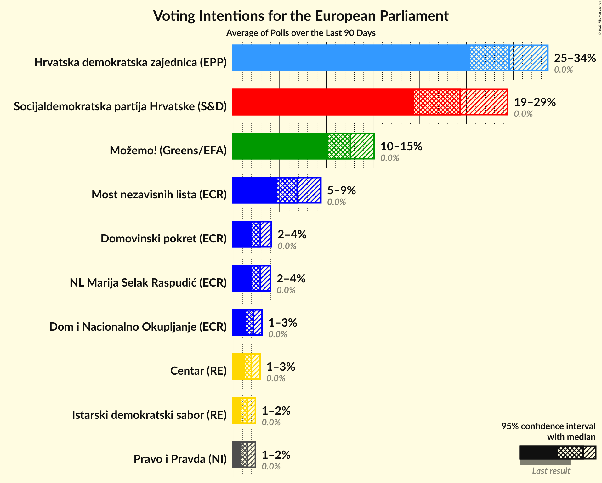

# Overview

The table below lists the most recent polls (less than 90 days old) registered and analyzed so far.

| Period     | Polling firm/Commissioner(s) | HDZ | HSS | SDP | HNS | IDS | Živi zid | P | BM 365 | Most | AK | NHR | START |
|:----------:|:----------------------------:|:--:|:--:|:--:|:--:|:--:|:--:|:--:|:--:|:--:|:--:|:--:|:--:|
| 25 May 2014 | General Election | 41.4%   4 | 41.4%   1 | 29.9%   2 | 29.9%   1 | 29.9%   1 | 0.5%   0 | 0.0%   0 | 0.0%   0 | 0.0%   0 | 0.0%   0 | 0.0%   0 | 0.0%   0 |
| N/A | [Poll Average](average.html) | 28–34%   4–6 | N/A   N/A | 13–20%   2–3 | 1–3%   0 | N/A   N/A | 11–15%   1–2 | 1–3%   0 | 2–6%   0 | 5–9%   0–1 | 6–11%   1–2 | 2–5%   0 | 4–7%   0–1 |
| [1–20 February 2019](2019-02-20-IPSOSPULS.html) | IPSOS PULS   Nova TV | 27–33%   4–5 | N/A   N/A | 12–17%   2 | 1–3%   0 | N/A   N/A | 11–15%   1–2 | 1–3%   0 | 3–6%   0 | 5–8%   0–1 | 6–9%   0–1 | 1–3%   0 | 5–8%   0–1 |
| [31 January–4 February 2019](2019-02-04-Promocijaplus.html) | Promocija plus   HRT | 29–35%   4–6 | N/A   N/A | 16–20%   2–3 | 1–3%   0 | N/A   N/A | 11–14%   1–2 | 1–3%   0 | 2–3%   0 | 6–9%   1 | 8–12%   1–2 | 3–5%   0 | 4–7%   0–1 |
| 25 May 2014 | General Election | 41.4%   4 | 41.4%   1 | 29.9%   2 | 29.9%   1 | 29.9%   1 | 0.5%   0 | 0.0%   0 | 0.0%   0 | 0.0%   0 | 0.0%   0 | 0.0%   0 | 0.0%   0 |

Only polls for which at least the sample size has been published are included in the table above.

**Legend:**
+ **Top half of each row:** Voting intentions (95% confidence interval)
+ **Bottom half of each row:** Seat projections for the European Parliament (95% confidence interval)
+ **HDZ:** Hrvatska demokratska zajednica (EPP)
+ **HSS:** Hrvatska seljačka stranka (EPP)
+ **SDP:** Socijaldemokratska partija Hrvatske (S&D)
+ **HNS:** Hrvatska narodna stranka–liberalni demokrati (ALDE)
+ **IDS:** Istarski demokratski sabor (ALDE)
+ **Živi zid:** Živi zid (EFDD)
+ **P:** Pametno (ALDE)
+ **BM 365:** Bandić Milan 365–Stranka rada i solidarnosti (*)
+ **Most:** Most nezavisnih lista (*)
+ **AK:** Amsterdamska koalicija (ALDE)
+ **NHR:** Neovisni za Hrvatsku (*)
+ **START:** Stranka antikorupcije, razvoja i transparentnosti (*)
+ **N/A (single party):** Party not included the published results
+ **N/A (entire row):** Calculation for this opinion poll not started yet

