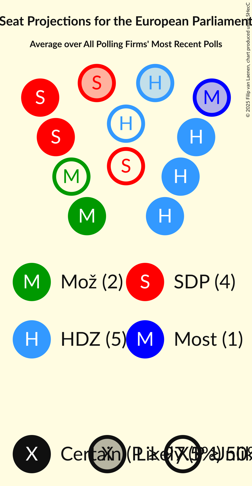

# Overview

The table below lists the most recent polls (less than 90 days old) registered and analyzed so far.

| Period     | Polling firm/Commissioner(s) | RF | Mož | SDP | SD | HSS | HNS | IDS | P | AK | GLAS | Centar | HSLS | HDZ | Most | Hrast | HS | DP | HKS | NHR | Živi zid | NLMK | KH | BM 365 | START | Fokus | HSU | OiP | AP |
|:----------:|:----------------------------:|:--:|:--:|:--:|:--:|:--:|:--:|:--:|:--:|:--:|:--:|:--:|:--:|:--:|:--:|:--:|:--:|:--:|:--:|:--:|:--:|:--:|:--:|:--:|:--:|:--:|:--:|:--:|:--:|
| 9 June 2024 | General Election | 0.0%   0 | 0.0%   0 | 0.0%   0 | 0.0%   0 | 0.0%   0 | 0.0%   0 | 0.0%   0 | 0.0%   0 | 0.0%   0 | 0.0%   0 | 0.0%   0 | 0.0%   0 | 0.0%   0 | 0.0%   0 | 0.0%   0 | 0.0%   0 | 0.0%   0 | 0.0%   0 | 0.0%   0 | 0.0%   0 | 0.0%   0 | 0.0%   0 | 0.0%   0 | 0.0%   0 | 0.0%   0 | 0.0%   0 | 0.0%   0 | 0.0%   0 |
| N/A | [Poll Average](average.html) | 0–2%   0 | 7–13%   1 | 21–31%   3–4 | N/A   N/A | 0–1%   0 | 0–2%   0 | 1–3%   0 | N/A   N/A | N/A   N/A | N/A   N/A | 0–3%   0 | N/A   N/A | 32–39%   4–5 | 6–10%   0–1 | N/A   N/A | 0–2%   0 | 7–11%   1 | N/A   N/A | N/A   N/A | N/A   N/A | N/A   N/A | N/A   N/A | N/A   N/A | N/A   N/A | 1–2%   0 | 0–2%   0 | N/A   N/A | N/A   N/A |
| [1–4 July 2024](2024-07-04-PromocijaPlus.html) | Promocija Plus   RTL | 0–2%   0 | 10–13%   1–2 | 26–32%   4 | N/A   N/A | 0–1%   0 | 0–2%   0 | 1–2%   0 | N/A   N/A | N/A   N/A | N/A   N/A | 0–1%   0 | N/A   N/A | 32–37%   5 | 6–9%   0–1 | N/A   N/A | 0–1%   0 | 6–10%   1 | N/A   N/A | N/A   N/A | N/A   N/A | N/A   N/A | N/A   N/A | N/A   N/A | N/A   N/A | 1–2%   0 | 0–1%   0 | N/A   N/A | N/A   N/A |
| [17–25 June 2024](2024-06-25-2x1Komunikacije.html) | 2x1 Komunikacije   Večernji list | N/A   N/A | 7–10%   1 | 22–27%   3–4 | N/A   N/A | N/A   N/A | N/A   N/A | 1–3%   0 | N/A   N/A | N/A   N/A | N/A   N/A | 2–4%   0 | N/A   N/A | 31–38%   4–6 | 5–9%   0–1 | N/A   N/A | 1–2%   0 | 7–11%   1 | N/A   N/A | N/A   N/A | N/A   N/A | N/A   N/A | N/A   N/A | N/A   N/A | N/A   N/A | 1–2%   0 | 1–3%   0 | N/A   N/A | N/A   N/A |
| [1–21 June 2024](2024-06-21-Ipsos.html) | Ipsos   Nova TV | N/A   N/A | 9–13%   1 | 21–27%   3 | N/A   N/A | N/A   N/A | N/A   N/A | N/A   N/A | N/A   N/A | N/A   N/A | N/A   N/A | N/A   N/A | N/A   N/A | 33–39%   4–5 | 7–11%   1 | N/A   N/A | N/A   N/A | 7–11%   1 | N/A   N/A | N/A   N/A | N/A   N/A | N/A   N/A | N/A   N/A | N/A   N/A | N/A   N/A | N/A   N/A | N/A   N/A | N/A   N/A | N/A   N/A |
| 9 June 2024 | General Election | 0.0%   0 | 0.0%   0 | 0.0%   0 | 0.0%   0 | 0.0%   0 | 0.0%   0 | 0.0%   0 | 0.0%   0 | 0.0%   0 | 0.0%   0 | 0.0%   0 | 0.0%   0 | 0.0%   0 | 0.0%   0 | 0.0%   0 | 0.0%   0 | 0.0%   0 | 0.0%   0 | 0.0%   0 | 0.0%   0 | 0.0%   0 | 0.0%   0 | 0.0%   0 | 0.0%   0 | 0.0%   0 | 0.0%   0 | 0.0%   0 | 0.0%   0 |

Only polls for which at least the sample size has been published are included in the table above.

**Legend:**
+ **Top half of each row:** Voting intentions (95% confidence interval)
+ **Bottom half of each row:** Seat projections for the European Parliament (95% confidence interval)
+ **RF:** Radnička fronta (GUE/NGL)
+ **Mož:** Možemo! (Greens/EFA)
+ **SDP:** Socijaldemokratska partija Hrvatske (S&D)
+ **SD:** Socijaldemokrati (S&D)
+ **HSS:** Hrvatska seljačka stranka (RE)
+ **HNS:** Hrvatska narodna stranka–liberalni demokrati (RE)
+ **IDS:** Istarski demokratski sabor (RE)
+ **P:** Pametno (RE)
+ **AK:** Amsterdamska koalicija (RE)
+ **GLAS:** Građansko-liberalni savez (RE)
+ **Centar:** Centar (RE)
+ **HSLS:** Hrvatska socijalno-liberalna stranka (RE)
+ **HDZ:** Hrvatska demokratska zajednica (EPP)
+ **Most:** Most nezavisnih lista (ECR)
+ **Hrast:** Hrvatski rast (ECR)
+ **HS:** Hrvatski suverenisti (ECR)
+ **DP:** Domovinski pokret (ECR)
+ **HKS:** Hrvatska konzervativna stranka (ECR)
+ **NHR:** Neovisni za Hrvatsku (PfE)
+ **Živi zid:** Živi zid (NI)
+ **NLMK:** Nezavisna lista Mislava Kolakušića (NI)
+ **KH:** Ključ Hrvatske (NI)
+ **BM 365:** Bandić Milan 365–Stranka rada i solidarnosti (*)
+ **START:** Stranka antikorupcije, razvoja i transparentnosti (*)
+ **Fokus:** Fokus na bitno (*)
+ **HSU:** Hrvatska stranka umirovljenika (*)
+ **OiP:** Odlučnost i Pravednost (*)
+ **AP:** Akcija za promjene (*)
+ **N/A (single party):** Party not included the published results
+ **N/A (entire row):** Calculation for this opinion poll not started yet

