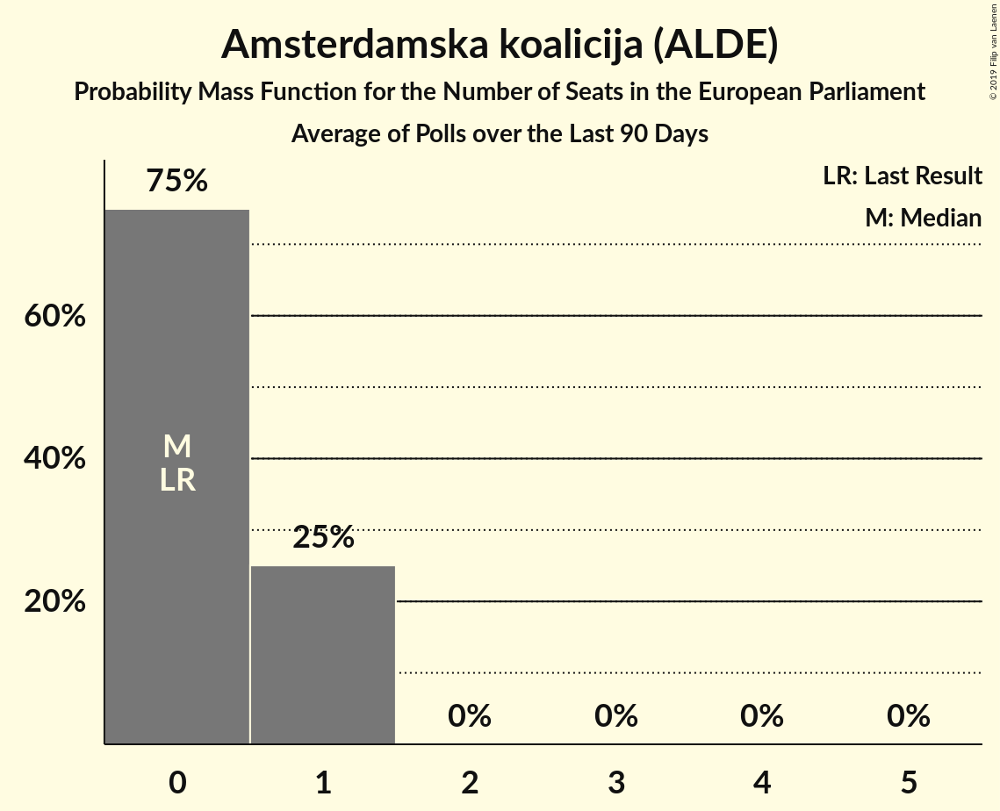

# Amsterdamska koalicija (ALDE)

<a href="#voting-intentions">Voting Intentions</a> | <a href="#seats">Seats</a>

## Voting Intentions

Last result: **0.0%** (General Election of 25 May 2014)

### Confidence Intervals

| Period     | Polling firm/Commissioner(s) | Median | 80% Confidence Interval | 90% Confidence Interval | 95% Confidence Interval | 99% Confidence Interval |
|:----------:|:----------------:|:-----------:|:-----------------------:|:-----------------------:|:-----------------------:|:-----------------------:|
| N/A | [Poll Average](average.html) | 5.4% | 4.2–6.8% | 3.9–7.1% | 3.7–7.4% | 3.3–8.1% |
| [1–20 January 2019](2019-01-20-IPSOSPULS.html) | IPSOS PULS   Nova TV | 6.1% | 5.2–7.1% | 4.9–7.5% | 4.7–7.7% | 4.3–8.3% |
| [2–7 January 2019](2019-01-07-Promocijaplus.html) | Promocija plus   HRT | 4.6% | 3.9–5.5% | 3.7–5.8% | 3.5–6.0% | 3.2–6.5% |
| [1–20 December 2018](2018-12-20-IPSOSPULS.html) | IPSOS PULS   Nova TV | 5.7% | 4.7–7.0% | 4.5–7.4% | 4.2–7.7% | 3.8–8.4% |
| [1–20 November 2018](2018-11-20-IPSOSPULS.html) | IPSOS PULS   Nova TV | 5.7% | 4.7–7.0% | 4.5–7.4% | 4.2–7.7% | 3.8–8.4% |
| [8 November 2018](2018-11-08-Promocijaplus.html) | Promocija plus   HRT | 5.9% | 5.1–7.0% | 4.9–7.2% | 4.7–7.5% | 4.3–8.0% |
| [1–18 October 2018](2018-10-18-IPSOSPULS.html) | IPSOS PULS   Nova TV | 5.6% | 4.7–6.7% | 4.5–7.0% | 4.3–7.3% | 3.9–7.9% |
| [2–5 October 2018](2018-10-05-Promocijaplus.html) | Promocija plus   HRT | 6.0% | 5.2–7.0% | 5.0–7.3% | 4.8–7.6% | 4.4–8.1% |
| [1–20 September 2018](2018-09-20-IPSOSPULS.html) | IPSOS PULS   Nova TV | 6.3% | 5.4–7.5% | 5.2–7.8% | 4.9–8.1% | 4.5–8.7% |
| [8 September 2018](2018-09-08-Promocijaplus.html) | Promocija plus   HRT | 5.4% | 4.6–6.3% | 4.4–6.6% | 4.2–6.8% | 3.8–7.3% |
| [1–20 August 2018](2018-08-20-IPSOSPULS.html) | IPSOS PULS   Nova TV | 7.3% | 6.3–8.6% | 6.1–8.9% | 5.8–9.2% | 5.4–9.9% |
| [2–5 August 2018](2018-08-05-Promocijaplus.html) | Promocija plus   HRT | 4.9% | 4.2–5.9% | 4.0–6.1% | 3.8–6.4% | 3.5–6.8% |
| [1–20 July 2018](2018-07-20-IPSOSPULS.html) | IPSOS PULS   Nova TV | 6.4% | 5.5–7.6% | 5.2–7.9% | 5.0–8.2% | 4.6–8.8% |
| [2–5 July 2018](2018-07-05-Promocijaplus.html) | Promocija plus   HRT | 4.4% | 3.7–5.2% | 3.5–5.5% | 3.3–5.7% | 3.0–6.2% |
| [1–20 June 2018](2018-06-20-IPSOSPULS.html) | IPSOS PULS   Nova TV | 5.3% | 4.5–6.4% | 4.2–6.8% | 4.0–7.0% | 3.7–7.6% |
| [6 May–7 June 2018](2018-06-07-Promocijaplus.html) | Promocija plus   HRT | 5.3% | 4.5–6.2% | 4.3–6.5% | 4.1–6.7% | 3.7–7.2% |
| [1–20 May 2018](2018-05-20-IPSOSPULS.html) | IPSOS PULS   Nova TV | 6.1% | 5.1–7.2% | 4.9–7.5% | 4.7–7.8% | 4.3–8.4% |
| [2–5 May 2018](2018-05-05-Promocijaplus.html) | Promocija plus   HRT | 4.7% | 4.0–5.6% | 3.8–5.9% | 3.6–6.1% | 3.3–6.6% |
| [1–20 April 2018](2018-04-20-IPSOSPULS.html) | IPSOS PULS   Nova TV | 7.8% | 6.8–9.1% | 6.5–9.5% | 6.3–9.8% | 5.8–10.4% |
| [8 April 2018](2018-04-08-Promocijaplus.html) | Promocija plus   HRT | 4.3% | 3.6–5.2% | 3.4–5.5% | 3.3–5.7% | 3.0–6.1% |
| [1–20 March 2018](2018-03-20-IPSOSPULS.html) | IPSOS PULS   Nova TV | 5.8% | 4.9–6.9% | 4.7–7.2% | 4.5–7.5% | 4.1–8.1% |
| [19 March 2018](2018-03-19-2x1Komunikacije.html) | 2x1 Komunikacije   CroElecto | 1.8% | 1.3–2.5% | 1.2–2.7% | 1.1–2.9% | 0.9–3.2% |
| [28 February–3 March 2018](2018-03-03-Promocijaplus.html) | Promocija plus   HRT | 4.8% | 4.0–5.7% | 3.8–6.0% | 3.7–6.2% | 3.4–6.7% |
| [1–20 February 2018](2018-02-20-IPSOSPULS.html) | IPSOS PULS   Nova TV | 5.4% | 4.5–6.5% | 4.3–6.8% | 4.1–7.1% | 3.7–7.7% |
| [4 February 2018](2018-02-04-Promocijaplus.html) | Promocija plus   HRT | 4.7% | 4.0–5.6% | 3.8–5.9% | 3.6–6.1% | 3.3–6.6% |
| [1–20 January 2018](2018-01-20-IPSOSPULS.html) | IPSOS PULS   Nova TV | 4.9% | 4.1–6.0% | 3.9–6.3% | 3.7–6.5% | 3.3–7.1% |

### Probability Mass Function

The following table shows the probability mass function per percentage block of voting intentions for the [poll average](average.html) for Amsterdamska koalicija (ALDE).

| Voting Intentions | Probability | Accumulated | Special Marks |
|:-----------------:|:-----------:|:-----------:|:-------------:|
| 0.0–0.5% | 0% | 100% | Last Result |
| 0.5–1.5% | 0% | 100% |  |
| 1.5–2.5% | 0% | 100% |  |
| 2.5–3.5% | 1.3% | 100% |  |
| 3.5–4.5% | 21% | 98.7% |  |
| 4.5–5.5% | 34% | 78% | Median |
| 5.5–6.5% | 29% | 44% |  |
| 6.5–7.5% | 13% | 15% |  |
| 7.5–8.5% | 2% | 2% |  |
| 8.5–9.5% | 0.1% | 0.1% |  |
| 9.5–10.5% | 0% | 0% |  |

## Seats

Last result: **0** seats (General Election of 25 May 2014)

### Confidence Intervals

| Period     | Polling firm/Commissioner(s) | Median | 80% Confidence Interval | 90% Confidence Interval | 95% Confidence Interval | 99% Confidence Interval |
|:----------:|:----------------:|:------:|:-----------------------:|:-----------------------:|:-----------------------:|:-----------------------:|
| N/A | [Poll Average](average.html) | 0 | 0–1 | 0–1 | 0–1 | 0–1 |
| [1–20 January 2019](2019-01-20-IPSOSPULS.html) | IPSOS PULS   Nova TV | 0 | 0–1 | 0–1 | 0–1 | 0–1 |
| [2–7 January 2019](2019-01-07-Promocijaplus.html) | Promocija plus   HRT | 0 | 0 | 0 | 0 | 0–1 |
| [1–20 December 2018](2018-12-20-IPSOSPULS.html) | IPSOS PULS   Nova TV | 0 | 0–1 | 0–1 | 0–1 | 0–1 |
| [1–20 November 2018](2018-11-20-IPSOSPULS.html) | IPSOS PULS   Nova TV | 0 | 0–1 | 0–1 | 0–1 | 0–1 |
| [8 November 2018](2018-11-08-Promocijaplus.html) | Promocija plus   HRT | 0 | 0–1 | 0–1 | 0–1 | 0–1 |
| [1–18 October 2018](2018-10-18-IPSOSPULS.html) | IPSOS PULS   Nova TV | 0 | 0–1 | 0–1 | 0–1 | 0–1 |
| [2–5 October 2018](2018-10-05-Promocijaplus.html) | Promocija plus   HRT | 0 | 0–1 | 0–1 | 0–1 | 0–1 |
| [1–20 September 2018](2018-09-20-IPSOSPULS.html) | IPSOS PULS   Nova TV | 1 | 0–1 | 0–1 | 0–1 | 0–1 |
| [8 September 2018](2018-09-08-Promocijaplus.html) | Promocija plus   HRT | 0 | 0–1 | 0–1 | 0–1 | 0–1 |
| [1–20 August 2018](2018-08-20-IPSOSPULS.html) | IPSOS PULS   Nova TV | 1 | 1 | 0–1 | 0–1 | 0–1 |
| [2–5 August 2018](2018-08-05-Promocijaplus.html) | Promocija plus   HRT | 0 | 0 | 0 | 0–1 | 0–1 |
| [1–20 July 2018](2018-07-20-IPSOSPULS.html) | IPSOS PULS   Nova TV | 1 | 0–1 | 0–1 | 0–1 | 0–1 |
| [2–5 July 2018](2018-07-05-Promocijaplus.html) | Promocija plus   HRT | 0 | 0 | 0 | 0 | 0 |
| [1–20 June 2018](2018-06-20-IPSOSPULS.html) | IPSOS PULS   Nova TV | 0 | 0–1 | 0–1 | 0–1 | 0–1 |
| [6 May–7 June 2018](2018-06-07-Promocijaplus.html) | Promocija plus   HRT | 0 | 0 | 0–1 | 0–1 | 0–1 |
| [1–20 May 2018](2018-05-20-IPSOSPULS.html) | IPSOS PULS   Nova TV | 0 | 0–1 | 0–1 | 0–1 | 0–1 |
| [2–5 May 2018](2018-05-05-Promocijaplus.html) | Promocija plus   HRT | 0 | 0 | 0 | 0–1 | 0–1 |
| [1–20 April 2018](2018-04-20-IPSOSPULS.html) | IPSOS PULS   Nova TV | 1 | 1 | 1 | 0–1 | 0–1 |
| [8 April 2018](2018-04-08-Promocijaplus.html) | Promocija plus   HRT | 0 | 0 | 0 | 0 | 0 |
| [1–20 March 2018](2018-03-20-IPSOSPULS.html) | IPSOS PULS   Nova TV | 0 | 0–1 | 0–1 | 0–1 | 0–1 |
| [19 March 2018](2018-03-19-2x1Komunikacije.html) | 2x1 Komunikacije   CroElecto | 0 | 0 | 0 | 0 | 0 |
| [28 February–3 March 2018](2018-03-03-Promocijaplus.html) | Promocija plus   HRT | 0 | 0 | 0 | 0 | 0–1 |
| [1–20 February 2018](2018-02-20-IPSOSPULS.html) | IPSOS PULS   Nova TV | 0 | 0–1 | 0–1 | 0–1 | 0–1 |
| [4 February 2018](2018-02-04-Promocijaplus.html) | Promocija plus   HRT | 0 | 0 | 0 | 0 | 0–1 |
| [1–20 January 2018](2018-01-20-IPSOSPULS.html) | IPSOS PULS   Nova TV | 0 | 0 | 0–1 | 0–1 | 0–1 |

### Probability Mass Function

The following table shows the probability mass function per seat for the [poll average](average.html) for Amsterdamska koalicija (ALDE).

| Number of Seats | Probability | Accumulated | Special Marks |
|:---------------:|:-----------:|:-----------:|:-------------:|
| 0 | 77% | 100% | Last Result, Median |
| 1 | 23% | 23% |  |
| 2 | 0% | 0% |  |

