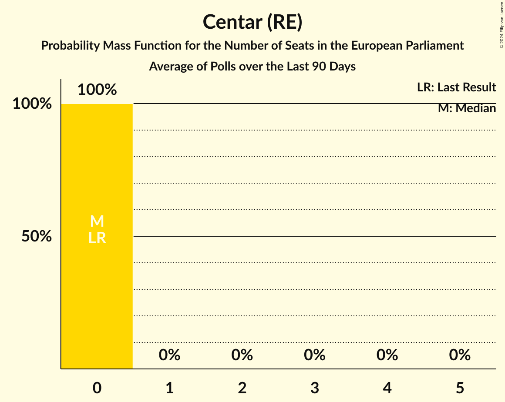

# Centar (RE)

<a href="#voting-intentions">Voting Intentions</a> | <a href="#seats">Seats</a>

## Voting Intentions

Last result: **0.0%** (General Election of 9 June 2024)

### Confidence Intervals

| Period     | Polling firm/Commissioner(s) | Median | 80% Confidence Interval | 90% Confidence Interval | 95% Confidence Interval | 99% Confidence Interval |
|:----------:|:----------------:|:-----------:|:-----------------------:|:-----------------------:|:-----------------------:|:-----------------------:|
| N/A | [Poll Average](average.html) | 1.9% | 1.1–3.0% | 1.0–3.3% | 0.9–3.5% | 0.7–4.0% |
| [1–4 October 2024](2024-10-04-PromocijaPlus.html) | Promocija Plus   RTL | 1.3% | 0.9–1.9% | 0.9–2.0% | 0.8–2.2% | 0.6–2.5% |
| [13–28 September 2024](2024-09-28-2x1Komunikacije.html) | 2x1 Komunikacije   Večernji list | 2.4% | 1.9–3.3% | 1.7–3.5% | 1.6–3.7% | 1.4–4.1% |
| [1–20 September 2024](2024-09-20-Ipsos.html) | Ipsos   Nova TV | 0.0% | N/A | N/A | N/A | N/A |
| [2–5 September 2024](2024-09-05-PromocijaPlus.html) | Promocija Plus   RTL | 1.6% | 1.2–2.2% | 1.1–2.4% | 1.0–2.5% | 0.8–2.9% |
| [13–27 August 2024](2024-08-27-2x1Komunikacije.html) | 2x1 Komunikacije   Večernji list | 0.0% | N/A | N/A | N/A | N/A |
| [1–21 August 2024](2024-08-21-Ipsos.html) | Ipsos   Nova TV | 0.0% | N/A | N/A | N/A | N/A |
| [31 July–2 August 2024](2024-08-02-PromocijaPlus.html) | Promocija Plus   RTL | 0.9% | 0.6–1.4% | 0.5–1.6% | 0.5–1.7% | 0.4–2.0% |
| [31 July 2024](2024-07-31-2x1Komunikacije.html) | 2x1 Komunikacije   Večernji list | 2.6% | 2.0–3.4% | 1.8–3.7% | 1.7–3.9% | 1.5–4.3% |
| [1–21 July 2024](2024-07-21-Ipsos.html) | Ipsos   Nova TV | 0.0% | N/A | N/A | N/A | N/A |
| [1–4 July 2024](2024-07-04-PromocijaPlus.html) | Promocija Plus   RTL | 0.3% | 0.2–0.7% | 0.2–0.8% | 0.1–0.9% | 0.1–1.1% |
| [17–25 June 2024](2024-06-25-2x1Komunikacije.html) | 2x1 Komunikacije   Večernji list | 2.4% | N/A | N/A | N/A | N/A |
| [1–21 June 2024](2024-06-21-Ipsos.html) | Ipsos   Nova TV | 0.0% | N/A | N/A | N/A | N/A |

### Probability Mass Function

The following table shows the probability mass function per percentage block of voting intentions for the [poll average](average.html) for Centar (RE).

| Voting Intentions | Probability | Accumulated | Special Marks |
|:-----------------:|:-----------:|:-----------:|:-------------:|
| 0.0–0.5% | 0.1% | 100% | Last Result |
| 0.5–1.5% | 36% | 99.9% |  |
| 1.5–2.5% | 40% | 64% | Median |
| 2.5–3.5% | 22% | 24% |  |
| 3.5–4.5% | 2% | 2% |  |
| 4.5–5.5% | 0% | 0% |  |
| 5.5–6.5% | 0% | 0% |  |

## Seats

Last result: **0** seats (General Election of 9 June 2024)

### Confidence Intervals

| Period     | Polling firm/Commissioner(s) | Median | 80% Confidence Interval | 90% Confidence Interval | 95% Confidence Interval | 99% Confidence Interval |
|:----------:|:----------------:|:------:|:-----------------------:|:-----------------------:|:-----------------------:|:-----------------------:|
| N/A | [Poll Average](average.html) | 0 | 0 | 0 | 0 | 0 |
| [1–4 October 2024](2024-10-04-PromocijaPlus.html) | Promocija Plus   RTL | 0 | 0 | 0 | 0 | 0 |
| [13–28 September 2024](2024-09-28-2x1Komunikacije.html) | 2x1 Komunikacije   Večernji list | 0 | 0 | 0 | 0 | 0 |
| [1–20 September 2024](2024-09-20-Ipsos.html) | Ipsos   Nova TV |  |  |  |  |  |
| [2–5 September 2024](2024-09-05-PromocijaPlus.html) | Promocija Plus   RTL | 0 | 0 | 0 | 0 | 0 |
| [13–27 August 2024](2024-08-27-2x1Komunikacije.html) | 2x1 Komunikacije   Večernji list |  |  |  |  |  |
| [1–21 August 2024](2024-08-21-Ipsos.html) | Ipsos   Nova TV |  |  |  |  |  |
| [31 July–2 August 2024](2024-08-02-PromocijaPlus.html) | Promocija Plus   RTL | 0 | 0 | 0 | 0 | 0 |
| [31 July 2024](2024-07-31-2x1Komunikacije.html) | 2x1 Komunikacije   Večernji list | 0 | 0 | 0 | 0 | 0 |
| [1–21 July 2024](2024-07-21-Ipsos.html) | Ipsos   Nova TV |  |  |  |  |  |
| [1–4 July 2024](2024-07-04-PromocijaPlus.html) | Promocija Plus   RTL | 0 | 0 | 0 | 0 | 0 |
| [17–25 June 2024](2024-06-25-2x1Komunikacije.html) | 2x1 Komunikacije   Večernji list |  |  |  |  |  |
| [1–21 June 2024](2024-06-21-Ipsos.html) | Ipsos   Nova TV |  |  |  |  |  |

### Probability Mass Function

The following table shows the probability mass function per seat for the [poll average](average.html) for Centar (RE).

| Number of Seats | Probability | Accumulated | Special Marks |
|:---------------:|:-----------:|:-----------:|:-------------:|
| 0 | 100% | 100% | Last Result, Median |

