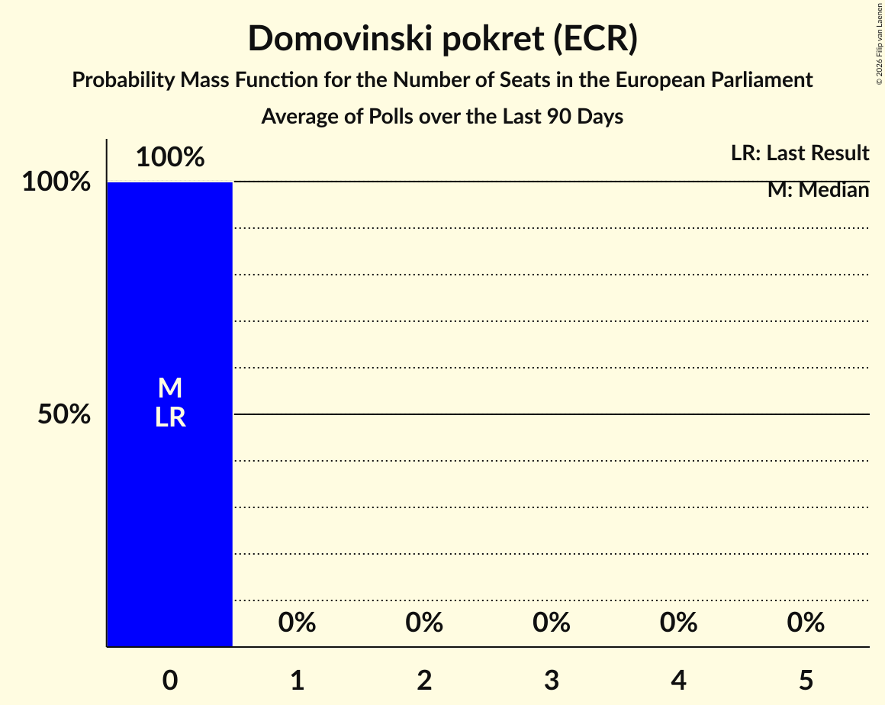

# Domovinski pokret (ECR)

<a href="#voting-intentions">Voting Intentions</a> | <a href="#seats">Seats</a>

## Voting Intentions

Last result: **0.0%** (General Election of 9 June 2024)

### Confidence Intervals

| Period     | Polling firm/Commissioner(s) | Median | 80% Confidence Interval | 90% Confidence Interval | 95% Confidence Interval | 99% Confidence Interval |
|:----------:|:----------------:|:-----------:|:-----------------------:|:-----------------------:|:-----------------------:|:-----------------------:|
| N/A | [Poll Average](average.html) | 8.2% | 6.8–9.8% | 6.5–10.3% | 6.2–10.7% | 5.6–11.5% |
| [1–21 August 2024](2024-08-21-Ipsos.html) | Ipsos   Nova TV | 7.4% | 6.3–8.6% | 6.1–9.0% | 5.8–9.3% | 5.3–10.0% |
| [31 July–2 August 2024](2024-08-02-PromocijaPlus.html) | Promocija Plus   RTL | 7.9% | 7.0–9.1% | 6.7–9.4% | 6.5–9.7% | 6.1–10.3% |
| [31 July 2024](2024-07-31-2x1Komunikacije.html) | 2x1 Komunikacije   Večernji list | 9.1% | 8.0–10.5% | 7.7–10.9% | 7.4–11.3% | 6.9–12.0% |
| [1–21 July 2024](2024-07-21-Ipsos.html) | Ipsos   Nova TV | 8.8% | 7.7–10.2% | 7.4–10.6% | 7.1–11.0% | 6.6–11.6% |
| [1–4 July 2024](2024-07-04-PromocijaPlus.html) | Promocija Plus   RTL | 8.1% | 7.1–9.2% | 6.9–9.5% | 6.6–9.8% | 6.2–10.4% |
| [17–25 June 2024](2024-06-25-2x1Komunikacije.html) | 2x1 Komunikacije   Večernji list | 8.7% | N/A | N/A | N/A | N/A |
| [1–21 June 2024](2024-06-21-Ipsos.html) | Ipsos   Nova TV | 8.9% | N/A | N/A | N/A | N/A |

### Probability Mass Function

The following table shows the probability mass function per percentage block of voting intentions for the [poll average](average.html) for Domovinski pokret (ECR).

| Voting Intentions | Probability | Accumulated | Special Marks |
|:-----------------:|:-----------:|:-----------:|:-------------:|
| 0.0–0.5% | 0% | 100% | Last Result |
| 0.5–1.5% | 0% | 100% |  |
| 1.5–2.5% | 0% | 100% |  |
| 2.5–3.5% | 0% | 100% |  |
| 3.5–4.5% | 0% | 100% |  |
| 4.5–5.5% | 0.4% | 100% |  |
| 5.5–6.5% | 6% | 99.6% |  |
| 6.5–7.5% | 23% | 94% |  |
| 7.5–8.5% | 34% | 71% | Median |
| 8.5–9.5% | 24% | 37% |  |
| 9.5–10.5% | 10% | 14% |  |
| 10.5–11.5% | 3% | 3% |  |
| 11.5–12.5% | 0.4% | 0.4% |  |
| 12.5–13.5% | 0% | 0% |  |

## Seats

Last result: **0** seats (General Election of 9 June 2024)

### Confidence Intervals

| Period     | Polling firm/Commissioner(s) | Median | 80% Confidence Interval | 90% Confidence Interval | 95% Confidence Interval | 99% Confidence Interval |
|:----------:|:----------------:|:------:|:-----------------------:|:-----------------------:|:-----------------------:|:-----------------------:|
| N/A | [Poll Average](average.html) | 1 | 1 | 0–1 | 0–1 | 0–1 |
| [1–21 August 2024](2024-08-21-Ipsos.html) | Ipsos   Nova TV | 1 | 0–1 | 0–1 | 0–1 | 0–1 |
| [31 July–2 August 2024](2024-08-02-PromocijaPlus.html) | Promocija Plus   RTL | 1 | 1 | 1 | 1 | 1 |
| [31 July 2024](2024-07-31-2x1Komunikacije.html) | 2x1 Komunikacije   Večernji list | 1 | 1 | 1 | 1 | 1 |
| [1–21 July 2024](2024-07-21-Ipsos.html) | Ipsos   Nova TV | 1 | 1 | 1 | 1 | 0–1 |
| [1–4 July 2024](2024-07-04-PromocijaPlus.html) | Promocija Plus   RTL | 1 | 1 | 1 | 1 | 1 |
| [17–25 June 2024](2024-06-25-2x1Komunikacije.html) | 2x1 Komunikacije   Večernji list |  |  |  |  |  |
| [1–21 June 2024](2024-06-21-Ipsos.html) | Ipsos   Nova TV |  |  |  |  |  |

### Probability Mass Function

The following table shows the probability mass function per seat for the [poll average](average.html) for Domovinski pokret (ECR).

| Number of Seats | Probability | Accumulated | Special Marks |
|:---------------:|:-----------:|:-----------:|:-------------:|
| 0 | 9% | 100% | Last Result |
| 1 | 91% | 91% | Median |
| 2 | 0.1% | 0.1% |  |
| 3 | 0% | 0% |  |

