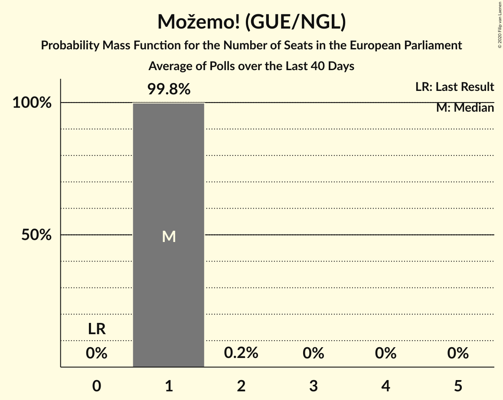

# Možemo! (GUE/NGL)

<a href="#voting-intentions">Voting Intentions</a> | <a href="#seats">Seats</a>

## Voting Intentions

Last result: **0.0%** (General Election of 26 May 2019)

### Confidence Intervals

| Period     | Polling firm/Commissioner(s) | Median | 80% Confidence Interval | 90% Confidence Interval | 95% Confidence Interval | 99% Confidence Interval |
|:----------:|:----------------:|:-----------:|:-----------------------:|:-----------------------:|:-----------------------:|:-----------------------:|
| N/A | [Poll Average](average.html) | 9.7% | 8.5–10.9% | 8.2–11.3% | 7.9–11.6% | 7.4–12.2% |
| [1–18 September 2020](2020-09-18-IPSOSPULS.html) | IPSOS PULS   Nova TV | 9.3% | 8.2–10.6% | 7.9–11.0% | 7.6–11.3% | 7.1–11.9% |
| [1–4 September 2020](2020-09-04-PromocijaPLUS.html) | Promocija PLUS | 10.0% | 9.0–11.1% | 8.7–11.5% | 8.5–11.8% | 8.0–12.3% |
| [1–18 August 2020](2020-08-18-IPSOSPULS.html) | IPSOS PULS   Nova TV | 9.5% | 8.4–10.8% | 8.1–11.2% | 7.8–11.5% | 7.3–12.1% |
| [1–4 August 2020](2020-08-04-PromocijaPLUS.html) | Promocija PLUS | 11.0% | 10.0–12.2% | 9.7–12.5% | 9.4–12.8% | 8.9–13.4% |
| [1–20 July 2020](2020-07-20-IPSOSPULS.html) | IPSOS PULS   Nova TV | 9.5% | 8.4–10.8% | 8.1–11.2% | 7.8–11.5% | 7.3–12.1% |
| [2–5 June 2020](2020-06-05-PromocijaPLUS.html) | Promocija PLUS | 0.0% | N/A | N/A | N/A | N/A |
| [18–21 May 2020](2020-05-21-IPSOSPULS.html) | IPSOS PULS   Dnevnik | 0.0% | N/A | N/A | N/A | N/A |
| [15–18 May 2020](2020-05-18-PromocijaPLUS.html) | Promocija PLUS | 0.0% | N/A | N/A | N/A | N/A |
| [5–8 May 2020](2020-05-08-PromocijaPLUS.html) | Promocija PLUS | 0.0% | N/A | N/A | N/A | N/A |
| [17–22 April 2020](2020-04-22-IPSOSPULS.html) | IPSOS PULS   Dnevnik | 0.0% | N/A | N/A | N/A | N/A |
| [15–18 April 2020](2020-04-18-PromocijaPLUS.html) | Promocija PLUS | 0.0% | N/A | N/A | N/A | N/A |
| [1–9 April 2020](2020-04-09-2x1Komunikacije.html) | 2x1 Komunikacije   CroElecto | 0.0% | N/A | N/A | N/A | N/A |
| [31 March–3 April 2020](2020-04-03-PromocijaPLUS.html) | Promocija PLUS | 0.0% | N/A | N/A | N/A | N/A |
| [1–20 March 2020](2020-03-20-IPSOSPULS.html) | IPSOS PULS   Dnevnik | 0.0% | N/A | N/A | N/A | N/A |
| [16–19 March 2020](2020-03-19-PromocijaPLUS.html) | Promocija PLUS | 0.0% | N/A | N/A | N/A | N/A |
| [4–12 March 2020](2020-03-12-2x1Komunikacije.html) | 2x1 Komunikacije   CroElecto | 0.0% | N/A | N/A | N/A | N/A |
| [3–6 March 2020](2020-03-06-PromocijaPLUS.html) | Promocija PLUS | 0.0% | N/A | N/A | N/A | N/A |
| [1–20 February 2020](2020-02-20-IPSOSPULS.html) | IPSOS PULS   Dnevnik | 0.0% | N/A | N/A | N/A | N/A |
| [14–18 February 2020](2020-02-18-PromocijaPLUS.html) | Promocija PLUS | 0.0% | N/A | N/A | N/A | N/A |
| [6 February 2020](2020-02-06-PromocijaPLUS.html) | Promocija PLUS   RTL | 0.0% | N/A | N/A | N/A | N/A |
| [21–22 January 2020](2020-01-22-IPSOSPULS.html) | IPSOS PULS   Dnevnik | 0.0% | N/A | N/A | N/A | N/A |
| [9–16 January 2020](2020-01-16-2x1Komunikacije.html) | 2x1 Komunikacije   CroElecto | 0.0% | N/A | N/A | N/A | N/A |
| [7–11 January 2020](2020-01-11-Promocijaplus.html) | Promocija plus   HRT | 0.0% | N/A | N/A | N/A | N/A |
| [1–20 December 2019](2019-12-20-IPSOSPULS.html) | IPSOS PULS   Dnevnik | 0.0% | N/A | N/A | N/A | N/A |
| [5–9 December 2019](2019-12-09-Promocijaplus.html) | Promocija plus   HRT | 0.0% | N/A | N/A | N/A | N/A |
| [1–25 November 2019](2019-11-25-Promocijaplus.html) | Promocija plus   HRT | 0.0% | N/A | N/A | N/A | N/A |
| [1–20 November 2019](2019-11-20-IPSOSPULS.html) | IPSOS PULS   Dnevnik | 0.0% | N/A | N/A | N/A | N/A |
| [4–15 November 2019](2019-11-15-2x1Komunikacije.html) | 2x1 Komunikacije   CroElecto | 0.0% | N/A | N/A | N/A | N/A |
| [4–8 November 2019](2019-11-08-Promocijaplus.html) | Promocija plus   RTL | 0.0% | N/A | N/A | N/A | N/A |
| [11–23 October 2019](2019-10-23-2x1Komunikacije.html) | 2x1 Komunikacije   CroElecto | 0.0% | N/A | N/A | N/A | N/A |
| [1–20 October 2019](2019-10-20-IPSOSPULS.html) | IPSOS PULS   Dnevnik | 0.0% | N/A | N/A | N/A | N/A |
| [14–18 October 2019](2019-10-18-Promocijaplus.html) | Promocija plus   HRT | 0.0% | N/A | N/A | N/A | N/A |
| [1–4 October 2019](2019-10-04-Promocijaplus.html) | Promocija plus   HRT | 0.0% | N/A | N/A | N/A | N/A |
| [1–23 September 2019](2019-09-23-Promocijaplus.html) | Promocija plus   HRT | 0.0% | N/A | N/A | N/A | N/A |
| [1–20 September 2019](2019-09-20-IPSOSPULS.html) | IPSOS PULS   Dnevnik | 0.0% | N/A | N/A | N/A | N/A |
| [9–19 September 2019](2019-09-19-2x1Komunikacije.html) | 2x1 Komunikacije   CroElecto | 0.0% | N/A | N/A | N/A | N/A |
| [2–6 September 2019](2019-09-06-Promocijaplus.html) | Promocija plus   RTL | 0.0% | N/A | N/A | N/A | N/A |
| [1–24 August 2019](2019-08-24-2x1Komunikacije.html) | 2x1 Komunikacije   CroElecto | 0.0% | N/A | N/A | N/A | N/A |
| [1–20 August 2019](2019-08-20-IPSOSPULS.html) | IPSOS PULS   Nova TV | 0.0% | N/A | N/A | N/A | N/A |
| [31 July–3 August 2019](2019-08-03-Promocijaplus.html) | Promocija plus   RTL | 0.0% | N/A | N/A | N/A | N/A |
| [1–20 July 2019](2019-07-20-IPSOSPULS.html) | IPSOS PULS   CroBarometer | 0.0% | N/A | N/A | N/A | N/A |
| [8–15 July 2019](2019-07-15-2x1Komunikacije.html) | 2x1 Komunikacije   CroElecto | 0.0% | N/A | N/A | N/A | N/A |
| [1–5 July 2019](2019-07-05-Promocijaplus.html) | Promocija plus   RTL | 0.0% | N/A | N/A | N/A | N/A |
| [1–20 June 2019](2019-06-20-IPSOSPULS.html) | IPSOS PULS   CroBarometer | 0.0% | N/A | N/A | N/A | N/A |
| [7–17 June 2019](2019-06-17-2x1Komunikacije.html) | 2x1 Komunikacije   CroElecto | 0.0% | N/A | N/A | N/A | N/A |
| [3–7 June 2019](2019-06-07-Promocijaplus.html) | Promocija plus   RTL | 0.0% | N/A | N/A | N/A | N/A |
| [27 May–1 June 2019](2019-06-01-2x1Komunikacije.html) | 2x1 Komunikacije   CroElecto | 0.0% | N/A | N/A | N/A | N/A |

### Probability Mass Function

The following table shows the probability mass function per percentage block of voting intentions for the [poll average](average.html) for Možemo! (GUE/NGL).

| Voting Intentions | Probability | Accumulated | Special Marks |
|:-----------------:|:-----------:|:-----------:|:-------------:|
| 0.0–0.5% | 0% | 100% | Last Result |
| 0.5–1.5% | 0% | 100% |  |
| 1.5–2.5% | 0% | 100% |  |
| 2.5–3.5% | 0% | 100% |  |
| 3.5–4.5% | 0% | 100% |  |
| 4.5–5.5% | 0% | 100% |  |
| 5.5–6.5% | 0% | 100% |  |
| 6.5–7.5% | 0.9% | 100% |  |
| 7.5–8.5% | 10% | 99.1% |  |
| 8.5–9.5% | 32% | 89% |  |
| 9.5–10.5% | 38% | 57% | Median |
| 10.5–11.5% | 16% | 19% |  |
| 11.5–12.5% | 3% | 3% |  |
| 12.5–13.5% | 0.2% | 0.2% |  |
| 13.5–14.5% | 0% | 0% |  |

## Seats

Last result: **0** seats (General Election of 26 May 2019)

### Confidence Intervals

| Period     | Polling firm/Commissioner(s) | Median | 80% Confidence Interval | 90% Confidence Interval | 95% Confidence Interval | 99% Confidence Interval |
|:----------:|:----------------:|:------:|:-----------------------:|:-----------------------:|:-----------------------:|:-----------------------:|
| N/A | [Poll Average](average.html) | 1 | 1 | 1 | 1 | 1 |
| [1–18 September 2020](2020-09-18-IPSOSPULS.html) | IPSOS PULS   Nova TV | 1 | 1 | 1 | 1 | 1 |
| [1–4 September 2020](2020-09-04-PromocijaPLUS.html) | Promocija PLUS | 1 | 1 | 1 | 1 | 1 |
| [1–18 August 2020](2020-08-18-IPSOSPULS.html) | IPSOS PULS   Nova TV | 1 | 1 | 1 | 1 | 1 |
| [1–4 August 2020](2020-08-04-PromocijaPLUS.html) | Promocija PLUS | 1 | 1 | 1 | 1 | 1–2 |
| [1–20 July 2020](2020-07-20-IPSOSPULS.html) | IPSOS PULS   Nova TV | 1 | 1 | 1 | 1 | 1 |
| [2–5 June 2020](2020-06-05-PromocijaPLUS.html) | Promocija PLUS |  |  |  |  |  |
| [18–21 May 2020](2020-05-21-IPSOSPULS.html) | IPSOS PULS   Dnevnik |  |  |  |  |  |
| [15–18 May 2020](2020-05-18-PromocijaPLUS.html) | Promocija PLUS |  |  |  |  |  |
| [5–8 May 2020](2020-05-08-PromocijaPLUS.html) | Promocija PLUS |  |  |  |  |  |
| [17–22 April 2020](2020-04-22-IPSOSPULS.html) | IPSOS PULS   Dnevnik |  |  |  |  |  |
| [15–18 April 2020](2020-04-18-PromocijaPLUS.html) | Promocija PLUS |  |  |  |  |  |
| [1–9 April 2020](2020-04-09-2x1Komunikacije.html) | 2x1 Komunikacije   CroElecto |  |  |  |  |  |
| [31 March–3 April 2020](2020-04-03-PromocijaPLUS.html) | Promocija PLUS |  |  |  |  |  |
| [1–20 March 2020](2020-03-20-IPSOSPULS.html) | IPSOS PULS   Dnevnik |  |  |  |  |  |
| [16–19 March 2020](2020-03-19-PromocijaPLUS.html) | Promocija PLUS |  |  |  |  |  |
| [4–12 March 2020](2020-03-12-2x1Komunikacije.html) | 2x1 Komunikacije   CroElecto |  |  |  |  |  |
| [3–6 March 2020](2020-03-06-PromocijaPLUS.html) | Promocija PLUS |  |  |  |  |  |
| [1–20 February 2020](2020-02-20-IPSOSPULS.html) | IPSOS PULS   Dnevnik |  |  |  |  |  |
| [14–18 February 2020](2020-02-18-PromocijaPLUS.html) | Promocija PLUS |  |  |  |  |  |
| [6 February 2020](2020-02-06-PromocijaPLUS.html) | Promocija PLUS   RTL |  |  |  |  |  |
| [21–22 January 2020](2020-01-22-IPSOSPULS.html) | IPSOS PULS   Dnevnik |  |  |  |  |  |
| [9–16 January 2020](2020-01-16-2x1Komunikacije.html) | 2x1 Komunikacije   CroElecto |  |  |  |  |  |
| [7–11 January 2020](2020-01-11-Promocijaplus.html) | Promocija plus   HRT |  |  |  |  |  |
| [1–20 December 2019](2019-12-20-IPSOSPULS.html) | IPSOS PULS   Dnevnik |  |  |  |  |  |
| [5–9 December 2019](2019-12-09-Promocijaplus.html) | Promocija plus   HRT |  |  |  |  |  |
| [1–25 November 2019](2019-11-25-Promocijaplus.html) | Promocija plus   HRT |  |  |  |  |  |
| [1–20 November 2019](2019-11-20-IPSOSPULS.html) | IPSOS PULS   Dnevnik |  |  |  |  |  |
| [4–15 November 2019](2019-11-15-2x1Komunikacije.html) | 2x1 Komunikacije   CroElecto |  |  |  |  |  |
| [4–8 November 2019](2019-11-08-Promocijaplus.html) | Promocija plus   RTL |  |  |  |  |  |
| [11–23 October 2019](2019-10-23-2x1Komunikacije.html) | 2x1 Komunikacije   CroElecto |  |  |  |  |  |
| [1–20 October 2019](2019-10-20-IPSOSPULS.html) | IPSOS PULS   Dnevnik |  |  |  |  |  |
| [14–18 October 2019](2019-10-18-Promocijaplus.html) | Promocija plus   HRT |  |  |  |  |  |
| [1–4 October 2019](2019-10-04-Promocijaplus.html) | Promocija plus   HRT |  |  |  |  |  |
| [1–23 September 2019](2019-09-23-Promocijaplus.html) | Promocija plus   HRT |  |  |  |  |  |
| [1–20 September 2019](2019-09-20-IPSOSPULS.html) | IPSOS PULS   Dnevnik |  |  |  |  |  |
| [9–19 September 2019](2019-09-19-2x1Komunikacije.html) | 2x1 Komunikacije   CroElecto |  |  |  |  |  |
| [2–6 September 2019](2019-09-06-Promocijaplus.html) | Promocija plus   RTL |  |  |  |  |  |
| [1–24 August 2019](2019-08-24-2x1Komunikacije.html) | 2x1 Komunikacije   CroElecto |  |  |  |  |  |
| [1–20 August 2019](2019-08-20-IPSOSPULS.html) | IPSOS PULS   Nova TV |  |  |  |  |  |
| [31 July–3 August 2019](2019-08-03-Promocijaplus.html) | Promocija plus   RTL |  |  |  |  |  |
| [1–20 July 2019](2019-07-20-IPSOSPULS.html) | IPSOS PULS   CroBarometer |  |  |  |  |  |
| [8–15 July 2019](2019-07-15-2x1Komunikacije.html) | 2x1 Komunikacije   CroElecto |  |  |  |  |  |
| [1–5 July 2019](2019-07-05-Promocijaplus.html) | Promocija plus   RTL |  |  |  |  |  |
| [1–20 June 2019](2019-06-20-IPSOSPULS.html) | IPSOS PULS   CroBarometer |  |  |  |  |  |
| [7–17 June 2019](2019-06-17-2x1Komunikacije.html) | 2x1 Komunikacije   CroElecto |  |  |  |  |  |
| [3–7 June 2019](2019-06-07-Promocijaplus.html) | Promocija plus   RTL |  |  |  |  |  |
| [27 May–1 June 2019](2019-06-01-2x1Komunikacije.html) | 2x1 Komunikacije   CroElecto |  |  |  |  |  |

### Probability Mass Function

The following table shows the probability mass function per seat for the [poll average](average.html) for Možemo! (GUE/NGL).

| Number of Seats | Probability | Accumulated | Special Marks |
|:---------------:|:-----------:|:-----------:|:-------------:|
| 0 | 0% | 100% | Last Result |
| 1 | 99.9% | 100% | Median |
| 2 | 0.1% | 0.1% |  |
| 3 | 0% | 0% |  |

