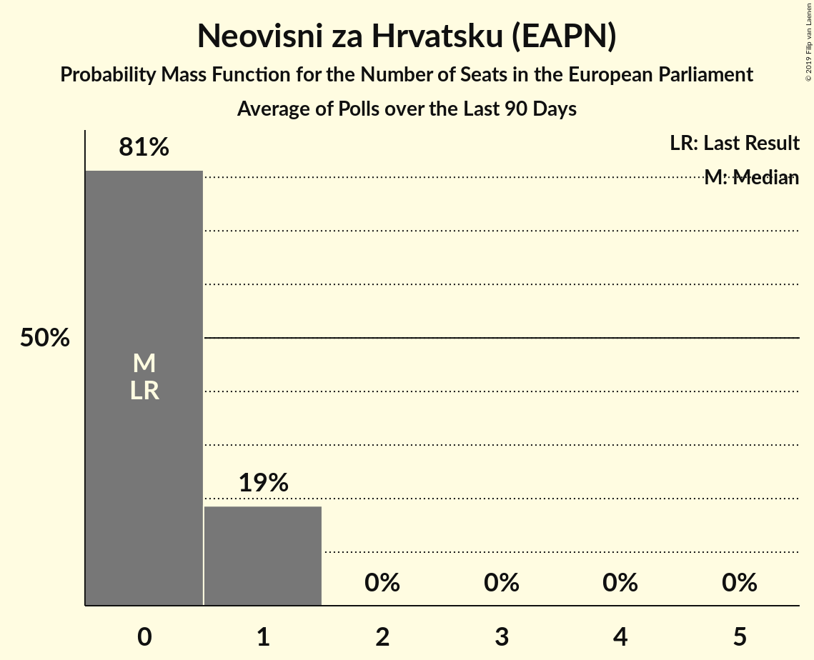

# Neovisni za Hrvatsku (EAPN)

<a href="#voting-intentions">Voting Intentions</a> | <a href="#seats">Seats</a>

## Voting Intentions

Last result: **0.0%** (General Election of 25 May 2014)

### Confidence Intervals

| Period     | Polling firm/Commissioner(s) | Median | 80% Confidence Interval | 90% Confidence Interval | 95% Confidence Interval | 99% Confidence Interval |
|:----------:|:----------------:|:-----------:|:-----------------------:|:-----------------------:|:-----------------------:|:-----------------------:|
| N/A | [Poll Average](average.html) | 4.2% | 3.1–6.1% | 2.8–6.5% | 2.6–6.8% | 2.2–7.4% |
| [30 April–6 May 2019](2019-05-06-Promocijaplus.html) | Promocija plus   RTL | 3.4% | 2.8–4.1% | 2.7–4.3% | 2.5–4.5% | 2.3–4.9% |
| [30 April 2019](2019-04-30-2x1Komunikacije.html) | 2x1 Komunikacije   CroElecto | 5.7% | 4.8–6.7% | 4.6–7.0% | 4.4–7.3% | 4.1–7.8% |
| [22–27 April 2019](2019-04-27-Oraclum.html) | Oraclum | 0.0% | N/A | N/A | N/A | N/A |
| [15–25 April 2019](2019-04-25-IPSOSPULS.html) | IPSOS PULS   Nova TV | 3.3% | 2.7–4.3% | 2.5–4.5% | 2.3–4.8% | 2.0–5.3% |
| [12–18 April 2019](2019-04-18-Promocijaplus.html) | Promocija plus   RTL | 4.1% | 3.5–4.8% | 3.3–5.1% | 3.2–5.2% | 2.9–5.6% |
| [1–5 April 2019](2019-04-05-Promocijaplus.html) | Promocija plus   RTL | 5.6% | 4.9–6.5% | 4.7–6.8% | 4.5–7.0% | 4.2–7.5% |
| [23 March 2019](2019-03-23-2x1Komunikacije.html) | 2x1 Komunikacije   CroElecto | 6.2% | 5.4–7.3% | 5.1–7.6% | 4.9–7.9% | 4.5–8.4% |
| [1–20 March 2019](2019-03-20-IPSOSPULS.html) | IPSOS PULS   Nova TV | 0.0% | N/A | N/A | N/A | N/A |
| [13–18 March 2019](2019-03-18-Promocijaplus.html) | Promocija plus   HRT | 0.0% | N/A | N/A | N/A | N/A |
| [6 March 2019](2019-03-06-Promocijaplus.html) | Promocija plus   HRT | 4.2% | N/A | N/A | N/A | N/A |
| [18–27 February 2019](2019-02-27-2x1Komunikacije.html) | 2x1 Komunikacije   CroElecto | 7.5% | N/A | N/A | N/A | N/A |
| [1–20 February 2019](2019-02-20-IPSOSPULS.html) | IPSOS PULS   Nova TV | 0.0% | N/A | N/A | N/A | N/A |
| [31 January–4 February 2019](2019-02-04-Promocijaplus.html) | Promocija plus   HRT | 3.7% | N/A | N/A | N/A | N/A |
| [1 February 2019](2019-02-01-2x1Komunikacije.html) | 2x1 Komunikacije   CroElecto | 8.6% | N/A | N/A | N/A | N/A |
| [1–18 January 2019](2019-01-18-IPSOSPULS.html) | IPSOS PULS   Nova TV | 8.9% | N/A | N/A | N/A | N/A |
| [2–7 January 2019](2019-01-07-Promocijaplus.html) | Promocija plus   HRT | 3.4% | N/A | N/A | N/A | N/A |
| [27 December 2018](2018-12-27-2x1Komunikacije.html) | 2x1 Komunikacije   CroElecto | 6.6% | N/A | N/A | N/A | N/A |
| [1–20 December 2018](2018-12-20-IPSOSPULS.html) | IPSOS PULS   Nova TV | 1.1% | N/A | N/A | N/A | N/A |
| [7–13 December 2018](2018-12-13-Ninamedia.html) | Ninamedia | 4.6% | N/A | N/A | N/A | N/A |
| [8 December 2018](2018-12-08-Promocijaplus.html) | Promocija plus   HRT | 3.2% | N/A | N/A | N/A | N/A |
| [23 November 2018](2018-11-23-2x1Komunikacije.html) | 2x1 Komunikacije   CroElecto | 7.6% | N/A | N/A | N/A | N/A |
| [1–20 November 2018](2018-11-20-IPSOSPULS.html) | IPSOS PULS   Nova TV | 2.3% | N/A | N/A | N/A | N/A |
| [8 November 2018](2018-11-08-Promocijaplus.html) | Promocija plus   HRT | 0.0% | N/A | N/A | N/A | N/A |
| [27 October 2018](2018-10-27-2x1Komunikacije.html) | 2x1 Komunikacije   CroElecto | 6.1% | N/A | N/A | N/A | N/A |
| [1–18 October 2018](2018-10-18-IPSOSPULS.html) | IPSOS PULS   Nova TV | 0.0% | N/A | N/A | N/A | N/A |
| [2–5 October 2018](2018-10-05-Promocijaplus.html) | Promocija plus   HRT | 0.0% | N/A | N/A | N/A | N/A |
| [21 September 2018](2018-09-21-2x1Komunikacije.html) | 2x1 Komunikacije   CroElecto | 6.2% | N/A | N/A | N/A | N/A |
| [1–20 September 2018](2018-09-20-IPSOSPULS.html) | IPSOS PULS   Nova TV | 0.0% | N/A | N/A | N/A | N/A |
| [8 September 2018](2018-09-08-Promocijaplus.html) | Promocija plus   HRT | 0.0% | N/A | N/A | N/A | N/A |
| [13–23 August 2018](2018-08-23-2x1Komunikacije.html) | 2x1 Komunikacije   CroElecto | 4.0% | N/A | N/A | N/A | N/A |
| [1–20 August 2018](2018-08-20-IPSOSPULS.html) | IPSOS PULS   Nova TV | 0.0% | N/A | N/A | N/A | N/A |
| [2–5 August 2018](2018-08-05-Promocijaplus.html) | Promocija plus   HRT | 0.0% | N/A | N/A | N/A | N/A |
| [1–20 July 2018](2018-07-20-IPSOSPULS.html) | IPSOS PULS   Nova TV | 0.0% | N/A | N/A | N/A | N/A |
| [9–20 July 2018](2018-07-20-2x1Komunikacije.html) | 2x1 Komunikacije   CroElecto | 6.0% | N/A | N/A | N/A | N/A |
| [2–5 July 2018](2018-07-05-Promocijaplus.html) | Promocija plus   HRT | 0.0% | N/A | N/A | N/A | N/A |
| [1–20 June 2018](2018-06-20-IPSOSPULS.html) | IPSOS PULS   Nova TV | 0.0% | N/A | N/A | N/A | N/A |
| [15 June 2018](2018-06-15-2x1Komunikacije.html) | 2x1 Komunikacije   CroElecto | 4.1% | N/A | N/A | N/A | N/A |
| [6 May–7 June 2018](2018-06-07-Promocijaplus.html) | Promocija plus   HRT | 0.0% | N/A | N/A | N/A | N/A |
| [24 May 2018](2018-05-24-2x1Komunikacije.html) | 2x1 Komunikacije   CroElecto | 4.8% | N/A | N/A | N/A | N/A |
| [1–20 May 2018](2018-05-20-IPSOSPULS.html) | IPSOS PULS   Nova TV | 0.0% | N/A | N/A | N/A | N/A |
| [2–5 May 2018](2018-05-05-Promocijaplus.html) | Promocija plus   HRT | 0.0% | N/A | N/A | N/A | N/A |
| [16–24 April 2018](2018-04-24-2x1Komunikacije.html) | 2x1 Komunikacije   CroElecto | 5.4% | N/A | N/A | N/A | N/A |
| [1–20 April 2018](2018-04-20-IPSOSPULS.html) | IPSOS PULS   Nova TV | 0.0% | N/A | N/A | N/A | N/A |
| [8 April 2018](2018-04-08-Promocijaplus.html) | Promocija plus   HRT | 0.0% | N/A | N/A | N/A | N/A |
| [1–20 March 2018](2018-03-20-IPSOSPULS.html) | IPSOS PULS   Nova TV | 0.0% | N/A | N/A | N/A | N/A |
| [19 March 2018](2018-03-19-2x1Komunikacije.html) | 2x1 Komunikacije   CroElecto | 0.0% | N/A | N/A | N/A | N/A |
| [17 March 2018](2018-03-17-2x1Komunikacije.html) | 2x1 Komunikacije   CroElecto | 4.7% | N/A | N/A | N/A | N/A |
| [28 February–3 March 2018](2018-03-03-Promocijaplus.html) | Promocija plus   HRT | 0.0% | N/A | N/A | N/A | N/A |
| [21 February 2018](2018-02-21-2x1Komunikacije.html) | 2x1 Komunikacije   CroElecto | 3.3% | N/A | N/A | N/A | N/A |
| [1–20 February 2018](2018-02-20-IPSOSPULS.html) | IPSOS PULS   Nova TV | 0.0% | N/A | N/A | N/A | N/A |
| [4 February 2018](2018-02-04-Promocijaplus.html) | Promocija plus   HRT | 0.0% | N/A | N/A | N/A | N/A |
| [26 January 2018](2018-01-26-2x1Komunikacije.html) | 2x1 Komunikacije   CroElecto | 1.3% | N/A | N/A | N/A | N/A |
| [1–20 January 2018](2018-01-20-IPSOSPULS.html) | IPSOS PULS   Nova TV | 0.0% | N/A | N/A | N/A | N/A |
| [2–5 January 2018](2018-01-05-Promocijaplus.html) | Promocija plus   HRT | 0.0% | N/A | N/A | N/A | N/A |

### Probability Mass Function

The following table shows the probability mass function per percentage block of voting intentions for the [poll average](average.html) for Neovisni za Hrvatsku (EAPN).

| Voting Intentions | Probability | Accumulated | Special Marks |
|:-----------------:|:-----------:|:-----------:|:-------------:|
| 0.0–0.5% | 0% | 100% | Last Result |
| 0.5–1.5% | 0% | 100% |  |
| 1.5–2.5% | 2% | 100% |  |
| 2.5–3.5% | 22% | 98% |  |
| 3.5–4.5% | 35% | 76% | Median |
| 4.5–5.5% | 20% | 41% |  |
| 5.5–6.5% | 16% | 20% |  |
| 6.5–7.5% | 4% | 4% |  |
| 7.5–8.5% | 0.3% | 0.3% |  |
| 8.5–9.5% | 0% | 0% |  |

## Seats

Last result: **0** seats (General Election of 25 May 2014)

### Confidence Intervals

| Period     | Polling firm/Commissioner(s) | Median | 80% Confidence Interval | 90% Confidence Interval | 95% Confidence Interval | 99% Confidence Interval |
|:----------:|:----------------:|:------:|:-----------------------:|:-----------------------:|:-----------------------:|:-----------------------:|
| N/A | [Poll Average](average.html) | 0 | 0 | 0 | 0–1 | 0–1 |
| [30 April–6 May 2019](2019-05-06-Promocijaplus.html) | Promocija plus   RTL | 0 | 0 | 0 | 0 | 0 |
| [30 April 2019](2019-04-30-2x1Komunikacije.html) | 2x1 Komunikacije   CroElecto | 0 | 0 | 0–1 | 0–1 | 0–1 |
| [22–27 April 2019](2019-04-27-Oraclum.html) | Oraclum |  |  |  |  |  |
| [15–25 April 2019](2019-04-25-IPSOSPULS.html) | IPSOS PULS   Nova TV | 0 | 0 | 0 | 0 | 0 |
| [12–18 April 2019](2019-04-18-Promocijaplus.html) | Promocija plus   RTL | 0 | 0 | 0 | 0 | 0 |
| [1–5 April 2019](2019-04-05-Promocijaplus.html) | Promocija plus   RTL | 0 | 0–1 | 0–1 | 0–1 | 0–1 |
| [23 March 2019](2019-03-23-2x1Komunikacije.html) | 2x1 Komunikacije   CroElecto | 0 | 0–1 | 0–1 | 0–1 | 0–1 |
| [1–20 March 2019](2019-03-20-IPSOSPULS.html) | IPSOS PULS   Nova TV |  |  |  |  |  |
| [13–18 March 2019](2019-03-18-Promocijaplus.html) | Promocija plus   HRT |  |  |  |  |  |
| [6 March 2019](2019-03-06-Promocijaplus.html) | Promocija plus   HRT |  |  |  |  |  |
| [18–27 February 2019](2019-02-27-2x1Komunikacije.html) | 2x1 Komunikacije   CroElecto |  |  |  |  |  |
| [1–20 February 2019](2019-02-20-IPSOSPULS.html) | IPSOS PULS   Nova TV |  |  |  |  |  |
| [31 January–4 February 2019](2019-02-04-Promocijaplus.html) | Promocija plus   HRT |  |  |  |  |  |
| [1 February 2019](2019-02-01-2x1Komunikacije.html) | 2x1 Komunikacije   CroElecto |  |  |  |  |  |
| [1–18 January 2019](2019-01-18-IPSOSPULS.html) | IPSOS PULS   Nova TV |  |  |  |  |  |
| [2–7 January 2019](2019-01-07-Promocijaplus.html) | Promocija plus   HRT |  |  |  |  |  |
| [27 December 2018](2018-12-27-2x1Komunikacije.html) | 2x1 Komunikacije   CroElecto |  |  |  |  |  |
| [1–20 December 2018](2018-12-20-IPSOSPULS.html) | IPSOS PULS   Nova TV |  |  |  |  |  |
| [7–13 December 2018](2018-12-13-Ninamedia.html) | Ninamedia |  |  |  |  |  |
| [8 December 2018](2018-12-08-Promocijaplus.html) | Promocija plus   HRT |  |  |  |  |  |
| [23 November 2018](2018-11-23-2x1Komunikacije.html) | 2x1 Komunikacije   CroElecto |  |  |  |  |  |
| [1–20 November 2018](2018-11-20-IPSOSPULS.html) | IPSOS PULS   Nova TV |  |  |  |  |  |
| [8 November 2018](2018-11-08-Promocijaplus.html) | Promocija plus   HRT |  |  |  |  |  |
| [27 October 2018](2018-10-27-2x1Komunikacije.html) | 2x1 Komunikacije   CroElecto |  |  |  |  |  |
| [1–18 October 2018](2018-10-18-IPSOSPULS.html) | IPSOS PULS   Nova TV |  |  |  |  |  |
| [2–5 October 2018](2018-10-05-Promocijaplus.html) | Promocija plus   HRT |  |  |  |  |  |
| [21 September 2018](2018-09-21-2x1Komunikacije.html) | 2x1 Komunikacije   CroElecto |  |  |  |  |  |
| [1–20 September 2018](2018-09-20-IPSOSPULS.html) | IPSOS PULS   Nova TV |  |  |  |  |  |
| [8 September 2018](2018-09-08-Promocijaplus.html) | Promocija plus   HRT |  |  |  |  |  |
| [13–23 August 2018](2018-08-23-2x1Komunikacije.html) | 2x1 Komunikacije   CroElecto |  |  |  |  |  |
| [1–20 August 2018](2018-08-20-IPSOSPULS.html) | IPSOS PULS   Nova TV |  |  |  |  |  |
| [2–5 August 2018](2018-08-05-Promocijaplus.html) | Promocija plus   HRT |  |  |  |  |  |
| [1–20 July 2018](2018-07-20-IPSOSPULS.html) | IPSOS PULS   Nova TV |  |  |  |  |  |
| [9–20 July 2018](2018-07-20-2x1Komunikacije.html) | 2x1 Komunikacije   CroElecto |  |  |  |  |  |
| [2–5 July 2018](2018-07-05-Promocijaplus.html) | Promocija plus   HRT |  |  |  |  |  |
| [1–20 June 2018](2018-06-20-IPSOSPULS.html) | IPSOS PULS   Nova TV |  |  |  |  |  |
| [15 June 2018](2018-06-15-2x1Komunikacije.html) | 2x1 Komunikacije   CroElecto |  |  |  |  |  |
| [6 May–7 June 2018](2018-06-07-Promocijaplus.html) | Promocija plus   HRT |  |  |  |  |  |
| [24 May 2018](2018-05-24-2x1Komunikacije.html) | 2x1 Komunikacije   CroElecto |  |  |  |  |  |
| [1–20 May 2018](2018-05-20-IPSOSPULS.html) | IPSOS PULS   Nova TV |  |  |  |  |  |
| [2–5 May 2018](2018-05-05-Promocijaplus.html) | Promocija plus   HRT |  |  |  |  |  |
| [16–24 April 2018](2018-04-24-2x1Komunikacije.html) | 2x1 Komunikacije   CroElecto |  |  |  |  |  |
| [1–20 April 2018](2018-04-20-IPSOSPULS.html) | IPSOS PULS   Nova TV |  |  |  |  |  |
| [8 April 2018](2018-04-08-Promocijaplus.html) | Promocija plus   HRT |  |  |  |  |  |
| [1–20 March 2018](2018-03-20-IPSOSPULS.html) | IPSOS PULS   Nova TV |  |  |  |  |  |
| [19 March 2018](2018-03-19-2x1Komunikacije.html) | 2x1 Komunikacije   CroElecto |  |  |  |  |  |
| [17 March 2018](2018-03-17-2x1Komunikacije.html) | 2x1 Komunikacije   CroElecto |  |  |  |  |  |
| [28 February–3 March 2018](2018-03-03-Promocijaplus.html) | Promocija plus   HRT |  |  |  |  |  |
| [21 February 2018](2018-02-21-2x1Komunikacije.html) | 2x1 Komunikacije   CroElecto |  |  |  |  |  |
| [1–20 February 2018](2018-02-20-IPSOSPULS.html) | IPSOS PULS   Nova TV |  |  |  |  |  |
| [4 February 2018](2018-02-04-Promocijaplus.html) | Promocija plus   HRT |  |  |  |  |  |
| [26 January 2018](2018-01-26-2x1Komunikacije.html) | 2x1 Komunikacije   CroElecto |  |  |  |  |  |
| [1–20 January 2018](2018-01-20-IPSOSPULS.html) | IPSOS PULS   Nova TV |  |  |  |  |  |
| [2–5 January 2018](2018-01-05-Promocijaplus.html) | Promocija plus   HRT |  |  |  |  |  |

### Probability Mass Function

The following table shows the probability mass function per seat for the [poll average](average.html) for Neovisni za Hrvatsku (EAPN).

| Number of Seats | Probability | Accumulated | Special Marks |
|:---------------:|:-----------:|:-----------:|:-------------:|
| 0 | 97% | 100% | Last Result, Median |
| 1 | 3% | 3% |  |
| 2 | 0% | 0% |  |

