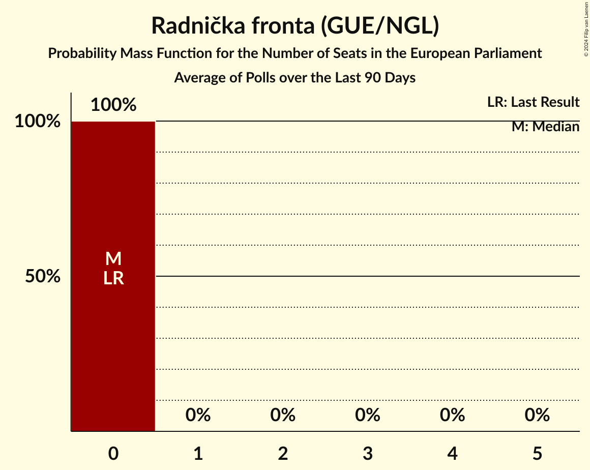

# Radnička fronta (GUE/NGL)

<a href="#voting-intentions">Voting Intentions</a> | <a href="#seats">Seats</a>

## Voting Intentions

Last result: **0.0%** (General Election of 9 June 2024)

### Confidence Intervals

| Period     | Polling firm/Commissioner(s) | Median | 80% Confidence Interval | 90% Confidence Interval | 95% Confidence Interval | 99% Confidence Interval |
|:----------:|:----------------:|:-----------:|:-----------------------:|:-----------------------:|:-----------------------:|:-----------------------:|
| N/A | [Poll Average](average.html) | 1.3% | 0.8–1.8% | 0.7–2.0% | 0.7–2.2% | 0.5–2.6% |
| [8–9 January 2025](2025-01-09-PromocijaPlus.html) | Promocija Plus   HRT | 1.2% | 0.8–1.8% | 0.7–2.0% | 0.7–2.2% | 0.5–2.6% |
| [1–20 December 2024](2024-12-20-Ipsos.html) | Ipsos   Nova TV | 0.0% | N/A | N/A | N/A | N/A |
| [16–17 December 2024](2024-12-17-PromocijaPlus.html) | Promocija Plus   HRT | 1.0% | 0.6–1.6% | 0.6–1.7% | 0.5–1.9% | 0.4–2.2% |
| [15–29 November 2024](2024-11-29-2x1Komunikacije.html) | 2x1 Komunikacije   Večernji list | 0.0% | N/A | N/A | N/A | N/A |
| [1–20 November 2024](2024-11-20-Ipsos.html) | Ipsos   Nova TV | 0.0% | N/A | N/A | N/A | N/A |
| [14–19 November 2024](2024-11-19-PromocijaPlus.html) | Promocija Plus   HRT | 1.3% | 0.9–2.0% | 0.8–2.2% | 0.7–2.4% | 0.6–2.8% |
| [4–7 November 2024](2024-11-07-PromocijaPlus.html) | Promocija Plus   RTL | 1.3% | N/A | N/A | N/A | N/A |
| [1–20 October 2024](2024-10-20-Ipsos.html) | Ipsos   Nova TV | 0.0% | N/A | N/A | N/A | N/A |
| [15–17 October 2024](2024-10-17-PromocijaPlus.html) | Promocija Plus   HRT | 0.9% | 0.6–1.4% | 0.6–1.6% | 0.5–1.7% | 0.4–2.0% |
| [1–4 October 2024](2024-10-04-PromocijaPlus.html) | Promocija Plus   RTL | 2.0% | N/A | N/A | N/A | N/A |
| [13–28 September 2024](2024-09-28-2x1Komunikacije.html) | 2x1 Komunikacije   Večernji list | 0.0% | N/A | N/A | N/A | N/A |
| [1–20 September 2024](2024-09-20-Ipsos.html) | Ipsos   Nova TV | 0.0% | N/A | N/A | N/A | N/A |
| [2–5 September 2024](2024-09-05-PromocijaPlus.html) | Promocija Plus   RTL | 0.9% | N/A | N/A | N/A | N/A |
| [13–27 August 2024](2024-08-27-2x1Komunikacije.html) | 2x1 Komunikacije   Večernji list | 0.0% | N/A | N/A | N/A | N/A |
| [1–21 August 2024](2024-08-21-Ipsos.html) | Ipsos   Nova TV | 0.0% | N/A | N/A | N/A | N/A |
| [31 July–2 August 2024](2024-08-02-PromocijaPlus.html) | Promocija Plus   RTL | 1.5% | N/A | N/A | N/A | N/A |
| [31 July 2024](2024-07-31-2x1Komunikacije.html) | 2x1 Komunikacije   Večernji list | 0.0% | N/A | N/A | N/A | N/A |
| [1–21 July 2024](2024-07-21-Ipsos.html) | Ipsos   Nova TV | 0.0% | N/A | N/A | N/A | N/A |
| [1–4 July 2024](2024-07-04-PromocijaPlus.html) | Promocija Plus   RTL | 0.9% | N/A | N/A | N/A | N/A |
| [17–25 June 2024](2024-06-25-2x1Komunikacije.html) | 2x1 Komunikacije   Večernji list | 0.0% | N/A | N/A | N/A | N/A |
| [1–21 June 2024](2024-06-21-Ipsos.html) | Ipsos   Nova TV | 0.0% | N/A | N/A | N/A | N/A |

### Probability Mass Function

The following table shows the probability mass function per percentage block of voting intentions for the [poll average](average.html) for Radnička fronta (GUE/NGL).

| Voting Intentions | Probability | Accumulated | Special Marks |
|:-----------------:|:-----------:|:-----------:|:-------------:|
| 0.0–0.5% | 0.7% | 100% | Last Result |
| 0.5–1.5% | 74% | 99.3% | Median |
| 1.5–2.5% | 25% | 25% |  |
| 2.5–3.5% | 0.5% | 0.5% |  |
| 3.5–4.5% | 0% | 0% |  |

## Seats

Last result: **0** seats (General Election of 9 June 2024)

### Confidence Intervals

| Period     | Polling firm/Commissioner(s) | Median | 80% Confidence Interval | 90% Confidence Interval | 95% Confidence Interval | 99% Confidence Interval |
|:----------:|:----------------:|:------:|:-----------------------:|:-----------------------:|:-----------------------:|:-----------------------:|
| N/A | [Poll Average](average.html) | 0 | 0 | 0 | 0 | 0 |
| [8–9 January 2025](2025-01-09-PromocijaPlus.html) | Promocija Plus   HRT | 0 | 0 | 0 | 0 | 0 |
| [1–20 December 2024](2024-12-20-Ipsos.html) | Ipsos   Nova TV |  |  |  |  |  |
| [16–17 December 2024](2024-12-17-PromocijaPlus.html) | Promocija Plus   HRT | 0 | 0 | 0 | 0 | 0 |
| [15–29 November 2024](2024-11-29-2x1Komunikacije.html) | 2x1 Komunikacije   Večernji list |  |  |  |  |  |
| [1–20 November 2024](2024-11-20-Ipsos.html) | Ipsos   Nova TV |  |  |  |  |  |
| [14–19 November 2024](2024-11-19-PromocijaPlus.html) | Promocija Plus   HRT | 0 | 0 | 0 | 0 | 0 |
| [4–7 November 2024](2024-11-07-PromocijaPlus.html) | Promocija Plus   RTL |  |  |  |  |  |
| [1–20 October 2024](2024-10-20-Ipsos.html) | Ipsos   Nova TV |  |  |  |  |  |
| [15–17 October 2024](2024-10-17-PromocijaPlus.html) | Promocija Plus   HRT | 0 | 0 | 0 | 0 | 0 |
| [1–4 October 2024](2024-10-04-PromocijaPlus.html) | Promocija Plus   RTL |  |  |  |  |  |
| [13–28 September 2024](2024-09-28-2x1Komunikacije.html) | 2x1 Komunikacije   Večernji list |  |  |  |  |  |
| [1–20 September 2024](2024-09-20-Ipsos.html) | Ipsos   Nova TV |  |  |  |  |  |
| [2–5 September 2024](2024-09-05-PromocijaPlus.html) | Promocija Plus   RTL |  |  |  |  |  |
| [13–27 August 2024](2024-08-27-2x1Komunikacije.html) | 2x1 Komunikacije   Večernji list |  |  |  |  |  |
| [1–21 August 2024](2024-08-21-Ipsos.html) | Ipsos   Nova TV |  |  |  |  |  |
| [31 July–2 August 2024](2024-08-02-PromocijaPlus.html) | Promocija Plus   RTL |  |  |  |  |  |
| [31 July 2024](2024-07-31-2x1Komunikacije.html) | 2x1 Komunikacije   Večernji list |  |  |  |  |  |
| [1–21 July 2024](2024-07-21-Ipsos.html) | Ipsos   Nova TV |  |  |  |  |  |
| [1–4 July 2024](2024-07-04-PromocijaPlus.html) | Promocija Plus   RTL |  |  |  |  |  |
| [17–25 June 2024](2024-06-25-2x1Komunikacije.html) | 2x1 Komunikacije   Večernji list |  |  |  |  |  |
| [1–21 June 2024](2024-06-21-Ipsos.html) | Ipsos   Nova TV |  |  |  |  |  |

### Probability Mass Function

The following table shows the probability mass function per seat for the [poll average](average.html) for Radnička fronta (GUE/NGL).

| Number of Seats | Probability | Accumulated | Special Marks |
|:---------------:|:-----------:|:-----------:|:-------------:|
| 0 | 100% | 100% | Last Result, Median |

