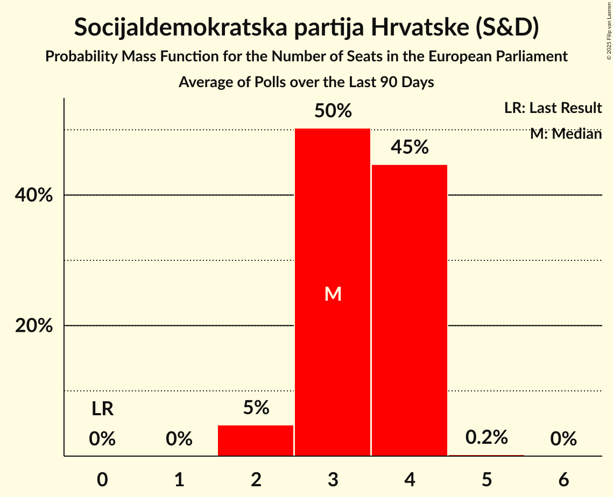

# Socijaldemokratska partija Hrvatske (S&D)

<a href="#voting-intentions">Voting Intentions</a> | <a href="#seats">Seats</a>

## Voting Intentions

Last result: **29.9%** (General Election of 25 May 2014)

### Confidence Intervals

| Period     | Polling firm/Commissioner(s) | Median | 80% Confidence Interval | 90% Confidence Interval | 95% Confidence Interval | 99% Confidence Interval |
|:----------:|:----------------:|:-----------:|:-----------------------:|:-----------------------:|:-----------------------:|:-----------------------:|
| N/A | [Poll Average](average.html) | 24.0% | 19.9–26.5% | 19.2–27.2% | 18.7–27.7% | 17.8–28.8% |
| [1–20 March 2018](2018-03-20-IPSOSPULS.html) | IPSOS PULS   Nova TV | 20.6% | 18.9–22.4% | 18.5–22.9% | 18.1–23.3% | 17.3–24.2% |
| [19 March 2018](2018-03-19-2x1Komunikacije.html) | 2x1 Komunikacije   CroElecto | 25.5% | 23.7–27.4% | 23.2–28.0% | 22.8–28.5% | 21.9–29.4% |
| [28 February–3 March 2018](2018-03-03-Promocijaplus.html) | Promocija plus   HRT | 24.3% | 22.7–26.1% | 22.3–26.5% | 21.9–27.0% | 21.2–27.8% |
| [1–20 February 2018](2018-02-20-IPSOSPULS.html) | IPSOS PULS   Nova TV | 21.6% | 19.9–23.4% | 19.4–23.9% | 19.0–24.4% | 18.2–25.3% |
| [4 February 2018](2018-02-04-Promocijaplus.html) | Promocija plus   HRT | 24.8% | 23.2–26.5% | 22.7–27.0% | 22.3–27.4% | 21.6–28.3% |
| [1–20 January 2018](2018-01-20-IPSOSPULS.html) | IPSOS PULS   Nova TV | 22.6% | 20.9–24.4% | 20.4–25.0% | 20.0–25.4% | 19.1–26.3% |

### Probability Mass Function

The following table shows the probability mass function per percentage block of voting intentions for the [poll average](average.html) for Socijaldemokratska partija Hrvatske (S&D).

| Voting Intentions | Probability | Accumulated | Special Marks |
|:-----------------:|:-----------:|:-----------:|:-------------:|
| 15.5–16.5% | 0% | 100% |  |
| 16.5–17.5% | 0.3% | 100% |  |
| 17.5–18.5% | 2% | 99.7% |  |
| 18.5–19.5% | 5% | 98% |  |
| 19.5–20.5% | 9% | 93% |  |
| 20.5–21.5% | 10% | 84% |  |
| 21.5–22.5% | 8% | 74% |  |
| 22.5–23.5% | 10% | 66% |  |
| 23.5–24.5% | 16% | 56% | Median |
| 24.5–25.5% | 17% | 40% |  |
| 25.5–26.5% | 13% | 23% |  |
| 26.5–27.5% | 7% | 10% |  |
| 27.5–28.5% | 2% | 3% |  |
| 28.5–29.5% | 0.6% | 0.7% |  |
| 29.5–30.5% | 0.1% | 0.1% | Last Result |
| 30.5–31.5% | 0% | 0% |  |

## Seats

Last result: **2** seats (General Election of 25 May 2014)

### Confidence Intervals

| Period     | Polling firm/Commissioner(s) | Median | 80% Confidence Interval | 90% Confidence Interval | 95% Confidence Interval | 99% Confidence Interval |
|:----------:|:----------------:|:------:|:-----------------------:|:-----------------------:|:-----------------------:|:-----------------------:|
| N/A | [Poll Average](average.html) | 3 | 3–4 | 3–4 | 3–4 | 2–4 |
| [1–20 March 2018](2018-03-20-IPSOSPULS.html) | IPSOS PULS   Nova TV | 3 | 3 | 3 | 3 | 2–4 |
| [19 March 2018](2018-03-19-2x1Komunikacije.html) | 2x1 Komunikacije   CroElecto | 3 | 3–4 | 3–4 | 3–4 | 3–4 |
| [28 February–3 March 2018](2018-03-03-Promocijaplus.html) | Promocija plus   HRT | 3 | 3–4 | 3–4 | 3–4 | 3–4 |
| [1–20 February 2018](2018-02-20-IPSOSPULS.html) | IPSOS PULS   Nova TV | 3 | 3 | 3 | 3–4 | 2–4 |
| [4 February 2018](2018-02-04-Promocijaplus.html) | Promocija plus   HRT | 3 | 3–4 | 3–4 | 3–4 | 3–4 |
| [1–20 January 2018](2018-01-20-IPSOSPULS.html) | IPSOS PULS   Nova TV | 3 | 3–4 | 3–4 | 3–4 | 3–4 |

### Probability Mass Function

The following table shows the probability mass function per seat for the [poll average](average.html) for Socijaldemokratska partija Hrvatske (S&D).

| Number of Seats | Probability | Accumulated | Special Marks |
|:---------------:|:-----------:|:-----------:|:-------------:|
| 2 | 0.7% | 100% | Last Result |
| 3 | 79% | 99.3% | Median |
| 4 | 20% | 20% |  |
| 5 | 0% | 0% |  |

