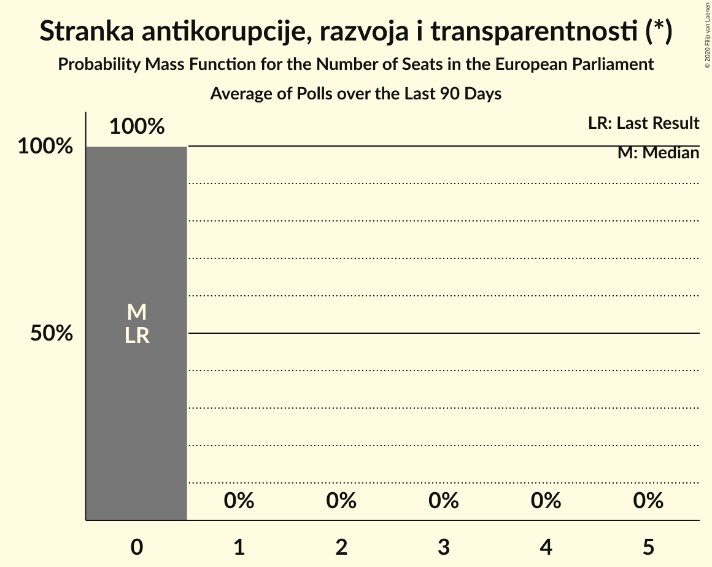

# Stranka antikorupcije, razvoja i transparentnosti (*)

<a href="#voting-intentions">Voting Intentions</a> | <a href="#seats">Seats</a>

## Voting Intentions

Last result: **0.0%** (General Election of 26 May 2019)

### Confidence Intervals

| Period     | Polling firm/Commissioner(s) | Median | 80% Confidence Interval | 90% Confidence Interval | 95% Confidence Interval | 99% Confidence Interval |
|:----------:|:----------------:|:-----------:|:-----------------------:|:-----------------------:|:-----------------------:|:-----------------------:|
| N/A | [Poll Average](average.html) | 0.8% | 0.4–1.2% | 0.4–1.3% | 0.3–1.5% | 0.2–1.8% |
| [1–23 September 2019](2019-09-23-Promocijaplus.html) | Promocija plus   RTL | 0.0% | N/A | N/A | N/A | N/A |
| [2–6 September 2019](2019-09-06-Promocijaplus.html) | Promocija plus   RTL | 0.0% | N/A | N/A | N/A | N/A |
| [31 July–3 August 2019](2019-08-03-Promocijaplus.html) | Promocija plus   RTL | 0.0% | N/A | N/A | N/A | N/A |
| [1–20 July 2019](2019-07-20-IPSOSPLUS.html) | IPSOS PLUS   CroBarometer | 0.7% | 0.4–1.2% | 0.4–1.3% | 0.3–1.5% | 0.2–1.8% |
| [8–15 July 2019](2019-07-15-2x1Komunikacije.html) | 2x1 Komunikacije   CroElecto | 0.0% | N/A | N/A | N/A | N/A |
| [1–5 July 2019](2019-07-05-Promocijaplus.html) | Promocija plus   RTL | 0.0% | N/A | N/A | N/A | N/A |
| [1–20 June 2019](2019-06-20-IPSOSPLUS.html) | IPSOS PLUS   CroBarometer | 0.5% | 0.3–0.9% | 0.3–1.1% | 0.2–1.2% | 0.2–1.4% |
| [7–17 June 2019](2019-06-17-2x1Komunikacije.html) | 2x1 Komunikacije   CroElecto | 1.2% | 0.8–1.7% | 0.7–1.9% | 0.7–2.0% | 0.5–2.3% |
| [3–7 June 2019](2019-06-07-Promocijaplus.html) | Promocija plus   RTL | 1.1% | 0.8–1.6% | 0.7–1.7% | 0.6–1.8% | 0.5–2.1% |
| [27 May–1 June 2019](2019-06-01-2x1Komunikacije.html) | 2x1 Komunikacije   CroElecto | 1.2% | 0.9–1.8% | 0.8–2.0% | 0.7–2.1% | 0.6–2.4% |

### Probability Mass Function

The following table shows the probability mass function per percentage block of voting intentions for the [poll average](average.html) for Stranka antikorupcije, razvoja i transparentnosti (*).

| Voting Intentions | Probability | Accumulated | Special Marks |
|:-----------------:|:-----------:|:-----------:|:-------------:|
| 0.0–0.5% | 22% | 100% | Last Result |
| 0.5–1.5% | 77% | 78% | Median |
| 1.5–2.5% | 2% | 2% |  |
| 2.5–3.5% | 0% | 0% |  |

## Seats

Last result: **0** seats (General Election of 26 May 2019)

### Confidence Intervals

| Period     | Polling firm/Commissioner(s) | Median | 80% Confidence Interval | 90% Confidence Interval | 95% Confidence Interval | 99% Confidence Interval |
|:----------:|:----------------:|:------:|:-----------------------:|:-----------------------:|:-----------------------:|:-----------------------:|
| N/A | [Poll Average](average.html) | 0 | 0 | 0 | 0 | 0 |
| [1–23 September 2019](2019-09-23-Promocijaplus.html) | Promocija plus   RTL |  |  |  |  |  |
| [2–6 September 2019](2019-09-06-Promocijaplus.html) | Promocija plus   RTL |  |  |  |  |  |
| [31 July–3 August 2019](2019-08-03-Promocijaplus.html) | Promocija plus   RTL |  |  |  |  |  |
| [1–20 July 2019](2019-07-20-IPSOSPLUS.html) | IPSOS PLUS   CroBarometer | 0 | 0 | 0 | 0 | 0 |
| [8–15 July 2019](2019-07-15-2x1Komunikacije.html) | 2x1 Komunikacije   CroElecto |  |  |  |  |  |
| [1–5 July 2019](2019-07-05-Promocijaplus.html) | Promocija plus   RTL |  |  |  |  |  |
| [1–20 June 2019](2019-06-20-IPSOSPLUS.html) | IPSOS PLUS   CroBarometer | 0 | 0 | 0 | 0 | 0 |
| [7–17 June 2019](2019-06-17-2x1Komunikacije.html) | 2x1 Komunikacije   CroElecto | 0 | 0 | 0 | 0 | 0 |
| [3–7 June 2019](2019-06-07-Promocijaplus.html) | Promocija plus   RTL | 0 | 0 | 0 | 0 | 0 |
| [27 May–1 June 2019](2019-06-01-2x1Komunikacije.html) | 2x1 Komunikacije   CroElecto | 0 | 0 | 0 | 0 | 0 |

### Probability Mass Function

The following table shows the probability mass function per seat for the [poll average](average.html) for Stranka antikorupcije, razvoja i transparentnosti (*).

| Number of Seats | Probability | Accumulated | Special Marks |
|:---------------:|:-----------:|:-----------:|:-------------:|
| 0 | 100% | 100% | Last Result, Median |

