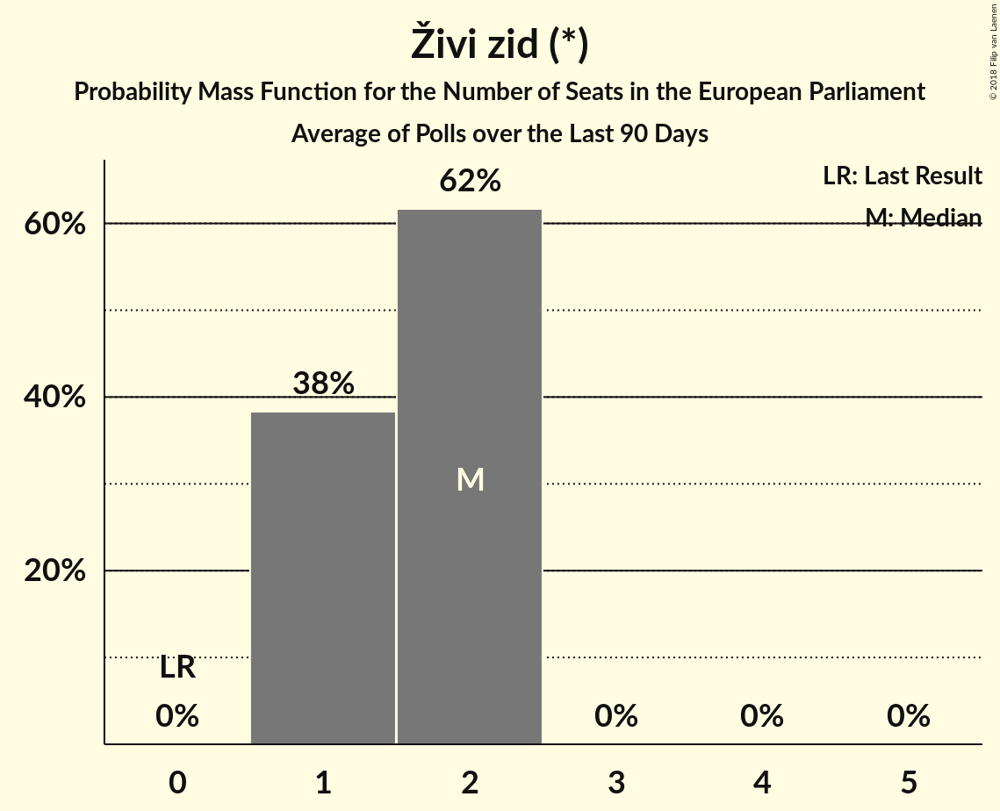

# Živi zid (*)

<a href="#voting-intentions">Voting Intentions</a> | <a href="#seats">Seats</a>

## Voting Intentions

Last result: **0.5%** (General Election of 25 May 2014)

### Confidence Intervals

| Period     | Polling firm/Commissioner(s) | Median | 80% Confidence Interval | 90% Confidence Interval | 95% Confidence Interval | 99% Confidence Interval |
|:----------:|:----------------:|:-----------:|:-----------------------:|:-----------------------:|:-----------------------:|:-----------------------:|
| N/A | [Poll Average](average.html) | 13.6% | 12.0–15.8% | 11.5–16.4% | 11.2–16.8% | 10.5–17.8% |
| [1–20 April 2018](2018-04-20-IPSOSPULS.html) | IPSOS PULS   Nova TV | 15.0% | 13.6–16.6% | 13.2–17.1% | 12.8–17.5% | 12.2–18.3% |
| [8 April 2018](2018-04-08-Promocijaplus.html) | Promocija plus   HRT | 13.1% | 11.9–14.5% | 11.6–14.9% | 11.3–15.3% | 10.7–15.9% |
| [1–20 March 2018](2018-03-20-IPSOSPULS.html) | IPSOS PULS   Nova TV | 13.8% | 12.4–15.3% | 12.0–15.8% | 11.7–16.2% | 11.1–16.9% |
| [19 March 2018](2018-03-19-2x1Komunikacije.html) | 2x1 Komunikacije   CroElecto | 12.9% | 11.5–14.4% | 11.1–14.8% | 10.8–15.2% | 10.2–16.0% |
| [28 February–3 March 2018](2018-03-03-Promocijaplus.html) | Promocija plus   HRT | 12.8% | 11.6–14.2% | 11.2–14.6% | 11.0–14.9% | 10.4–15.6% |
| [1–20 February 2018](2018-02-20-IPSOSPULS.html) | IPSOS PULS   Nova TV | 13.4% | 12.0–14.9% | 11.6–15.4% | 11.3–15.8% | 10.7–16.6% |
| [4 February 2018](2018-02-04-Promocijaplus.html) | Promocija plus   HRT | 13.8% | 12.6–15.3% | 12.2–15.7% | 11.9–16.0% | 11.4–16.7% |
| [1–20 January 2018](2018-01-20-IPSOSPULS.html) | IPSOS PULS   Nova TV | 14.1% | 12.7–15.7% | 12.3–16.1% | 11.9–16.5% | 11.3–17.3% |

### Probability Mass Function

The following table shows the probability mass function per percentage block of voting intentions for the [poll average](average.html) for Živi zid (*).

| Voting Intentions | Probability | Accumulated | Special Marks |
|:-----------------:|:-----------:|:-----------:|:-------------:|
| 0.0–0.5% | 0% | 100% | Last Result |
| 0.5–1.5% | 0% | 100% |  |
| 1.5–2.5% | 0% | 100% |  |
| 2.5–3.5% | 0% | 100% |  |
| 3.5–4.5% | 0% | 100% |  |
| 4.5–5.5% | 0% | 100% |  |
| 5.5–6.5% | 0% | 100% |  |
| 6.5–7.5% | 0% | 100% |  |
| 7.5–8.5% | 0% | 100% |  |
| 8.5–9.5% | 0% | 100% |  |
| 9.5–10.5% | 0.5% | 100% |  |
| 10.5–11.5% | 5% | 99.5% |  |
| 11.5–12.5% | 16% | 95% |  |
| 12.5–13.5% | 27% | 78% |  |
| 13.5–14.5% | 24% | 52% | Median |
| 14.5–15.5% | 16% | 28% |  |
| 15.5–16.5% | 9% | 12% |  |
| 16.5–17.5% | 3% | 4% |  |
| 17.5–18.5% | 0.7% | 0.8% |  |
| 18.5–19.5% | 0.1% | 0.1% |  |
| 19.5–20.5% | 0% | 0% |  |

## Seats

Last result: **0** seats (General Election of 25 May 2014)

### Confidence Intervals

| Period     | Polling firm/Commissioner(s) | Median | 80% Confidence Interval | 90% Confidence Interval | 95% Confidence Interval | 99% Confidence Interval |
|:----------:|:----------------:|:------:|:-----------------------:|:-----------------------:|:-----------------------:|:-----------------------:|
| N/A | [Poll Average](average.html) | 2 | 1–2 | 1–2 | 1–2 | 1–3 |
| [1–20 April 2018](2018-04-20-IPSOSPULS.html) | IPSOS PULS   Nova TV | 2 | 2 | 2 | 2 | 1–3 |
| [8 April 2018](2018-04-08-Promocijaplus.html) | Promocija plus   HRT | 2 | 1–2 | 1–2 | 1–2 | 1–2 |
| [1–20 March 2018](2018-03-20-IPSOSPULS.html) | IPSOS PULS   Nova TV | 2 | 2 | 2 | 1–2 | 1–2 |
| [19 March 2018](2018-03-19-2x1Komunikacije.html) | 2x1 Komunikacije   CroElecto | 1 | 1–2 | 1–2 | 1–2 | 1–2 |
| [28 February–3 March 2018](2018-03-03-Promocijaplus.html) | Promocija plus   HRT | 2 | 1–2 | 1–2 | 1–2 | 1–2 |
| [1–20 February 2018](2018-02-20-IPSOSPULS.html) | IPSOS PULS   Nova TV | 2 | 2 | 1–2 | 1–2 | 1–2 |
| [4 February 2018](2018-02-04-Promocijaplus.html) | Promocija plus   HRT | 2 | 1–2 | 1–2 | 1–2 | 1–2 |
| [1–20 January 2018](2018-01-20-IPSOSPULS.html) | IPSOS PULS   Nova TV | 2 | 2 | 2 | 1–2 | 1–2 |

### Probability Mass Function

The following table shows the probability mass function per seat for the [poll average](average.html) for Živi zid (*).

| Number of Seats | Probability | Accumulated | Special Marks |
|:---------------:|:-----------:|:-----------:|:-------------:|
| 0 | 0% | 100% | Last Result |
| 1 | 26% | 100% |  |
| 2 | 73% | 74% | Median |
| 3 | 0.8% | 0.8% |  |
| 4 | 0% | 0% |  |

